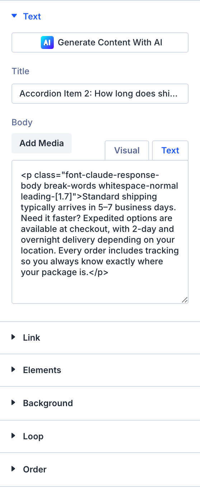
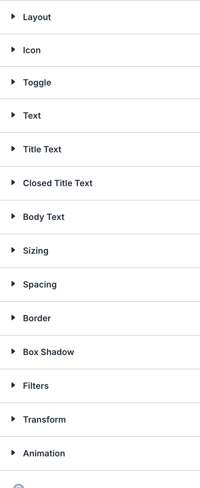

# Accordion

The Accordion module displays collapsible content sections where only one item is open at a time.

!!! abstract "Quick Reference"
    **What it does:** Organizes content into vertically stacked expandable/collapsible panels where only one panel is open at a time.
    **When to use it:** FAQ sections, product/service detail breakdowns, step-by-step instructions
    **Key settings:** Toggle Icon, Loop, Order, individual item Title and Content
    **Block identifier:** `divi/accordion`
    **ET Docs:** [Official documentation](https://help.elegantthemes.com/en/articles/10063343-the-accordion-module-in-divi-5)

!!! tip "When to Use This Module"
    - You need collapsible content sections where only one item should be open at a time
    - FAQ pages where visitors scan questions and expand individual answers
    - Long-form content that needs to be broken into scannable, on-demand sections

!!! warning "When NOT to Use This Module"
    - You need multiple items open simultaneously → use [Toggle](toggle.md)
    - You want horizontal tab-based content organization → use [Tabs](tabs.md)
    - You need rich media galleries or sliders → use [Gallery](gallery.md) or [Slider](slider.md)

## Overview

The Accordion module organizes content into a vertically stacked group of expandable/collapsible panels. When a visitor clicks on a panel header, its content is revealed and any previously open panel collapses automatically. By default, the first panel is open when the page loads.

This behavior distinguishes it from the [Toggle](toggle.md) module, where multiple items can be open simultaneously. The accordion enforces a one-at-a-time pattern, which keeps the layout compact and focused.

For additional reference, see the [official Elegant Themes documentation](https://help.elegantthemes.com/en/articles/10063343-the-accordion-module-in-divi-5).

[View A Live Demo Of This Module](https://www.16wells.dev/module-demos/accordion/)

{ loading=lazy }
*The Accordion module showing collapsible FAQ-style content panels.*

## Use Cases

1. **FAQ Sections** — Present frequently asked questions with answers that expand on click, keeping the page scannable without overwhelming visitors with a wall of text.
2. **Product or Service Details** — Break down features, specifications, or plan tiers into expandable sections so visitors can drill into what interests them.
3. **Step-by-Step Instructions** — Organize multi-step processes where each step expands to reveal detailed instructions, keeping the overall flow visible.

## How to Add the Accordion Module

1. Open the Visual Builder on the page you want to edit.
2. Click the gray **+** icon to add a new module to a row.
3. Search for "Accordion" in the module picker or find it in the Content Elements category, then click to insert it.


## Settings & Options

The Accordion module settings are organized across three tabs: Content, Design, and Advanced.

### Content Tab

The Content tab controls the accordion's items, icon, link behavior, background, and metadata.

| Setting | Type | Description |
|---------|------|-------------|
| Add, Edit, and Remove | item list | Manage individual accordion items. Each item has its own title and body content. Click **+** to add, the pencil icon to edit, the trash icon to delete, and drag to reorder. |
| Toggle Icon | icon picker | Choose the icon displayed next to each accordion item header that indicates expand/collapse state. |
| Link | url | Optionally link the entire accordion module to a URL. |
| Background | background controls | Set a background color, gradient, image, or video behind the entire accordion module. |
| Loop | toggle | When enabled, collapsing the last item automatically opens the first item, creating a circular navigation pattern. |
| Order | select | Control the display order of accordion items (e.g., default order or reversed). |
| Meta | admin label | Set an admin label for the module to help identify it in the Visual Builder's layer panel. |

{ loading=lazy }

#### Individual Accordion Item Settings

Each accordion item within the module has its own settings:

| Setting | Type | Description |
|---------|------|-------------|
| Title | text | The heading text displayed in the clickable panel header. |
| Content | rich text editor | The body content revealed when the item is expanded. Supports text, images, and other media. |

### Design Tab

The Design tab controls the visual styling of the accordion and its contents.

**Module-specific settings:**

| Setting | Type | Description |
|---------|------|-------------|
| Icon | icon styling | Customize the toggle icon's color, size, and placement. |
| Toggle | toggle styling | Style the overall toggle container including open/closed state appearance. |

**Shared design options** — see [Options Groups](../options-groups/index.md) for detailed documentation:

| Options Group | Description |
|--------------|-------------|
| [Text](../options-groups/text.md) | Font, weight, alignment, color, line height, text shadow |
| [Title Text](../options-groups/text.md) | Font, size, color, letter spacing for accordion item titles (open and closed states) |
| [Closed Title Text](../options-groups/text.md) | Override title styling for items in their closed state |
| [Body Text](../options-groups/text.md) | Font, size, color, line height for expanded content area text |
| [Sizing](../options-groups/sizing.md) | Width, max-width, height, min-height |
| [Spacing](../options-groups/spacing.md) | Margin and padding (responsive) |
| [Border](../options-groups/border.md) | Width, color, style, radius |
| [Box Shadow](../options-groups/box-shadow.md) | Shadow effects |
| [Filters](../options-groups/filters.md) | CSS filters (brightness, contrast, etc.) |
| [Transform](../options-groups/transform.md) | Scale, translate, rotate, skew |
| [Animation](../options-groups/animation.md) | Entrance animation styles |

{ loading=lazy }

### Advanced Tab

The Advanced tab provides developer-oriented controls for custom attributes, conditional display, interactions, and scroll-driven effects.

**Shared advanced options** — see [Options Groups](../options-groups/index.md) for detailed documentation:

| Options Group | Description |
|--------------|-------------|
| [Attributes](../options-groups/attributes.md) | CSS ID, classes, custom HTML attributes |
| [CSS](../options-groups/css.md) | Custom CSS per element target |
| HTML | Custom HTML attributes for module wrapper |
| [Conditions](../options-groups/conditions.md) | Display rules (user role, page type, date, logic) |
| Interactions | Hover, click, or scroll-triggered interactions |
| [Visibility](../options-groups/visibility.md) | Device visibility toggles |
| [Transitions](../options-groups/transitions.md) | Hover transition timing |
| [Position](../options-groups/position.md) | CSS position and offsets |
| [Scroll Effects](../options-groups/scroll-effects.md) | Scroll-driven animation effects |

{ loading=lazy }

## Managing Accordion Items

Each accordion module starts with a set of default items. You can:

1. **Add an item** — Click the **+** button at the bottom of the item list in the Content tab.
2. **Edit an item** — Click the pencil/gear icon on any existing item to open its individual settings.
3. **Delete an item** — Click the trash icon on the item you want to remove.
4. **Reorder items** — Drag items by their handle to rearrange the display order.


## Styling Individual Items

Each accordion item can be styled independently from the parent module. Click the pencil icon on any item, then navigate to that item's **Design** tab to override the parent styles for just that item. This is useful when you want to visually distinguish a specific item — for example, highlighting a "most popular" FAQ or drawing attention to an important step.


## Code Examples

### Custom CSS

```css
/* Style the Accordion module container */
.et_pb_accordion {
    margin-bottom: 30px;
}

/* Style accordion item titles */
.et_pb_accordion .et_pb_toggle_title {
    font-weight: 600;
    font-size: 18px;
}

/* Style the open/active item differently */
.et_pb_accordion .et_pb_toggle_open .et_pb_toggle_title {
    color: #2ea3f2;
}

/* Style the content area */
.et_pb_accordion .et_pb_toggle_content {
    padding: 20px;
    line-height: 1.7;
}

/* Responsive adjustments */
@media (max-width: 980px) {
    .et_pb_accordion {
        padding: 10px;
    }
    .et_pb_accordion .et_pb_toggle_title {
        font-size: 16px;
    }
}
```

### PHP Hooks

```php
/* Filter the Accordion module output */
add_filter('et_module_shortcode_output', function($output, $render_slug) {
    if ('et_pb_accordion' !== $render_slug) {
        return $output;
    }
    // Modify $output as needed
    return $output;
}, 10, 2);
```

## Common Patterns

1. **FAQ Page** — Create a dedicated FAQ page with a single accordion module containing all questions and answers. Use descriptive titles as the questions and rich text content for the answers.

2. **Service Detail Sections** — Use multiple accordion modules on a services page, one per service category, each containing expandable details about individual offerings, pricing, and terms.

3. **Documentation Navigation** — Build a knowledge base layout where top-level topics are accordion headers and each expands to show a summary with links to full articles.

## AI Interaction Notes

!!! warning "Create vs. Modify"
    Modifying existing module content via REST API (`wp.apiFetch` PATCH) updates
    title, body text, and settings attributes. **Creating new modules via REST API**
    produces content that renders on the front end but may not appear in the Visual
    Builder layer view. Use browser automation for reliable module creation.
    See [REST API Content Playbook](../playbooks/rest-api-content.md).

**Block identifier:** `divi/accordion` — *Needs verification on current build*

| Operation | Method | Status | Notes |
|-----------|--------|--------|-------|
| Read content | Parse `post_content` block JSON | Observed | Use brace-depth parser — see [Content Encoding](../internals/content-encoding.md) |
| Modify existing | `wp.apiFetch` PATCH on post endpoint | Observed | Update block attributes in `post_content` |
| Create new | Browser automation (Playwright) | Observed | REST creation may break VB visibility |
| Batch modify | Sequential REST requests | Needs Testing | See [REST API Content Playbook](../playbooks/rest-api-content.md) |

**Key content attributes** — *JSON paths need verification*:

| Attribute | JSON Path | Notes |
|-----------|-----------|-------|
| Title | `attrs.title` | Accordion item heading text |
| Content | `attrs.content` | Accordion item body content |

!!! tip "Module Selection Guidance"
    FAQ sections use Accordion; for independent collapsible items use Toggle; for horizontal tabs use Tabs.

## Saving Your Work

After configuring the accordion:

- **Save changes** — Click the purple **Save** button at the bottom of the Visual Builder, or press `Ctrl+S` (Windows) / `Cmd+S` (Mac).
- **Exit the builder** — Click the **X** button or use `Ctrl+Shift+E` to return to the WordPress dashboard.

## Version Notes

!!! note "Divi 5 Only"
    This page documents Divi 5 behavior exclusively.

## Troubleshooting

!!! warning "Module Not Rendering"
    If the Accordion module doesn't appear on the front end, verify that:

    - The module is not inside a disabled section or row
    - Visibility settings aren't hiding it on the current device
    - There is at least one accordion item with content

!!! warning "All Items Appear Open"
    If multiple items display open simultaneously, you may have accidentally inserted individual Toggle modules instead of an Accordion module. The Accordion enforces one-open-at-a-time behavior; Toggles do not.

!!! tip "Accordion Won't Collapse on Mobile"
    Check that JavaScript is not being blocked on the page. The accordion's expand/collapse behavior relies on JavaScript. Also verify no custom CSS is overriding the `display` property on toggle content elements.

## Related

- [Toggle](toggle.md) — Similar collapsible panels, but multiple items can be open at once
- [Tabs](tabs.md) — Horizontal tab-based content organization as an alternative to vertical accordions
- [Accordion Icon Options](../options-groups/accordion-icon.md) — Style the expand/collapse indicator icon
- [Toggle Icon Options](../options-groups/toggle-icon.md) — Related icon styling for toggle-style elements
- [Playbook: Build a Page](../playbooks/build-a-page.md) — Step-by-step page building workflow in the Visual Builder
