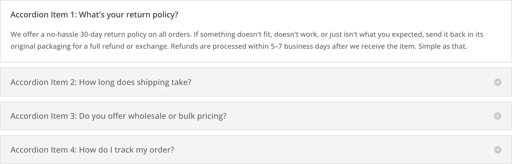

# Accordion

The Accordion module is a Divi 5 content element used in the Visual Builder.

## Overview

How to add, configure and customize the Divi accordion module.

The Divi Accordion Module helps consolidate information into a vertically stacked group of toggles that can be clicked to reveal or hide their contents. The accordion module is similar to the toggle module, however, the accordion module comes as a group of toggles and when a new toggle is opened, the previously opened toggle is closed. By default, the first toggle is set to display as an open toggle. The Accordion module is great for displaying a frequently asked questions section in an easy-to-read way.

View A Live Demo Of This Module

{ loading=lazy }
*The Accordion module displaying FAQ-style content with expandable items.*

## Settings & Options

### Content Tab

<!-- TODO: Verify all Content tab settings for Accordion module -->

| Setting | Type | Default | Description |
|---------|------|---------|-------------|
| <!-- TODO: Document Content settings --> | | | |

<!-- { loading=lazy } -->

### Design Tab

<!-- TODO: Verify all Design tab settings for Accordion module -->

| Setting | Type | Default | Description |
|---------|------|---------|-------------|
| <!-- TODO: Document Design settings --> | | | |

<!-- { loading=lazy } -->

### Advanced Tab

<!-- TODO: Verify all Advanced tab settings for Accordion module -->

| Setting | Type | Default | Description |
|---------|------|---------|-------------|
| CSS ID | text | — | Assign a unique CSS ID to the module |
| CSS Class | text | — | Assign CSS classes to the module |
| Custom CSS | code | — | Add custom CSS directly to the module's elements |
| Visibility | toggle | Show on all devices | Control device visibility (desktop, tablet, phone) |
| Transition | select | Default | Animation transition style for hover effects |

## Code Examples

### Custom CSS

```css
/* Style the Accordion module */
.et_pb_accordion {
    /* Add your custom styles */
    margin-bottom: 30px;
}

/* Responsive adjustments */
@media (max-width: 980px) {
    .et_pb_accordion {
        padding: 20px;
    }
}
```

### PHP Hooks

```php
/* Filter the Accordion module output */
add_filter('et_module_shortcode_output', function($output, $render_slug) {
    if ('et_pb_et_pb_accordion' !== $render_slug) {
        return $output;
    }
    // Modify $output as needed
    return $output;
}, 10, 2);
```

## Common Patterns

<!-- TODO: Add 2-3 real-world usage patterns with screenshots -->

1. **Basic Usage** — Add the Accordion module to any row in the Visual Builder and configure its settings.

2. **Styled Variation** — Use the Design tab to customize fonts, colors, and spacing to match your site's design system.

3. **Dynamic Content** — Use dynamic content fields to pull data from custom fields or post meta.

## Version Notes

!!! note "Divi 5 Only"
    This page documents Divi 5 behavior exclusively.

## Troubleshooting

!!! warning "Module Not Rendering"
    If the Accordion module doesn't appear on the front end, verify that:

    - The module is not inside a disabled section or row
    - Visibility settings aren't hiding it on the current device
    - Any required fields (like URLs or content) are filled in

<!-- TODO: Add module-specific troubleshooting items -->

## Related

- [Toggle](toggle.md)
- [Tabs](tabs.md)
