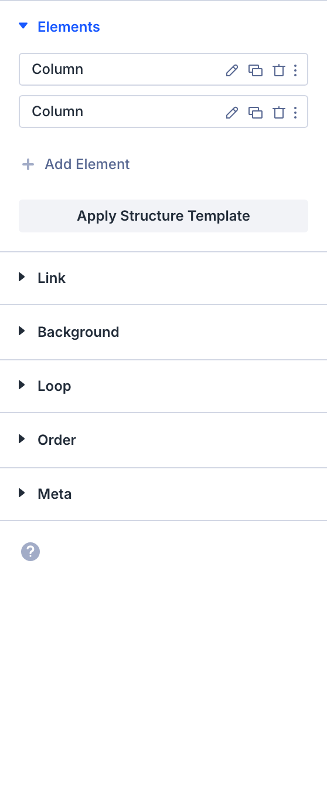

# Bar Counter

The Bar Counter module is a Divi 5 content element used in the Visual Builder.

## Overview

How to add, configure and customize the Divi bar counter module.

The Divi Bar Counters Module is an easy way to display numerical information on your website. It’s great for communicating information in percentage form like company statistics, numerical goals, growth metrics, and more. The bar counters animation is triggered by using lazy-load which makes this module eye-catching and engaging. In this doc we’ll walk through all the settings and options available with the Divi Bar Counters Module.

View A Live Demo Of This Module

{ loading=lazy }
*The Bar Counter module as it appears in the Divi 5 Visual Builder.*

## Settings & Options

### Content Tab

<!-- TODO: Verify all Content tab settings for Bar Counter module -->

| Setting | Type | Default | Description |
|---------|------|---------|-------------|
| <!-- TODO: Document Content settings --> | | | |

{ loading=lazy }

### Design Tab

<!-- TODO: Verify all Design tab settings for Bar Counter module -->

| Setting | Type | Default | Description |
|---------|------|---------|-------------|
| <!-- TODO: Document Design settings --> | | | |

{ loading=lazy }

### Advanced Tab

<!-- TODO: Verify all Advanced tab settings for Bar Counter module -->

| Setting | Type | Default | Description |
|---------|------|---------|-------------|
| CSS ID | text | — | Assign a unique CSS ID to the module |
| CSS Class | text | — | Assign CSS classes to the module |
| Custom CSS | code | — | Add custom CSS directly to the module's elements |
| Visibility | toggle | Show on all devices | Control device visibility (desktop, tablet, phone) |
| Transition | select | Default | Animation transition style for hover effects |

## Code Examples

### Custom CSS

```css
/* Style the Bar Counter module */
.et_pb_bar_counter {
    /* Add your custom styles */
    margin-bottom: 30px;
}

/* Responsive adjustments */
@media (max-width: 980px) {
    .et_pb_bar_counter {
        padding: 20px;
    }
}
```

### PHP Hooks

```php
/* Filter the Bar Counter module output */
add_filter('et_module_shortcode_output', function($output, $render_slug) {
    if ('et_pb_et_pb_bar_counter' !== $render_slug) {
        return $output;
    }
    // Modify $output as needed
    return $output;
}, 10, 2);
```

## Common Patterns

<!-- TODO: Add 2-3 real-world usage patterns with screenshots -->

1. **Basic Usage** — Add the Bar Counter module to any row in the Visual Builder and configure its settings.

2. **Styled Variation** — Use the Design tab to customize fonts, colors, and spacing to match your site's design system.

3. **Dynamic Content** — Use dynamic content fields to pull data from custom fields or post meta.

## Version Notes

!!! note "Divi 5 Only"
    This page documents Divi 5 behavior exclusively.

## Troubleshooting

!!! warning "Module Not Rendering"
    If the Bar Counter module doesn't appear on the front end, verify that:

    - The module is not inside a disabled section or row
    - Visibility settings aren't hiding it on the current device
    - Any required fields (like URLs or content) are filled in

<!-- TODO: Add module-specific troubleshooting items -->

## Related

- [Circle Counter](circle-counter.md)
- [Number Counter](number-counter.md)
