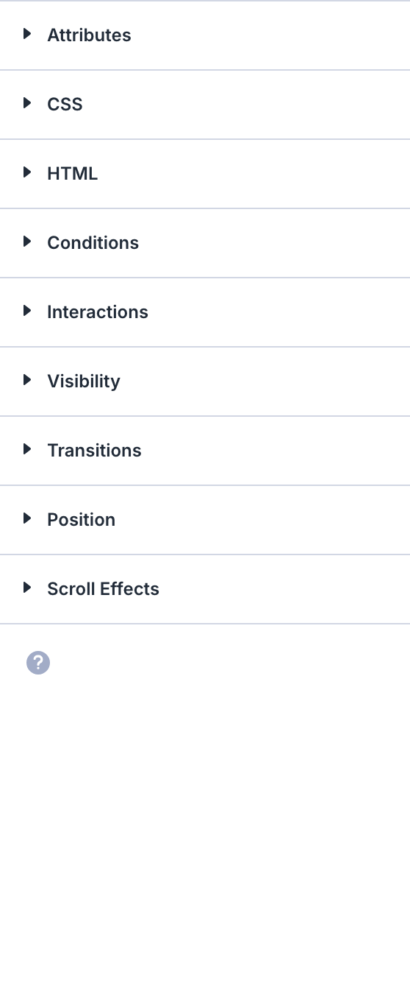

<!-- AUTO-UPDATED: 2026-05-06 — verify changes -->

# Bar Counter

The Bar Counters module displays animated horizontal progress bars that fill to a specified percentage value.

!!! abstract "Quick Reference"
    **What it does:** Renders animated horizontal bars that fill from zero to a target percentage when scrolled into view.
    **When to use it:** Skills charts, project completion trackers, survey results, fundraising progress
    **Key settings:** Individual bar Title, Percent (0-100), Background Color, Elements toggle, Bar styling
    **Block identifier:** `divi/bar-counter`
    **ET Docs:** [Official documentation](https://help.elegantthemes.com/en/articles/10199990-the-bar-counters-module-in-divi-5)

!!! tip "When to Use This Module"
    - You need to visualize percentage-based data as horizontal progress bars
    - Skills or proficiency displays on portfolio and team pages
    - Metrics that benefit from an animated fill effect on scroll

!!! warning "When NOT to Use This Module"
    - You need a circular/radial progress display → use [Circle Counter](circle-counter.md)
    - You need an animated number counting up to a value → use [Number Counter](number-counter.md)
    - You need a countdown to a date/time → use [Countdown Timer](countdown-timer.md)

## Overview

The Bar Counters module renders one or more labeled horizontal bars that animate from zero to a target percentage when they scroll into view. Each bar consists of a title, a filled portion representing the percentage, and a numeric label showing the value. The fill animation triggers automatically via lazy loading, making the bars visually engaging as visitors scroll down the page.

This module is designed for presenting data in percentage form. It works well for skills proficiency charts, project completion trackers, survey results, fundraising progress, or any metric that can be expressed as a proportion of 100. You can add as many individual bars as needed within a single module instance.

Each bar is an individual child item with its own title and percentage, similar to how the Accordion module contains individual accordion items. The parent module controls shared styling, while each bar can be configured independently for its content.

For additional reference, see the [official Elegant Themes documentation](https://help.elegantthemes.com/en/articles/10199990-the-bar-counters-module-in-divi-5).

[View A Live Demo Of This Module](https://www.16wells.dev/module-demos/bar-counter/)

{ loading=lazy }
*The Bar Counters module showing multiple animated progress bars with percentage labels.*

## Use Cases

1. **Skills or Expertise Chart** — Display proficiency levels for different technologies, languages, or competencies on a team page or personal portfolio.
2. **Project Completion Tracker** — Show the progress of ongoing projects, campaigns, or milestones with bars that visually communicate how far along each effort is.
3. **Survey or Poll Results** — Present poll outcomes or survey data in a clean, visual format that is easier to scan than raw numbers or tables.

## How to Add the Bar Counters Module

1. Open the Visual Builder on the page you want to edit.
2. Click the gray **+** icon to add a new module to a row.
3. Search for "Bar Counters" in the module picker or locate it in the Content Elements category, then click to insert it.


## Settings & Options

The Bar Counters module settings are organized across three tabs: Content, Design, and Advanced.

### Content Tab

The Content tab controls individual bar items, visual elements, link behavior, background, and metadata.

| Setting | Type | Description |
|---------|------|-------------|
| Add, Edit, and Remove | item list | Manage individual bar counter items. Each item has its own title and percentage value. Click **+** to add a bar, the pencil icon to edit, the trash icon to delete, and drag to reorder. |
| Elements | toggles | Control which visual elements are displayed, such as the percentage text label on each bar. |
| Link | URL | Optionally link the entire module to a URL so clicking navigates to another page or resource. |
| Background | background controls | Apply a background color, gradient, image, or video behind the entire Bar Counters module container. |
| Loop | toggle | When enabled, the module can be repeated in loop-based layouts such as post type archives or dynamic content queries. |
| Order | select | Control the display order when the module is used inside a loop or dynamic layout context. |
| Meta | admin label | Set an internal admin label to identify this module in the Visual Builder's layer panel and search. |

{ loading=lazy }

#### Individual Bar Item Settings

Each bar within the module has its own configurable settings:

| Setting | Type | Description |
|---------|------|-------------|
| Title | text | The label displayed on the bar, typically describing the skill, metric, or category. |
| Percent | number (0-100) | The target fill value for the bar. The bar animates from 0 to this percentage when it enters the viewport. |
| Background Color | color picker | Set the fill color for this individual bar, allowing each bar to have a distinct color. |

### Design Tab

The Design tab controls the visual appearance of the bars, text, and overall module layout.

**Module-specific settings:**

| Setting | Type | Description |
|---------|------|-------------|
| Layout | layout options | Control the overall arrangement and orientation of the bar elements within the module. |
| Bar | bar styling | Style the bar elements themselves, including the bar fill color, unfilled/track color, height, and border radius of the bars. |
| Text |  | Choose the overall Bar Counters module's text styles for this module. | <!-- AUTO-ADDED -->
| Title Text |  | Choose the Bar Counters module's title styles. | <!-- AUTO-ADDED -->
| Percentage Text |  | Choose the Bar Counters module's Percentage text styles. | <!-- AUTO-ADDED -->
| Sizing |  | Choose the Bar Counters module's sizing. | <!-- AUTO-ADDED -->
| Spacing |  | Choose the Bar Counters module's spacing. | <!-- AUTO-ADDED -->
| Border |  | Choose the Bar Counters module's border styles. | <!-- AUTO-ADDED -->
| Box Shadow |  | Choose the Bar Counters module's Box Shadow styles. | <!-- AUTO-ADDED -->
| Filters |  | Choose the Bar Counters module's filters, such as hue shifts, saturation changes, and blending modes. | <!-- AUTO-ADDED -->
| Transform |  | Choose the Bar Counters module's advanced design effects, such as scaling, rotating, skewing, and translating. | <!-- AUTO-ADDED -->
| Animation |  | Choose the Bar Counters module's animation styles, adding personality and interactivity while keeping a polished, professional feel. | <!-- AUTO-ADDED -->

**Shared design options** — see [Options Groups](../options-groups/index.md) for detailed documentation:

| Options Group | Description |
|--------------|-------------|
| [Text](../options-groups/text.md) | Font, weight, alignment, color, line height, text shadow |
| [Title Text](../options-groups/text.md) | Font, size, color, letter spacing for bar title labels |
| [Percentage Text](../options-groups/text.md) | Font, size, color, weight for numeric percentage labels |
| [Sizing](../options-groups/sizing.md) | Width, max-width, height, min-height |
| [Spacing](../options-groups/spacing.md) | Margin and padding (responsive) |
| [Border](../options-groups/border.md) | Width, color, style, radius |
| [Box Shadow](../options-groups/box-shadow.md) | Shadow effects |
| [Filters](../options-groups/filters.md) | CSS filters (brightness, contrast, etc.) |
| [Transform](../options-groups/transform.md) | Scale, translate, rotate, skew |
| [Animation](../options-groups/animation.md) | Entrance animation styles |

{ loading=lazy }

### Advanced Tab

The Advanced tab provides developer-oriented controls for custom attributes, conditional display, interactions, and scroll-driven effects.

**Shared advanced options** — see [Options Groups](../options-groups/index.md) for detailed documentation:

| Options Group | Description |
|--------------|-------------|
| [Attributes](../options-groups/attributes.md) | CSS ID, classes, custom HTML attributes |
| [CSS](../options-groups/css.md) | Custom CSS per element target |
| HTML | Custom HTML attributes for module wrapper |
| [Conditions](../options-groups/conditions.md) | Display rules (user role, page type, date, logic) |
| Interactions | Hover, click, or scroll-triggered interactions |
| [Visibility](../options-groups/visibility.md) | Device visibility toggles |
| [Transitions](../options-groups/transitions.md) | Hover transition timing |
| [Position](../options-groups/position.md) | CSS position and offsets |
| [Scroll Effects](../options-groups/scroll-effects.md) | Scroll-driven animation effects |
| Attributes |  | Assign a CSS ID, reusable CSS classes, or custom HTML attributes to the element. Use these to apply advanced styling via your child theme's stylesheet or Divi's custom CSS settings. | <!-- AUTO-ADDED -->
| CSS- |  | Allows you to add custom CSS code to fine-tune your Bar Counters module, enabling advanced styling that perfectly aligns with your vision. | <!-- AUTO-ADDED -->
| Conditions |  | Allows you to create dynamic, personalized content, ensuring the right message reaches the right audience at the right time. | <!-- AUTO-ADDED -->
| Visibility |  | Choose the Bar Counters' module visibility based on different devices. | <!-- AUTO-ADDED -->
| Transitions |  | Choose how long the Bar Counters' module animation takes, adding subtle, impactful animations that enhance user experience and make your modules stand out. | <!-- AUTO-ADDED -->
| Position |  | Choose precise control of the Bar Counters' module placement and create dynamic, visually engaging designs. | <!-- AUTO-ADDED -->
| Scroll Effects |  | Control how the Bar Counters module behaves and transforms during scrolling. | <!-- AUTO-ADDED -->
| Open the Bar Counters module settings |  | Click on the Bar Counters module on your page or click on the Gear icon to open its settings. | <!-- AUTO-ADDED -->
| Edit an Item |  | Click the Pencil icon next to the Bar Counter item you want to update(1). | <!-- AUTO-ADDED -->
| Add a New Item |  | In theContenttab, clickAdd New Bar Counter Item (2). Enter the title and body content, then customize design options like background color, text style, or icons. Click the arrow icon at the top left to return to the main module settings. | <!-- AUTO-ADDED -->
| Clone an existing item |  | Click on the Duplicate icon (4) to clone an existing item. | <!-- AUTO-ADDED -->
| Delete Item |  | Click theTrash icon (3)next to the Bar Counter item to delete it. | <!-- AUTO-ADDED -->
| Save |  | k on theSavebutton. | <!-- AUTO-ADDED -->
| Exit |  | k on theExitbutton. | <!-- AUTO-ADDED -->

{ loading=lazy }

## Code Examples

### Custom CSS

```css
/* Style the Bar Counters module container */
.et_pb_counters {
    margin-bottom: 30px;
}

/* Style individual bar tracks (unfilled background) */
.et_pb_counters .et_pb_counter_container {
    background-color: #e0e0e0;
    border-radius: 6px;
    height: 30px;
}

/* Style the filled portion of each bar */
.et_pb_counters .et_pb_counter_amount {
    border-radius: 6px;
    font-weight: 700;
}

/* Style bar title labels */
.et_pb_counters .et_pb_counter_title {
    font-size: 16px;
    font-weight: 600;
    margin-bottom: 6px;
}

/* Add spacing between individual bars */
.et_pb_counters .et_pb_counter_container + .et_pb_counter_container {
    margin-top: 15px;
}

/* Responsive adjustments */
@media (max-width: 980px) {
    .et_pb_counters .et_pb_counter_container {
        height: 24px;
    }
    .et_pb_counters .et_pb_counter_title {
        font-size: 14px;
    }
}
```

### PHP Hooks

```php
/* Filter the Bar Counters module output */
add_filter('et_module_shortcode_output', function($output, $render_slug) {
    if ('et_pb_counters' !== $render_slug) {
        return $output;
    }
    // Example: wrap the module in a custom container
    $output = '<div class="custom-counters-wrapper">' . $output . '</div>';
    return $output;
}, 10, 2);
```

## Common Patterns

1. **Skills Section on an About Page** — Add a Bar Counters module with entries for each skill or technology. Assign distinct colors to each bar and set percentages that reflect proficiency levels. Pair with a heading or blurb module that introduces the team or individual.

2. **Fundraising or Goal Tracker** — Use a single bar set to the current fundraising percentage. Style the fill color in a brand accent color and increase the bar height for visual prominence. Update the percentage value as the campaign progresses.

3. **Comparison Chart** — Display competing metrics side by side using two Bar Counters modules in adjacent columns. For example, show "Before" percentages on the left and "After" on the right to illustrate improvement or growth.

## AI Interaction Notes

!!! warning "Create vs. Modify"
    Modifying existing module content via REST API (`wp.apiFetch` PATCH) updates
    title, body text, and settings attributes. **Creating new modules via REST API**
    produces content that renders on the front end but may not appear in the Visual
    Builder layer view. Use browser automation for reliable module creation.
    See [REST API Content Playbook](../playbooks/rest-api-content.md).

**Block identifier:** `divi/bar-counters` — *Needs verification on current build*

| Operation | Method | Status | Notes |
|-----------|--------|--------|-------|
| Read content | Parse `post_content` block JSON | Observed | Use brace-depth parser — see [Content Encoding](../internals/content-encoding.md) |
| Modify existing | `wp.apiFetch` PATCH on post endpoint | Observed | Update block attributes in `post_content` |
| Create new | Browser automation (Playwright) | Observed | REST creation may break VB visibility |
| Batch modify | Sequential REST requests | Needs Testing | See [REST API Content Playbook](../playbooks/rest-api-content.md) |

**Key content attributes** — *JSON paths need verification*:

| Attribute | JSON Path | Notes |
|-----------|-----------|-------|
| Title | `attrs.title` | Label displayed on the bar |
| Percent | `attrs.percent` | Target fill value (0-100) |

!!! tip "Module Selection Guidance"
    For horizontal progress bars use Bar Counter; for circular displays use Circle Counter; for animated numbers use Number Counter.

## Saving Your Work

After configuring the Bar Counters module:

- **Save changes** — Click the purple **Save** button at the bottom of the Visual Builder, or press `Ctrl+S` (Windows) / `Cmd+S` (Mac).
- **Exit the builder** — Click the **X** button or use `Ctrl+Shift+E` to return to the WordPress dashboard.

## Version Notes

!!! note "Divi 5 Only"
    This page documents Divi 5 behavior exclusively.

## Troubleshooting

!!! warning "Bars Not Animating"
    If the bars appear at their full percentage without the fill animation:

    - Ensure the module is below the fold so the scroll-triggered animation can fire when it enters the viewport
    - Check that no JavaScript errors on the page are preventing the intersection observer from running
    - Verify that a caching plugin is not serving a static snapshot of the page with pre-filled bars

!!! warning "Percentage Labels Missing"
    If the numeric percentage text is not visible on the bars:

    - Open the Content tab and check the Elements toggle to confirm percentage display is enabled
    - Verify that the Design tab Percentage Text color is not set to the same color as the bar fill, making it invisible
    - Check that the bar height is tall enough to contain the text at the configured font size

!!! tip "Bars All Look the Same Color"
    By default, all bars may share a single fill color from the parent module's Design settings. To give each bar a unique color, open each individual bar item's settings and set its Background Color to a distinct value.

## Related

- [Circle Counter](circle-counter.md) — Animated circular counters for displaying percentages in a radial format
- [Number Counter](number-counter.md) — Animated number counters that count up to a target value on scroll
