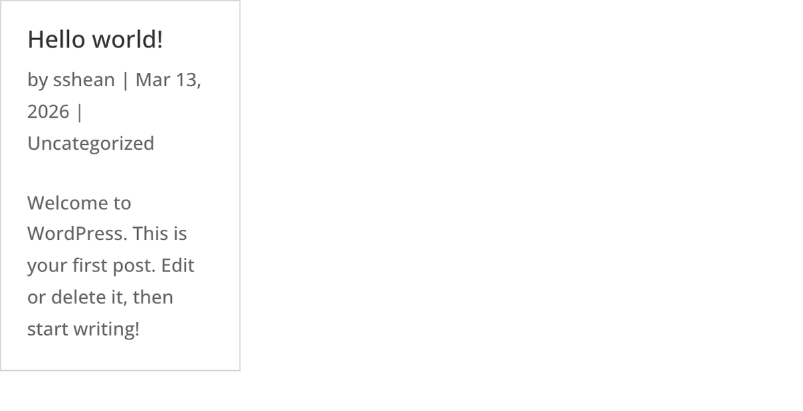
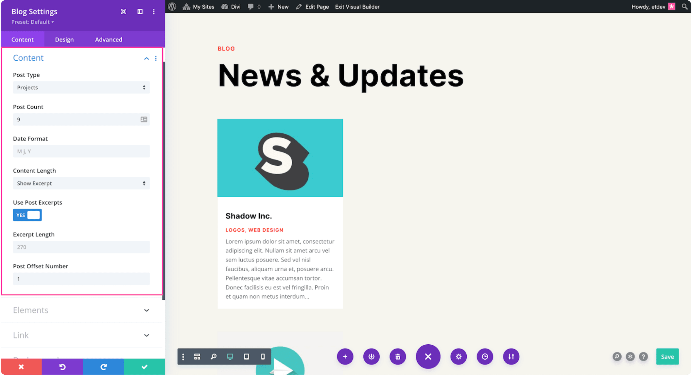

# Blog Module

The Blog module displays WordPress posts in configurable grid or fullwidth layouts with filtering, pagination, and meta controls.

## Overview

The Blog module is the primary tool in Divi for presenting dynamic post content on any page. It pulls posts from the WordPress database and renders them with featured images, titles, excerpts or full content, author and date metadata, category labels, comment counts, and read-more links. Two core layout modes are available: a fullwidth list view that stacks posts vertically, and a multi-column grid view that supports masonry-style positioning.

Pagination is built in, so visitors can navigate through large collections of posts without needing a custom query loop. You can filter which posts appear by selecting specific categories, setting a post count, or applying an offset to skip a number of posts from the beginning of the query.

The Blog module is particularly useful for blog index pages, homepage "latest posts" sections, category landing pages, and related-posts sections in Theme Builder templates. Its combination of layout options and meta toggles makes it adaptable to editorial, corporate, and portfolio-style designs.

For additional reference, see the [official Elegant Themes documentation](https://help.elegantthemes.com/en/articles/10226327-the-blog-module-in-divi-5).

[View A Live Demo Of This Module](https://www.16wells.dev/module-demos/blog/)

{ loading=lazy }
*The Blog module displaying posts in a grid layout with featured images, titles, and meta information.*

## Use Cases

1. **Blog Index Page** — Display all published posts with pagination, allowing visitors to browse your full archive in either a traditional list layout or a magazine-style grid.
2. **Homepage Latest Posts** — Show a small number of recent posts (typically 3-6) in a grid without pagination to highlight fresh content and encourage visitors to explore further.
3. **Category Landing Page** — Filter the module to a single category and use it as the primary content area for topic-specific pages, giving each category its own dedicated browsing experience.

## How to Add the Blog Module

1. Open the Visual Builder on the page where you want to display posts.
2. Click the gray **+** icon to add a new module to a row.
3. Search for "Blog" in the module picker or find it in the Content Elements category, then click to insert it.

<!-- TODO: Add animated GIF demonstrating module insertion -->

## Settings & Options

The Blog module settings are organized across three tabs: Content, Design, and Advanced.

### Content Tab

The Content tab controls which posts appear, what information is shown, and how the module links and displays at a structural level.

| Setting | Type | Description |
|---------|------|-------------|
| Content | item editor | Configure blog post query parameters including post count, category filtering, date format, content display mode (excerpt vs. full content), excerpt length, and offset. Toggle individual meta elements such as featured image, author, date, categories, comment count, and pagination. |
| Elements | icon picker | Select the icon used within the Blog module, such as the icon that appears on overlays or navigation elements. |
| Link | url | Make the entire Blog module wrapper clickable, directing users to another page, section, or external URL. Configure the link target (same window or new tab). |
| Background | background controls | Set a background color, gradient, image, or video behind the entire Blog module container. Supports multi-layered backgrounds with blend modes. |
| Order | order controls | Define the display order of the Blog module within Flexbox and CSS Grid parent layouts. Useful when the visual order should differ from the DOM order. |
| Meta | admin label | Assign a custom admin label to the module for easier identification in the Visual Builder layer panel. Force visibility in the builder interface. |

<!-- { loading=lazy } -->
<!-- TODO: Capture Content tab screenshot -->

#### Blog Content Settings Detail

The Content group within the Content tab contains the most important settings for controlling post output:

| Setting | Type | Description |
|---------|------|-------------|
| Post Count | number | The maximum number of posts to display per page. Defaults to 10. Combined with pagination, this controls how many posts a visitor sees before needing to navigate forward. |
| Include Categories | multi-select | Filter posts to one or more specific WordPress categories. When no categories are selected, all published posts are included. |
| Date Format | text | The PHP date format string used for post dates. Defaults to `M j, Y` (e.g., "Mar 16, 2026"). Accepts any valid PHP date format characters. |
| Show Featured Image | toggle | Controls whether the post's featured image appears above the title. When disabled, posts display as text-only entries. |
| Show Content | select | Choose between displaying a truncated excerpt or the full post content. When set to excerpt mode, the Excerpt Length setting controls the character count. |
| Excerpt Length | number | The number of characters to display in excerpted mode. Defaults to 270. Only applies when Show Content is set to excerpt mode. |
| Show Author | toggle | Display or hide the post author name in the meta line below the title. |
| Show Date | toggle | Display or hide the post publication date in the meta line. |
| Show Categories | toggle | Display or hide the post's assigned categories in the meta line. |
| Show Comments Count | toggle | Display or hide the number of comments for each post. |
| Show Pagination | toggle | Enable or disable page navigation at the bottom of the post list. When disabled, only the first page of results is shown. |
| Offset | number | Skip this many posts from the beginning of the query. Useful when another module is already displaying the most recent posts and you want to avoid duplicates. |

### Design Tab

The Design tab provides full visual control over the blog's layout mode, image overlays, typography for every text element, and standard module styling options.

**Module-specific settings:**

| Setting | Type | Description |
|---------|------|-------------|
| Layout | layout controls | Choose between Fullwidth (list) and Grid layout modes. In Grid mode, set the number of columns (1-4) and enable or disable masonry positioning. Masonry allows posts of varying heights to tile together without gaps. |
| Overlay | overlay controls | Configure the hover overlay that appears on featured images. Set the overlay color, icon, and icon color. The overlay adds a visual cue that the post image is interactive. |
| Read More Text | text styling | Control the appearance of the "read more" link at the end of each excerpt. Style it as a standard link or as a button-like element using font, size, and color settings. |

**Shared design options** — see [Options Groups](../options-groups/index.md) for detailed documentation:

| Options Group | Description |
|--------------|-------------|
| [Image](../options-groups/image.md) | Border radius, alignment, sizing for featured images |
| [Text](../options-groups/text.md) | Font, weight, alignment, color, line height, text shadow |
| [Title Text](../options-groups/text.md) | Font, size, color, letter spacing for post titles |
| [Body Text](../options-groups/text.md) | Font, size, color, line height for excerpt/content text |
| [Meta Text](../options-groups/text.md) | Font, size, color for author, date, categories metadata |
| [Pagination Text](../options-groups/text.md) | Font, size, color for pagination navigation links |
| [Sizing](../options-groups/sizing.md) | Width, max-width, height, min-height |
| [Spacing](../options-groups/spacing.md) | Margin and padding (responsive) |
| [Border](../options-groups/border.md) | Width, color, style, radius |
| [Box Shadow](../options-groups/box-shadow.md) | Shadow effects |
| [Filters](../options-groups/filters.md) | CSS filters (brightness, contrast, etc.) |
| [Transform](../options-groups/transform.md) | Scale, translate, rotate, skew |
| [Animation](../options-groups/animation.md) | Entrance animation styles |

<!-- { loading=lazy } -->
<!-- TODO: Capture Design tab screenshot -->

### Advanced Tab

The Advanced tab provides developer-oriented controls for custom attributes, conditional display, interactions, and scroll-driven effects.

**Shared advanced options** — see [Options Groups](../options-groups/index.md) for detailed documentation:

| Options Group | Description |
|--------------|-------------|
| [Attributes](../options-groups/attributes.md) | CSS ID, classes, custom HTML attributes |
| [CSS](../options-groups/css.md) | Custom CSS per element target |
| HTML | Custom HTML attributes for module wrapper |
| [Conditions](../options-groups/conditions.md) | Display rules (user role, page type, date, logic) |
| Interactions | Hover, click, or scroll-triggered interactions |
| [Visibility](../options-groups/visibility.md) | Device visibility toggles |
| [Transitions](../options-groups/transitions.md) | Hover transition timing |
| [Position](../options-groups/position.md) | CSS position and offsets |
| [Scroll Effects](../options-groups/scroll-effects.md) | Scroll-driven animation effects |

<!-- { loading=lazy } -->
<!-- TODO: Capture Advanced tab screenshot -->

## Code Examples

### Custom CSS

```css
/* Card-style blog grid with hover effect */
.et_pb_blog_grid .et_pb_post {
    background: #ffffff;
    border-radius: 8px;
    box-shadow: 0 1px 3px rgba(0, 0, 0, 0.1);
    overflow: hidden;
    transition: box-shadow 0.3s ease;
}
.et_pb_blog_grid .et_pb_post:hover {
    box-shadow: 0 4px 12px rgba(0, 0, 0, 0.15);
}

/* Add padding to the text area below the image */
.et_pb_blog_grid .et_pb_post .post-content-inner {
    padding: 1.5rem;
}

/* Style the read more link as a button */
.et_pb_blog_grid .et_pb_post a.more-link {
    display: inline-block;
    padding: 0.5rem 1rem;
    background: var(--et-global-color-primary);
    color: #ffffff;
    border-radius: 4px;
    text-decoration: none;
    font-size: 0.875rem;
}

/* Reduce meta font size and lighten color */
.et_pb_blog_grid .et_pb_post .post-meta {
    font-size: 0.8rem;
    color: #888888;
}

/* Responsive adjustments for mobile */
@media (max-width: 980px) {
    .et_pb_blog_grid .et_pb_post .post-content-inner {
        padding: 1rem;
    }
}
```

### PHP Hooks

```php
/**
 * Exclude a specific category from all Blog module queries.
 */
function my_exclude_category_from_blog( $args, $props ) {
    $exclude_cat = 42; // Category ID to exclude
    if ( isset( $args['cat'] ) ) {
        $args['category__not_in'] = array( $exclude_cat );
    }
    return $args;
}
add_filter( 'et_pb_blog_query_args', 'my_exclude_category_from_blog', 10, 2 );

/**
 * Override excerpt word count for Blog modules.
 */
function my_custom_blog_excerpt_length( $length ) {
    if ( is_singular() ) {
        return 30;
    }
    return $length;
}
add_filter( 'excerpt_length', 'my_custom_blog_excerpt_length', 999 );

/**
 * Filter the Blog module output to add a wrapper class.
 */
add_filter( 'et_module_shortcode_output', function( $output, $render_slug ) {
    if ( 'et_pb_blog' !== $render_slug ) {
        return $output;
    }
    // Add a custom wrapper class
    $output = str_replace(
        'class="et_pb_blog',
        'class="et_pb_blog my-custom-blog',
        $output
    );
    return $output;
}, 10, 2 );
```

## Common Patterns

1. **Homepage Latest Posts** — Place a Blog module in a fullwidth section with Post Count set to 3, Layout set to Grid with 3 columns, and pagination disabled. Add a button module below with a "View All Posts" link to your blog archive page. This gives visitors a quick preview of your most recent content without overwhelming the homepage.

2. **Category Landing Page** — Use the Include Categories filter to display posts from a single category. Set the layout to Fullwidth for a traditional editorial feel or Grid for a magazine-style presentation. Enable all meta elements so visitors can see author, date, and related categories for each post.

3. **Related Posts Section** — In a Theme Builder post template, add a Blog module below the main content area. Filter it to the same category as the current post, set a low post count (3-4), and use Grid layout. Apply an offset of 1 to skip the current post if it would otherwise appear in the results. This creates a "You might also like" section.

## AI Interaction Notes

!!! warning "Create vs. Modify"
    Modifying existing module content via REST API (`wp.apiFetch` PATCH) updates
    title, body text, and settings attributes. **Creating new modules via REST API**
    produces content that renders on the front end but may not appear in the Visual
    Builder layer view. Use browser automation for reliable module creation.
    See [REST API Content Playbook](../playbooks/rest-api-content.md).

**Block identifier:** `divi/blog` — *Needs verification on current build*

| Operation | Method | Status | Notes |
|-----------|--------|--------|-------|
| Read content | Parse `post_content` block JSON | Observed | Use brace-depth parser — see [Content Encoding](../internals/content-encoding.md) |
| Modify existing | `wp.apiFetch` PATCH on post endpoint | Observed | Update block attributes in `post_content` |
| Create new | Browser automation (Playwright) | Observed | REST creation may break VB visibility |
| Batch modify | Sequential REST requests | Needs Testing | See [REST API Content Playbook](../playbooks/rest-api-content.md) |

**Key content attributes** — *JSON paths need verification*:

| Attribute | JSON Path | Notes |
|-----------|-----------|-------|
| Posts Number | `attrs.posts_number` | Maximum posts to display per page |
| Include Categories | `attrs.include_categories` | Filter posts by category IDs |
| Show Content | `attrs.show_content` | Excerpt vs. full content display mode |

!!! tip "Module Selection Guidance"
    For post feeds use Blog; for project grids use Portfolio; for image-only grids use Gallery.

## Saving Your Work

After configuring the Blog module:

- **Save changes** — Click the purple **Save** button at the bottom of the Visual Builder, or press `Ctrl+S` (Windows) / `Cmd+S` (Mac).
- **Exit the builder** — Click the **X** button or use `Ctrl+Shift+E` to return to the WordPress dashboard.

## Version Notes

!!! note "Divi 5 Only"
    This page documents Divi 5 behavior exclusively. The Blog module in Divi 5 features updated markup for grid layouts, and the masonry implementation may use CSS Grid instead of the JavaScript-based column approach found in earlier versions.

## Troubleshooting

!!! warning "Posts Not Displaying"
    If the Blog module appears empty, verify that: (1) you have published posts assigned to the selected categories, (2) the Offset value is not set high enough to skip past all available posts, and (3) no plugin or custom code is modifying the query in a way that filters out all results. Also check that the Post Count is greater than zero.

!!! warning "Grid Columns Appear Uneven"
    When Masonry is enabled, posts with different featured image aspect ratios or content lengths will produce tiles of varying height. If you want a uniform grid, either crop all featured images to the same aspect ratio or disable the Masonry option in the Design tab's Layout group.

!!! tip "Pagination Not Working on Static Front Page"
    On pages set as the static front page in WordPress settings, Blog module pagination can conflict with WordPress's built-in paging. If clicking page 2 shows the same posts as page 1, add a query variable fix to your child theme's `functions.php` that maps `page` to `paged` on the main query for the front page.

## Related

- [Portfolio Module](portfolio.md) — Display project-type posts in grid layouts
- [Filterable Portfolio Module](filterable-portfolio.md) — Portfolio with category filtering built in
- [Post Slider Module](post-slider.md) — Show posts in a full-screen sliding format
