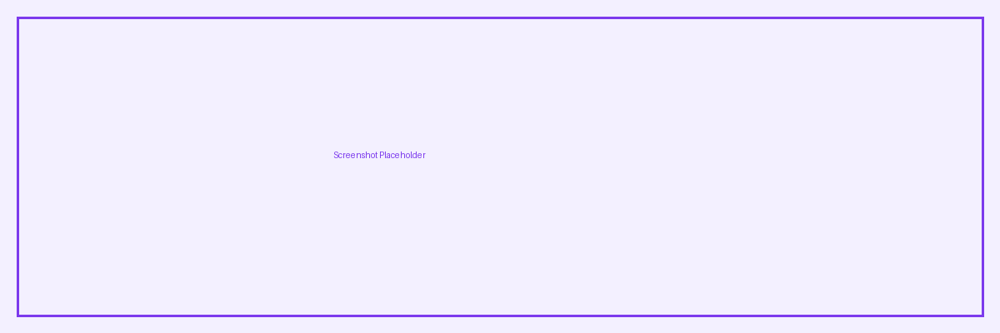

# Blurb Module

The Blurb module combines an icon or image with a heading and body text, typically used for feature highlights, service descriptions, and icon-based content grids.

## Overview

Blurbs are one of Divi's most versatile modules. They pair a visual element (either a Divi icon or an uploaded image) with a title and a short description. Most Divi sites use Blurbs for service sections, feature lists, team introductions, and process steps.

The module supports two distinct layouts — one with the image/icon positioned above the text, and one with it placed to the left or right. This makes it flexible enough for both vertical card-style layouts and horizontal feature rows.

<!-- TODO: Replace with proper screenshot -->
<!-- { loading=lazy } -->
<!-- *Default Blurb layout with icon placement set to Top.* -->

## Settings & Options

### Content Tab

| Setting | Type | Default | Description |
|---------|------|---------|-------------|
| Title | text | none | The heading displayed in the blurb |
| URL | url | none | Makes the title and image/icon clickable |
| URL Target | select | Same Window | `Same Window` or `New Tab` |
| Use Icon | toggle | No | Switch between image and icon mode |
| Icon | icon picker | none | Divi icon (only when Use Icon is enabled) |
| Image | upload | none | Image file (only when Use Icon is disabled) |
| Alt Text | text | none | Image alt attribute for accessibility |
| Body | rich text | none | The description text below the title |

### Design Tab

| Setting | Type | Default | Description |
|---------|------|---------|-------------|
| Image/Icon Placement | select | Top | `Top`, `Left`, or `Right` |
| Image Max Width | range | 100% | Maximum width of the blurb image |
| Icon Color | color | theme accent | Color of the icon |
| Circle Icon | toggle | No | Adds a circular background behind the icon |
| Circle Color | color | theme accent | Background color of the icon circle |
| Icon Font Size | range | 96px | Size of the icon |
| Title Font | typography | default | Full typography controls for the title |
| Body Font | typography | default | Full typography controls for body text |
| Text Alignment | select | Left | `Left`, `Center`, `Right`, `Justified` |
| Animation | select | None | Entrance animation style |

### Advanced Tab

| Setting | Type | Default | Description |
|---------|------|---------|-------------|
| CSS ID | text | none | Custom HTML id attribute |
| CSS Class | text | none | Custom CSS class(es) |
| Custom CSS | code | none | Target specific elements within the module |

## Code Examples

### Targeting blurb elements with CSS

```css
/* Style all blurb titles */
.et_pb_blurb_content h4,
.et_pb_blurb_content h2 {
    font-weight: 700;
    letter-spacing: -0.02em;
}

/* Style blurb icons */
.et_pb_blurb .et-pb-icon {
    color: #7c3aed;
    font-size: 48px;
}

/* Blurb image hover effect */
.et_pb_blurb .et_pb_main_blurb_image img {
    transition: transform 0.3s ease;
}
.et_pb_blurb:hover .et_pb_main_blurb_image img {
    transform: scale(1.05);
}
```

### Adding a custom class via PHP

```php
/**
 * Add a custom class to all Blurb modules.
 */
function my_custom_blurb_class( $output, $render_slug ) {
    if ( 'et_pb_blurb' === $render_slug ) {
        $output = str_replace(
            'class="et_pb_blurb',
            'class="et_pb_blurb my-custom-blurb',
            $output
        );
    }
    return $output;
}
add_filter( 'et_module_shortcode_output', 'my_custom_blurb_class', 10, 2 );
```

## Common Patterns

### Feature grid (3-column)

Place three Blurb modules in a 1/3 + 1/3 + 1/3 row with icons set to "Top" placement and text centered. This is the most common Divi layout pattern for service or feature sections.

### Horizontal feature list

Set Image/Icon Placement to "Left" and stack multiple Blurbs vertically. This works well for benefit lists, process steps, or comparison points.

### Linked card grid

Add a URL to each Blurb and apply hover effects via Custom CSS to create a clickable card grid. Combine with box-shadow and border-radius for a modern card aesthetic.

## Version Notes

!!! note "Divi 5 Only"
    This page documents Divi 5 behavior exclusively. The Blurb module's rendering structure in Divi 5 uses updated markup — the heading tag may differ from earlier versions. Verify CSS selectors accordingly.

## Troubleshooting

!!! warning "Icon not showing"
    If the icon appears as a blank square, Divi's icon font may not be loading. Check that `et-icons` is not being dequeued by a performance plugin. Also verify that the icon font file is accessible at `/wp-content/themes/Divi/includes/builder/styles/`.

!!! warning "Image blurry on retina"
    Blurb images are displayed at the size they're uploaded. For sharp rendering on retina displays, upload images at 2x the display dimensions and set the Image Max Width accordingly.

## Related

- [Text Module](text.md) — for longer-form content without an image/icon
- [Call to Action Module](#) — when you need a button instead of body text
