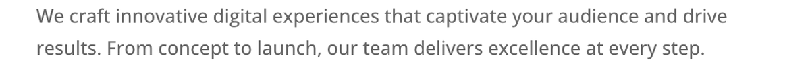
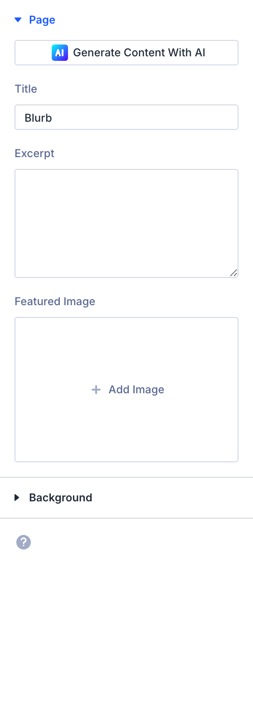

# Blurb Module

The Blurb module pairs an icon or image with a heading and descriptive text to create compact, visually engaging content blocks.

!!! abstract "Quick Reference"
    **What it does:** Combines an icon or image with a title and body text to create a self-contained content block.
    **When to use it:** Feature grids, service descriptions, process steps, linked card navigation
    **Key settings:** Image & Icon (icon/image mode), Text (title/body), Link, Image/Icon Placement (top/left)
    **Block identifier:** `divi/blurb`
    **ET Docs:** [Official documentation](https://help.elegantthemes.com/en/articles/10226428-the-blurb-module-in-divi-5)

!!! tip "When to Use This Module"
    - You need an icon or image paired with a heading and short description
    - Feature highlight grids, service listings, or benefit sections
    - Clickable card-style navigation elements with visual icons

!!! warning "When NOT to Use This Module"
    - You need a standalone icon without text → use [Icon](icon.md)
    - You need long-form text content without a visual element → use [Text](text.md)
    - You need a heading, description, and prominent button → use [Call to Action](call-to-action.md)
    - You need a list of icon-paired items → use [Icon List](icon-list.md)

## Overview

The Blurb module is one of the most frequently used elements in Divi layouts. It combines a visual component — either a Divi icon or an uploaded image — with a title and body text to create a self-contained content unit. This makes it the go-to choice for feature highlights, service descriptions, team member introductions, process steps, and benefit lists.

Two primary layout orientations are available. The default places the image or icon above the text in a vertically stacked arrangement, which works well for card-style grids. The alternative positions the visual element to the left of the text, creating a horizontal layout suited to inline feature lists and process flows. The image/icon placement setting controls this behavior.

Because the Blurb module supports both icons from the built-in Divi icon library and custom uploaded images, it adapts easily to different design contexts. Icons keep file sizes small and scale cleanly at any resolution, while images allow for photographs, illustrations, or branded graphics that carry more visual weight.

For additional reference, see the [official Elegant Themes documentation](https://help.elegantthemes.com/en/articles/10226428-the-blurb-module-in-divi-5).

[View A Live Demo Of This Module](https://www.16wells.dev/module-demos/blurb/)

{ loading=lazy }
*The Blurb module displaying an icon, title, and body text in a vertical layout.*

## Use Cases

1. **Feature or Service Grid** — Arrange three or four Blurb modules in equal-width columns to present the key features of a product or the core services of a business, each with a distinctive icon and a short description.
2. **Process Steps** — Use the left-aligned icon placement with numbered icons to walk visitors through a multi-step workflow, onboarding process, or how-it-works sequence.
3. **Linked Card Navigation** — Add URLs to each Blurb and apply hover styling to create a clickable card grid that serves as a visual navigation hub for sub-pages or product categories.

## How to Add the Blurb Module

1. Open the Visual Builder on the page you want to edit.
2. Click the gray **+** icon to add a new module to a row.
3. Search for "Blurb" in the module picker or find it in the Content Elements category, then click to insert it.

<!-- TODO: Add animated GIF demonstrating module insertion -->

## Settings & Options

The Blurb module settings are organized across three tabs: Content, Design, and Advanced.

### Content Tab

The Content tab controls the text, visual media, linking behavior, background, and metadata for the Blurb module.

| Setting | Type | Description |
|---------|------|-------------|
| Text | text fields | Set the Blurb's title (heading) and body content. The title appears as a heading element above the body text. The body field supports rich text including links, lists, and basic formatting. |
| Image & Icon | media controls | Choose between displaying an uploaded image or a Divi icon. In icon mode, select from the built-in icon library. In image mode, upload or select an image from the media library and set its alt text for accessibility. |
| Link | url | Make the entire Blurb module clickable by assigning a destination URL. Configure whether the link opens in the same window or a new tab. When a URL is set, the title and image/icon both become clickable. |
| Background | background controls | Set a background color, gradient, image, or video behind the entire Blurb module container. Supports multi-layered backgrounds with blend modes for creative effects. |
| Loop | toggle | Enable the loop builder to dynamically populate the Blurb's content from a data source, allowing you to create repeating blurbs driven by custom fields or other dynamic data. |
| Order | order controls | Define the display order of the Blurb module within Flexbox and CSS Grid parent layouts. Useful when the visual arrangement should differ from the source order. |
| Meta | admin label | Assign a custom admin label to identify the module in the Visual Builder's layer panel. Force visibility within the builder interface for easier editing. |

<!-- { loading=lazy } -->
<!-- TODO: Capture Content tab screenshot -->

### Design Tab

The Design tab provides full visual control over the icon/image appearance, typography for all text elements, and standard module styling.

**Module-specific settings:**

| Setting | Type | Description |
|---------|------|-------------|
| Image & Icon | icon/image styling | Control the image or icon's visual presentation. For icons: set color, size, background shape (circle or square), background color, and padding. For images: set max width, alignment, border radius, and responsive sizing. Configure the placement position (top, left, or right) relative to the text content. |

**Shared design options** — see [Options Groups](../options-groups/index.md) for detailed documentation:

| Options Group | Description |
|--------------|-------------|
| [Text](../options-groups/text.md) | Font, weight, alignment, color, line height, text shadow |
| [Title Text](../options-groups/text.md) | Font, size, color, letter spacing for the Blurb title heading |
| [Body Text](../options-groups/text.md) | Font, size, color, line height for body content text |
| [Sizing](../options-groups/sizing.md) | Width, max-width, height, min-height |
| [Spacing](../options-groups/spacing.md) | Margin and padding (responsive) |
| [Border](../options-groups/border.md) | Width, color, style, radius |
| [Box Shadow](../options-groups/box-shadow.md) | Shadow effects |
| [Filters](../options-groups/filters.md) | CSS filters (brightness, contrast, etc.) |
| [Transform](../options-groups/transform.md) | Scale, translate, rotate, skew |
| [Animation](../options-groups/animation.md) | Entrance animation styles |

<!-- { loading=lazy } -->
<!-- TODO: Capture Design tab screenshot -->

### Advanced Tab

The Advanced tab provides developer-oriented controls for custom attributes, conditional display, interactions, and scroll-driven effects.

**Shared advanced options** — see [Options Groups](../options-groups/index.md) for detailed documentation:

| Options Group | Description |
|--------------|-------------|
| [Attributes](../options-groups/attributes.md) | CSS ID, classes, custom HTML attributes |
| [CSS](../options-groups/css.md) | Custom CSS per element target |
| HTML | Custom HTML attributes for module wrapper |
| [Conditions](../options-groups/conditions.md) | Display rules (user role, page type, date, logic) |
| Interactions | Hover, click, or scroll-triggered interactions |
| [Visibility](../options-groups/visibility.md) | Device visibility toggles |
| [Transitions](../options-groups/transitions.md) | Hover transition timing |
| [Position](../options-groups/position.md) | CSS position and offsets |
| [Scroll Effects](../options-groups/scroll-effects.md) | Scroll-driven animation effects |

<!-- { loading=lazy } -->
<!-- TODO: Capture Advanced tab screenshot -->

## Code Examples

### Custom CSS

```css
/* Card-style Blurb with hover lift effect */
.et_pb_blurb {
    background: #ffffff;
    border-radius: 8px;
    padding: 2rem;
    box-shadow: 0 1px 3px rgba(0, 0, 0, 0.1);
    transition: transform 0.3s ease, box-shadow 0.3s ease;
}
.et_pb_blurb:hover {
    transform: translateY(-4px);
    box-shadow: 0 8px 24px rgba(0, 0, 0, 0.12);
}

/* Style blurb titles */
.et_pb_blurb_content h4,
.et_pb_blurb_content h2 {
    font-weight: 700;
    letter-spacing: -0.02em;
}

/* Icon color and sizing */
.et_pb_blurb .et-pb-icon {
    color: var(--et-global-color-primary);
    font-size: 48px;
}

/* Image hover zoom effect */
.et_pb_blurb .et_pb_main_blurb_image img {
    transition: transform 0.3s ease;
    border-radius: 6px;
}
.et_pb_blurb:hover .et_pb_main_blurb_image img {
    transform: scale(1.05);
}

/* Responsive: stack left-aligned blurbs on mobile */
@media (max-width: 767px) {
    .et_pb_blurb .et_pb_blurb_content {
        flex-direction: column;
        text-align: center;
    }
}
```

### PHP Hooks

```php
/**
 * Add a custom wrapper class to all Blurb modules.
 */
function my_custom_blurb_class( $output, $render_slug ) {
    if ( 'et_pb_blurb' === $render_slug ) {
        $output = str_replace(
            'class="et_pb_blurb',
            'class="et_pb_blurb my-custom-blurb',
            $output
        );
    }
    return $output;
}
add_filter( 'et_module_shortcode_output', 'my_custom_blurb_class', 10, 2 );

/**
 * Filter the Blurb module to add a data attribute for tracking.
 */
add_filter( 'et_module_shortcode_output', function( $output, $render_slug ) {
    if ( 'et_pb_blurb' !== $render_slug ) {
        return $output;
    }
    $output = str_replace(
        'class="et_pb_blurb',
        'data-module="blurb" class="et_pb_blurb',
        $output
    );
    return $output;
}, 10, 2 );
```

## Common Patterns

1. **Three-Column Feature Grid** — Place three Blurb modules in a 1/3 + 1/3 + 1/3 row with icons set to top placement and text centered. Assign a unique icon and accent color to each blurb for visual variety. This is the most common Divi pattern for service, feature, and benefit sections.

2. **Horizontal Process Steps** — Set Image/Icon Placement to "Left" and stack multiple Blurbs vertically within a single column. Use numbered icons or step-related icons to guide visitors through a sequential workflow. This layout is effective for how-it-works sections and onboarding flows.

3. **Clickable Card Navigation** — Assign a URL to each Blurb, apply a background color, border radius, and box shadow via the Design tab, and add hover effects using custom CSS or the Interactions builder. This creates a visual navigation grid where each card links to a sub-page, product, or service detail page.

## AI Interaction Notes

!!! warning "Create vs. Modify"
    Modifying existing module content via REST API (`wp.apiFetch` PATCH) updates
    title, body text, and settings attributes. **Creating new modules via REST API**
    produces content that renders on the front end but may not appear in the Visual
    Builder layer view. Use browser automation for reliable module creation.
    See [REST API Content Playbook](../playbooks/rest-api-content.md).

**Block identifier:** `divi/blurb` — *Needs verification on current build*

| Operation | Method | Status | Notes |
|-----------|--------|--------|-------|
| Read content | Parse `post_content` block JSON | Observed | Use brace-depth parser — see [Content Encoding](../internals/content-encoding.md) |
| Modify existing | `wp.apiFetch` PATCH on post endpoint | Observed | Update block attributes in `post_content` |
| Create new | Browser automation (Playwright) | Observed | REST creation may break VB visibility |
| Batch modify | Sequential REST requests | Needs Testing | See [REST API Content Playbook](../playbooks/rest-api-content.md) |

**Key content attributes** — *JSON paths need verification*:

| Attribute | JSON Path | Notes |
|-----------|-----------|-------|
| Title | `attrs.title.text` | Blurb heading text |
| Body | `attrs.content.text` | Blurb body content |
| Image URL | `attrs.image.url` | Image source URL |
| Icon | `attrs.font_icon` | Selected Divi icon character |
| Use Icon | `attrs.use_icon` | Toggle between icon and image mode |
| Placement | `attrs.image_placement` | Icon/image position relative to text |

!!! tip "Module Selection Guidance"
    For icons with descriptions or feature cards use Blurb; for text-only use Text; for blocks needing a prominent button use Call to Action; for team profiles use Person.

## Saving Your Work

After configuring the Blurb module:

- **Save changes** — Click the purple **Save** button at the bottom of the Visual Builder, or press `Ctrl+S` (Windows) / `Cmd+S` (Mac).
- **Exit the builder** — Click the **X** button or use `Ctrl+Shift+E` to return to the WordPress dashboard.

## Version Notes

!!! note "Divi 5 Only"
    This page documents Divi 5 behavior exclusively. The Blurb module in Divi 5 uses updated markup and CSS class structures. The heading tag level may differ from Divi 4, so verify your CSS selectors if you are migrating custom styles from an earlier version.

## Troubleshooting

!!! warning "Icon Not Displaying"
    If the icon appears as an empty square or does not render at all, the Divi icon font may not be loading correctly. Check that a performance optimization plugin is not dequeuing the `et-icons` stylesheet. Also verify that the icon font files are accessible at the expected theme path.

!!! warning "Image Appears Blurry on Retina Screens"
    Blurb images render at their uploaded dimensions. For crisp display on high-density (retina) screens, upload images at twice the intended display size and use the Image Max Width setting to constrain them to the correct visual dimensions.

!!! tip "Left-Aligned Icon Not Aligning Properly"
    When using left placement, the icon and text should sit side by side. If the icon appears above the text instead, check that the column width is sufficient to accommodate both elements horizontally. On narrow columns or mobile viewports, the layout may automatically stack vertically.

## Related

- [Icon Module](icon.md) — Display a standalone icon without accompanying text
- [Text Module](text.md) — For longer-form content blocks without an image or icon element
- [Call to Action Module](call-to-action.md) — Combines a heading, description, and button for conversion-focused content blocks
- [Icon List Module](icon-list.md) — Display a list of items each paired with an icon
- [Image & Icon Options](../options-groups/image-icon.md) — Configure image/icon display settings shared across modules
- [Flexbox Layout](../builder/flexbox.md) — Control blurb card alignment and spacing in grid layouts
