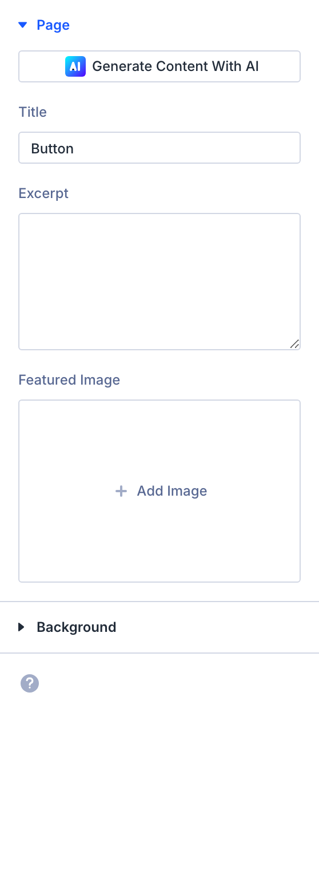
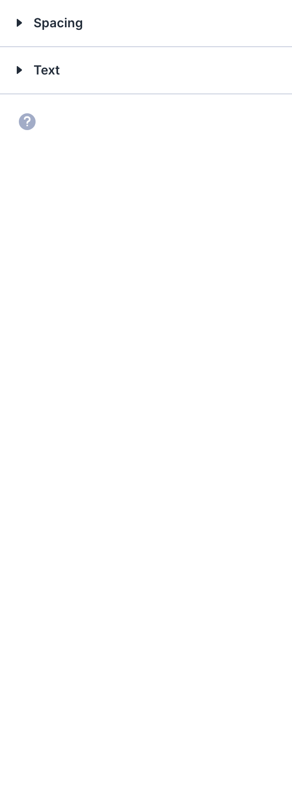

# Button

The Button module renders a single clickable button element with fully customizable text, link, icon, and styling.

## Overview

The Button module is one of the most frequently used elements in Divi 5 layouts. It creates a standalone, styled link that directs visitors to another page, section, file, or external URL. Unlike a plain text link, the button provides a visually prominent call-to-action with configurable colors, borders, icons, and hover effects.

Every aspect of the button's appearance can be controlled through the Design tab, including typography, background fills, border treatments, icon selection, and spacing. The module supports responsive settings, so you can fine-tune how the button looks and behaves across desktop, tablet, and phone breakpoints independently.

Buttons work in any column configuration and can be aligned left, center, or right within their container. They pair naturally with text, images, and other content modules to create effective conversion points throughout a page layout.

For additional reference, see the [official Elegant Themes documentation](https://help.elegantthemes.com/en/articles/10259665-the-button-module-divi-5).

[View A Live Demo Of This Module](https://www.16wells.dev/module-demos/button/)

{ loading=lazy }
*The Button module as it appears on the live demo.*

## Use Cases

1. **Primary Navigation Actions** — Place a button after introductory text or a hero section to guide visitors toward key pages such as contact forms, product pages, or signup flows.
2. **Download Links** — Create a styled download button that links to a PDF, document, or other file asset, making the download action visually distinct from surrounding content.
3. **Section Anchors** — Use buttons with anchor links to scroll visitors to specific sections on the same page, creating an interactive single-page navigation experience.

## How to Add the Button Module

1. Open the Visual Builder on the page you want to edit.
2. Click the gray **+** icon to add a new module to a row.
3. Search for "Button" in the module picker or find it in the Content Elements category, then click to insert it.

<!-- TODO: Add animated GIF demonstrating module insertion -->

## Settings & Options

The Button module settings are organized across three tabs: Content, Design, and Advanced.

### Content Tab

The Content tab controls the button's label text, destination link, and module metadata.

| Setting | Type | Description |
|---------|------|-------------|
| Text | text | The label displayed on the button. This is the visible text visitors see and click. Supports dynamic content. |
| Link | url | The destination URL the button points to. Can be an external URL, an internal page, a section anchor, or a file download link. Also includes settings for link target (same window or new tab) and link relationship attributes. |
| Loop | toggle | Enables the loop builder, allowing the button to repeat dynamically based on a data source such as posts or custom queries. |
| Order | number | Controls the display order of this module when its parent row or column uses Flexbox or CSS Grid layout modes. |
| Meta | admin label | Set an admin label for the module to help identify it in the Visual Builder's layer panel. Also controls Visual Builder visibility. |

<!-- { loading=lazy } -->
<!-- TODO: Capture Content tab screenshot -->

### Design Tab

The Design tab controls the button's visual appearance including alignment, typography, colors, spacing, and effects.

**Module-specific settings:**

| Setting | Type | Description |
|---------|------|-------------|
| Alignment | select | Sets the horizontal position of the button within its column — left, center, or right. Supports responsive values per breakpoint. |

**Shared design options** — see [Options Groups](../options-groups/index.md) for detailed documentation:

| Options Group | Description |
|--------------|-------------|
| [Text](../options-groups/text.md) | Font, weight, alignment, color, line height, text shadow |
| [Button](../options-groups/button.md) | Text size, colors, border, radius, font, icon, hover behavior |
| [Spacing](../options-groups/spacing.md) | Margin and padding (responsive) |
| [Box Shadow](../options-groups/box-shadow.md) | Shadow effects |
| [Filters](../options-groups/filters.md) | CSS filters (brightness, contrast, etc.) |
| [Transform](../options-groups/transform.md) | Scale, translate, rotate, skew |
| [Animation](../options-groups/animation.md) | Entrance animation styles |

<!-- { loading=lazy } -->
<!-- TODO: Capture Design tab screenshot -->

### Advanced Tab

The Advanced tab provides developer-oriented controls for custom attributes, conditional display, interactions, and scroll-driven effects.

**Shared advanced options** — see [Options Groups](../options-groups/index.md) for detailed documentation:

| Options Group | Description |
|--------------|-------------|
| [Attributes](../options-groups/attributes.md) | CSS ID, classes, custom HTML attributes |
| [CSS](../options-groups/css.md) | Custom CSS per element target |
| HTML | Custom HTML attributes for module wrapper |
| [Conditions](../options-groups/conditions.md) | Display rules (user role, page type, date, logic) |
| Interactions | Hover, click, or scroll-triggered interactions |
| [Visibility](../options-groups/visibility.md) | Device visibility toggles |
| [Transitions](../options-groups/transitions.md) | Hover transition timing |
| [Position](../options-groups/position.md) | CSS position and offsets |
| [Scroll Effects](../options-groups/scroll-effects.md) | Scroll-driven animation effects |

<!-- { loading=lazy } -->
<!-- TODO: Capture Advanced tab screenshot -->

## Code Examples

### Custom CSS

```css
/* Style the Button module container */
.et_pb_button_module_wrapper {
    margin-bottom: 30px;
}

/* Custom button appearance */
.et_pb_button {
    font-weight: 700;
    letter-spacing: 1px;
    text-transform: uppercase;
    padding: 14px 32px;
    border-radius: 50px;
}

/* Hover effect — background fill with color shift */
.et_pb_button:hover {
    background-color: #1a73e8;
    border-color: #1a73e8;
    color: #ffffff;
}

/* Responsive adjustments */
@media (max-width: 980px) {
    .et_pb_button {
        font-size: 14px;
        padding: 12px 24px;
    }
}

@media (max-width: 767px) {
    .et_pb_button_module_wrapper {
        text-align: center;
    }
}
```

### PHP Hooks

```php
/* Add a custom data attribute to all Button modules for analytics tracking */
add_filter('et_module_shortcode_output', function($output, $render_slug) {
    if ('et_pb_button' !== $render_slug) {
        return $output;
    }
    $output = str_replace(
        'class="et_pb_button',
        'data-track="button-click" class="et_pb_button',
        $output
    );
    return $output;
}, 10, 2);
```

## Common Patterns

1. **Hero Section CTA** — Place a Button module below a heading and text in a hero section. Use a bold background color, generous padding, and a pill-shaped border radius to make the button the focal point. Align it center or left depending on whether the hero uses a centered or split layout.

2. **Ghost Button Pair** — Add two Button modules side by side in a two-column row: one with a solid background (primary action) and one with a transparent background and visible border (secondary action). This pattern clearly communicates a primary and secondary choice, such as "Get Started" and "Learn More."

3. **Sticky Footer Button** — Use the Advanced tab's Position setting to make a button sticky at the bottom of the viewport on mobile devices. Set position to Fixed, bottom offset to 20px, and full width via custom CSS. This keeps the CTA accessible as visitors scroll through long pages.

## Saving Your Work

After configuring the button:

- **Save changes** — Click the purple **Save** button at the bottom of the Visual Builder, or press `Ctrl+S` (Windows) / `Cmd+S` (Mac).
- **Exit the builder** — Click the **X** button or use `Ctrl+Shift+E` to return to the WordPress dashboard.

## Version Notes

!!! note "Divi 5 Only"
    This page documents Divi 5 behavior exclusively.

## Troubleshooting

!!! warning "Button Not Clickable"
    If the button appears but does not respond to clicks:

    - Verify the **Link** field contains a valid URL including the protocol (`https://`).
    - Check for overlapping elements with a higher z-index that may be intercepting clicks. Use browser DevTools to inspect stacking order.
    - JavaScript errors from other plugins can prevent click handlers from firing. Check the browser console for errors.

!!! warning "Button Icon Not Showing"
    If you have enabled custom button styles but the icon does not appear:

    - Confirm that an icon is selected in the **Button** settings under the Design tab.
    - Check the **Button On Hover** toggle — when enabled, the icon only appears on hover. Disable it to show the icon at all times.
    - Verify the icon color is not the same as the button background color.

!!! tip "Button Width Not Matching Design"
    By default, the button width is determined by its text content and padding. To create a full-width button, add `width: 100%` via the CSS editor in the Advanced tab. For a fixed-width button, set a specific `min-width` value instead.

## Related

- [Call to Action](call-to-action.md) — Combines heading, description text, and a button into one conversion-focused block
- [Text](text.md) — Use alongside buttons for descriptive content that introduces the action
