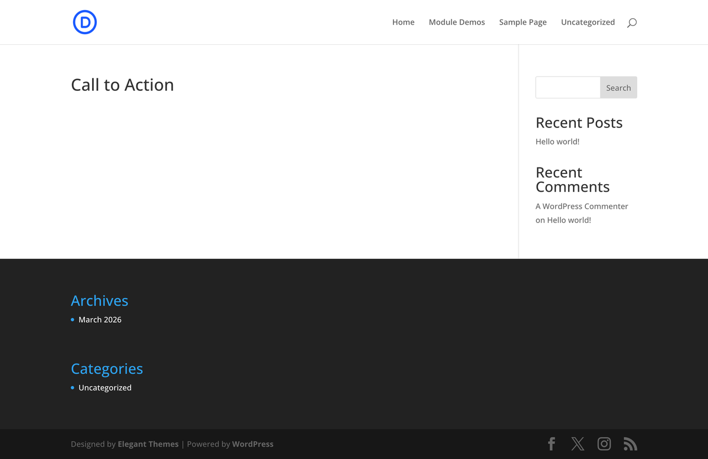
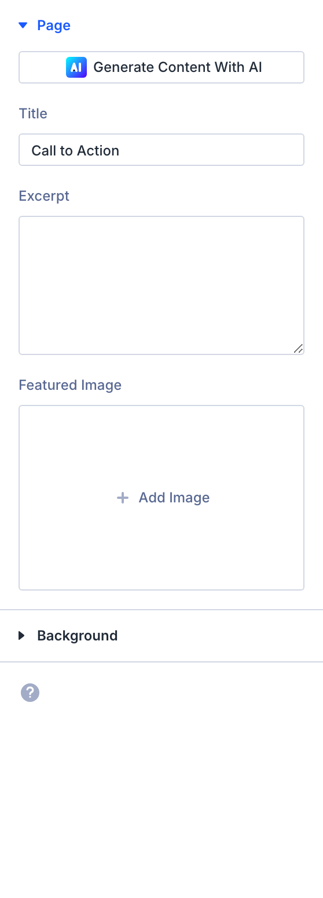

# Call to Action

The Call to Action module is a Divi 5 content element used in the Visual Builder.

## Overview

How to add, configure and customize the Divi call to action module.

Having a clear call to action on your website is important for creating an enjoyable user experience and increasing conversions. The Divi Call To Action Module can help you grow your email list, increase contact form submissions, promote a product, and more.

View a Live Demo of the Divi Call To Action Module

{ loading=lazy }
*The Call to Action module as it appears in the Divi 5 Visual Builder.*

## Settings & Options

### Content Tab

<!-- TODO: Verify all Content tab settings for Call to Action module -->

| Setting | Type | Default | Description |
|---------|------|---------|-------------|
| Button– Type the text of the button here. Note | text | — | The button will not show unless it has a link applied to it. You can do so in Link > Button Link URL. |

{ loading=lazy }

### Design Tab

<!-- TODO: Verify all Design tab settings for Call to Action module -->

| Setting | Type | Default | Description |
|---------|------|---------|-------------|
| <!-- TODO: Document Design settings --> | | | |

{ loading=lazy }

### Advanced Tab

<!-- TODO: Verify all Advanced tab settings for Call to Action module -->

| Setting | Type | Default | Description |
|---------|------|---------|-------------|
| CSS ID | text | — | Assign a unique CSS ID to the module |
| CSS Class | text | — | Assign CSS classes to the module |
| Custom CSS | code | — | Add custom CSS directly to the module's elements |
| Visibility | toggle | Show on all devices | Control device visibility (desktop, tablet, phone) |
| Transition | select | Default | Animation transition style for hover effects |

## Code Examples

### Custom CSS

```css
/* Style the Call to Action module */
.et_pb_call_to_action {
    /* Add your custom styles */
    margin-bottom: 30px;
}

/* Responsive adjustments */
@media (max-width: 980px) {
    .et_pb_call_to_action {
        padding: 20px;
    }
}
```

### PHP Hooks

```php
/* Filter the Call to Action module output */
add_filter('et_module_shortcode_output', function($output, $render_slug) {
    if ('et_pb_et_pb_call_to_action' !== $render_slug) {
        return $output;
    }
    // Modify $output as needed
    return $output;
}, 10, 2);
```

## Common Patterns

<!-- TODO: Add 2-3 real-world usage patterns with screenshots -->

1. **Basic Usage** — Add the Call to Action module to any row in the Visual Builder and configure its settings.

2. **Styled Variation** — Use the Design tab to customize fonts, colors, and spacing to match your site's design system.

3. **Dynamic Content** — Use dynamic content fields to pull data from custom fields or post meta.

## Version Notes

!!! note "Divi 5 Only"
    This page documents Divi 5 behavior exclusively.

## Troubleshooting

!!! warning "Module Not Rendering"
    If the Call to Action module doesn't appear on the front end, verify that:

    - The module is not inside a disabled section or row
    - Visibility settings aren't hiding it on the current device
    - Any required fields (like URLs or content) are filled in

<!-- TODO: Add module-specific troubleshooting items -->

## Related

- [Button](button.md)
- [Blurb](blurb.md)
