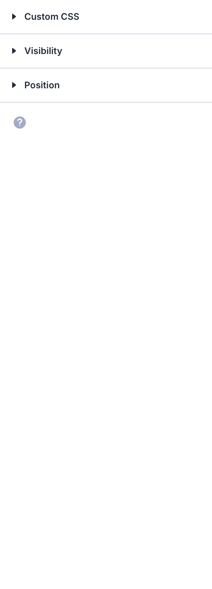

# Circle Counter

The Circle Counter module displays an animated circular progress bar with a percentage value and optional title.

!!! abstract "Quick Reference"
    **What it does:** Displays an animated circular progress arc that fills from zero to a target percentage on scroll.
    **When to use it:** Skills/proficiency displays, project milestones, statistics dashboards, KPI visualizations
    **Key settings:** Title, Number (0-100), Percent Sign toggle, Circle color and track color
    **Block identifier:** `divi/circle-counter`
    **ET Docs:** [Official documentation](https://help.elegantthemes.com/en/articles/10260293-the-circle-counter-module-in-divi-5)

!!! tip "When to Use This Module"
    - You need a visual circular gauge for percentage-based data
    - Statistics dashboards showing completion rates, satisfaction scores, or growth metrics
    - Grouped counters in multi-column rows for visual impact

!!! warning "When NOT to Use This Module"
    - You need horizontal progress bars → use [Bar Counter](bar-counter.md)
    - You need an animated number without a circular visual → use [Number Counter](number-counter.md)
    - You need a countdown to a specific date → use [Countdown Timer](countdown-timer.md)

## Overview

The Circle Counter module presents numerical data as a filled arc within a circle, animating from zero to the target value when the element scrolls into view. It is commonly used to represent completion percentages, skill proficiency levels, project progress, and other metrics that benefit from a visual gauge rather than plain text.

Each circle counter consists of three visual components: the circular track (background ring), the progress arc (filled portion), and a centered number that counts up to the specified value. A title below the circle provides context for what the number represents. The animation triggers automatically via lazy-loading when the module enters the viewport, creating an engaging reveal effect.

Circle counters work best when grouped together. Place three or four in a multi-column row to create a statistics dashboard effect — for example, showing completion rates, satisfaction scores, or growth percentages side by side. The module adapts to its column width, so the circle scales proportionally in narrower containers.

For additional reference, see the [official Elegant Themes documentation](https://help.elegantthemes.com/en/articles/10260293-the-circle-counter-module-in-divi-5).

[View A Live Demo Of This Module](https://www.16wells.dev/module-demos/circle-counter/)

{ loading=lazy }
*The Circle Counter module as it appears on the live demo.*

## Use Cases

1. **Skills or Proficiency Display** — Show skill levels on a portfolio or team member page with each circle representing a different competency and its mastery percentage.
2. **Project Milestones** — Visualize project progress on a status page or case study, with each circle counter tracking a different phase or deliverable.
3. **Statistics Dashboard** — Present key business metrics like customer satisfaction, revenue growth, or completion rates in a visually engaging row of animated counters.

## How to Add the Circle Counter Module

1. Open the Visual Builder on the page you want to edit.
2. Click the gray **+** icon to add a new module to a row.
3. Search for "Circle Counter" in the module picker or find it in the Content Elements category, then click to insert it.


## Settings & Options

The Circle Counter module settings are organized across three tabs: Content, Design, and Advanced.

### Content Tab

The Content tab controls the counter's title, number value, display options, link behavior, background, and metadata.

| Setting | Type | Description |
|---------|------|-------------|
| Title | text | The label displayed below the circle, providing context for the number value (e.g., "Project Completion" or "Customer Satisfaction"). Supports dynamic content. |
| Number | number/text | The target percentage value the counter animates to. Enter a number between 0 and 100. This is the value displayed inside the circle. |
| Percent Sign | toggle | Controls whether a percent sign (%) is displayed after the number inside the circle. Disable this if the number represents a non-percentage metric. |
| Link | url/link settings | Optionally make the entire module clickable, linking to a page, section, or external URL. Includes target and relationship attribute controls. |
| Background | background controls | Set a background color, gradient, image, or video behind the circle counter module. Multiple background layers can be combined. |
| Loop | toggle | Enables the loop builder, allowing the circle counter to repeat dynamically based on a data source such as posts or custom queries. |
| Order | number | Controls the display order of this module when its parent row or column uses Flexbox or CSS Grid layout modes. |
| Meta | admin label | Set an admin label for the module to help identify it in the Visual Builder's layer panel. Also controls Visual Builder visibility. |

{ loading=lazy }

### Design Tab

The Design tab controls the circle's colors, text styling, module dimensions, and visual effects.

**Module-specific settings:**

| Setting | Type | Description |
|---------|------|-------------|
| Circle | circle styling | Configure the progress arc color, the background track color, and the overall opacity of the circle element. These settings define the primary visual identity of the counter. |

**Shared design options** — see [Options Groups](../options-groups/index.md) for detailed documentation:

| Options Group | Description |
|--------------|-------------|
| [Text](../options-groups/text.md) | Font, weight, alignment, color, line height, text shadow |
| [Title Text](../options-groups/text.md) | Font, size, color, letter spacing for the title below the circle |
| [Number Text](../options-groups/text.md) | Font, size, color, weight for the percentage number inside the circle |
| [Sizing](../options-groups/sizing.md) | Width, max-width, height, min-height |
| [Spacing](../options-groups/spacing.md) | Margin and padding (responsive) |
| [Border](../options-groups/border.md) | Width, color, style, radius |
| [Box Shadow](../options-groups/box-shadow.md) | Shadow effects |
| [Filters](../options-groups/filters.md) | CSS filters (brightness, contrast, etc.) |
| [Transform](../options-groups/transform.md) | Scale, translate, rotate, skew |
| [Animation](../options-groups/animation.md) | Entrance animation styles |

{ loading=lazy }

### Advanced Tab

The Advanced tab provides developer-oriented controls for custom attributes, conditional display, interactions, and scroll-driven effects.

**Shared advanced options** — see [Options Groups](../options-groups/index.md) for detailed documentation:

| Options Group | Description |
|--------------|-------------|
| [Attributes](../options-groups/attributes.md) | CSS ID, classes, custom HTML attributes |
| [CSS](../options-groups/css.md) | Custom CSS per element target |
| HTML | Custom HTML attributes for module wrapper |
| [Conditions](../options-groups/conditions.md) | Display rules (user role, page type, date, logic) |
| Interactions | Hover, click, or scroll-triggered interactions |
| [Visibility](../options-groups/visibility.md) | Device visibility toggles |
| [Transitions](../options-groups/transitions.md) | Hover transition timing |
| [Position](../options-groups/position.md) | CSS position and offsets |
| [Scroll Effects](../options-groups/scroll-effects.md) | Scroll-driven animation effects |

{ loading=lazy }

## Code Examples

### Custom CSS

```css
/* Style the Circle Counter module container */
.et_pb_circle_counter {
    margin-bottom: 30px;
}

/* Customize the percentage number inside the circle */
.et_pb_circle_counter .percent p {
    font-weight: 700;
    font-size: 36px;
    color: #333333;
}

/* Style the title below the circle */
.et_pb_circle_counter h3 {
    font-size: 16px;
    text-transform: uppercase;
    letter-spacing: 1px;
    margin-top: 15px;
    color: #666666;
}

/* Add a hover effect to the circle */
.et_pb_circle_counter:hover {
    transform: scale(1.05);
    transition: transform 0.3s ease;
}

/* Responsive adjustments */
@media (max-width: 980px) {
    .et_pb_circle_counter {
        max-width: 200px;
        margin-left: auto;
        margin-right: auto;
    }
}
```

### PHP Hooks

```php
/* Filter the Circle Counter module output to add a wrapper class */
add_filter('et_module_shortcode_output', function($output, $render_slug) {
    if ('et_pb_circle_counter' !== $render_slug) {
        return $output;
    }
    // Wrap the module in an additional container for layout purposes
    $output = '<div class="custom-counter-wrapper">' . $output . '</div>';
    return $output;
}, 10, 2);
```

## Common Patterns

1. **Skills Row** — Place three or four circle counters in a multi-column row on an about or team page. Assign each counter a different skill label (e.g., "HTML/CSS," "WordPress," "Design") with corresponding proficiency percentages. Use matching circle colors tied to your brand palette.

2. **Project Status Dashboard** — Create a statistics section with circle counters representing different project phases or KPIs. Use a dark background section with light circle colors for high contrast. Add entrance animations with staggered delays so each counter animates in sequence from left to right.

3. **Before/After Metrics** — Pair circle counters with text modules to present improvement metrics in a case study. For example, show "Before: 45%" and "After: 92%" side by side with descriptive text below each explaining the improvement. Use contrasting circle colors (muted for "before," vibrant for "after") to visually reinforce the change.

## AI Interaction Notes

!!! warning "Create vs. Modify"
    Modifying existing module content via REST API (`wp.apiFetch` PATCH) updates
    title, body text, and settings attributes. **Creating new modules via REST API**
    produces content that renders on the front end but may not appear in the Visual
    Builder layer view. Use browser automation for reliable module creation.
    See [REST API Content Playbook](../playbooks/rest-api-content.md).

**Block identifier:** `divi/circle-counter` — *Needs verification on current build*

| Operation | Method | Status | Notes |
|-----------|--------|--------|-------|
| Read content | Parse `post_content` block JSON | Observed | Use brace-depth parser — see [Content Encoding](../internals/content-encoding.md) |
| Modify existing | `wp.apiFetch` PATCH on post endpoint | Observed | Update block attributes in `post_content` |
| Create new | Browser automation (Playwright) | Observed | REST creation may break VB visibility |
| Batch modify | Sequential REST requests | Needs Testing | See [REST API Content Playbook](../playbooks/rest-api-content.md) |

**Key content attributes** — *JSON paths need verification*:

| Attribute | JSON Path | Notes |
|-----------|-----------|-------|
| Title | `attrs.title` | Label displayed below the circle |
| Number | `attrs.number` | Target percentage value (0-100) |
| Percent Sign | `attrs.percent_sign` | Toggle for % symbol display |

!!! tip "Module Selection Guidance"
    For circular progress displays use Circle Counter; for horizontal bars use Bar Counter; for plain animated numbers use Number Counter.

## Saving Your Work

After configuring the circle counter:

- **Save changes** — Click the purple **Save** button at the bottom of the Visual Builder, or press `Ctrl+S` (Windows) / `Cmd+S` (Mac).
- **Exit the builder** — Click the **X** button or use `Ctrl+Shift+E` to return to the WordPress dashboard.

## Version Notes

!!! note "Divi 5 Only"
    This page documents Divi 5 behavior exclusively.

## Troubleshooting

!!! warning "Counter Not Animating"
    If the circle counter displays the final value without animating:

    - The animation triggers when the module scrolls into the viewport. If the module is visible on page load without scrolling, the animation may have already completed before you noticed it.
    - Check that JavaScript is not being blocked by a content security policy or script-blocking plugin.
    - Lazy-loading conflicts with certain caching or optimization plugins can prevent the animation trigger. Try disabling lazy-load optimizations temporarily to test.

!!! warning "Circle Not Visible"
    If the module area appears but the circular progress bar is missing:

    - Verify that the circle color and the background color are not identical. If both are the same, the progress arc will be invisible.
    - Check the **Number** field in the Content tab — if set to 0, no progress arc will render.
    - Inspect the module with browser DevTools to confirm the canvas or SVG element is present and has appropriate dimensions.

!!! tip "Matching Circle Sizes Across Columns"
    Circle counters automatically scale to fit their column width. If circles in different columns appear at different sizes, ensure all columns in the row have equal widths. Alternatively, set a fixed `max-width` on the `.et_pb_circle_counter` class via custom CSS to enforce consistent sizing regardless of column width.

## Related

- [Bar Counter](bar-counter.md) — Horizontal progress bar alternative for displaying percentages and metrics
- [Number Counter](number-counter.md) — Animated number that counts up to a target value without a circular visual
