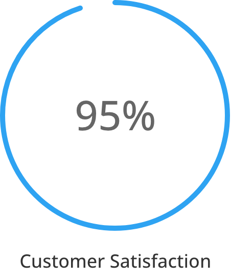
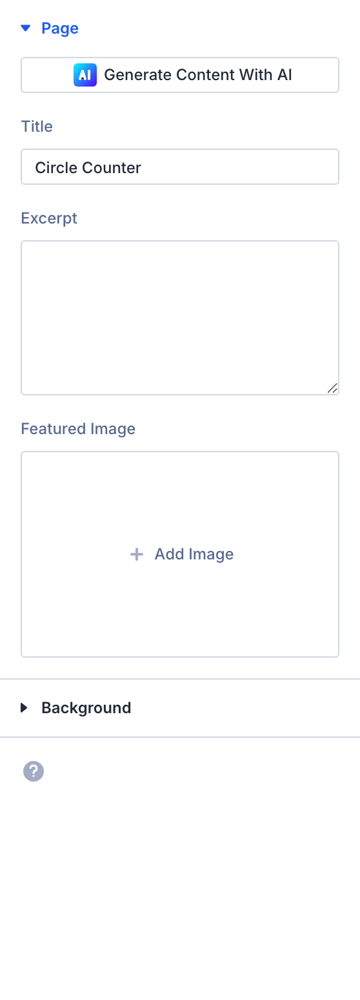

# Circle Counter

The Circle Counter module is a Divi 5 content element used in the Visual Builder.

## Overview

How to add, configure and customize the Divi circle counter module.

The Divi Circle Counter Module is an interactive way to display statistics and numerical information on your website. It’s an animated module that uses lazy-loading to catch the eye.

[View A Live Demo Of This Module](https://www.16wells.dev/module-demos/circle-counter/)

{ loading=lazy }
*The Circle Counter module as it appears on the live demo.*


## Settings & Options

### Content Tab

<!-- TODO: Verify all Content tab settings for Circle Counter module -->

| Setting | Type | Default | Description |
|---------|------|---------|-------------|
| <!-- TODO: Document Content settings --> | | | |

<!-- { loading=lazy } -->

### Design Tab

<!-- TODO: Verify all Design tab settings for Circle Counter module -->

| Setting | Type | Default | Description |
|---------|------|---------|-------------|
| <!-- TODO: Document Design settings --> | | | |

<!-- { loading=lazy } -->

### Advanced Tab

<!-- TODO: Verify all Advanced tab settings for Circle Counter module -->

| Setting | Type | Default | Description |
|---------|------|---------|-------------|
| CSS ID | text | — | Assign a unique CSS ID to the module |
| CSS Class | text | — | Assign CSS classes to the module |
| Custom CSS | code | — | Add custom CSS directly to the module's elements |
| Visibility | toggle | Show on all devices | Control device visibility (desktop, tablet, phone) |
| Transition | select | Default | Animation transition style for hover effects |

## Code Examples

### Custom CSS

```css
/* Style the Circle Counter module */
.et_pb_circle_counter {
    /* Add your custom styles */
    margin-bottom: 30px;
}

/* Responsive adjustments */
@media (max-width: 980px) {
    .et_pb_circle_counter {
        padding: 20px;
    }
}
```

### PHP Hooks

```php
/* Filter the Circle Counter module output */
add_filter('et_module_shortcode_output', function($output, $render_slug) {
    if ('et_pb_et_pb_circle_counter' !== $render_slug) {
        return $output;
    }
    // Modify $output as needed
    return $output;
}, 10, 2);
```

## Common Patterns

<!-- TODO: Add 2-3 real-world usage patterns with screenshots -->

1. **Basic Usage** — Add the Circle Counter module to any row in the Visual Builder and configure its settings.

2. **Styled Variation** — Use the Design tab to customize fonts, colors, and spacing to match your site's design system.

3. **Dynamic Content** — Use dynamic content fields to pull data from custom fields or post meta.

## Version Notes

!!! note "Divi 5 Only"
    This page documents Divi 5 behavior exclusively.

## Troubleshooting

!!! warning "Module Not Rendering"
    If the Circle Counter module doesn't appear on the front end, verify that:

    - The module is not inside a disabled section or row
    - Visibility settings aren't hiding it on the current device
    - Any required fields (like URLs or content) are filled in

<!-- TODO: Add module-specific troubleshooting items -->

## Related

- [Bar Counter](bar-counter.md)
- [Number Counter](number-counter.md)
