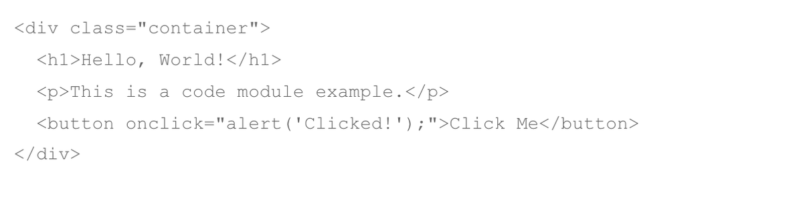

# Code

The Code module lets you insert raw HTML, CSS, JavaScript, or shortcodes anywhere in your Divi 5 layout.

## Overview

The Code module is a freeform container for any markup or scripting language that the browser can interpret. You paste or type code directly into the module's editor, and Divi renders it on the front end exactly as written. This makes it the primary tool for embedding third-party integrations — calendar widgets, CRM forms, chat scripts, tracking pixels, or any snippet that a service asks you to paste into your site.

Unlike the Text module, the Code module does not apply Divi's default typography or spacing rules to its contents. Whatever you place inside the editor is output verbatim, which gives you full control but also means you are responsible for your own styling and sanitization. CSS must be wrapped in `<style>` tags and JavaScript must be wrapped in `<script>` tags for the browser to interpret them correctly.

The module is also the go-to solution for running WordPress shortcodes from other plugins. Drop any valid shortcode into the editor and it will be processed during page rendering, making the Code module a bridge between Divi's visual layout system and the broader WordPress plugin ecosystem.

For additional reference, see the [official Elegant Themes documentation](https://help.elegantthemes.com/en/articles/10260309-the-code-module-divi-5).

[View A Live Demo Of This Module](https://www.16wells.dev/module-demos/code/)

{ loading=lazy }
*The Code module as it appears on the live demo.*

## Use Cases

1. **Third-Party Embeds** — Paste embed codes from services like Calendly, HubSpot, Google Maps, or payment processors to integrate external functionality directly into a Divi layout.
2. **Custom Scripting** — Add page-specific JavaScript for animations, scroll-triggered events, or custom form validation without editing theme files.
3. **Shortcode Rendering** — Insert shortcodes from WooCommerce, contact form plugins, or other WordPress extensions that need to render inside a visually designed page.

## How to Add the Code Module

1. Open the Visual Builder on the page you want to edit.
2. Click the gray **+** icon to add a new module to a row.
3. Search for "Code" in the module picker or find it in the Content Elements category, then click to insert it.

## Settings & Options

The Code module settings are organized across three tabs: Content, Design, and Advanced.

### Content Tab

The Content tab holds the code editor and controls for linking, background, and layout behavior.

| Setting | Type | Description |
|---------|------|-------------|
| Text (Code Editor) | code editor | The main editing area where you enter HTML, CSS, JavaScript, or shortcodes. CSS must be enclosed in `<style>` tags and JavaScript in `<script>` tags. The editor preserves whitespace and does not apply any formatting. |
| Link | url | Optionally wrap the entire module output in a link, making the rendered code area clickable. |
| Background | background controls | Set a background color, gradient, image, or video behind the module container. |
| Loop | toggle | Connect the module to the loop builder for use in dynamic templates that repeat across posts or custom post types. |
| Order | select | Control the module's display order when the parent row uses Flexbox or Grid layout modes. |
| Meta | admin label | Assign an admin label visible only in the Visual Builder to help identify this module in the layers panel. |

<!-- { loading=lazy } -->
<!-- TODO: Capture Content tab screenshot -->

### Design Tab

The Design tab controls the visual presentation of the module container and any text rendered by its code.

**Shared design options** — see [Options Groups](../options-groups/index.md) for detailed documentation:

| Options Group | Description |
|--------------|-------------|
| [Text](../options-groups/text.md) | Font, weight, alignment, color, line height, text shadow |
| [Sizing](../options-groups/sizing.md) | Width, max-width, height, min-height |
| [Spacing](../options-groups/spacing.md) | Margin and padding (responsive) |
| [Border](../options-groups/border.md) | Width, color, style, radius |
| [Box Shadow](../options-groups/box-shadow.md) | Shadow effects |
| [Filters](../options-groups/filters.md) | CSS filters (brightness, contrast, etc.) |
| [Transform](../options-groups/transform.md) | Scale, translate, rotate, skew |
| [Animation](../options-groups/animation.md) | Entrance animation styles |

<!-- { loading=lazy } -->
<!-- TODO: Capture Design tab screenshot -->

### Advanced Tab

The Advanced tab provides developer-oriented controls for custom attributes, conditional display, interactions, and scroll-driven effects.

**Shared advanced options** — see [Options Groups](../options-groups/index.md) for detailed documentation:

| Options Group | Description |
|--------------|-------------|
| [Attributes](../options-groups/attributes.md) | CSS ID, classes, custom HTML attributes |
| [CSS](../options-groups/css.md) | Custom CSS per element target |
| HTML | Custom HTML attributes for module wrapper |
| [Conditions](../options-groups/conditions.md) | Display rules (user role, page type, date, logic) |
| Interactions | Hover, click, or scroll-triggered interactions |
| [Visibility](../options-groups/visibility.md) | Device visibility toggles |
| [Transitions](../options-groups/transitions.md) | Hover transition timing |
| [Position](../options-groups/position.md) | CSS position and offsets |
| [Scroll Effects](../options-groups/scroll-effects.md) | Scroll-driven animation effects |

<!-- { loading=lazy } -->
<!-- TODO: Capture Advanced tab screenshot -->

## Code Examples

### Custom CSS

```css
/* Add a styled container around the Code module output */
.et_pb_code {
    background-color: #f5f5f5;
    border-left: 4px solid #2ea3f2;
    padding: 24px;
    border-radius: 6px;
    margin-bottom: 30px;
}

/* Responsive adjustments for smaller screens */
@media (max-width: 980px) {
    .et_pb_code {
        padding: 16px;
        font-size: 14px;
    }
}
```

### PHP Hooks

```php
/* Filter the Code module output before rendering */
add_filter('et_module_shortcode_output', function($output, $render_slug) {
    if ('et_pb_code' !== $render_slug) {
        return $output;
    }
    // Example: wrap the output in an additional container
    $output = '<div class="custom-code-wrapper">' . $output . '</div>';
    return $output;
}, 10, 2);
```

## Common Patterns

1. **Embedding a Scheduling Widget** — Paste the embed code from Calendly, Acuity, or a similar scheduling service into the Code module. Set a max-width in the Design tab to center the widget within the row, and add top/bottom padding so it does not crowd adjacent modules.

2. **Adding Page-Specific CSS** — When you need styles that apply only to one page, place a Code module in a fullwidth section at the top of the layout and enter your CSS inside `<style>` tags. This avoids polluting the global stylesheet and keeps the customization visually tied to the page it affects.

3. **Running a Plugin Shortcode** — Insert a shortcode like `[woocommerce_cart]` or `[gravityform id="1"]` into the Code module to render plugin output inside a Divi layout. Combine with the row's column structure to place the shortcode output alongside other Divi modules.

## AI Interaction Notes

!!! warning "Create vs. Modify"
    Modifying existing module content via REST API (`wp.apiFetch` PATCH) updates
    title, body text, and settings attributes. **Creating new modules via REST API**
    produces content that renders on the front end but may not appear in the Visual
    Builder layer view. Use browser automation for reliable module creation.
    See [REST API Content Playbook](../playbooks/rest-api-content.md).

**Block identifier:** `divi/code` — *Needs verification on current build*

| Operation | Method | Status | Notes |
|-----------|--------|--------|-------|
| Read content | Parse `post_content` block JSON | Observed | Use brace-depth parser — see [Content Encoding](../internals/content-encoding.md) |
| Modify existing | `wp.apiFetch` PATCH on post endpoint | Observed | Update block attributes in `post_content` |
| Create new | Browser automation (Playwright) | Observed | REST creation may break VB visibility |
| Batch modify | Sequential REST requests | Needs Testing | See [REST API Content Playbook](../playbooks/rest-api-content.md) |

**Key content attributes** — *JSON paths need verification*:

| Attribute | JSON Path | Notes |
|-----------|-----------|-------|
| Raw Content | `attrs.raw_content` | HTML, CSS, JS, or shortcode content |

!!! tip "Module Selection Guidance"
    For embedding raw HTML/CSS/JS or shortcodes use Code; for formatted text use Text; for styled code display consider a syntax highlighting plugin.

## Saving Your Work

After configuring the Code module:

- **Save changes** — Click the purple **Save** button at the bottom of the Visual Builder, or press `Ctrl+S` (Windows) / `Cmd+S` (Mac).
- **Exit the builder** — Click the **X** button or use `Ctrl+Shift+E` to return to the WordPress dashboard.

## Version Notes

!!! note "Divi 5 Only"
    This page documents Divi 5 behavior exclusively.

## Troubleshooting

!!! warning "Code Not Executing on the Front End"
    If your HTML, CSS, or JavaScript does not work when viewing the published page:

    - Verify that CSS is wrapped in `<style>` tags and JavaScript is wrapped in `<script>` tags. The module outputs content verbatim, so the browser needs these tags to interpret code correctly.
    - Check the browser console (F12 > Console) for JavaScript errors that may indicate syntax issues or conflicts with other scripts.
    - Confirm that a caching plugin or CDN is not serving a stale version of the page. Purge all caches after making changes.

!!! warning "Module Appears Empty in the Visual Builder"
    The Visual Builder may not execute JavaScript or render certain third-party embeds in the editor preview. This is expected behavior — the code will run normally on the published front end. Use the front-end preview (eye icon) to verify your output.

!!! tip "Shortcode Not Rendering"
    If a shortcode displays as plain text instead of its expected output, verify that the plugin providing the shortcode is active. Also confirm the shortcode syntax is correct — mismatched brackets or incorrect attribute names will cause WordPress to treat the shortcode as literal text.

## Related

- [Text](text.md) — For styled rich text content without raw code
