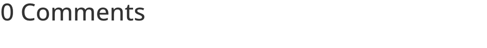

# Comments

The Comments module displays and styles the WordPress comment section within Divi 5 layouts.

## Overview

The Comments module gives you complete visual control over the native WordPress comment system. Instead of relying on your theme's default comment template, this module lets you place the comment section anywhere in a layout and style every element — avatars, metadata, reply buttons, the submission form, and the comment count — through the Visual Builder's point-and-click interface.

The module is most commonly used inside Divi Theme Builder templates for blog posts, where it replaces the default comment output with a fully customizable version. It renders both existing comments (threaded with replies) and the "Leave a Reply" form, so visitors can read the conversation and participate without leaving the page.

Because the module pulls from WordPress's built-in comment system, all standard WordPress comment settings still apply. Moderation rules, required fields, comment threading depth, and avatar display preferences configured under **Settings > Discussion** in the WordPress dashboard are respected. The Comments module controls only the visual presentation, not the underlying comment behavior.

For additional reference, see the [official Elegant Themes documentation](https://help.elegantthemes.com/en/articles/10260827-the-comments-module-in-divi-5).

[View A Live Demo Of This Module](https://www.16wells.dev/module-demos/comments/)

{ loading=lazy }
*The Comments module as it appears on the live demo.*

## Use Cases

1. **Custom Blog Post Templates** — Place the Comments module in a Theme Builder post template to control exactly where the comment section appears relative to the post content, author bio, and related posts.
2. **Product Feedback Pages** — Add a comment section to product or portfolio pages to collect user reviews and questions directly on the page, styled to match the site's design.
3. **Event Discussion Boards** — Enable comments on event pages so attendees can ask questions, share logistics, or coordinate before and after the event.

## How to Add the Comments Module

1. Open the Visual Builder on the page or template you want to edit.
2. Click the gray **+** icon to add a new module to a row.
3. Search for "Comments" in the module picker or find it in the Content Elements category, then click to insert it.

## Settings & Options

The Comments module settings are organized across three tabs: Content, Design, and Advanced.

### Content Tab

The Content tab controls which comment elements are visible, along with linking, background, and layout options.

| Setting | Type | Description |
|---------|------|-------------|
| Show Author Avatar | toggle | Display or hide the commenter's avatar image next to each comment. Avatars are pulled from Gravatar based on the commenter's email address. |
| Show Reply Button | toggle | Display or hide the "Reply" link beneath each comment. Disabling this removes the ability for visitors to post threaded replies to specific comments. |
| Show Comment Count | toggle | Display or hide the total number of comments shown above the comment list (e.g., "3 Comments"). |
| Show Comment Meta | toggle | Display or hide the metadata line on each comment, which typically includes the commenter's name and the date/time of the comment. |
| Link | url | Optionally link the entire module to a URL, making the comment area clickable. |
| Background | background controls | Set a background color, gradient, image, or video behind the entire comments module. |
| Loop | toggle | Connect the module to the loop builder for dynamic templates that repeat across posts or custom post types. |
| Order | select | Control the module's display order when the parent row uses Flexbox or Grid layout modes. |
| Meta | admin label | Assign an admin label visible only in the Visual Builder to identify this module in the layers panel. |

<!-- { loading=lazy } -->
<!-- TODO: Capture Content tab screenshot -->

### Design Tab

The Design tab provides granular styling for every visual element within the comments area.

| Setting | Type | Description |
|---------|------|-------------|
| Fields | field styling | Style the comment form input fields (name, email, URL, comment textarea) — background color, text color, border, padding, and focus states. |
| Image | image styling | Control the size, border radius, and border of commenter avatar images. Use this to make avatars circular or adjust their dimensions. |
| Text | text styling | Set general text properties like font family, weight, style, line height, and color that apply as defaults across the module. |
| Comment Count Text | text styling | Style the comment count heading specifically — font, size, color, weight, letter spacing, and alignment. |
| Form Title Text | text styling | Style the "Leave a Reply" heading above the comment form — font, size, color, weight, and spacing. |
| Meta Text | text styling | Style the comment metadata (author name and date) — font, size, color, weight, and letter spacing. |
| Comment Text | text styling | Style the body text of individual comments — font, size, color, line height, and letter spacing. |
| Button | button styling | Customize the submit button for the comment form — text color, background, border, font, size, padding, icon, and hover states. |
| Sizing | dimensions | Control the module's width, max-width, min-height, and height. |
| Spacing | margin/padding | Set margin and padding values around and within the module container. Supports responsive values per device breakpoint. |
| Border | border controls | Add borders around the module container or individual elements with configurable width, color, style, and corner radius. |
| Box Shadow | shadow controls | Apply box shadow effects with adjustable offset, blur, spread, color, and position. |
| Filters | image filters | Apply CSS filter effects — brightness, contrast, saturation, hue rotation, invert, sepia, blur, and opacity. |
| Transform | transform controls | Apply CSS transforms including scale, translate, rotate, and skew with a configurable origin point. |
| Animation | animation select | Choose an entrance animation (fade, slide, bounce, zoom, flip, fold, roll) with configurable duration, delay, and intensity. |

<!-- { loading=lazy } -->
<!-- TODO: Capture Design tab screenshot -->

### Advanced Tab

The Advanced tab provides developer-oriented controls for targeting, conditional display, and scroll-driven effects.

| Setting | Type | Description |
|---------|------|-------------|
| Attributes | text fields | Assign a CSS ID and CSS classes to the module for targeting with custom styles or JavaScript. |
| CSS | code editor | Write custom CSS that applies directly to specific elements within the module (comment list, form, avatars, buttons, etc.). |
| HTML | code fields | Select the semantic HTML tag for the module wrapper and add custom HTML attributes. |
| Conditions | condition builder | Set display conditions so the module only renders when specific rules are met (e.g., user role, page type, or whether comments are open on the current post). |
| Interactions | interaction builder | Define hover, click, or scroll-triggered interactions that affect this module or other elements on the page. |
| Visibility | device toggles | Show or hide the module on desktop, tablet, and/or phone. Hidden modules are not rendered in the page source for that device. |
| Transitions | transition controls | Configure CSS transition duration, delay, and easing curve for hover-state changes. |
| Position | position controls | Set the CSS position property (relative, absolute, fixed, sticky) and offset values (top, right, bottom, left, z-index). |
| Scroll Effects | scroll controls | Apply scroll-driven effects like parallax, fade, scale, rotate, blur, or horizontal movement as the user scrolls past the module. |

<!-- { loading=lazy } -->
<!-- TODO: Capture Advanced tab screenshot -->

## Code Examples

### Custom CSS

```css
/* Style the comment list and form container */
.et_pb_comments_module .comment-list {
    border-left: 3px solid #2ea3f2;
    padding-left: 20px;
}

/* Style individual comment bodies */
.et_pb_comments_module .comment-body {
    background-color: #f9f9f9;
    padding: 20px;
    border-radius: 8px;
    margin-bottom: 16px;
}

/* Make avatars circular */
.et_pb_comments_module .avatar {
    border-radius: 50%;
    border: 2px solid #e0e0e0;
}

/* Style the reply link */
.et_pb_comments_module .comment-reply-link {
    font-size: 13px;
    font-weight: 600;
    text-transform: uppercase;
    letter-spacing: 0.5px;
}

/* Responsive adjustments */
@media (max-width: 980px) {
    .et_pb_comments_module .comment-body {
        padding: 14px;
    }
    .et_pb_comments_module .avatar {
        width: 40px;
        height: 40px;
    }
}
```

### PHP Hooks

```php
/* Filter the Comments module output */
add_filter('et_module_shortcode_output', function($output, $render_slug) {
    if ('et_pb_comments' !== $render_slug) {
        return $output;
    }
    // Example: add a wrapper div for additional styling control
    $output = '<div class="custom-comments-wrapper">' . $output . '</div>';
    return $output;
}, 10, 2);

/* Customize the comment form fields rendered by WordPress */
add_filter('comment_form_default_fields', function($fields) {
    // Remove the URL/website field from the comment form
    unset($fields['url']);
    return $fields;
});
```

## Common Patterns

1. **Blog Post Template with Styled Comments** — In the Divi Theme Builder, create a post template with the Post Content module followed by the Comments module in a narrow single-column row. Style the comment form fields with rounded borders and a subtle background color to visually separate the conversation from the article content.

2. **Comments with Hidden Avatars on Mobile** — Use the Visibility setting to display the full comment layout with avatars on desktop, while hiding avatars on tablet and phone via custom CSS to save horizontal space on smaller screens. This keeps the comment section readable without shrinking text.

3. **Discussion-Focused Landing Page** — Place the Comments module on a standard page (not just posts) to create a discussion board for community topics. Enable comments on the page via the WordPress Discussion settings, then use the module's Design tab to style the form prominently with a large "Leave a Reply" heading and a high-contrast submit button.

## Saving Your Work

After configuring the Comments module:

- **Save changes** — Click the purple **Save** button at the bottom of the Visual Builder, or press `Ctrl+S` (Windows) / `Cmd+S` (Mac).
- **Exit the builder** — Click the **X** button or use `Ctrl+Shift+E` to return to the WordPress dashboard.

## Version Notes

!!! note "Divi 5 Only"
    This page documents Divi 5 behavior exclusively.

## Troubleshooting

!!! warning "No Comments Showing in the Module"
    If the Comments module appears but shows no comments or no comment form:

    - Verify that comments are enabled on the specific post or page. Go to the post editor, open **Discussion** in the settings panel, and check "Allow comments."
    - Check **Settings > Discussion** in the WordPress dashboard to ensure comment registration and moderation settings are not blocking display.
    - If using the module on a page (not a post), WordPress disables comments on pages by default. Enable them via the page editor's Discussion settings.

!!! warning "Avatars Not Displaying"
    If commenter avatars appear as blank or missing:

    - Confirm that the **Show Author Avatar** toggle is enabled in the Content tab.
    - Check **Settings > Discussion > Avatars** in WordPress and ensure "Show Avatars" is enabled.
    - Gravatar images load from an external service. If your site restricts external requests or the commenter's email is not registered with Gravatar, a default placeholder is shown instead.

!!! tip "Comment Form Styles Not Applying"
    If Design tab changes to the comment form are not visible on the front end, purge any page caches and hard-refresh the browser. Some field styles (particularly focus states) only appear during user interaction and cannot be previewed in the Visual Builder.

## Related

- [Blog](blog.md) — Displays a feed of blog posts, often used alongside the Comments module in templates
- [Post Title](post-title.md) — Renders the post title dynamically in Theme Builder templates
