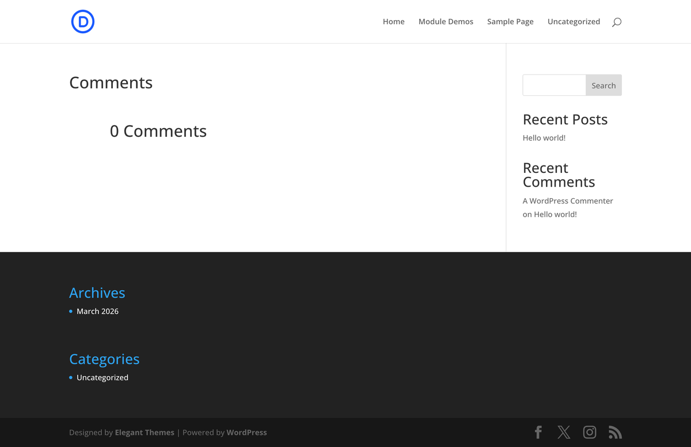

# Comments

The Comments module is a Divi 5 content element used in the Visual Builder.

## Overview

How to add, configure and customize the Divi comments module.

The Divi Comments Module makes it easy to style the comment section on blog posts or pages. With this module, you have full control over how the comments section looks, and you can place this module anywhere in your layout. Having a good-looking comments section is one step towards getting more engagement on your posts! Use this module as you build a custom page template for blog posts in the Divi Theme Builder.

View A Live Demo Of This Module

<!-- TODO: Replace with proper screenshot -->
<!-- { loading=lazy } -->
<!-- *The Comments module as it appears in the Divi 5 Visual Builder.* -->

## Settings & Options

### Content Tab

<!-- TODO: Verify all Content tab settings for Comments module -->

| Setting | Type | Default | Description |
|---------|------|---------|-------------|
| <!-- TODO: Document Content settings --> | | | |

<!-- { loading=lazy } -->

### Design Tab

<!-- TODO: Verify all Design tab settings for Comments module -->

| Setting | Type | Default | Description |
|---------|------|---------|-------------|
| <!-- TODO: Document Design settings --> | | | |

<!-- { loading=lazy } -->

### Advanced Tab

<!-- TODO: Verify all Advanced tab settings for Comments module -->

| Setting | Type | Default | Description |
|---------|------|---------|-------------|
| CSS ID | text | — | Assign a unique CSS ID to the module |
| CSS Class | text | — | Assign CSS classes to the module |
| Custom CSS | code | — | Add custom CSS directly to the module's elements |
| Visibility | toggle | Show on all devices | Control device visibility (desktop, tablet, phone) |
| Transition | select | Default | Animation transition style for hover effects |

## Code Examples

### Custom CSS

```css
/* Style the Comments module */
.et_pb_comments {
    /* Add your custom styles */
    margin-bottom: 30px;
}

/* Responsive adjustments */
@media (max-width: 980px) {
    .et_pb_comments {
        padding: 20px;
    }
}
```

### PHP Hooks

```php
/* Filter the Comments module output */
add_filter('et_module_shortcode_output', function($output, $render_slug) {
    if ('et_pb_et_pb_comments' !== $render_slug) {
        return $output;
    }
    // Modify $output as needed
    return $output;
}, 10, 2);
```

## Common Patterns

<!-- TODO: Add 2-3 real-world usage patterns with screenshots -->

1. **Basic Usage** — Add the Comments module to any row in the Visual Builder and configure its settings.

2. **Styled Variation** — Use the Design tab to customize fonts, colors, and spacing to match your site's design system.

3. **Dynamic Content** — Use dynamic content fields to pull data from custom fields or post meta.

## Version Notes

!!! note "Divi 5 Only"
    This page documents Divi 5 behavior exclusively.

## Troubleshooting

!!! warning "Module Not Rendering"
    If the Comments module doesn't appear on the front end, verify that:

    - The module is not inside a disabled section or row
    - Visibility settings aren't hiding it on the current device
    - Any required fields (like URLs or content) are filled in

<!-- TODO: Add module-specific troubleshooting items -->

## Related

- [Blog](blog.md)
- [Post Title](post-title.md)
