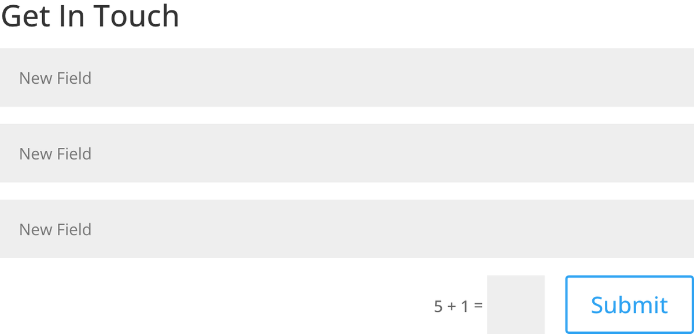
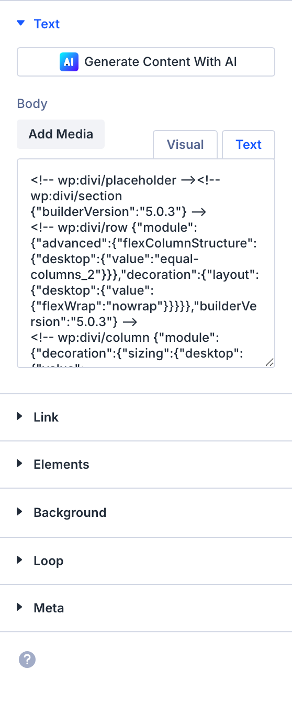

# Contact Form

The Contact Form module lets visitors send messages directly from your site using a configurable multi-field form with email routing, spam protection, and conditional logic.

!!! abstract "Quick Reference"
    **What it does:** Builds multi-field forms that send email notifications on submission with spam protection.
    **When to use it:** Contact pages, support request intake, event registration, RSVP forms
    **Key settings:** Form Fields (repeater), Email To, Message Pattern, Subject, Spam Protection, Redirect URL
    **Block identifier:** `divi/contact-form`
    **ET Docs:** [Official documentation](https://help.elegantthemes.com/en/articles/10260983-the-contact-form-module-in-divi-5)

!!! tip "When to Use This Module"
    - Collecting visitor inquiries, feedback, or support requests via email
    - Building multi-field forms with conditional logic and validation
    - Creating registration or RSVP forms with customizable field types

!!! warning "When NOT to Use This Module"
    - For email newsletter signups with ESP integration → use [Email Optin](email-optin.md)
    - For user login and authentication → use [Login](login.md)
    - For displaying WordPress comments → use [Comments](comments.md)

## Overview

The Contact Form module is one of the most frequently used interactive elements in Divi 5. It provides a complete form-building system within the Visual Builder — no third-party plugin required. Out of the box, the module ships with Name, Email, and Message fields, but you can add unlimited additional fields of various types including text inputs, email fields, textareas, checkboxes, radio buttons, and dropdown selects. Each field supports required validation, placeholder text, and conditional visibility logic that shows or hides fields based on other field values.

On submission, the module composes an email using a configurable message pattern and sends it to one or more recipient addresses. You control the subject line, the body layout (using field tokens), and the success message or redirect URL the visitor sees after submitting. Spam protection is built in through reCAPTCHA integration and a honeypot field, both enabled by default.

The entire form — fields, labels, buttons, spacing, and validation messages — is fully styleable through the Design tab. This means you can match the form to any brand without writing CSS, though the module also exposes clean selectors for advanced customization.

For additional reference, see the [official Elegant Themes documentation](https://help.elegantthemes.com/en/articles/10260983-the-contact-form-module-in-divi-5).

[View A Live Demo Of This Module](https://www.16wells.dev/module-demos/contact-form/)

{ loading=lazy }
*The Contact Form module as it appears on the live demo.*

## Use Cases

1. **Standard Contact Page** — Place the form on a dedicated Contact page with Name, Email, and Message fields alongside a [Map](map.md) module or [Blurb](blurb.md) modules displaying your address and phone number.
2. **Support Request Intake** — Build a multi-field form with dropdowns for issue category and priority, conditional fields that appear based on selections, and a structured message pattern that formats submissions for your support team.
3. **Event Registration or RSVP** — Collect attendee names, emails, dietary preferences (checkbox), and guest count (select) with a redirect to a confirmation page after submission.

## How to Add the Contact Form Module

1. Open the Visual Builder on the page you want to edit.
2. Click the gray **+** icon to add a new module to a row.
3. Search for "Contact Form" in the module picker or find it in the Forms category, then click to insert it.

## Settings & Options

The Contact Form module settings are organized across three tabs: Content, Design, and Advanced.

### Content Tab

The Content tab controls the form's fields, email routing, submission behavior, spam protection, and layout options.

#### Form Fields

The Form Fields section uses a repeater interface. Each field is an individual item you can expand to configure. You can add new fields, remove existing ones, and drag to reorder them. The module ships with three default fields: Name, Email, and Message.

| Setting | Type | Description |
|---------|------|-------------|
| Form Fields (Add, Edit, Remove) | repeater | Manage individual form fields. Click **+** to add a new field, the pencil icon to edit, the trash icon to delete, and drag handles to reorder. |

Each field in the repeater exposes these settings:

| Setting | Type | Description |
|---------|------|-------------|
| Title | text | The label text displayed above or inside the field. Also used as the token name in the Message Pattern (e.g., a field titled "Phone" produces the `%%Phone%%` token). |
| Type | select | The HTML field type to render. Options: **Input** (single-line text), **Email** (text with email validation), **Textarea** (multi-line text), **Checkbox** (one or more checkable options), **Radio** (single-select from options), **Select** (dropdown menu). |
| Required | toggle | When enabled, the form cannot be submitted until this field has a value. Required fields display a validation error if left empty. |
| Options | text | Defines the choices for Select, Radio, and Checkbox field types. Enter one option per line. Ignored for Input, Email, and Textarea types. |
| Conditional Logic | toggle | When enabled, this field is only visible when conditions based on other field values are met. Useful for multi-step forms or context-dependent questions. |

#### Text

| Setting | Type | Description |
|---------|------|-------------|
| Title | text | An optional heading displayed above the form fields. Leave empty to hide the form title. |
| Success Message | text | The confirmation text shown to visitors after a successful submission. Supports basic HTML for formatting. |
| Submit Button Text | text | The label displayed on the form's submit button. Defaults to "Submit" if left empty. |

#### Email

| Setting | Type | Description |
|---------|------|-------------|
| Email To | text | The recipient email address for form submissions. Separate multiple addresses with commas to send to more than one recipient. Defaults to the site admin email. |
| Message Pattern | text | Defines the email body layout using field tokens. Tokens follow the format `%%Field Title%%` (e.g., `%%Name%%`, `%%Email%%`, `%%Message%%`). If left empty, the email lists all fields and their values in order. |
| Subject | text | The subject line of the notification email. Supports field tokens for dynamic subjects. |

#### Redirect

| Setting | Type | Description |
|---------|------|-------------|
| Use Redirect URL | toggle | When enabled, redirects the visitor to a specified URL after submission instead of showing the success message. Useful for thank-you pages or conversion tracking. |
| Redirect URL | url | The full URL to redirect to after successful submission. Only visible when Use Redirect URL is enabled. |

#### Spam Protection

| Setting | Type | Description |
|---------|------|-------------|
| Use Spam Protection | toggle | Enables reCAPTCHA and/or honeypot spam protection on the form. reCAPTCHA keys must be configured in Divi Theme Options > Integration for the CAPTCHA challenge to appear. The honeypot field is invisible and catches automated bots. |

#### Additional Content Settings

| Setting | Type | Description |
|---------|------|-------------|
| Link | url | Optionally link the entire module to a URL, making the form area clickable. |
| Background | background controls | Set a background color, gradient, image, or video behind the form container. |
| Loop | toggle | Connect the module to the loop builder for dynamic templates. |
| Order | select | Control the module's display order when the parent row uses Flexbox or Grid layout modes. |
| Meta | admin label | Assign an admin label visible only in the Visual Builder to identify this module in the layers panel. |

{ loading=lazy }
<!-- TODO: Capture Content tab screenshot -->

### Design Tab

The Design tab controls the visual presentation of every element within the form.

**Module-specific settings:**

| Setting | Type | Description |
|---------|------|-------------|
| Fields | field styling | Style the form input fields, textareas, and selects — background color, text color, focus states, border, padding, and font properties. |
| Captcha Text | text styling | Style the reCAPTCHA label and related text — font, size, color, and spacing. Only visible when spam protection is enabled. |

**Shared design options** — see [Options Groups](../options-groups/index.md) for detailed documentation:

| Options Group | Description |
|--------------|-------------|
| [Text](../options-groups/text.md) | Font, weight, alignment, color, line height, text shadow |
| [Title Text](../options-groups/text.md) | Font, size, color, letter spacing for the form title heading |
| [Button](../options-groups/button.md) | Submit button text color, background, border, font, icon, hover states |
| [Sizing](../options-groups/sizing.md) | Width, max-width, height, min-height |
| [Spacing](../options-groups/spacing.md) | Margin and padding (responsive) |
| [Border](../options-groups/border.md) | Width, color, style, radius |
| [Box Shadow](../options-groups/box-shadow.md) | Shadow effects |
| [Filters](../options-groups/filters.md) | CSS filters (brightness, contrast, etc.) |
| [Transform](../options-groups/transform.md) | Scale, translate, rotate, skew |
| [Animation](../options-groups/animation.md) | Entrance animation styles |

{ loading=lazy }
<!-- TODO: Capture Design tab screenshot -->

### Advanced Tab

The Advanced tab provides developer-oriented controls for custom attributes, conditional display, interactions, and scroll-driven effects.

**Shared advanced options** — see [Options Groups](../options-groups/index.md) for detailed documentation:

| Options Group | Description |
|--------------|-------------|
| [Attributes](../options-groups/attributes.md) | CSS ID, classes, custom HTML attributes |
| [CSS](../options-groups/css.md) | Custom CSS per element target |
| HTML | Custom HTML attributes for module wrapper |
| [Conditions](../options-groups/conditions.md) | Display rules (user role, page type, date, logic) |
| Interactions | Hover, click, or scroll-triggered interactions |
| [Visibility](../options-groups/visibility.md) | Device visibility toggles |
| [Transitions](../options-groups/transitions.md) | Hover transition timing |
| [Position](../options-groups/position.md) | CSS position and offsets |
| [Scroll Effects](../options-groups/scroll-effects.md) | Scroll-driven animation effects |

{ loading=lazy }
<!-- TODO: Capture Advanced tab screenshot -->

## Code Examples

### Custom CSS

```css
/* Dark-themed contact form */
.et_pb_contact_form_container {
    background-color: #1a1a2e;
    padding: 40px;
    border-radius: 12px;
}

.et_pb_contact_form_container .et_pb_contact_form input,
.et_pb_contact_form_container .et_pb_contact_form textarea,
.et_pb_contact_form_container .et_pb_contact_form select {
    background-color: #16213e;
    border: 1px solid #0f3460;
    color: #e0e0e0;
    border-radius: 8px;
    padding: 14px 18px;
    transition: border-color 0.3s ease;
}

.et_pb_contact_form_container .et_pb_contact_form input:focus,
.et_pb_contact_form_container .et_pb_contact_form textarea:focus {
    border-color: #e94560;
    outline: none;
}

/* Style the submit button */
.et_pb_contact_form_container .et_pb_contact_submit {
    background-color: #e94560;
    border: none;
    border-radius: 8px;
    padding: 14px 32px;
    font-weight: 600;
    letter-spacing: 1px;
    transition: background-color 0.3s ease, transform 0.2s ease;
}

.et_pb_contact_form_container .et_pb_contact_submit:hover {
    background-color: #c73652;
    transform: translateY(-2px);
}

/* Two-column field layout */
.et_pb_contact_form .et_pb_contact_field:not(.et_pb_contact_field_last) {
    width: 48%;
    float: left;
    margin-right: 4%;
}

.et_pb_contact_form .et_pb_contact_field.et_pb_contact_field_last {
    width: 48%;
    float: left;
    margin-right: 0;
}

/* Full-width textarea */
.et_pb_contact_form .et_pb_contact_field textarea {
    width: 100%;
    min-height: 150px;
}

/* Responsive: stack on mobile */
@media (max-width: 767px) {
    .et_pb_contact_form .et_pb_contact_field,
    .et_pb_contact_form .et_pb_contact_field.et_pb_contact_field_last {
        width: 100%;
        float: none;
        margin-right: 0;
    }
}
```

### PHP Hooks

```php
/**
 * Add a Reply-To header using the sender's email field.
 */
add_filter('et_pb_contact_form_email_headers', function ($headers, $contact_form_info) {
    if (!empty($contact_form_info['email'])) {
        $headers .= "Reply-To: " . sanitize_email($contact_form_info['email']) . "\r\n";
    }
    return $headers;
}, 10, 2);

/**
 * Route submissions to different recipients based on a Department field value.
 */
add_filter('et_pb_contact_form_email_recipients', function ($recipients, $contact_form_info) {
    if (!empty($contact_form_info['department'])) {
        switch (strtolower($contact_form_info['department'])) {
            case 'sales':
                return 'sales@example.com';
            case 'support':
                return 'support@example.com';
            case 'billing':
                return 'billing@example.com';
        }
    }
    return $recipients;
}, 10, 2);
```

### JavaScript: Custom Validation

```javascript
/**
 * Add phone number validation to a field titled "Phone".
 * Runs before the default Divi form validation.
 */
document.addEventListener('DOMContentLoaded', function () {
    const forms = document.querySelectorAll('.et_pb_contact_form');

    forms.forEach(function (form) {
        form.addEventListener('submit', function (e) {
            const phoneField = form.querySelector('input[name*="phone" i]');
            if (phoneField) {
                const phoneValue = phoneField.value.replace(/[\s\-\(\)]/g, '');
                if (phoneValue && !/^\+?\d{10,15}$/.test(phoneValue)) {
                    e.preventDefault();
                    alert('Please enter a valid phone number.');
                    phoneField.focus();
                }
            }
        });
    });
});
```

## Common Patterns

1. **Standard Contact Page Form** — Use the default Name, Email, and Message fields on a dedicated Contact page. Set the Email To address, customize the Success Message, and enable Spam Protection. Place the module in a single-column row alongside a Map module or Blurb modules with your address and phone number.

2. **Lightweight Newsletter Signup** — Reduce the form to two required fields (Name and Email) and set the submit button text to "Subscribe." Use the redirect URL to send subscribers to a third-party confirmation page, or set a success message confirming their signup. Style the form compactly with minimal padding for use in sidebars or footers.

3. **Support Request with Conditional Fields** — Add fields for Name (Input, required), Email (Email, required), Order Number (Input), Issue Category (Select with options: Shipping, Product Defect, Return, Billing, Other), Description (Textarea, required), and Priority (Radio with options: Low, Normal, Urgent). Enable Conditional Logic on a "Return Address" field so it only appears when Issue Category is "Return." Use the Message Pattern to structure the email for quick parsing by your support team.

## AI Interaction Notes

!!! warning "Create vs. Modify"
    Modifying existing module content via REST API (`wp.apiFetch` PATCH) updates
    title, body text, and settings attributes. **Creating new modules via REST API**
    produces content that renders on the front end but may not appear in the Visual
    Builder layer view. Use browser automation for reliable module creation.
    See [REST API Content Playbook](../playbooks/rest-api-content.md).

**Block identifier:** `divi/contact-form` — *Needs verification on current build*

| Operation | Method | Status | Notes |
|-----------|--------|--------|-------|
| Read content | Parse `post_content` block JSON | Observed | Use brace-depth parser — see [Content Encoding](../internals/content-encoding.md) |
| Modify existing | `wp.apiFetch` PATCH on post endpoint | Observed | Update block attributes in `post_content` |
| Create new | Browser automation (Playwright) | Observed | REST creation may break VB visibility |
| Batch modify | Sequential REST requests | Needs Testing | See [REST API Content Playbook](../playbooks/rest-api-content.md) |

**Key content attributes** — *JSON paths need verification*:

| Attribute | JSON Path | Notes |
|-----------|-----------|-------|
| Fields | `attrs.fields` | Form field configuration array |
| Email | `attrs.email` | Recipient email address(es) |
| Subject | `attrs.subject` | Notification email subject line |
| Success Message | `attrs.success_message` | Post-submission confirmation text |
| Redirect URL | `attrs.redirect_url` | Post-submission redirect destination |

!!! tip "Module Selection Guidance"
    For data collection use Contact Form; for email list signups use Email Optin; for user authentication use Login.

## Saving Your Work

After configuring the Contact Form module:

- **Save changes** — Click the purple **Save** button at the bottom of the Visual Builder, or press `Ctrl+S` (Windows) / `Cmd+S` (Mac).
- **Exit the builder** — Click the **X** button or use `Ctrl+Shift+E` to return to the WordPress dashboard.

## Version Notes

!!! note "Divi 5 Only"
    This page documents Divi 5 behavior exclusively.

## Troubleshooting

!!! warning "Emails Not Being Received"
    If form submissions are sent but emails never arrive:

    1. **Check your spam/junk folder** — form-generated emails are frequently flagged by spam filters.
    2. **Verify SPF and DKIM records** — your domain's DNS must include SPF and DKIM records that authorize your web server to send email.
    3. **Use an SMTP plugin** — WordPress uses PHP `wp_mail()` by default, which relies on the server's `sendmail` configuration. Install an SMTP plugin (WP Mail SMTP, FluentSMTP, or similar) to route emails through a proper mail service.
    4. **Test with a different Email To address** — some corporate email servers have aggressive filtering. Test with a Gmail or Outlook address to isolate the issue.

!!! warning "reCAPTCHA Not Loading"
    If the CAPTCHA challenge does not appear on the form:

    1. **Verify API keys** — go to Divi Theme Options > Integration and confirm your reCAPTCHA Site Key and Secret Key are entered correctly.
    2. **Check key type** — Divi 5 requires reCAPTCHA v2 (checkbox) keys. V3 keys will not work.
    3. **Domain mismatch** — the domain registered with Google reCAPTCHA must match your site's domain exactly, including `www` vs non-`www`.
    4. **JavaScript conflicts** — another plugin or theme script may be blocking the reCAPTCHA script. Check the browser console for errors.

!!! warning "Form Not Submitting / Spinning Indefinitely"
    If the form appears to submit but never completes:

    1. **JavaScript errors** — open the browser developer console (F12) and check for errors that may prevent the AJAX request from completing.
    2. **REST API or admin-ajax blocked** — some security plugins or server firewalls block `admin-ajax.php` or the WordPress REST API. Whitelist these endpoints.
    3. **Hidden required field** — if a required field is hidden by conditional logic but still marked as required, the form cannot pass validation. Ensure conditional logic rules account for required field states.

## Related

- [Email Optin](email-optin.md) — For newsletter signups with direct ESP integration
- [Login](login.md) — For user authentication forms
- [Spam Protection Options](../options-groups/spam-protection.md) — reCAPTCHA and honeypot settings for form security
- [Fields Options](../options-groups/fields.md) — Shared form field styling and configuration
- [Playbook: Build a Page](../playbooks/build-a-page.md) — Step-by-step guide to assembling pages with forms and content
