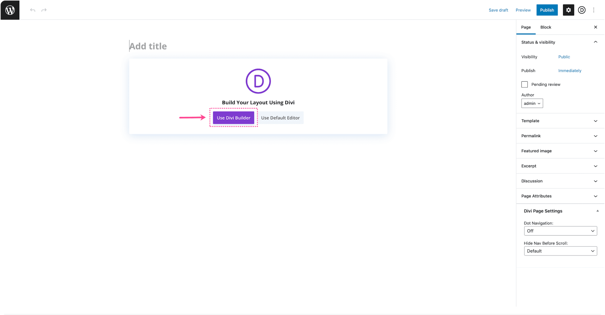

# Contact Form

The Contact Form module lets visitors send messages directly from your site using a configurable multi-field form with email routing, spam protection, and conditional logic.

## Overview

The Contact Form module is one of the most frequently used interactive elements in Divi 5. It provides a complete form-building system within the Visual Builder — no third-party plugin required. Out of the box, the module ships with Name, Email, and Message fields, but you can add unlimited additional fields of various types including text inputs, email fields, textareas, checkboxes, radio buttons, and dropdown selects. Each field supports required validation, placeholder text, and conditional visibility logic that shows or hides fields based on other field values.

On submission, the module composes an email using a configurable message pattern and sends it to one or more recipient addresses. You control the subject line, the body layout (using field tokens), and the success message or redirect URL the visitor sees after submitting. Spam protection is built in through reCAPTCHA integration and a honeypot field, both enabled by default.

The entire form — fields, labels, buttons, spacing, and validation messages — is fully styleable through the Design tab. This means you can match the form to any brand without writing CSS, though the module also exposes clean selectors for advanced customization.

{ loading=lazy }
*The Contact Form module as it appears in the Divi 5 Visual Builder with default Name, Email, and Message fields.*

## Settings & Options

### Content Tab

#### Form Fields

The Form Fields section uses a repeater interface. Each field is an individual item you can expand to configure. You can add new fields, remove existing ones, and drag to reorder them. The module ships with three default fields: Name, Email, and Message.

| Setting | Type | Default | Description |
|---------|------|---------|-------------|
| Form Fields | repeater | Name, Email, Message | Collection of form fields. Click **+ Add New Field** to add a field. Drag handles to reorder. Click the trash icon to remove a field. |

Each field in the repeater exposes these settings:

| Setting | Type | Default | Description |
|---------|------|---------|-------------|
| Title | text | — | The label text displayed above or inside the field. Also used as the token name in the Message Pattern (e.g., a field titled "Phone" produces the `%%Phone%%` token). |
| Type | select | Input | The HTML field type to render. Options: **Input** (single-line text), **Email** (text with email validation), **Textarea** (multi-line text), **Checkbox** (one or more checkable options), **Radio** (single-select from options), **Select** (dropdown menu). |
| Required | toggle | No | When enabled, the form cannot be submitted until this field has a value. Required fields display a validation error if left empty. |
| Options | text | — | Defines the choices for Select, Radio, and Checkbox field types. Enter one option per line. Ignored for Input, Email, and Textarea types. |
| Conditional Logic | toggle | No | When enabled, this field is only visible when conditions based on other field values are met. Configure rules to show or hide the field depending on selections in other fields — useful for multi-step forms or context-dependent questions. |

<!-- { loading=lazy }
*Expanded field settings showing Title, Type, Required toggle, and Options for a Select field.* -->

#### Email & Submission

| Setting | Type | Default | Description |
|---------|------|---------|-------------|
| Email To | text | Site admin email | The recipient email address for form submissions. Separate multiple addresses with commas to send to more than one recipient. |
| Message Pattern | text | — | Defines the email body layout using field tokens. Tokens use the format `%%Field Title%%` (e.g., `%%Name%%`, `%%Email%%`, `%%Message%%`). If left empty, the email lists all fields and their values in order. |
| Subject | text | "New Message From [Site Name]" | The subject line of the notification email. Supports field tokens. |
| Success Message | text | "Thanks for contacting us" | The confirmation message displayed to the visitor after a successful form submission. Supports basic HTML. |
| Use Redirect URL | toggle | No | When enabled, redirects the visitor to a specified URL after submission instead of showing the success message. Useful for sending users to a dedicated thank-you page or triggering conversion tracking. |
| Redirect URL | url | — | The full URL to redirect to after successful submission. Only visible when **Use Redirect URL** is enabled. |
| Use Spam Protection | toggle | Yes | Enables reCAPTCHA and/or honeypot spam protection on the form. reCAPTCHA keys must be configured in Divi Theme Options > Integration for the CAPTCHA challenge to appear. The honeypot field is invisible and catches automated bots. |
| Admin Label | text | — | A label visible only in the Visual Builder to help identify this module when working with multiple Contact Form modules on the same page. Does not appear on the front end. |

<!-- { loading=lazy }
*Content tab showing Email To, Message Pattern, Success Message, and spam protection settings.* -->

### Design Tab

The Design tab controls the visual presentation of every element within the form.

#### Form Field Styles

| Setting | Type | Default | Description |
|---------|------|---------|-------------|
| Field Background Color | color | `#ffffff` | Background color of all input, textarea, and select fields. |
| Field Text Color | color | `#333333` | Text color for user input inside fields. |
| Field Focus Background Color | color | — | Background color applied when a field receives focus. |
| Field Focus Text Color | color | — | Text color applied when a field receives focus. |
| Field Border Width | range | 1px | Border thickness around form fields. |
| Field Border Color | color | `#bbbbbb` | Border color for form fields in their default state. |
| Field Border Focus Color | color | Theme accent | Border color applied when a field is focused. |
| Field Border Radius | range | 3px | Corner rounding for form fields. |
| Field Padding | spacing | 16px | Internal padding within each form field. |

#### Field Labels

| Setting | Type | Default | Description |
|---------|------|---------|-------------|
| Label Font | font | Body font | Font family for field labels. |
| Label Font Size | range | 14px | Font size for field labels. |
| Label Font Weight | select | Bold | Font weight for field labels. |
| Label Text Color | color | `#333333` | Text color for field labels. |
| Label Line Height | range | 1.7em | Line height for field labels. |
| Label Letter Spacing | range | 0px | Letter spacing for field labels. |

#### Placeholder Text

| Setting | Type | Default | Description |
|---------|------|---------|-------------|
| Placeholder Color | color | `#999999` | Text color for placeholder text inside fields. |

#### Button Styles

| Setting | Type | Default | Description |
|---------|------|---------|-------------|
| Use Custom Styles For Button | toggle | No | Enables per-module button customization. When off, the button inherits global Divi button styles. |
| Button Text Color | color | `#ffffff` | Text color of the submit button. |
| Button Background Color | color | Theme accent | Background color of the submit button. |
| Button Border Width | range | 2px | Border thickness of the submit button. |
| Button Border Color | color | Theme accent | Border color of the submit button. |
| Button Border Radius | range | 3px | Corner rounding of the submit button. |
| Button Font | font | Body font | Font family for the button text. |
| Button Font Size | range | 20px | Font size for the button text. |
| Button Padding | spacing | 10px 24px | Internal padding of the submit button. |
| Button Hover Text Color | color | — | Text color on hover. |
| Button Hover Background Color | color | — | Background color on hover. |
| Button Hover Border Color | color | — | Border color on hover. |
| Button Icon | icon | Arrow | Icon displayed alongside button text. |
| Button Icon Placement | select | Right | Position of the icon relative to button text. Options: Left, Right. |
| Show Icon on Hover Only | toggle | Yes | When enabled, the button icon appears only on hover. |

#### Form Layout

| Setting | Type | Default | Description |
|---------|------|---------|-------------|
| Form Field Gap | range | 20px | Vertical spacing between form fields. |
| Full Width Fields | toggle | Yes | When enabled, each field spans the full width of the form. When off, fields may display side by side depending on column settings. |

#### Spacing

| Setting | Type | Default | Description |
|---------|------|---------|-------------|
| Margin | spacing | — | External spacing around the module. |
| Padding | spacing | — | Internal spacing within the module container. |

#### Title Text (if using a form title)

| Setting | Type | Default | Description |
|---------|------|---------|-------------|
| Title Font | font | Heading font | Font family for the form title. |
| Title Font Size | range | 26px | Font size for the form title. |
| Title Text Color | color | `#333333` | Text color for the form title. |
| Title Line Height | range | 1.4em | Line height for the form title. |
| Title Letter Spacing | range | 0px | Letter spacing for the form title. |
| Title Text Alignment | select | Left | Alignment of the form title. |

#### Validation & Success Messages

| Setting | Type | Default | Description |
|---------|------|---------|-------------|
| Success Message Text Color | color | `#468847` | Text color for the success confirmation message. |
| Success Message Background Color | color | `#dff0d8` | Background color for the success message container. |
| Error Message Text Color | color | `#b94a48` | Text color for field validation error messages. |

<!-- { loading=lazy }
*Design tab showing field styling, button customization, and spacing controls.* -->

### Advanced Tab

| Setting | Type | Default | Description |
|---------|------|---------|-------------|
| CSS ID | text | — | Assign a unique CSS ID to the module for targeting with custom CSS or JavaScript. |
| CSS Class | text | — | Assign one or more CSS classes to the module, separated by spaces. |
| Custom CSS | code | — | Write custom CSS rules scoped to specific elements of the module (fields, labels, button, container, success message, errors). |
| Visibility | toggle | Show on all devices | Control which devices display the module. Options: Desktop, Tablet, Phone. |
| Transition Duration | range | 300ms | Duration of CSS transitions for hover and focus effects. |
| Transition Delay | range | 0ms | Delay before transitions begin. |
| Transition Speed Curve | select | Ease | Timing function for transitions. Options: Ease, Ease-In, Ease-Out, Ease-In-Out, Linear. |
| Position | select | Default | CSS positioning. Options: Default (static), Relative, Absolute, Fixed. |
| Z-Index | number | — | Stack order for overlapping elements. |
| Overflow | select | Visible | How to handle content that overflows the module box. Options: Visible, Hidden, Scroll, Auto. |
| Scroll Effects | toggle | No | Enable parallax, fade, scale, rotate, or blur effects triggered by scrolling. |

## Code Examples

### Custom CSS for Form Styling

```css
/* Dark-themed contact form */
.et_pb_contact_form_container {
    background-color: #1a1a2e;
    padding: 40px;
    border-radius: 12px;
}

.et_pb_contact_form_container .et_pb_contact_form input,
.et_pb_contact_form_container .et_pb_contact_form textarea,
.et_pb_contact_form_container .et_pb_contact_form select {
    background-color: #16213e;
    border: 1px solid #0f3460;
    color: #e0e0e0;
    border-radius: 8px;
    padding: 14px 18px;
    transition: border-color 0.3s ease;
}

.et_pb_contact_form_container .et_pb_contact_form input:focus,
.et_pb_contact_form_container .et_pb_contact_form textarea:focus {
    border-color: #e94560;
    outline: none;
}

/* Style the submit button */
.et_pb_contact_form_container .et_pb_contact_submit {
    background-color: #e94560;
    border: none;
    border-radius: 8px;
    padding: 14px 32px;
    font-weight: 600;
    letter-spacing: 1px;
    transition: background-color 0.3s ease, transform 0.2s ease;
}

.et_pb_contact_form_container .et_pb_contact_submit:hover {
    background-color: #c73652;
    transform: translateY(-2px);
}

/* Two-column field layout */
.et_pb_contact_form .et_pb_contact_field:not(.et_pb_contact_field_last) {
    width: 48%;
    float: left;
    margin-right: 4%;
}

.et_pb_contact_form .et_pb_contact_field.et_pb_contact_field_last {
    width: 48%;
    float: left;
    margin-right: 0;
}

/* Full-width textarea */
.et_pb_contact_form .et_pb_contact_field textarea {
    width: 100%;
    min-height: 150px;
}

/* Responsive: stack on mobile */
@media (max-width: 767px) {
    .et_pb_contact_form .et_pb_contact_field,
    .et_pb_contact_form .et_pb_contact_field.et_pb_contact_field_last {
        width: 100%;
        float: none;
        margin-right: 0;
    }
}
```

### Custom Email Handling with PHP

```php
/**
 * Modify the email headers for Contact Form submissions.
 * Adds a Reply-To header using the sender's email field.
 */
add_filter('et_pb_contact_form_email_headers', function ($headers, $contact_form_info) {
    // $contact_form_info contains form data including field values
    if (!empty($contact_form_info['email'])) {
        $headers .= "Reply-To: " . sanitize_email($contact_form_info['email']) . "\r\n";
    }
    return $headers;
}, 10, 2);

/**
 * Send form submissions to different recipients based on a field value.
 * Requires a "Department" select field with options like Sales, Support, Billing.
 */
add_filter('et_pb_contact_form_email_recipients', function ($recipients, $contact_form_info) {
    if (!empty($contact_form_info['department'])) {
        switch (strtolower($contact_form_info['department'])) {
            case 'sales':
                return 'sales@example.com';
            case 'support':
                return 'support@example.com';
            case 'billing':
                return 'billing@example.com';
        }
    }
    return $recipients;
}, 10, 2);
```

### Adding a Custom Field Programmatically

```php
/**
 * Add a hidden field to the contact form that captures the referring page URL.
 * The value is included in the email notification.
 */
add_filter('et_pb_contact_form_field_html', function ($html, $field_data) {
    // Append a hidden referrer field after the last visible field
    if ($field_data['field_id'] === 'et_pb_contact_message_0') {
        $referrer = esc_url(wp_get_referer());
        $html .= '<input type="hidden" name="et_pb_contact_referrer" value="' . $referrer . '">';
    }
    return $html;
}, 10, 2);
```

### JavaScript: Custom Validation

```javascript
/**
 * Add custom phone number validation to a field titled "Phone".
 * Runs before the default Divi form validation.
 */
document.addEventListener('DOMContentLoaded', function () {
    const forms = document.querySelectorAll('.et_pb_contact_form');

    forms.forEach(function (form) {
        form.addEventListener('submit', function (e) {
            const phoneField = form.querySelector('input[name*="phone" i]');
            if (phoneField) {
                const phoneValue = phoneField.value.replace(/[\s\-\(\)]/g, '');
                if (phoneValue && !/^\+?\d{10,15}$/.test(phoneValue)) {
                    e.preventDefault();
                    alert('Please enter a valid phone number.');
                    phoneField.focus();
                }
            }
        });
    });
});
```

## Common Patterns

### 1. Standard Contact Page Form

The most common use case: a Name, Email, and Message form placed on a dedicated Contact page. Keep the default three fields, set the **Email To** address, customize the **Success Message**, and enable **Spam Protection**. Place the module in a single-column row, optionally alongside a Map module or Blurb modules with your address and phone number.

<!-- { loading=lazy }
*A contact page layout with the Contact Form module alongside address and map information.* -->

### 2. Newsletter Signup Form

Use the Contact Form as a lightweight newsletter signup by reducing it to two fields: **Name** and **Email** (both required). Set the **Email To** address to your list manager or use a redirect URL to send subscribers to a third-party signup confirmation page. Style the button with a call-to-action label like "Subscribe" and use the Design tab to create a compact, horizontal layout.

!!! tip "For Advanced Email Marketing"
    If you need double opt-in, list segmentation, or autoresponders, use the [Email Optin module](email-optin.md) instead, which integrates directly with Mailchimp, ConvertKit, and other providers.

<!-- { loading=lazy }
*A compact newsletter signup form with Name and Email fields in a two-column layout.* -->

### 3. Support Request Form with File Context

Build a support request form by adding fields for **Name** (Input, required), **Email** (Email, required), **Order Number** (Input), **Issue Category** (Select — options: Shipping, Product Defect, Return, Billing, Other), **Description** (Textarea, required), and **Priority** (Radio — options: Low, Normal, Urgent). Use **Conditional Logic** to show a "Return Address" field only when the Issue Category is "Return". Set the **Message Pattern** to produce a structured email your support team can quickly parse:

```
Support request from %%Name%% (%%Email%%)
Order: %%Order Number%%
Category: %%Issue Category%%
Priority: %%Priority%%

%%Description%%
```

<!-- { loading=lazy }
*A multi-field support request form with category dropdown and conditional fields.* -->

## Version Notes

!!! note "Divi 5 Only"
    This page documents Divi 5 behavior exclusively.

## Troubleshooting

!!! warning "Emails Not Being Received"
    If form submissions are sent but emails never arrive:

    1. **Check your spam/junk folder** — form-generated emails are frequently flagged by spam filters.
    2. **Verify SPF and DKIM records** — your domain's DNS must include SPF and DKIM records that authorize your web server to send email. Without these, receiving mail servers may silently reject messages.
    3. **Use an SMTP plugin** — WordPress uses PHP `wp_mail()` by default, which relies on the server's `sendmail` configuration. Install an SMTP plugin (WP Mail SMTP, FluentSMTP, or similar) to route emails through a proper mail service like Gmail, SendGrid, or Amazon SES.
    4. **Test with a different Email To address** — some email providers (especially corporate servers) have aggressive filtering. Test with a Gmail or Outlook address to isolate the issue.
    5. **Check server mail logs** — your hosting provider's error logs may show bounced or undelivered messages.

!!! warning "reCAPTCHA Not Loading"
    If the CAPTCHA challenge does not appear on the form:

    1. **Verify API keys** — go to **Divi Theme Options > Integration** and confirm your reCAPTCHA Site Key and Secret Key are entered correctly. Keys are generated at [google.com/recaptcha](https://www.google.com/recaptcha/admin).
    2. **Check key type** — Divi 5 requires reCAPTCHA v2 (checkbox) keys. If you generated v3 keys, they will not work.
    3. **Domain mismatch** — the domain registered with Google reCAPTCHA must match your site's domain exactly, including `www` vs non-`www`.
    4. **JavaScript conflicts** — another plugin or theme script may be blocking the reCAPTCHA script from loading. Check the browser console for errors.
    5. **Caching** — if you recently added your keys, purge all page caches and CDN caches.

!!! warning "Form Not Submitting / Spinning Indefinitely"
    If the form appears to submit but never completes:

    1. **JavaScript errors** — open the browser developer console (F12) and check for errors. A broken script from another plugin can prevent the form's AJAX request from completing.
    2. **REST API or admin-ajax blocked** — some security plugins or server-level firewalls block `admin-ajax.php` or the WordPress REST API. Whitelist these endpoints.
    3. **Required field not visible** — if a required field is hidden by conditional logic but still required, the form cannot submit. Ensure conditional logic rules do not hide required fields without also making them optional.
    4. **Plugin conflicts** — deactivate other plugins one by one to identify conflicts, especially caching plugins, security plugins, and other form plugins.

!!! warning "Module Not Rendering on Front End"
    If the Contact Form module does not appear on the published page:

    - The module is inside a disabled section or row.
    - Visibility settings in the Advanced tab are hiding it on the current device.
    - A caching plugin is serving a stale version of the page — purge your cache.

## Related

- [Email Optin](email-optin.md) — for newsletter signups with ESP integration
- [Login](login.md) — for user authentication forms
