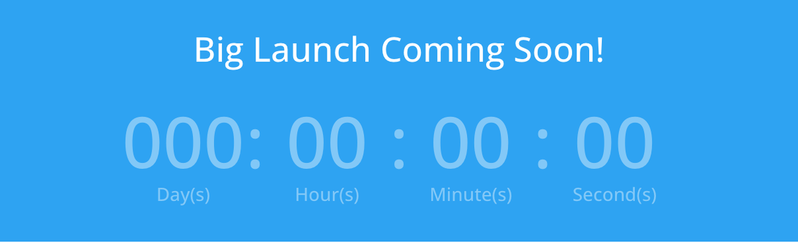

# Countdown Timer

The Countdown Timer module displays a real-time countdown to a specific date and time, showing the remaining days, hours, minutes, and seconds.

!!! abstract "Quick Reference"
    **What it does:** Shows a live-updating countdown to a target date/time, broken into days, hours, minutes, and seconds.
    **When to use it:** Product launches, limited-time sales, event countdowns, coming-soon pages
    **Key settings:** Title, Date (target date/time picker), Numbers styling, Label Text, Separator Text
    **Block identifier:** `divi/countdown-timer`
    **ET Docs:** [Official documentation](https://help.elegantthemes.com/en/articles/10273123-the-countdown-timer-module-in-divi-5)

!!! tip "When to Use This Module"
    - You need a real-time countdown to a specific future date and time
    - Urgency-driven marketing for flash sales, product launches, or event registrations
    - "Coming soon" landing pages where visitors need to know when something goes live

!!! warning "When NOT to Use This Module"
    - You need to display static statistics or percentages → use [Number Counter](number-counter.md) or [Circle Counter](circle-counter.md)
    - You need an animated progress bar → use [Bar Counter](bar-counter.md)
    - You need a recurring timer that resets → consider custom JavaScript in a [Code](code.md) module

## Overview

The Countdown Timer module lets you place an animated, live-updating timer on any page or post. You set a target date and time, and the module automatically calculates and displays the remaining duration broken into days, hours, minutes, and seconds. Each unit updates in real time without requiring a page refresh, giving visitors an immediate sense of urgency or anticipation.

This module is particularly effective for time-sensitive marketing. Whether you are promoting a product launch, building excitement for a live event, running a limited-time sale, or creating a "coming soon" landing page, the countdown timer draws attention and encourages visitors to act before time runs out.

The timer supports full visual customization through the Design tab, where you can style the number displays, separator characters, labels, and surrounding text independently. You can also set a title above the timer to provide context for what visitors are counting down to.

For additional reference, see the [official Elegant Themes documentation](https://help.elegantthemes.com/en/articles/10273123-the-countdown-timer-module-in-divi-5).

[View A Live Demo Of This Module](https://www.16wells.dev/module-demos/countdown-timer/)

{ loading=lazy }
*The Countdown Timer module displaying a live countdown with days, hours, minutes, and seconds.*

## Use Cases

1. **Product Launch Countdown** — Place a countdown timer on a landing page to build anticipation for a new product or service release, paired with a pre-order button or email signup form.
2. **Limited-Time Sale Banner** — Add a timer to a promotional section to show exactly how much time remains in a flash sale or seasonal discount, creating urgency that drives conversions.
3. **Event Countdown** — Display a countdown to a webinar, conference, or live stream start time so visitors know precisely when to tune in or show up.

## How to Add the Countdown Timer Module

1. Open the Visual Builder on the page where you want to place the countdown timer.
2. Click the gray **+** icon inside any row to add a new module.
3. Search for "Countdown Timer" in the module picker or browse the Content Elements category, then click to insert it.

## Settings & Options

The Countdown Timer module settings are organized across three tabs: Content, Design, and Advanced.

### Content Tab

The Content tab is where you set the countdown target date, title text, link behavior, and background styling.

| Setting | Type | Description |
|---------|------|-------------|
| Title | text | The heading displayed above the countdown timer. Use this to tell visitors what they are counting down to, such as "Sale Ends In" or "Event Starts In." |
| Date | date/time picker | The target date and time the countdown is counting toward. When this date is reached, the timer displays all zeros. |
| Link | url | Optionally wrap the entire module in a link so clicking anywhere on it navigates to a specified URL. Useful for linking to an event page or product listing. |
| Background | background controls | Set a background color, gradient, image, or video behind the entire countdown timer module. |
| Loop | toggle | Enable the loop builder to use this module as a repeating element within dynamic content layouts. |
| Order | select | Control the module's display order when its parent row uses Flexbox or CSS Grid layout. |
| Meta | admin label | Assign a custom label to identify this module in the Visual Builder's layer panel. Helpful when a page has multiple countdown timers. |

### Design Tab

The Design tab provides granular control over the typography and visual appearance of every element within the countdown timer.

**Module-specific settings:**

| Setting | Type | Description |
|---------|------|-------------|
| Numbers | text styling | Control the appearance of the countdown digits (days, hours, minutes, seconds). Set the font family, size, weight, color, and spacing for the numerical display. |
| Separator Text | text styling | Style the separator characters between the countdown units (typically colons or other dividers). Adjust font, size, and color. |
| Label Text | text styling | Customize the labels beneath each number group (e.g., "Days," "Hours," "Minutes," "Seconds"). Control font, size, color, and letter spacing. |

**Shared design options** — see [Options Groups](../options-groups/index.md) for detailed documentation:

| Options Group | Description |
|--------------|-------------|
| [Text](../options-groups/text.md) | Font, weight, alignment, color, line height, text shadow |
| [Title Text](../options-groups/text.md) | Font, size, color, letter spacing for the title heading |
| [Sizing](../options-groups/sizing.md) | Width, max-width, height, min-height |
| [Spacing](../options-groups/spacing.md) | Margin and padding (responsive) |
| [Border](../options-groups/border.md) | Width, color, style, radius |
| [Box Shadow](../options-groups/box-shadow.md) | Shadow effects |
| [Filters](../options-groups/filters.md) | CSS filters (brightness, contrast, etc.) |
| [Transform](../options-groups/transform.md) | Scale, translate, rotate, skew |
| [Animation](../options-groups/animation.md) | Entrance animation styles |

### Advanced Tab

The Advanced tab provides developer-oriented controls for custom attributes, conditional display, interactions, and scroll-driven effects.

**Shared advanced options** — see [Options Groups](../options-groups/index.md) for detailed documentation:

| Options Group | Description |
|--------------|-------------|
| [Attributes](../options-groups/attributes.md) | CSS ID, classes, custom HTML attributes |
| [CSS](../options-groups/css.md) | Custom CSS per element target |
| HTML | Custom HTML attributes for module wrapper |
| [Conditions](../options-groups/conditions.md) | Display rules (user role, page type, date, logic) |
| Interactions | Hover, click, or scroll-triggered interactions |
| [Visibility](../options-groups/visibility.md) | Device visibility toggles |
| [Transitions](../options-groups/transitions.md) | Hover transition timing |
| [Position](../options-groups/position.md) | CSS position and offsets |
| [Scroll Effects](../options-groups/scroll-effects.md) | Scroll-driven animation effects |

## Code Examples

### Custom CSS

```css
/* Style the countdown timer container */
.et_pb_countdown_timer {
    text-align: center;
    padding: 40px 20px;
}

/* Style the countdown number sections */
.et_pb_countdown_timer .section {
    display: inline-block;
    margin: 0 15px;
}

/* Style the countdown digits */
.et_pb_countdown_timer .section p.value {
    font-size: 48px;
    font-weight: 700;
    color: #2ea3f2;
}

/* Style the unit labels (Days, Hours, etc.) */
.et_pb_countdown_timer .section p.label {
    font-size: 14px;
    text-transform: uppercase;
    letter-spacing: 1px;
    color: #666;
}

/* Style the separator between units */
.et_pb_countdown_timer .sep {
    font-size: 36px;
    color: #ccc;
}

/* Responsive adjustments */
@media (max-width: 980px) {
    .et_pb_countdown_timer .section {
        margin: 0 8px;
    }
    .et_pb_countdown_timer .section p.value {
        font-size: 32px;
    }
}
```

### PHP Hooks

```php
/* Filter the Countdown Timer module output */
add_filter('et_module_shortcode_output', function($output, $render_slug) {
    if ('et_pb_countdown_timer' !== $render_slug) {
        return $output;
    }
    // Example: add a wrapper div around the timer
    $output = '<div class="custom-countdown-wrapper">' . $output . '</div>';
    return $output;
}, 10, 2);
```

## Common Patterns

1. **Hero Section Countdown** — Place the countdown timer in a full-width section with a background image or video, paired with a heading module above and a call-to-action button below. This creates a high-impact landing page for product launches or events.

2. **Sale Notification Bar** — Add the countdown timer to a narrow row at the top of the page with a bold background color and compact sizing. Pair it with short text like "Flash Sale Ends In:" to create an urgency bar that stays visible as visitors browse.

3. **Event Registration Page** — Combine the countdown timer with a blurb module listing event details and an email optin or button module for registration. Style the timer numbers in your brand colors and use the title field to display the event name.

## AI Interaction Notes

!!! warning "Create vs. Modify"
    Modifying existing module content via REST API (`wp.apiFetch` PATCH) updates
    title, body text, and settings attributes. **Creating new modules via REST API**
    produces content that renders on the front end but may not appear in the Visual
    Builder layer view. Use browser automation for reliable module creation.
    See [REST API Content Playbook](../playbooks/rest-api-content.md).

**Block identifier:** `divi/countdown-timer` — *Needs verification on current build*

| Operation | Method | Status | Notes |
|-----------|--------|--------|-------|
| Read content | Parse `post_content` block JSON | Observed | Use brace-depth parser — see [Content Encoding](../internals/content-encoding.md) |
| Modify existing | `wp.apiFetch` PATCH on post endpoint | Observed | Update block attributes in `post_content` |
| Create new | Browser automation (Playwright) | Observed | REST creation may break VB visibility |
| Batch modify | Sequential REST requests | Needs Testing | See [REST API Content Playbook](../playbooks/rest-api-content.md) |

**Key content attributes** — *JSON paths need verification*:

| Attribute | JSON Path | Notes |
|-----------|-----------|-------|
| Date Time | `attrs.date_time` | Target countdown date and time |
| Use Cookie | `attrs.use_cookie` | Evergreen countdown cookie toggle |

!!! tip "Module Selection Guidance"
    For event countdowns use Countdown Timer; for static stats use Number Counter or Circle Counter.

## Saving Your Work

After configuring the countdown timer:

- **Save changes** — Click the purple **Save** button at the bottom of the Visual Builder, or press `Ctrl+S` (Windows) / `Cmd+S` (Mac).
- **Exit the builder** — Click the **X** button or use `Ctrl+Shift+E` to return to the WordPress dashboard.

## Version Notes

!!! note "Divi 5 Only"
    This page documents Divi 5 behavior exclusively.

## Troubleshooting

!!! warning "Timer Shows All Zeros"
    If the countdown timer displays 00:00:00:00, the target date has already passed. Open the module settings and update the date/time field to a future date. Double-check the timezone settings in your WordPress General Settings to ensure the timer is calculating against the correct timezone.

!!! warning "Numbers Not Updating in Real Time"
    If the countdown appears frozen or only updates on page refresh, JavaScript may be blocked or encountering an error. Check the browser console for JavaScript errors, and verify that no caching plugin is serving a fully static version of the page. Exclude the page from full-page caching if necessary.

!!! tip "Timer Looks Misaligned on Mobile"
    On smaller screens, the countdown units may stack awkwardly if the container is too narrow. Use the Spacing settings in the Design tab to reduce margins between units, or apply custom CSS to adjust the layout at mobile breakpoints. Consider reducing the font size of the numbers and labels for phone devices.

## Related

- [Number Counter](number-counter.md) — Animated number counting for statistics and metrics
- [Circle Counter](circle-counter.md) — Circular progress indicators with animated fill
