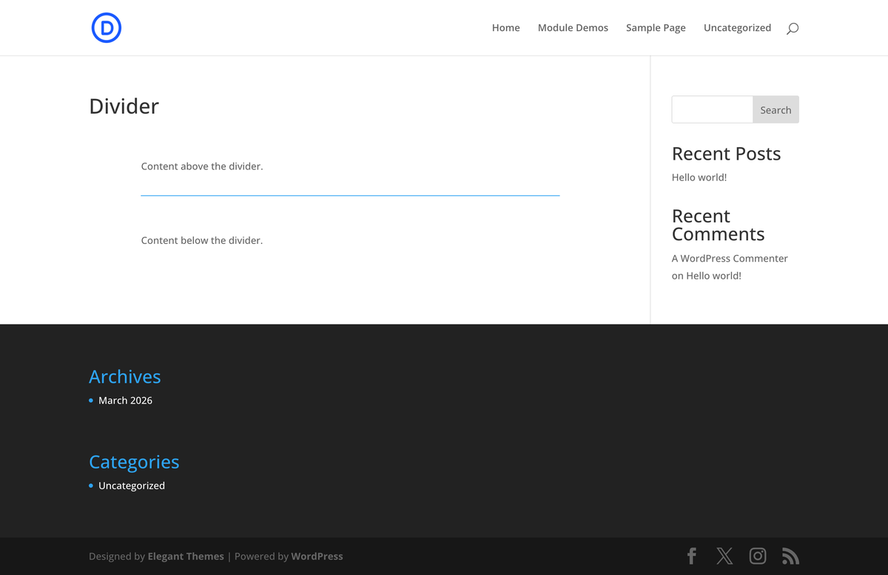
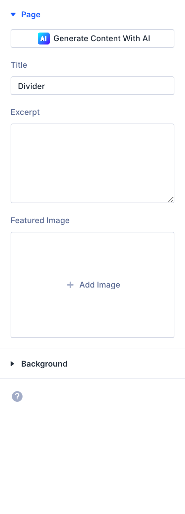

# Divider

The Divider module is a Divi 5 content element used in the Visual Builder.

## Overview

How to add, configure and customize the Divi divider module.

The Divider Module makes it easy to add horizontal lines to your web design to add separation. You can define the divider color, thickness, width, and alignment.

View A Live Demo Of This Module

<!-- TODO: Replace with proper screenshot -->
<!-- { loading=lazy } -->
<!-- *The Divider module as it appears in the Divi 5 Visual Builder.* -->

## Settings & Options

### Content Tab

<!-- TODO: Verify all Content tab settings for Divider module -->

| Setting | Type | Default | Description |
|---------|------|---------|-------------|
| Line Style– Choose the style for the line | text | — | Solid, dashed, dotted, double, groove, ridge, inset, outset, or none. |
| Line Position– Choose the position of the line | text | — | top, vertically centered, or bottom. |

<!-- TODO: Replace with proper screenshot -->
<!-- { loading=lazy } -->

### Design Tab

<!-- TODO: Verify all Design tab settings for Divider module -->

| Setting | Type | Default | Description |
|---------|------|---------|-------------|
| <!-- TODO: Document Design settings --> | | | |

<!-- TODO: Replace with proper screenshot -->
<!-- { loading=lazy } -->

### Advanced Tab

<!-- TODO: Verify all Advanced tab settings for Divider module -->

| Setting | Type | Default | Description |
|---------|------|---------|-------------|
| CSS ID | text | — | Assign a unique CSS ID to the module |
| CSS Class | text | — | Assign CSS classes to the module |
| Custom CSS | code | — | Add custom CSS directly to the module's elements |
| Visibility | toggle | Show on all devices | Control device visibility (desktop, tablet, phone) |
| Transition | select | Default | Animation transition style for hover effects |

## Code Examples

### Custom CSS

```css
/* Style the Divider module */
.et_pb_divider {
    /* Add your custom styles */
    margin-bottom: 30px;
}

/* Responsive adjustments */
@media (max-width: 980px) {
    .et_pb_divider {
        padding: 20px;
    }
}
```

### PHP Hooks

```php
/* Filter the Divider module output */
add_filter('et_module_shortcode_output', function($output, $render_slug) {
    if ('et_pb_et_pb_divider' !== $render_slug) {
        return $output;
    }
    // Modify $output as needed
    return $output;
}, 10, 2);
```

## Common Patterns

<!-- TODO: Add 2-3 real-world usage patterns with screenshots -->

1. **Basic Usage** — Add the Divider module to any row in the Visual Builder and configure its settings.

2. **Styled Variation** — Use the Design tab to customize fonts, colors, and spacing to match your site's design system.

3. **Dynamic Content** — Use dynamic content fields to pull data from custom fields or post meta.

## Version Notes

!!! note "Divi 5 Only"
    This page documents Divi 5 behavior exclusively.

## Troubleshooting

!!! warning "Module Not Rendering"
    If the Divider module doesn't appear on the front end, verify that:

    - The module is not inside a disabled section or row
    - Visibility settings aren't hiding it on the current device
    - Any required fields (like URLs or content) are filled in

<!-- TODO: Add module-specific troubleshooting items -->

## Related

- [Text](text.md)
- [Code](code.md)
