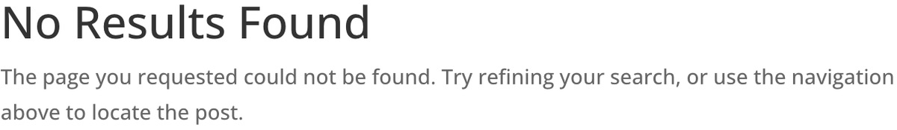

# Filterable Portfolio

The Filterable Portfolio module displays WordPress project posts in a sortable, category-based grid or fullwidth layout.

## Overview

The Filterable Portfolio module builds on the standard Portfolio module by adding interactive category filtering. Visitors can click category labels displayed above the portfolio grid to dynamically show or hide projects based on their assigned project categories. This makes it straightforward for users to browse large collections of work without navigating away from the page.

This module pulls content directly from the WordPress Projects custom post type that ships with Divi. Each project's featured image, title, and category metadata are rendered automatically, so there is no need to manually configure individual items. When you publish or update a project post, the Filterable Portfolio reflects those changes on the front end.

The Filterable Portfolio is well-suited for creative agencies, freelancers, and businesses that want to showcase categorized work samples, case studies, or product lines. It pairs naturally with dedicated project pages and can be combined with other layout modules to build full portfolio sections.

For additional reference, see the [official Elegant Themes documentation](https://help.elegantthemes.com/en/articles/10315331-the-filterable-portfolio-module-in-divi-5).

[View A Live Demo Of This Module](https://www.16wells.dev/module-demos/filterable-portfolio/)

{ loading=lazy }
*The Filterable Portfolio module displaying project posts with category filter buttons.*

## Use Cases

1. **Agency Portfolio Page** — Display client work organized by service type (branding, web design, print) so visitors can filter to the category most relevant to their needs.

2. **Product Showcase** — Present a product catalog where customers can sort items by category, making it easy to browse specific product lines without leaving the page.

3. **Case Study Library** — Showcase business case studies filtered by industry or solution type, helping prospects quickly find examples relevant to their situation.

## How to Add the Filterable Portfolio Module

1. **Insert the module.** Open the Visual Builder, click the gray plus icon inside any row, and search for "Filterable Portfolio" in the module picker. Click it to add it to your layout.

2. **Configure your content.** In the Content tab, set the number of projects to display and select which project categories to include. Enable or disable the title, category labels, and pagination elements as needed.

3. **Style and publish.** Switch to the Design tab to choose between grid and fullwidth layouts, adjust overlay colors, customize typography for titles and filter labels, and fine-tune spacing. Save your layout when finished.

## Settings & Options

### Content Tab

The Content tab controls which project data appears and how the module links to other content.

| Setting | Type | Description |
|---------|------|-------------|
| **Content** | | |
| Number of Projects | number | Sets how many project posts are displayed in the portfolio grid. Accepts any positive integer. |
| Project Categories | multi-select | Filters which project categories are included. Leave empty to show all categories, or select specific ones to narrow the display. |
| **Elements** | | |
| Show Title | toggle | Controls whether the project title appears below each portfolio thumbnail. |
| Show Categories | toggle | Controls whether the category filter buttons appear above the portfolio grid. |
| Show Pagination | toggle | Enables or disables numbered pagination below the portfolio when the project count exceeds the per-page limit. |
| **Link** | | |
| Module Link URL | url | Wraps the entire module in a link to a specified URL, page, or section. |
| Module Link Target | select | Sets whether the module link opens in the same window or a new tab. |
| **Background** | | |
| Background Color | color | Applies a solid background color to the module container. |
| Background Gradient | gradient | Applies a gradient background with configurable direction, stops, and colors. |
| Background Image | image | Sets a background image behind the module content. |
| Background Video | video | Embeds a background video behind the module content. |
| Background Pattern | pattern | Adds a repeating pattern overlay to the module background. |
| Background Mask | mask | Applies a decorative mask shape to the module background. |
| **Meta** | | |
| Admin Label | text | Custom label displayed in the Visual Builder layers panel to help identify the module. |
| Disable On | toggle | Forces the module to remain visible in the Visual Builder even when front-end visibility is restricted. |

### Design Tab

The Design tab provides layout, typography, color, and visual effect controls for the portfolio display.

**Module-specific settings:**

| Setting | Type | Description |
|---------|------|-------------|
| Layout | select | Switches between Grid (multi-column) and Fullwidth (single-column, full-width images) display modes. |
| Overlay | overlay controls | Configure the hover overlay on portfolio thumbnails — overlay icon, icon color, overlay background color, and whether to show the icon on hover. |
| Filter Criteria Text | text styling | Style the category filter buttons — font, weight, style, color, size, letter spacing, line height, and text shadow. |

**Shared design options** — see [Options Groups](../options-groups/index.md) for detailed documentation:

| Options Group | Description |
|--------------|-------------|
| [Image](../options-groups/image.md) | Rounded corners, border, box shadow, and CSS filters for portfolio thumbnails |
| [Text](../options-groups/text.md) | Font, weight, alignment, color, line height, text shadow |
| [Title Text](../options-groups/text.md) | Font, size, color, letter spacing for project titles |
| [Meta Text](../options-groups/text.md) | Font, size, color for project metadata text |
| [Pagination Text](../options-groups/text.md) | Font, size, color for pagination links |
| [Sizing](../options-groups/sizing.md) | Width, max-width, height, min-height |
| [Spacing](../options-groups/spacing.md) | Margin and padding (responsive) |
| [Border](../options-groups/border.md) | Width, color, style, radius |
| [Box Shadow](../options-groups/box-shadow.md) | Shadow effects |
| [Filters](../options-groups/filters.md) | CSS filters (brightness, contrast, etc.) |
| [Transform](../options-groups/transform.md) | Scale, translate, rotate, skew |
| [Animation](../options-groups/animation.md) | Entrance animation styles |

### Advanced Tab

The Advanced tab provides developer-oriented controls for custom attributes, conditional display, interactions, and scroll-driven effects.

**Shared advanced options** — see [Options Groups](../options-groups/index.md) for detailed documentation:

| Options Group | Description |
|--------------|-------------|
| [Attributes](../options-groups/attributes.md) | CSS ID, classes, custom HTML attributes |
| [CSS](../options-groups/css.md) | Custom CSS per element target |
| HTML | Custom HTML attributes for module wrapper |
| [Conditions](../options-groups/conditions.md) | Display rules (user role, page type, date, logic) |
| Interactions | Hover, click, or scroll-triggered interactions |
| [Visibility](../options-groups/visibility.md) | Device visibility toggles |
| [Transitions](../options-groups/transitions.md) | Hover transition timing |
| [Position](../options-groups/position.md) | CSS position and offsets |
| [Scroll Effects](../options-groups/scroll-effects.md) | Scroll-driven animation effects |

## Code Examples

### Custom CSS

```css
/* Customize the category filter buttons */
.et_pb_filterable_portfolio .et_pb_portfolio_filters li a {
    background-color: #f5f5f5;
    border-radius: 4px;
    padding: 8px 16px;
    color: #333;
    transition: all 0.3s ease;
}

.et_pb_filterable_portfolio .et_pb_portfolio_filters li a:hover,
.et_pb_filterable_portfolio .et_pb_portfolio_filters li a.active {
    background-color: #2ea3f2;
    color: #fff;
}

/* Add a subtle hover effect to portfolio items */
.et_pb_filterable_portfolio .et_pb_portfolio_item {
    transition: transform 0.3s ease, box-shadow 0.3s ease;
}

.et_pb_filterable_portfolio .et_pb_portfolio_item:hover {
    transform: translateY(-4px);
    box-shadow: 0 8px 24px rgba(0, 0, 0, 0.12);
}

/* Responsive: stack to single column on mobile */
@media (max-width: 767px) {
    .et_pb_filterable_portfolio .et_pb_portfolio_item {
        width: 100% !important;
        margin-right: 0 !important;
    }
}
```

### PHP Hooks

```php
/* Modify the Filterable Portfolio module output */
add_filter('et_module_shortcode_output', function($output, $render_slug) {
    if ('et_pb_filterable_portfolio' !== $render_slug) {
        return $output;
    }

    // Example: Add a wrapper div with a custom class
    $output = '<div class="custom-portfolio-wrapper">' . $output . '</div>';

    return $output;
}, 10, 2);
```

```php
/* Change the number of projects per page for filterable portfolios */
add_filter('pre_get_posts', function($query) {
    if (!is_admin() && $query->get('post_type') === 'project') {
        $query->set('posts_per_page', 12);
    }
});
```

## Common Patterns

1. **Category-Filtered Services Page** — Place a Filterable Portfolio in a fullwidth row on a services page. Create project categories that match your service offerings (e.g., "Web Design", "SEO", "Branding"). Visitors can click each category to view only relevant work samples, creating an interactive browsing experience without custom code.

2. **Grid Portfolio with Custom Overlay** — Use the grid layout with a custom overlay icon and branded overlay color. Set the overlay color to match your brand palette with reduced opacity so the thumbnail remains partially visible on hover. Adjust the title and meta typography to complement your site's design system.

3. **Paginated Project Archive** — Enable pagination and set a conservative project count (6 or 9) to keep page load times fast when you have a large number of projects. Combine with a heading module above the portfolio to provide context, and style the pagination text to match your navigation design.

## Saving Your Work

After configuring the Filterable Portfolio module, save your layout by clicking the green **Save** button at the bottom of the Visual Builder panel, or use the keyboard shortcut **Ctrl+S** (Windows) / **Cmd+S** (Mac). To reuse this configured module on other pages, right-click the module in the Visual Builder and select **Save to Library**. You can also copy and paste modules between pages using **Ctrl+C** / **Ctrl+V**.

## Version Notes

!!! note "Divi 5 Only"
    This page documents Divi 5 behavior exclusively. The Filterable Portfolio module in Divi 5 uses the updated Visual Builder interface with the accordion-style settings panel. Settings organization and naming may differ from Divi 4.

## Troubleshooting

!!! warning "No Projects Appearing"
    If the Filterable Portfolio displays nothing, verify that you have published project posts under **Projects** in the WordPress admin. The module pulls from the Projects custom post type, so standard posts and pages will not appear. Also confirm that each project has a featured image assigned and belongs to at least one project category.

!!! warning "Category Filters Not Showing"
    If the filter buttons are missing above the portfolio, check that the **Show Categories** toggle is enabled in the Content tab under Elements. Also ensure your projects are assigned to more than one category, as the filter is less useful with a single category and may not render if only one exists.

!!! tip "Slow Loading with Many Projects"
    If the portfolio is slow to load or causes layout shifts, reduce the **Number of Projects** setting and enable **Pagination**. Large project counts force the module to load all thumbnails at once, which impacts performance. Consider optimizing your project featured images to web-appropriate sizes (1200px wide maximum) before uploading.

## Related

- [Portfolio](portfolio.md)
- [Gallery](gallery.md)
- [Blog](blog.md)
