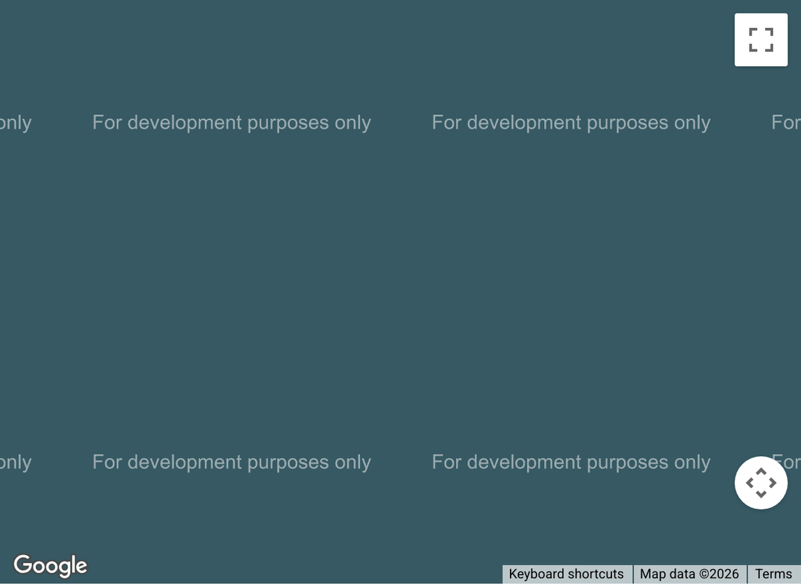

# Fullwidth Map

The Fullwidth Map module displays an interactive Google Map that spans the entire width of a fullwidth section, with support for multiple location pins.

!!! abstract "Quick Reference"
    **What it does:** Embeds a full-width interactive Google Map with customizable pins, info windows, and zoom controls.
    **When to use it:** Contact page location displays, multi-location directories, event venue showcases
    **Key settings:** Map center address, Zoom level, Pin titles/content/addresses, Mouse wheel zoom, Mobile dragging
    **Block identifier:** `divi/fullwidth-map`
    **ET Docs:** [Official documentation](https://help.elegantthemes.com/en/articles/10353411-the-map-module-in-divi-5)

!!! tip "When to Use This Module"
    - Displaying business locations on a contact page with edge-to-edge presentation
    - Showing multiple branch or franchise locations with individual info windows
    - Featuring event or venue locations prominently on landing pages

!!! warning "When NOT to Use This Module"
    - For maps within content columns or standard sections → use [Map](map.md)
    - For static location display without interactivity → use an [Image](image.md) with a map screenshot
    - For non-Google map providers → use [Code](code.md) with a custom embed

## Overview

The Fullwidth Map module embeds a Google Maps instance that stretches edge to edge within a fullwidth section. It provides visitors with an interactive map they can pan, zoom, and click to explore your business locations, event venues, or any geographic points of interest. Multiple pins can be added to mark different addresses, each with its own title and description that appear in an info window when clicked.

This module is functionally identical to the standard [Map](map.md) module but is designed exclusively for use within fullwidth sections. The edge-to-edge presentation makes it particularly effective on contact pages, location directories, and real estate listings where the map serves as a primary visual element rather than a secondary detail.

Before the module can display a map, you must configure a Google Maps API key in the Divi theme options. This requires creating a Google Cloud project, enabling the Maps JavaScript API, setting up billing, and generating an API key. Without a valid key, the module will show a placeholder or error message on the front end.

For additional reference, see the [official Elegant Themes documentation for the Map module](https://help.elegantthemes.com/en/articles/10353411-the-map-module-in-divi-5).

[View A Live Demo Of This Module](https://www.16wells.dev/module-demos/fullwidth-map/)

{ loading=lazy }
*The Fullwidth Map module displaying an interactive Google Map with location pins.*

## Use Cases

1. **Contact Page Location Display** — Embed a full-width map at the top or bottom of a contact page showing your office or store location, giving visitors an immediate visual reference and the ability to get directions with a single click.

2. **Multi-Location Directory** — Add multiple pins to showcase all branch offices, retail outlets, or franchise locations on a single map. Each pin can include the address, phone number, and hours in its info window description.

3. **Event or Venue Showcase** — Feature the location of an upcoming event, conference, or venue prominently on a landing page with a full-width map that visitors can interact with to explore nearby parking, hotels, and transit options.

## How to Add the Fullwidth Map Module

1. Open the Visual Builder and ensure the page has a fullwidth section. If needed, click the blue **+** icon and select **Fullwidth** as the section type.

2. Click the gray **+** icon inside the fullwidth section to open the module picker.

3. Search for "Fullwidth Map" or browse the Fullwidth Modules category, then click to insert it into the section.

## Settings & Options

The Fullwidth Map module settings are organized across three tabs: Content, Design, and Advanced.

### Content Tab

The Content tab controls the map's location, pins, link behavior, and background.

| Setting | Type | Description |
|---------|------|-------------|
| Add New Pin | item list | Add, edit, and remove map pins. Each pin has its own address, title, and content fields. Click **+** to add a pin, the pencil icon to edit, the trash icon to delete, and drag to reorder. |
| Map | location selector | Set the geographic center point and default zoom level for the map. Enter an address or coordinates to position the initial view. Requires a valid Google Maps API key configured in theme options. |
| Link | url | Make the entire module clickable, redirecting users to another page, section, or external URL when they click outside of map controls. |
| Background | background controls | Set a background color, gradient, image, or video behind the module. This is visible if the map has any transparent areas or during loading. |
| Loop | toggle | Enable the Loop Builder to dynamically generate map content from posts or custom post types. |
| Order | select | Control the display order of the module when placed inside a Flexbox or CSS Grid layout container. |
| Meta | admin label | Set a custom label to identify the module in the Visual Builder's layer panel. Includes a toggle to force visibility in the builder. |

#### Individual Pin Settings

Each map pin has its own configuration when you click to edit it:

| Setting | Type | Description |
|---------|------|-------------|
| Title | text | The heading displayed in the pin's info window when a visitor clicks the marker. |
| Content | rich text editor | The body text shown in the info window below the title. Supports HTML for formatting addresses, phone numbers, and links. |
| Address | text / geocoder | The physical address or coordinates used to place the pin on the map. The address is geocoded through the Google Maps API. |

### Design Tab

The Design tab controls the map's interactive behavior, visual filters, and dimensional styling.

**Module-specific settings:**

| Setting | Type | Description |
|---------|------|-------------|
| Controls | toggle options | Enable or disable map interaction controls. Options include mouse wheel zoom (prevents accidental zooming while scrolling) and mobile dragging (prevents the map from capturing touch gestures on mobile devices). |
| Map | filter options | Apply visual filters to the map tiles themselves, allowing you to adjust the map's color scheme to better match your site's design without using a custom map style. |

**Shared design options** — see [Options Groups](../options-groups/index.md) for detailed documentation:

| Options Group | Description |
|--------------|-------------|
| [Sizing](../options-groups/sizing.md) | Width, max-width, height, min-height |
| [Spacing](../options-groups/spacing.md) | Margin and padding per side, responsive breakpoints |
| [Border](../options-groups/border.md) | Width, color, style, border radius |
| [Box Shadow](../options-groups/box-shadow.md) | Color, offsets, blur radius, spread |
| [Filters](../options-groups/filters.md) | Brightness, contrast, saturation, hue, blur, invert, blend mode |
| [Transform](../options-groups/transform.md) | Scale, translate, rotate, skew, transform origin |
| [Animation](../options-groups/animation.md) | Entrance animation style, duration, delay, intensity |

### Advanced Tab

The Advanced tab provides developer-oriented controls for custom attributes, conditional display, and interaction behavior.

**Shared advanced options** — see [Options Groups](../options-groups/index.md) for detailed documentation:

| Options Group | Description |
|--------------|-------------|
| [Attributes](../options-groups/attributes.md) | CSS ID, classes, custom HTML attributes |
| [CSS](../options-groups/css.md) | Custom CSS per element target (map container, pin markers, info windows) |
| HTML | Semantic HTML tag for the module wrapper (div, section, aside) |
| [Conditions](../options-groups/conditions.md) | Display rules (user role, page type, date, logic) |
| Interactions | Hover, click, or scroll-triggered interactions |
| [Visibility](../options-groups/visibility.md) | Device visibility toggles |
| [Transitions](../options-groups/transitions.md) | Hover transition timing |
| [Position](../options-groups/position.md) | CSS position and offsets |
| [Scroll Effects](../options-groups/scroll-effects.md) | Scroll-driven animation effects |

## Code Examples

### Custom CSS

```css
/* Adjust the Fullwidth Map height for a more prominent display */
.et_pb_fullwidth_map {
    min-height: 500px;
}

/* Style the map info window content */
.et_pb_fullwidth_map .gm-style-iw {
    max-width: 300px;
    padding: 10px;
}

/* Style the info window title */
.et_pb_fullwidth_map .gm-style-iw h4 {
    font-size: 16px;
    font-weight: 600;
    margin-bottom: 8px;
}

/* Add a subtle border above the map for visual separation */
.et_pb_fullwidth_map {
    border-top: 3px solid #2ea3f2;
}

/* Responsive height adjustments */
@media (max-width: 980px) {
    .et_pb_fullwidth_map {
        min-height: 350px;
    }
}

@media (max-width: 767px) {
    .et_pb_fullwidth_map {
        min-height: 250px;
    }
}
```

### PHP Hooks

```php
/* Filter the Fullwidth Map module output */
add_filter('et_module_shortcode_output', function($output, $render_slug) {
    if ('et_pb_fullwidth_map' !== $render_slug) {
        return $output;
    }
    // Example: Wrap the map in a container for additional styling control
    $output = '<div class="custom-map-wrapper">' . $output . '</div>';
    return $output;
}, 10, 2);
```

## Common Patterns

1. **Contact Page Footer Map** — Place the Fullwidth Map module as the last element on a contact page, directly above the site footer. Add a single pin for your primary location with the full address, phone number, and business hours in the pin content. Disable mouse wheel zoom to prevent accidental map interactions while visitors scroll.

2. **Multi-Location with Desaturated Style** — Add pins for all business locations and use the Design tab's Map Filters to desaturate the map tiles, creating a grayscale base that matches a minimalist site design. The colored pin markers stand out clearly against the muted background, drawing attention to each location.

3. **Sticky Map Section** — Use the Advanced tab's Position settings to make the fullwidth section containing the map sticky, so it remains visible while visitors scroll through a list of location details in adjacent sections. This creates a split-view experience where the map updates context as users read about each location.

## AI Interaction Notes

!!! warning "Create vs. Modify"
    Modifying existing module content via REST API (`wp.apiFetch` PATCH) updates
    title, body text, and settings attributes. **Creating new modules via REST API**
    produces content that renders on the front end but may not appear in the Visual
    Builder layer view. Use browser automation for reliable module creation.
    See [REST API Content Playbook](../playbooks/rest-api-content.md).

**Block identifier:** `divi/fullwidth-map` — *Needs verification on current build*

| Operation | Method | Status | Notes |
|-----------|--------|--------|-------|
| Read content | Parse `post_content` block JSON | Observed | Use brace-depth parser — see [Content Encoding](../internals/content-encoding.md) |
| Modify existing | `wp.apiFetch` PATCH on post endpoint | Observed | Update block attributes in `post_content` |
| Create new | Browser automation (Playwright) | Observed | REST creation may break VB visibility |
| Batch modify | Sequential REST requests | Needs Testing | See [REST API Content Playbook](../playbooks/rest-api-content.md) |

**Key content attributes** — *JSON paths need verification*:

| Attribute | JSON Path | Notes |
|-----------|-----------|-------|
| Address | `attrs.address` | Map center address or coordinates |
| Zoom | `attrs.zoom_level` | Default map zoom level |
| Mouse Wheel | `attrs.mouse_wheel` | Toggle mouse wheel zoom behavior |

!!! tip "Module Selection Guidance"
    For edge-to-edge maps use Fullwidth Map; for maps within content columns use Map.

## Saving Your Work

After configuring the Fullwidth Map:

- **Save changes** — Click the purple **Save** button at the bottom of the Visual Builder, or press `Ctrl+S` (Windows) / `Cmd+S` (Mac).
- **Exit the builder** — Click the **X** button or use `Ctrl+Shift+E` to return to the WordPress dashboard.

## Version Notes

!!! note "Divi 5 Only"
    This page documents Divi 5 behavior exclusively.

## Troubleshooting

!!! warning "Map Shows Gray Area or Error Message"
    If the map displays a gray placeholder, a "For development purposes only" watermark, or an API error, your Google Maps API key is either missing, invalid, or has billing issues. Go to **Divi > Theme Options > General** and verify the API key. Ensure billing is enabled on your Google Cloud project and the Maps JavaScript API is activated.

!!! warning "Pins Not Appearing at Correct Locations"
    If pins are placed in the wrong position or not showing at all, verify that the addresses entered in each pin's settings are complete and correctly formatted. Ambiguous addresses (like just a city name) may geocode to unexpected locations. Use full street addresses or latitude/longitude coordinates for precision.

!!! tip "Map Interferes with Page Scrolling on Mobile"
    On mobile devices, visitors may accidentally interact with the map when trying to scroll the page. Enable the "Disable Mobile Dragging" option in the Design tab's Controls settings to prevent the map from capturing touch scroll gestures, allowing visitors to scroll past the map normally.

## Related

- [Map](map.md) — Standard-width version for use within regular sections and rows
