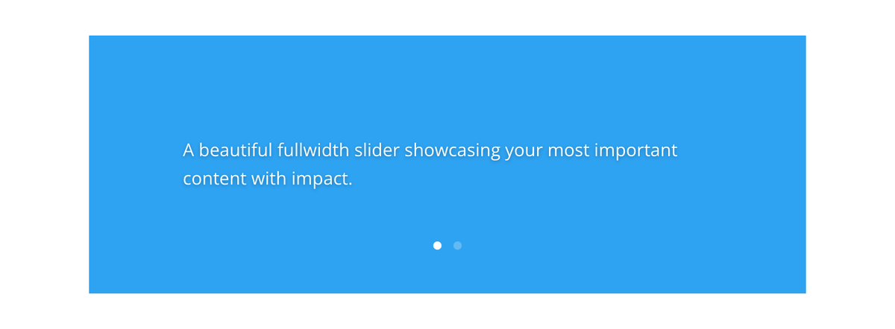

# Fullwidth Slider

The Fullwidth Slider module displays a full-width slideshow with customizable slides that can include titles, body text, buttons, images, and video backgrounds.

!!! abstract "Quick Reference"
    **What it does:** Creates an edge-to-edge slideshow with individually configurable slides, each with its own content and background.
    **When to use it:** Homepage hero banners, promotional campaign rotators, visual storytelling sections
    **Key settings:** Slides (repeater), Show Arrows, Show Dot Navigation, per-slide Heading/Button/Body/Background
    **Block identifier:** `divi/fullwidth-slider`
    **ET Docs:** [Official documentation](https://help.elegantthemes.com/en/articles/10364612-the-slider-module-in-divi-5)

!!! tip "When to Use This Module"
    - Building a homepage hero with rotating slides for different products or offers
    - Displaying time-sensitive promotions in an auto-advancing slideshow
    - Creating visual storytelling sections with parallax or video backgrounds

!!! warning "When NOT to Use This Module"
    - For a single static hero section → use [Fullwidth Header](fullwidth-header.md)
    - For content-width sliders in standard sections → use [Slider](slider.md)
    - For blog post-based slideshows → use [Post Slider](post-slider.md)

## Overview

The Fullwidth Slider module creates an edge-to-edge slideshow that spans the entire browser width. Each slide can contain a heading, descriptive text, a call-to-action button, and a background image or video, making it one of the most versatile modules for hero sections, promotional banners, and feature highlights. The module supports parallax background effects and full-width video backgrounds for cinematic presentations.

Slides are managed individually within the module, so each one can have its own unique content, background, and styling. Navigation arrows and dot indicators let visitors move between slides manually, while auto-advancement can cycle through slides on a timer. The fullwidth format ensures maximum visual impact regardless of the visitor's screen resolution.

The Fullwidth Slider differs from the standard [Slider](slider.md) module only in that it must be placed inside a fullwidth section and stretches to fill the entire viewport width. It shares the same slide-level content structure and most design controls. For sliders that automatically pull from blog posts, see the [Post Slider](post-slider.md) module. For video-focused slideshows, see the [Video Slider](video-slider.md) module.

For additional reference, see the [official Elegant Themes documentation](https://help.elegantthemes.com/en/articles/10364612-the-slider-module-in-divi-5).

[View A Live Demo Of This Module](https://www.16wells.dev/module-demos/fullwidth-slider/)

{ loading=lazy }
*The Fullwidth Slider module displaying a hero-style slide with title, text, and call-to-action button.*

## Use Cases

1. **Homepage Hero Banner** — Create an attention-grabbing first impression with a fullwidth slideshow cycling through your key offerings. Each slide can feature a different product, service, or value proposition with a unique background image and CTA button.

2. **Promotional Campaign Rotator** — Display time-sensitive promotions, seasonal offers, or event announcements in a rotating slideshow. Update individual slides without rebuilding the entire section, and use the button on each slide to link directly to the relevant landing page.

3. **Visual Storytelling Section** — Use the slider mid-page to break up text-heavy content with a sequence of full-bleed images and captions. Parallax backgrounds and video slides add depth and movement that keeps visitors engaged as they scroll.

## How to Add the Fullwidth Slider Module

1. Open the Visual Builder on the page you want to edit. Add a **Fullwidth Section** if one does not already exist, since this module requires a fullwidth section.
2. Click the gray **+** icon inside the fullwidth section to add a new module.
3. Search for "Fullwidth Slider" in the module picker or locate it in the Fullwidth Modules category, then click to insert it. The module will appear with one default slide ready for editing.

## Settings & Options

The Fullwidth Slider module settings are organized across three tabs at the module level. Each individual slide also has its own settings panel.

### Content Tab

The Content tab manages the collection of slides, navigation elements, and module-level metadata.

| Setting | Type | Description |
|---------|------|-------------|
| Slides | item list | Manage individual slides within the slider. Click **+** to add a new slide, the pencil icon to edit, the trash icon to delete, and drag to reorder. Each slide opens its own settings panel. |
| Elements — Show Arrows | toggle | Display or hide the left/right navigation arrows that allow visitors to move between slides manually. |
| Elements — Show Dot Navigation | toggle | Display or hide the dot indicators below the slider that show the current slide position and allow direct navigation. |
| Link | url | Optionally make the entire slider module clickable, directing visitors to a specified URL. |
| Background | background controls | Set a background color, gradient, image, or video behind the slider module itself (visible if slides do not fully cover the area). |
| Loop | toggle | When enabled, activates the Loop Builder functionality for repeating the module in dynamic layouts. |
| Order | select | Control the module's placement order within Flexbox and Grid parent layouts. |
| Meta — Admin Label | text | Set a custom label for the module in the Visual Builder's layer panel. |
| Meta — Disable On | device toggles | Control builder-level visibility across devices. |

#### Individual Slide Settings

Each slide within the Fullwidth Slider has its own settings panel with the following options:

| Setting | Type | Description |
|---------|------|-------------|
| Heading | text | The main title displayed prominently on the slide. |
| Button | text | The call-to-action button label. Leave empty to hide the button. |
| Body | rich text editor | Descriptive content displayed below the heading. Supports formatted text, links, and inline media. |
| Image | image upload | An optional image displayed alongside the slide content, typically positioned to the left or right of the text. |
| Link — Button Link URL | url | The destination URL when a visitor clicks the slide button. |
| Link — URL Opens | select | Choose whether the button link opens in the same window or a new tab. |
| Background | background controls | Set the slide's background color, gradient, image, or video. Supports parallax scrolling for images. |

### Design Tab

The Design tab controls the visual presentation of the slider, its slides, and all typographic elements.

**Module-specific settings:**

| Setting | Type | Description |
|---------|------|-------------|
| Navigation | color picker | Set the color of the navigation arrows and dot indicators for both default and hover states. |

**Shared design options** — see [Options Groups](../options-groups/index.md) for detailed documentation:

| Options Group | Description |
|--------------|-------------|
| [Overlay](../options-groups/overlay.md) | Color overlay on slide backgrounds with adjustable opacity |
| [Image](../options-groups/image.md) | Border radius, shadow, object-fit for slide images |
| [Text](../options-groups/text.md) | Font, weight, alignment, color, line height, text shadow |
| [Title Text](../options-groups/title-text.md) | Font, size, color, letter spacing, line height, text shadow for slide headings |
| [Body Text](../options-groups/body-text.md) | Font, size, color, spacing for slide body content |
| [Button](../options-groups/button.md) | Font, colors, border, border radius, padding, hover states for CTA button |
| [Sizing](../options-groups/sizing.md) | Width, max-width, height, min-height |
| [Spacing](../options-groups/spacing.md) | Margin and padding per side, responsive breakpoints |
| [Border](../options-groups/border.md) | Width, color, style, border radius |
| [Box Shadow](../options-groups/box-shadow.md) | Color, offsets, blur radius, spread |
| [Filters](../options-groups/filters.md) | Brightness, contrast, saturation, hue, blur, invert, blend mode |
| [Transform](../options-groups/transform.md) | Scale, translate, rotate, skew, transform origin |
| [Animation](../options-groups/animation.md) | Entrance animation style, duration, delay, intensity |

### Advanced Tab

The Advanced tab provides low-level control over HTML attributes, custom CSS, conditional display logic, and scroll-based effects.

**Shared advanced options** — see [Options Groups](../options-groups/index.md) for detailed documentation:

| Options Group | Description |
|--------------|-------------|
| [Attributes](../options-groups/attributes.md) | CSS ID, classes, custom HTML attributes |
| [CSS](../options-groups/css.md) | Custom CSS per element target (slide content, title, button, image, arrows, dots) |
| HTML | Semantic HTML tag for the module wrapper (div, section, article) |
| [Conditions](../options-groups/conditions.md) | Display rules (user role, page type, date, logic) |
| Interactions | Hover, click, or scroll-triggered interactions |
| [Visibility](../options-groups/visibility.md) | Device visibility toggles |
| [Transitions](../options-groups/transitions.md) | Hover transition timing |
| [Position](../options-groups/position.md) | CSS position and offsets |
| [Scroll Effects](../options-groups/scroll-effects.md) | Scroll-driven animation effects |

## Code Examples

### Custom CSS

```css
/* Darken slide backgrounds for better text contrast */
.et_pb_fullwidth_slider .et_pb_slide_overlay_container {
    background: linear-gradient(to bottom, rgba(0,0,0,0.3), rgba(0,0,0,0.6));
}

/* Style the slide heading */
.et_pb_fullwidth_slider .et_pb_slide_description h2 {
    font-size: 48px;
    font-weight: 700;
    text-transform: uppercase;
    letter-spacing: 2px;
}

/* Customize the CTA button */
.et_pb_fullwidth_slider .et_pb_button {
    border-radius: 30px;
    padding: 12px 32px;
    font-weight: 600;
    text-transform: uppercase;
}

/* Center slide content vertically */
.et_pb_fullwidth_slider .et_pb_slide_description {
    display: flex;
    flex-direction: column;
    justify-content: center;
    align-items: center;
    text-align: center;
}

/* Responsive: reduce heading size on mobile */
@media (max-width: 767px) {
    .et_pb_fullwidth_slider .et_pb_slide_description h2 {
        font-size: 28px;
    }
}
```

### PHP Hooks

```php
/* Filter the Fullwidth Slider module output */
add_filter('et_module_shortcode_output', function($output, $render_slug) {
    if ('et_pb_fullwidth_slider' !== $render_slug) {
        return $output;
    }
    // Example: Add a scroll-down indicator after the slider
    $output .= '<div class="scroll-indicator"><span>&#8595;</span></div>';
    return $output;
}, 10, 2);

/* Add custom class to the slider based on slide count */
add_filter('et_module_shortcode_output', function($output, $render_slug) {
    if ('et_pb_fullwidth_slider' !== $render_slug) {
        return $output;
    }
    $slide_count = substr_count($output, 'et_pb_slide ');
    if ($slide_count === 1) {
        $output = str_replace('et_pb_fullwidth_slider', 'et_pb_fullwidth_slider single-slide', $output);
    }
    return $output;
}, 10, 2);
```

## Common Patterns

1. **Parallax Hero with Video Fallback** — Set a high-resolution image as the slide background with parallax enabled. For modern browsers, add a video background that autoplays silently. The image serves as a fallback for devices that do not support autoplay. Add a centered heading and CTA button with the overlay darkened to ensure text readability.

2. **Multi-Slide Feature Tour** — Create three to five slides, each spotlighting a different feature or benefit of your product. Use a consistent background style across all slides and position a product image on the right side of each slide with descriptive text on the left. Enable dot navigation so visitors can jump between features.

3. **Minimal Announcement Banner** — Use a single slide with a solid background color or subtle gradient. Set a short heading, a one-line description, and a button linking to the announcement page. Disable navigation arrows and dots since there is only one slide, keeping the layout clean and focused.

## AI Interaction Notes

!!! warning "Create vs. Modify"
    Modifying existing module content via REST API (`wp.apiFetch` PATCH) updates
    title, body text, and settings attributes. **Creating new modules via REST API**
    produces content that renders on the front end but may not appear in the Visual
    Builder layer view. Use browser automation for reliable module creation.
    See [REST API Content Playbook](../playbooks/rest-api-content.md).

**Block identifier:** `divi/fullwidth-slider` — *Needs verification on current build*

| Operation | Method | Status | Notes |
|-----------|--------|--------|-------|
| Read content | Parse `post_content` block JSON | Observed | Use brace-depth parser — see [Content Encoding](../internals/content-encoding.md) |
| Modify existing | `wp.apiFetch` PATCH on post endpoint | Observed | Update block attributes in `post_content` |
| Create new | Browser automation (Playwright) | Observed | REST creation may break VB visibility |
| Batch modify | Sequential REST requests | Needs Testing | See [REST API Content Playbook](../playbooks/rest-api-content.md) |

**Key content attributes** — *JSON paths need verification*:

| Attribute | JSON Path | Notes |
|-----------|-----------|-------|
| Slide content | Per-child blocks | Each slide is a nested child block with its own attributes |

!!! tip "Module Selection Guidance"
    For full-width rotating banners use Fullwidth Slider; for content-width sliders use Slider; for post-based sliders use Post Slider.

## Saving Your Work

After configuring the Fullwidth Slider module, click the green **Save** button at the bottom of the Visual Builder interface. You can also save the entire slider (with all its slides) to your Divi Library for reuse across pages by right-clicking the module and selecting **Save to Library**.

## Version Notes

!!! note "Divi 5 Only"
    This page documents Divi 5 behavior exclusively. The Fullwidth Slider in Divi 5 uses the updated rendering engine and supports Conditions, Interactions, Scroll Effects, and enhanced Flexbox/Grid layout controls that are not available in Divi 4.

## Troubleshooting

!!! warning "Slides Not Advancing Automatically"
    If you expect slides to auto-rotate but they remain static, check that the auto-advance setting is enabled and that a timing interval is configured. Also verify that the slider contains more than one slide, as single-slide sliders will not animate.

!!! warning "Video Background Not Playing"
    Video backgrounds require an MP4 or WebM URL. If the video does not play, verify the file URL is publicly accessible and that no browser autoplay restrictions are blocking it. Most mobile browsers block autoplay video unless it is muted. Ensure the video is served over HTTPS.

!!! tip "Content Overflowing on Mobile"
    If slide text or buttons are being cut off on smaller screens, reduce the heading font size and body text length for tablet and phone breakpoints using the responsive toggle in the Design tab. You can also increase the module's minimum height to give content more vertical room.

## Related

- [Slider](slider.md)
- [Post Slider](post-slider.md)
- [Video Slider](video-slider.md)
- [Fullwidth Header](fullwidth-header.md)
