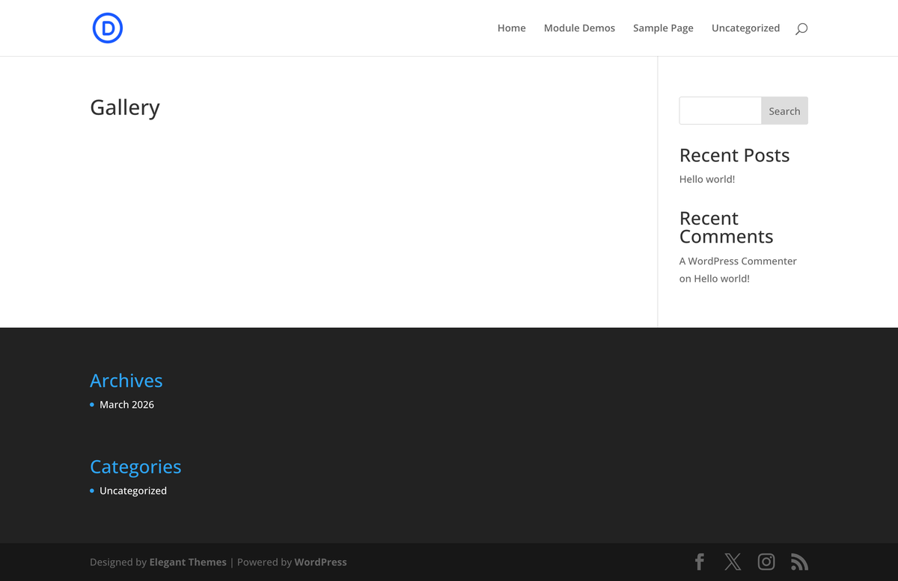
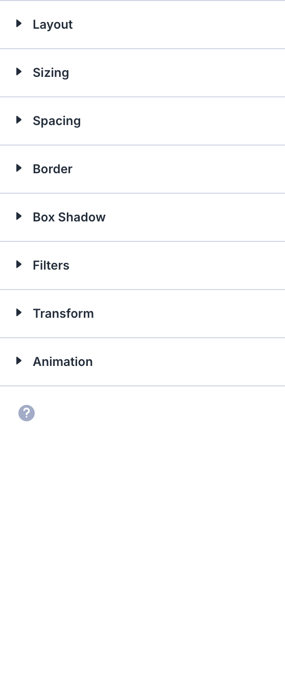

# Gallery

The Gallery module is a Divi 5 content element used in the Visual Builder.

## Overview

How to add, configure and customize the Divi gallery module.

The Divi Gallery Module allows you to display a gallery of images anywhere on your website. You can use it to show a home tour, display your products, show off your work, and more.

View A Live Demo Of This Module

<!-- TODO: Replace with proper screenshot -->
<!-- { loading=lazy } -->
<!-- *The Gallery module as it appears in the Divi 5 Visual Builder.* -->

## Settings & Options

### Content Tab

<!-- TODO: Verify all Content tab settings for Gallery module -->

| Setting | Type | Default | Description |
|---------|------|---------|-------------|
| Image Order– Choose the order of your images | text | — | default or random. |
| Layout– Choose the layout for your gallery | text | — | grid or slider. |

<!-- TODO: Replace with proper screenshot -->
<!-- { loading=lazy } -->

### Design Tab

<!-- TODO: Verify all Design tab settings for Gallery module -->

| Setting | Type | Default | Description |
|---------|------|---------|-------------|
| <!-- TODO: Document Design settings --> | | | |

<!-- TODO: Replace with proper screenshot -->
<!-- { loading=lazy } -->

### Advanced Tab

<!-- TODO: Verify all Advanced tab settings for Gallery module -->

| Setting | Type | Default | Description |
|---------|------|---------|-------------|
| CSS ID | text | — | Assign a unique CSS ID to the module |
| CSS Class | text | — | Assign CSS classes to the module |
| Custom CSS | code | — | Add custom CSS directly to the module's elements |
| Visibility | toggle | Show on all devices | Control device visibility (desktop, tablet, phone) |
| Transition | select | Default | Animation transition style for hover effects |

## Code Examples

### Custom CSS

```css
/* Style the Gallery module */
.et_pb_gallery {
    /* Add your custom styles */
    margin-bottom: 30px;
}

/* Responsive adjustments */
@media (max-width: 980px) {
    .et_pb_gallery {
        padding: 20px;
    }
}
```

### PHP Hooks

```php
/* Filter the Gallery module output */
add_filter('et_module_shortcode_output', function($output, $render_slug) {
    if ('et_pb_et_pb_gallery' !== $render_slug) {
        return $output;
    }
    // Modify $output as needed
    return $output;
}, 10, 2);
```

## Common Patterns

<!-- TODO: Add 2-3 real-world usage patterns with screenshots -->

1. **Basic Usage** — Add the Gallery module to any row in the Visual Builder and configure its settings.

2. **Styled Variation** — Use the Design tab to customize fonts, colors, and spacing to match your site's design system.

3. **Dynamic Content** — Use dynamic content fields to pull data from custom fields or post meta.

## Version Notes

!!! note "Divi 5 Only"
    This page documents Divi 5 behavior exclusively.

## Troubleshooting

!!! warning "Module Not Rendering"
    If the Gallery module doesn't appear on the front end, verify that:

    - The module is not inside a disabled section or row
    - Visibility settings aren't hiding it on the current device
    - Any required fields (like URLs or content) are filled in

<!-- TODO: Add module-specific troubleshooting items -->

## Related

- [Image](image.md)
- [Filterable Portfolio](filterable-portfolio.md)
- [Portfolio](portfolio.md)
