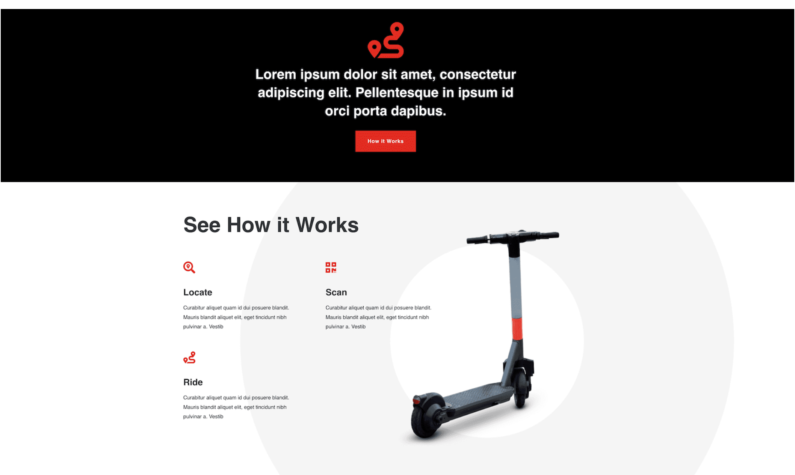

# Icon

The Icon module is a Divi 5 content element used in the Visual Builder.

## Overview

How to add, configure and customize the Divi icon module.

The Divi Icon module makes it easy to add unique icons to your website design anywhere on the page. Divi comes with hundreds of icons that you can completely customize with size and color options. You can choose from Divi’s native icon set or from hundreds more icons included in the Font Awesome icon set.

You can use the icon module to draw your visitor’s attention to a specific area on the page that’s important. Or have it call out certain features and functions your business offers. Using icons is a fun way to add a design element to your page without cluttering up the design.

{ loading=lazy }
*The Icon module as it appears in the Divi 5 Visual Builder.*

## Settings & Options

### Content Tab

<!-- TODO: Verify all Content tab settings for Icon module -->

| Setting | Type | Default | Description |
|---------|------|---------|-------------|
| Theme Releases | text | — | Divi Icon Update |

<!-- { loading=lazy } -->

### Design Tab

<!-- TODO: Verify all Design tab settings for Icon module -->

| Setting | Type | Default | Description |
|---------|------|---------|-------------|
| <!-- TODO: Document Design settings --> | | | |

<!-- { loading=lazy } -->

### Advanced Tab

<!-- TODO: Verify all Advanced tab settings for Icon module -->

| Setting | Type | Default | Description |
|---------|------|---------|-------------|
| CSS ID | text | — | Assign a unique CSS ID to the module |
| CSS Class | text | — | Assign CSS classes to the module |
| Custom CSS | code | — | Add custom CSS directly to the module's elements |
| Visibility | toggle | Show on all devices | Control device visibility (desktop, tablet, phone) |
| Transition | select | Default | Animation transition style for hover effects |

## Code Examples

### Custom CSS

```css
/* Style the Icon module */
.et_pb_icon {
    /* Add your custom styles */
    margin-bottom: 30px;
}

/* Responsive adjustments */
@media (max-width: 980px) {
    .et_pb_icon {
        padding: 20px;
    }
}
```

### PHP Hooks

```php
/* Filter the Icon module output */
add_filter('et_module_shortcode_output', function($output, $render_slug) {
    if ('et_pb_et_pb_icon' !== $render_slug) {
        return $output;
    }
    // Modify $output as needed
    return $output;
}, 10, 2);
```

## Common Patterns

<!-- TODO: Add 2-3 real-world usage patterns with screenshots -->

1. **Basic Usage** — Add the Icon module to any row in the Visual Builder and configure its settings.

2. **Styled Variation** — Use the Design tab to customize fonts, colors, and spacing to match your site's design system.

3. **Dynamic Content** — Use dynamic content fields to pull data from custom fields or post meta.

## Version Notes

!!! note "Divi 5 Only"
    This page documents Divi 5 behavior exclusively.

## Troubleshooting

!!! warning "Module Not Rendering"
    If the Icon module doesn't appear on the front end, verify that:

    - The module is not inside a disabled section or row
    - Visibility settings aren't hiding it on the current device
    - Any required fields (like URLs or content) are filled in

<!-- TODO: Add module-specific troubleshooting items -->

## Related

- [Blurb](blurb.md)
- [Button](button.md)
