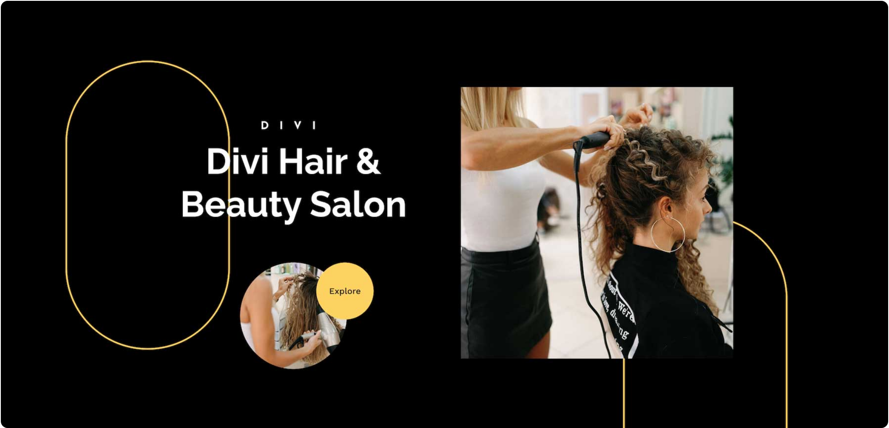

# Image

The Image module displays a single image with optional link, lightbox, and animation support.

## Overview

The Image module is one of the most frequently used content elements in Divi 5. It places a single image anywhere within a row and provides granular control over sizing, alignment, borders, shadows, filters, and entrance animations. Whether you need a simple inline photo, a linked banner, or a lightbox-enabled portfolio piece, the Image module handles it without requiring custom code.

Beyond basic display, the module integrates with the Divi 5 Visual Builder's responsive editing controls. You can set different image sizes, alignment, and spacing per device breakpoint (desktop, tablet, phone), ensuring images look sharp on every screen. The built-in CSS filter controls let you adjust hue, saturation, brightness, contrast, and more directly within the builder — no external image editor required.

The Image module also supports linking to any URL or opening the full-size image in a lightbox overlay. Combined with entrance animations and hover effects via the Design and Advanced tabs, a single Image module can serve as a hero graphic, a clickable call-to-action, or part of a curated visual grid alongside [Gallery](gallery.md) and [Blurb](blurb.md) modules.

{ loading=lazy }
*The Image module as it appears in the Divi 5 Visual Builder.*

## Settings & Options

### Content Tab

| Setting | Type | Default | Description |
|---------|------|---------|-------------|
| Image URL | upload | — | Upload or select an image from the WordPress media library. Accepts JPG, PNG, GIF, WebP, and SVG formats. |
| Image Alt Text | text | — | Alt text applied to the `` tag for accessibility and SEO. Screen readers and search engines rely on this value. |
| Image Link URL | url | — | URL the image links to when clicked. Leave empty for a non-linked image. Ignored when lightbox is enabled. |
| URL Opens | select | Same Window | Controls whether the linked URL opens in the same browser window or a new tab. Only visible when Image Link URL is set. |
| Image Alignment | select | Default | Horizontal alignment of the image within the module container — Left, Center, or Right. |
| Use Lightbox | toggle | No | When enabled, clicking the image opens the full-size version in a lightbox overlay. Overrides any link URL. |
| Admin Label | text | — | A custom label shown only in the Visual Builder interface. Useful for identifying modules when a row contains multiple Image modules. |

{ loading=lazy }
*Content tab showing image upload, link, and lightbox options.*

### Design Tab

| Setting | Type | Default | Description |
|---------|------|---------|-------------|
| Width | range | auto | Sets an explicit width for the image. Accepts px, %, vw, and other CSS units. |
| Max Width | range | 100% | Caps the image width so it does not exceed the specified value, even if the source image is larger. |
| Alignment | select | Center | Controls horizontal alignment of the entire module within its column — Left, Center, or Right. |
| Border Radius | range | 0px | Rounds the corners of the image. Use equal values on all four corners for a uniform radius, or set each corner independently. |
| Border Width | range | 0px | Thickness of the border drawn around the image. |
| Border Color | color | #333333 | Color of the image border. Only visible when Border Width is greater than 0. |
| Border Style | select | Solid | Style of the border line — Solid, Dashed, Dotted, Double, Groove, Ridge, Inset, or Outset. |
| Box Shadow | select | None | Adds a drop shadow effect behind the image. Choose from preset shadow styles or configure horizontal/vertical offset, blur, spread, and color manually. |
| CSS Filters | range | defaults | A group of filter controls that adjust the image appearance in real time — Hue Rotate (0°), Saturate (100%), Brightness (100%), Contrast (100%), Invert (0%), Sepia (0%), Opacity (100%), and Blur (0px). |
| Animation Style | select | None | Entrance animation played when the image scrolls into view — Fade, Slide, Bounce, Zoom, Flip, Fold, or Roll. Additional controls for direction, duration, delay, intensity, and repeat appear when an animation is selected. |
| Image Spacing | range | varies | Margin and padding controls around the image module. Supports per-side values and responsive overrides for desktop, tablet, and phone. |

{ loading=lazy }
*Design tab with sizing, border, shadow, filter, and animation controls.*

### Advanced Tab

| Setting | Type | Default | Description |
|---------|------|---------|-------------|
| CSS ID | text | — | Assign a unique CSS ID to the module for targeting with custom CSS or JavaScript. |
| CSS Class | text | — | Assign one or more CSS classes to the module, separated by spaces. |
| Custom CSS | code | — | Write custom CSS targeting specific elements within the module — Main Element, Image, and overlay elements. |
| Visibility | toggle | Show on all devices | Control whether the module is visible on desktop, tablet, and phone. Hiding a module removes it from the DOM on that device. |
| Transition | select | Default | Controls the CSS transition duration, delay, and easing curve applied to hover-state changes such as color shifts, transforms, and filter adjustments. |

## Code Examples

### Hover Zoom Effect

```css
/* Smooth zoom on hover with overflow hidden */
.et_pb_image {
    overflow: hidden;
    border-radius: 8px;
}

.et_pb_image img {
    transition: transform 0.4s ease;
}

.et_pb_image:hover img {
    transform: scale(1.08);
}
```

### Fixed Aspect Ratio

```css
/* Force a 16:9 aspect ratio on all images */
.et_pb_image {
    aspect-ratio: 16 / 9;
    overflow: hidden;
}

.et_pb_image img {
    width: 100%;
    height: 100%;
    object-fit: cover;
}
```

### Color Overlay on Hover

```css
/* Dark overlay with text-ready styling */
.et_pb_image {
    position: relative;
}

.et_pb_image::after {
    content: "";
    position: absolute;
    inset: 0;
    background: rgba(0, 0, 0, 0.5);
    opacity: 0;
    transition: opacity 0.3s ease;
    pointer-events: none;
}

.et_pb_image:hover::after {
    opacity: 1;
}
```

### PHP — Filter Image Module Output

```php
/* Add a custom wrapper div around every Image module */
add_filter('et_module_shortcode_output', function($output, $render_slug) {
    if ('et_pb_image' !== $render_slug) {
        return $output;
    }

    return '<div class="custom-image-wrapper">' . $output . '</div>';
}, 10, 2);
```

### Responsive Image Adjustments

```css
/* Stack images full-width on mobile, constrain on desktop */
.et_pb_image {
    max-width: 600px;
    margin-left: auto;
    margin-right: auto;
}

@media (max-width: 980px) {
    .et_pb_image {
        max-width: 100%;
        padding: 0 15px;
    }
}
```

## Common Patterns

### 1. Hero Image

A full-width image placed at the top of a page inside a fullwidth section. Set **Max Width** to `100%`, **Alignment** to `Center`, and remove all margin/padding for edge-to-edge display. Pair with a scroll-down animation (Fade or Slide Up) for visual impact on page load.

{ loading=lazy }
*Full-width hero image spanning the entire viewport width.*

### 2. Image Card with Caption

Place an Image module above a [Text module](text.md) inside a one-third or one-quarter column. Apply **Border Radius** of 8–12px and a subtle **Box Shadow** to create a card appearance. Use consistent aspect ratios across all cards in the row by applying the fixed aspect ratio CSS above with a shared CSS class.

{ loading=lazy }
*Three-column card layout with rounded images and captions.*

### 3. Lightbox Gallery Grid

Arrange multiple Image modules in a multi-column row, each with **Use Lightbox** enabled. Divi groups lightbox images within the same section, so visitors can click any image and navigate through all of them in a single lightbox slideshow. Add a hover zoom effect for interactivity.

{ loading=lazy }
*Four-column image grid with lightbox enabled for each image.*

## Version Notes

!!! note "Divi 5 Only"
    This page documents Divi 5 behavior exclusively.

## Troubleshooting

!!! warning "Image Not Displaying"
    If the Image module appears empty on the front end:

    - Verify an image is actually selected in the Content tab — the upload field should show a thumbnail preview.
    - Check that the image file still exists in the WordPress Media Library and has not been deleted.
    - Confirm the image URL is accessible (no 404). Migrated sites may have broken media paths.
    - Inspect the module's **Visibility** settings to ensure it is not hidden on the current device.
    - Clear any page caching plugin or CDN cache after uploading a new image.

!!! warning "Lightbox Not Working"
    If clicking the image does not open the lightbox overlay:

    - Confirm **Use Lightbox** is set to **Yes** in the Content tab.
    - Check that no JavaScript errors are blocking Divi's lightbox script — open the browser console (F12) and look for errors.
    - If a link URL is also set, the lightbox takes priority, but conflicting JavaScript from other plugins can interfere. Disable other lightbox or gallery plugins to test.
    - Ensure the Divi framework JS files are loading correctly. A minification or optimization plugin may be combining or deferring scripts in a way that breaks the lightbox initialization.

!!! warning "Module Not Rendering"
    If the Image module doesn't appear on the front end, verify that:

    - The module is not inside a disabled section or row
    - Visibility settings aren't hiding it on the current device
    - Any required fields (like the image source) are filled in

## Related

- [Gallery](gallery.md) — Display multiple images in a grid or slider layout
- [Blurb](blurb.md) — Combine an image or icon with a title and text
- [Fullwidth Header](fullwidth-header.md) — Full-width hero section with background image support
