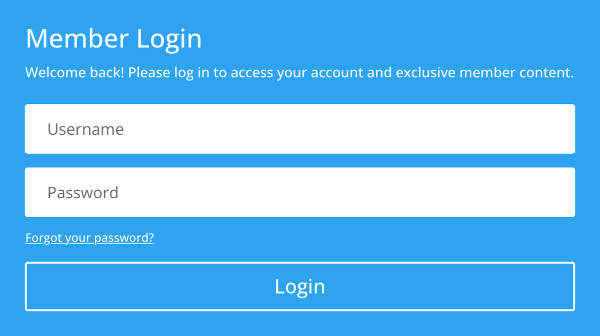

# Login

The Login module displays a WordPress login form that allows registered users to sign in directly from any page.

## Overview

The Login module provides a fully styled WordPress authentication form that you can place anywhere in your Divi 5 layout. It renders username and password fields along with a submit button, giving registered users a convenient way to log in without navigating to the default WordPress login page. This is especially valuable for membership sites, client portals, gated content areas, and any site where front-end authentication improves the user experience.

In Divi 5, the Login module includes a title and description area above the form fields, letting you provide context or instructions for visitors. You can customize the redirect URL so that users land on a specific page after a successful login, rather than defaulting to the WordPress dashboard. The module also displays a link to the password recovery page, helping users who have forgotten their credentials.

The Design tab gives you comprehensive control over the visual presentation of every element within the module — from the input field styling and button appearance to the title and body text typography. Combined with the Advanced tab's conditional display options, you can show the login form only to logged-out users and display different content to those already authenticated. This makes the Login module a practical building block for any site that requires user registration.

For additional reference, see the [official Elegant Themes documentation](https://help.elegantthemes.com/en/articles/10315833-the-login-form-module-in-divi-5).

[View A Live Demo Of This Module](https://www.16wells.dev/module-demos/login/)

{ loading=lazy }
*The Login module as it appears on the live demo.*

## Use Cases

1. **Membership Site Login** — Place the Login module on a dedicated sign-in page or in a sidebar to give members quick access to protected content, downloads, courses, or community forums without redirecting to the WordPress admin login screen.

2. **Client Portal Access** — Add the Login module to a client-facing page where customers can authenticate to view invoices, project updates, support tickets, or other private resources. Set the redirect URL to point directly to the portal dashboard after login.

3. **Gated Content Landing Page** — Combine the Login module with Divi 5 display conditions to show the form only to logged-out visitors. Once authenticated, the user sees the protected content in place of the login form, creating a seamless access experience.

## How to Add the Login Module

1. **Open the Visual Builder** — Navigate to the page where you want the login form and activate the Divi 5 Visual Builder. Click the plus icon within the section and row where the form should appear.

2. **Select the Login Module** — Search for "Login" in the module picker or browse the module list. Click to insert it into your chosen column.

3. **Configure the Settings** — Add a title and description in the Content tab to provide context for visitors. Set the redirect URL if you want users to land on a specific page after logging in. Then style the form fields, button, and text using the Design tab.

## Settings & Options

### Content Tab

The Content tab controls the text displayed above the form, the post-login redirect behavior, and general module configuration.

| Setting | Type | Description |
|---------|------|-------------|
| Text | group | Contains the title and body text fields displayed above the login form. The title serves as a heading and the body text provides instructions or context for the visitor. |
| Redirect | group | Set a custom URL where users are redirected after a successful login. If left empty, WordPress uses its default redirect behavior, which typically sends users to the admin dashboard. |
| Link | group | Configure a link URL applied to the module wrapper, along with link target (same window or new tab) settings. |
| Background | group | Apply a background color, gradient, or image to the module container. This fills the area behind the form fields and text content. |
| Loop | toggle | When used inside a dynamic layout such as a Theme Builder template, this setting controls whether the module repeats for each item in a post loop. |
| Order | select | Determines the display order of the module relative to sibling modules within the same container. |
| Meta | group | Contains the admin label field for assigning a custom name to this module instance in the Visual Builder layers panel. |

### Design Tab

The Design tab provides styling controls for the form fields, button, typography, and overall module appearance.

| Setting | Type | Description |
|---------|------|-------------|
| Fields | group | Style the username and password input fields. Control the field background color, text color, placeholder color, focus border color, and field border radius. These settings determine how the form inputs look in their default, focused, and filled states. |
| Text | group | General text styling options including text color, text alignment, and text shadow applied to the module's content area. |
| Title Text | group | Typography controls specifically for the module title — font family, font weight, font size, letter spacing, line height, text color, and text shadow. Supports responsive values per device. |
| Body Text | group | Typography controls for the description text below the title — font family, weight, size, spacing, height, color, and shadow. Also supports responsive breakpoint overrides. |
| Button | group | Customize the login button appearance. Control the button text color, background color, border width, border color, border radius, font, icon placement, and hover state styles. |
| Sizing | group | Set the width, max-width, height, and min-height of the module. Accepts CSS units like px, %, em, vw, and vh. |
| Spacing | group | Margin and padding controls for the module container. Set individual values for each side and configure responsive overrides for desktop, tablet, and phone. |
| Border | group | Apply border width, color, style, and border radius to the outer module container. |
| Box Shadow | group | Add a shadow effect behind the module with configurable offset, blur, spread, and color values. |
| Filters | group | CSS filter controls — hue rotate, saturate, brightness, contrast, invert, sepia, opacity, and blur — applied to the entire module. |
| Transform | group | CSS transform controls including scale, translate, rotate, skew, and transform origin. |
| Animation | group | Entrance animation played when the module scrolls into view. Options include fade, slide, bounce, zoom, flip, fold, and roll with configurable direction, duration, delay, and intensity. |

### Advanced Tab

The Advanced tab provides low-level HTML, CSS, and behavior controls.

| Setting | Type | Description |
|---------|------|-------------|
| Attributes | group | Set the CSS ID and CSS class for the module. The ID must be unique on the page. Multiple CSS classes can be separated by spaces. |
| CSS | group | Write custom CSS targeting specific elements within the module, such as the form wrapper, input fields, button, title, and body text. Styles are scoped to this module instance. |
| HTML | group | Add custom HTML attributes to the module wrapper element for data attributes, ARIA labels, or other accessibility enhancements. |
| Conditions | group | Set display conditions that control when the module is visible. Common conditions include logged-in status, user role, date/time ranges, and post type — particularly useful for showing the login form only to logged-out users. |
| Interactions | group | Configure click, hover, and scroll-based interactions that trigger animations or state changes on this or other page elements. |
| Visibility | toggle | Control whether the module appears on desktop, tablet, and phone. Hidden modules are removed from the page output on the excluded device types. |
| Transitions | group | Configure the CSS transition duration, delay, and easing curve for hover-state changes on the module and its child elements. |
| Position | group | Set the CSS position property (relative, absolute, fixed, sticky) and offset values for precise placement within the layout. |
| Scroll Effects | group | Apply scroll-driven animations such as parallax movement, fading, scaling, rotating, or blurring as the user scrolls past the module. |

## Code Examples

### Custom CSS — Styled Login Form

```css
/* Clean, card-style login form */
.et_pb_login {
    background: #ffffff;
    border-radius: 12px;
    box-shadow: 0 4px 20px rgba(0, 0, 0, 0.08);
    padding: 40px;
    max-width: 480px;
    margin: 0 auto;
}

.et_pb_login input[type="text"],
.et_pb_login input[type="password"] {
    border: 1px solid #e0e0e0;
    border-radius: 6px;
    padding: 12px 16px;
    font-size: 16px;
    transition: border-color 0.2s ease;
}

.et_pb_login input:focus {
    border-color: #2ea3f2;
    outline: none;
}
```

### Custom CSS — Full-Width Button

```css
/* Make the login button span the full form width */
.et_pb_login .et_pb_button {
    width: 100%;
    text-align: center;
    padding: 14px 24px;
    border-radius: 6px;
    font-weight: 600;
}
```

### Custom CSS — Responsive Layout

```css
/* Stack login form nicely on mobile */
@media (max-width: 767px) {
    .et_pb_login {
        padding: 24px 16px;
    }

    .et_pb_login h2 {
        font-size: 22px;
    }

    .et_pb_login input[type="text"],
    .et_pb_login input[type="password"] {
        font-size: 16px; /* Prevents iOS zoom on focus */
    }
}
```

### PHP — Customize Login Redirect

```php
/* Redirect users to a custom page after logging in via the Divi Login module */
add_filter('login_redirect', function($redirect_to, $requested_redirect_to, $user) {
    if (!is_wp_error($user) && isset($user->roles)) {
        if (in_array('subscriber', $user->roles)) {
            return home_url('/members/dashboard/');
        }
    }
    return $redirect_to;
}, 10, 3);
```

### PHP — Filter Login Module Output

```php
/* Add a custom message above the login form */
add_filter('et_module_shortcode_output', function($output, $render_slug) {
    if ('et_pb_login' !== $render_slug) {
        return $output;
    }

    $notice = '<div class="login-notice">Members: Log in to access exclusive content.</div>';
    return $notice . $output;
}, 10, 2);
```

## Common Patterns

### 1. Centered Login Card

Place the Login module in a single-column row with a maximum width of 480px and center alignment. Apply a white background, border radius, and box shadow to create a floating card effect. Add a title like "Member Login" and a short description. This pattern is ideal for dedicated login pages.

### 2. Sidebar Login Widget

Add the Login module to a narrow sidebar column (one-quarter or one-third width) alongside your main page content. Use compact spacing and a smaller title font size so the form fits neatly within the sidebar without dominating the layout. Set a display condition to hide the module for logged-in users.

### 3. Conditional Login and Welcome

Use two modules in the same row: a Login module with a display condition set to "User is not logged in" and a Text module with a welcome message conditioned to "User is logged in." This creates a seamless experience where visitors see the login form and authenticated users see personalized content in its place.

## Saving Your Work

After configuring the Login module, click the green checkmark button at the bottom of the settings panel to apply your changes. Save the page using the save button in the Visual Builder toolbar or press Ctrl+S (Cmd+S on Mac). Test the login form on the front end by logging out and attempting to sign in with valid credentials.

## Version Notes

!!! note "Divi 5 Only"
    This page documents Divi 5 behavior exclusively.

## Troubleshooting

!!! warning "Login Form Not Submitting"
    If clicking the login button does not authenticate the user or the page simply reloads:

    - Check that the username and password are correct by testing them on the standard WordPress login page at `/wp-login.php`.
    - Verify that no security plugin is blocking the login request or requiring additional fields like a CAPTCHA.
    - Inspect the browser console for JavaScript errors that may be preventing the form submission.
    - If using a custom redirect URL, confirm the URL is valid and accessible.

!!! warning "Login Form Visible to Logged-In Users"
    If authenticated users can still see the login form:

    - Add a display condition in the Advanced tab to show the module only when the user is not logged in.
    - Check that browser caching or a page cache plugin is not serving a stale version of the page. Full-page caching can interfere with conditional display logic since it serves the same HTML to all visitors.

!!! warning "Styling Not Applying to Form Fields"
    If your custom CSS or Design tab changes do not affect the input fields or button:

    - Use more specific CSS selectors to override default styles — for example, `.et_pb_login input[type="text"]` instead of just `input`.
    - Check for conflicting styles from your WordPress theme or other plugins using the browser inspector.
    - Ensure custom CSS is placed in the correct element target within the Advanced tab CSS fields.

## Related

- [Contact Form](contact-form.md) — Collect visitor inquiries with a customizable form
- [Email Optin](email-optin.md) — Capture email subscribers with an integrated signup form
