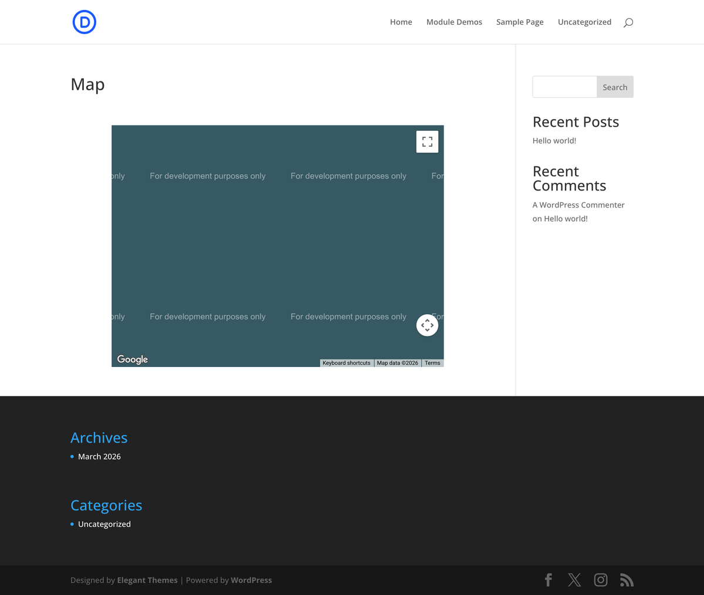
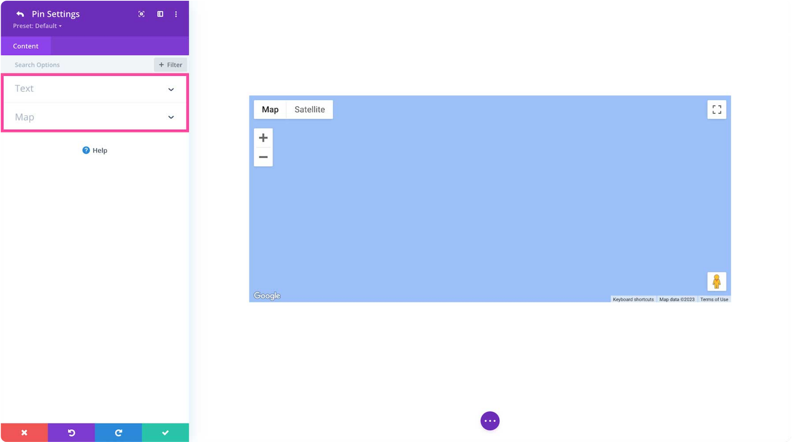

# Map

The Map module is a Divi 5 content element used in the Visual Builder.

## Overview

How to add, configure and customize the Divi map module.

The Divi Map Module is an easy way to display an interactive Google map on your website. You can specify multiple pin locations and is a visual and useful way to share your business’s location on a contact page or an about page.

In this documentation we’ll go over how to add the map module to your page and all of the settings and design customizations available within the Divi Map Module.

<!-- TODO: Replace with proper screenshot -->
<!-- { loading=lazy } -->
<!-- *The Map module as it appears in the Divi 5 Visual Builder.* -->

## Settings & Options

### Content Tab

<!-- TODO: Verify all Content tab settings for Map module -->

| Setting | Type | Default | Description |
|---------|------|---------|-------------|
| <!-- TODO: Document Content settings --> | | | |

<!-- TODO: Replace with proper screenshot -->
<!-- { loading=lazy } -->

### Design Tab

<!-- TODO: Verify all Design tab settings for Map module -->

| Setting | Type | Default | Description |
|---------|------|---------|-------------|
| <!-- TODO: Document Design settings --> | | | |

<!-- TODO: Replace with proper screenshot -->
<!-- { loading=lazy } -->

### Advanced Tab

<!-- TODO: Verify all Advanced tab settings for Map module -->

| Setting | Type | Default | Description |
|---------|------|---------|-------------|
| CSS ID | text | — | Assign a unique CSS ID to the module |
| CSS Class | text | — | Assign CSS classes to the module |
| Custom CSS | code | — | Add custom CSS directly to the module's elements |
| Visibility | toggle | Show on all devices | Control device visibility (desktop, tablet, phone) |
| Transition | select | Default | Animation transition style for hover effects |

## Code Examples

### Custom CSS

```css
/* Style the Map module */
.et_pb_map {
    /* Add your custom styles */
    margin-bottom: 30px;
}

/* Responsive adjustments */
@media (max-width: 980px) {
    .et_pb_map {
        padding: 20px;
    }
}
```

### PHP Hooks

```php
/* Filter the Map module output */
add_filter('et_module_shortcode_output', function($output, $render_slug) {
    if ('et_pb_et_pb_map' !== $render_slug) {
        return $output;
    }
    // Modify $output as needed
    return $output;
}, 10, 2);
```

## Common Patterns

<!-- TODO: Add 2-3 real-world usage patterns with screenshots -->

1. **Basic Usage** — Add the Map module to any row in the Visual Builder and configure its settings.

2. **Styled Variation** — Use the Design tab to customize fonts, colors, and spacing to match your site's design system.

3. **Dynamic Content** — Use dynamic content fields to pull data from custom fields or post meta.

## Version Notes

!!! note "Divi 5 Only"
    This page documents Divi 5 behavior exclusively.

## Troubleshooting

!!! warning "Module Not Rendering"
    If the Map module doesn't appear on the front end, verify that:

    - The module is not inside a disabled section or row
    - Visibility settings aren't hiding it on the current device
    - Any required fields (like URLs or content) are filled in

<!-- TODO: Add module-specific troubleshooting items -->

## Related

- [Fullwidth Map](fullwidth-map.md)
