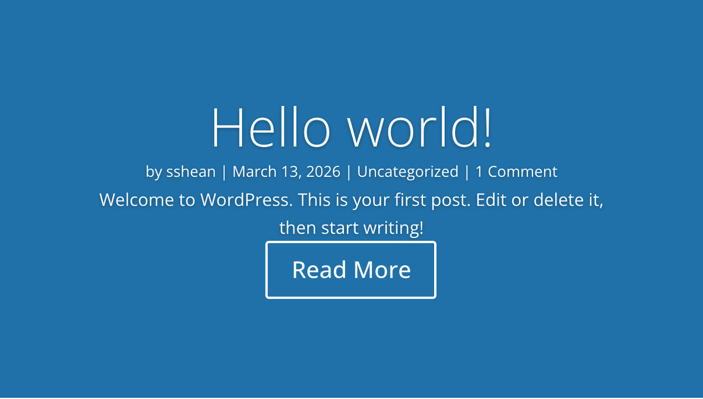

# Post Slider Module

The Post Slider module automatically generates slides from WordPress posts, displaying featured images, titles, excerpts, and meta information in a full-width sliding format.

## Overview

The Post Slider module transforms your WordPress posts into an interactive slideshow. Rather than manually creating individual slides, this module queries your post library and generates slides dynamically from published content. Each slide can display the post's featured image as a background, along with the title, excerpt, author, date, and a configurable read-more button that links to the full post.

Navigation is handled through arrow controls and optional bullet-style dot indicators, and the slider can be set to auto-advance through slides at a defined interval or to wait for manual interaction. Featured images can be placed as full slide backgrounds or positioned alongside the text content, giving you flexibility in how visual and textual elements relate to each other.

This module is particularly effective for hero sections on blog landing pages, homepage spotlights for recent articles, and featured content carousels within editorial layouts. It combines the visual impact of a slider with the automation of a dynamic post query, so new content appears in the slider as soon as it is published. For additional reference, see the [official Elegant Themes documentation](https://help.elegantthemes.com/en/articles/10358882-the-post-slider-module-in-divi-5).

[View A Live Demo Of This Module](https://www.16wells.dev/module-demos/post-slider/)

{ loading=lazy }
*The Post Slider module displaying a blog post with featured image background, title, excerpt, and navigation controls.*

## Use Cases

1. **Blog Hero Slider** — Feature your most recent or most important posts in a large, eye-catching slider at the top of your blog page. Enable auto-advance and bullet navigation so visitors can scan through featured content before scrolling down to the full post grid.
2. **Homepage Content Spotlight** — Place the Post Slider in a fullwidth section on your homepage to highlight recent articles, announcements, or news items. Limit the post count to 3-5 and configure the read-more button to drive traffic to individual posts.
3. **Category Feature Section** — Filter the slider to a specific category to create a focused content carousel within a topic-specific landing page, showcasing the latest articles from that category with their featured images.

## How to Add the Post Slider Module

1. Open the Visual Builder on the page where you want the slider to appear.
2. Click the gray **+** icon to add a new module to a row.
3. Search for "Post Slider" in the module picker or find it in the Content Elements category, then click to insert it.

## Settings & Options

The Post Slider module settings are organized across three tabs: Content, Design, and Advanced.

### Content Tab

The Content tab controls which posts appear in the slider, what elements are shown on each slide, and how the featured image is handled.

| Setting | Type | Description |
|---------|------|-------------|
| Number of Posts | number | The maximum number of posts to include in the slider rotation. Each post becomes one slide. |
| Post Categories | multi-select | Filter the slider to display posts from specific categories. When no categories are selected, all published posts are included. |
| Read More Button Text | text | Customize the label on the call-to-action button that links to the full post. Defaults to "Read More." Set to empty to remove the button text. |
| Sorting Method | select | Control the order in which posts appear in the slider. Options typically include date descending, date ascending, and other WordPress query ordering methods. |
| Navigation Arrows | toggle | Show or hide the left and right arrow controls that allow visitors to manually advance between slides. |
| Bullet Navigation | toggle | Show or hide the dot indicators below the slider that represent each slide and allow direct navigation to a specific slide. |
| Read More Button | toggle | Enable or disable the read-more button on each slide. When disabled, the button is removed from the slide layout entirely. |
| Post Meta | toggle | Show or hide the metadata line (author, date, categories) on each slide. Disabling this creates a cleaner slide with just the title and excerpt. |
| Featured Image | toggle | Control whether the post's featured image is used as the slide background or displayed alongside the content. |
| Featured Image Placement | select | Determine how the featured image is positioned within each slide: as a full background behind the text overlay, or placed to the side of the slide content. |
| Link | url | Make the entire Post Slider module wrapper clickable, directing users to a specified page, section, or external URL. |
| Background | background controls | Set a fallback background color, gradient, image, or video behind the slider container. This is visible when individual slides lack featured images. |
| Order | order controls | Define the display order of the Post Slider module within Flexbox and CSS Grid parent layouts. |
| Meta | admin label | Assign a custom admin label to the module for easier identification in the Visual Builder layer panel. |

### Design Tab

The Design tab provides full visual control over the slider's overlay, navigation elements, typography, button styling, and standard module properties.

| Setting | Type | Description |
|---------|------|-------------|
| Overlay | overlay controls | Configure the background overlay that appears on top of featured images. Set the overlay color and opacity to ensure text remains readable against varied image backgrounds. |
| Navigation | navigation styling | Customize the appearance of slider arrow controls and dot indicators, including color, size, and hover states. |
| Image | image styling | Style the featured images with border radius, sizing, and alignment controls. Applies when images are displayed alongside content rather than as backgrounds. |
| Text | text styling | Set general text properties that cascade to all text elements on each slide, including font family, weight, style, alignment, color, and line height. |
| Title Text | text styling | Override the general text styles specifically for post titles on each slide. Includes full typography controls: font family, weight, size, letter spacing, line height, color, and text shadow. |
| Body Text | text styling | Style the post excerpt or content text independently from the title. Control font, size, color, and spacing for the body copy area of each slide. |
| Meta Text | text styling | Style the metadata line (author, date, categories) with separate typography settings. Typically rendered smaller and lighter than the title and body text. |
| Button | button styling | Configure the read-more button appearance including background color, text color, border, border radius, font, size, padding, and hover state styles. |
| Sizing | dimensions | Set the module's width, max-width, min-height, and height. The min-height setting is particularly important for controlling the slider's visual prominence on the page. |
| Spacing | margin/padding | Define margin and padding values for the module and its internal slide content area. Supports responsive values per breakpoint (desktop, tablet, phone). |
| Border | border controls | Add borders to the module container. Configure width, color, style, and border radius for rounded corners. |
| Box Shadow | shadow controls | Apply box shadow effects with customizable horizontal/vertical offset, blur radius, spread, color, and position (outer or inner). |
| Filters | image filters | Apply CSS filter effects such as brightness, contrast, saturation, hue rotation, blur, invert, sepia, and opacity to the module. Includes blend mode selection. |
| Transform | transform controls | Apply CSS transforms including scale, translate, rotate, and skew. Set the transform origin point for precise positioning. |
| Animation | animation select | Choose an entrance animation (fade, slide, bounce, zoom, flip, fold, roll) with configurable duration, delay, intensity, and direction. |

### Advanced Tab

The Advanced tab provides developer-oriented controls for custom attributes, conditional display logic, and scroll-driven effects.

| Setting | Type | Description |
|---------|------|-------------|
| Attributes | text fields | Assign a CSS ID and CSS classes to the module for targeting with custom styles or JavaScript. Add custom HTML attributes. |
| CSS | code editor | Write custom CSS that applies directly to specific elements within the module (slider container, slide, title, meta, content, button, arrows, dots, image, etc.). |
| HTML | tag select | Choose a semantic HTML tag for the module's wrapper element, improving accessibility and SEO structure. |
| Conditions | condition builder | Set display conditions so the module only appears based on rules such as user role, page type, date range, or custom logic. |
| Interactions | interaction builder | Define hover, click, or scroll-triggered interactions that affect this module or other elements on the page. |
| Visibility | device toggles | Show or hide the module on desktop, tablet, and/or phone. Hidden modules are not rendered in the page source for that device. |
| Transitions | transition controls | Configure CSS transition properties (duration, easing function, delay) for smooth hover state changes on module elements. |
| Position | position controls | Set the CSS position property (relative, absolute, fixed, sticky) and offset values (top, right, bottom, left, z-index). |
| Scroll Effects | scroll controls | Apply scroll-driven effects such as parallax, fade, scale, rotate, blur, or horizontal movement as the user scrolls past the module. |

## Code Examples

### Custom CSS

```css
/* Dark overlay for better text readability */
.et_pb_post_slider .et_pb_slide_overlay {
    background: linear-gradient(
        to bottom,
        rgba(0, 0, 0, 0.2) 0%,
        rgba(0, 0, 0, 0.7) 100%
    );
}

/* Style the slide title */
.et_pb_post_slider .et_pb_slide_description .et_pb_slide_title {
    font-weight: 700;
    text-shadow: 0 2px 4px rgba(0, 0, 0, 0.3);
}

/* Customize the read more button */
.et_pb_post_slider .et_pb_slide_description .et_pb_more_button {
    background: #ffffff !important;
    color: #333333 !important;
    border-radius: 50px;
    padding: 12px 28px;
    font-size: 0.9rem;
    letter-spacing: 0.05em;
    text-transform: uppercase;
}
.et_pb_post_slider .et_pb_slide_description .et_pb_more_button:hover {
    background: var(--et-global-color-primary) !important;
    color: #ffffff !important;
}

/* Reduce meta font size */
.et_pb_post_slider .et_pb_slide_description .post-meta {
    font-size: 0.85rem;
    opacity: 0.8;
}

/* Responsive: reduce padding on mobile */
@media (max-width: 980px) {
    .et_pb_post_slider .et_pb_slide_description {
        padding: 30px 20px;
    }
}
```

### PHP Hooks

```php
/**
 * Filter the Post Slider module output to add a custom class.
 */
add_filter( 'et_module_shortcode_output', function( $output, $render_slug ) {
    if ( 'et_pb_post_slider' !== $render_slug ) {
        return $output;
    }
    $output = str_replace(
        'class="et_pb_post_slider',
        'class="et_pb_post_slider my-custom-slider',
        $output
    );
    return $output;
}, 10, 2 );

/**
 * Exclude sticky posts from the Post Slider query.
 */
function my_post_slider_exclude_sticky( $args ) {
    $args['ignore_sticky_posts'] = true;
    return $args;
}
add_filter( 'et_pb_post_slider_query_args', 'my_post_slider_exclude_sticky', 10, 1 );
```

## Common Patterns

1. **Full-Screen Hero Slider** — Place the Post Slider in a fullwidth section at the top of your homepage. Set the min-height to 80vh or higher in the Sizing settings, enable the featured image as a background, and apply a dark overlay to ensure white text remains readable. Enable both arrow and bullet navigation for maximum user control.

2. **Compact Featured Posts Bar** — Use the Post Slider with a reduced min-height (250-300px) and limited post count (3-4) to create a compact content carousel above the main blog grid. Disable the post meta and body text to show only titles and read-more buttons, creating a teaser that encourages visitors to click through.

3. **Category News Ticker** — Filter the slider to a single news or announcements category, enable auto-advance with a short interval, and position it within a standard-width row. Style the slides with a solid background color instead of featured images for a clean, editorial appearance that fits alongside other content modules.

## Saving Your Work

After configuring the Post Slider module:

- **Save changes** — Click the purple **Save** button at the bottom of the Visual Builder, or press `Ctrl+S` (Windows) / `Cmd+S` (Mac).
- **Exit the builder** — Click the **X** button or use `Ctrl+Shift+E` to return to the WordPress dashboard.

## Version Notes

!!! note "Divi 5 Only"
    This page documents Divi 5 behavior exclusively. The Post Slider module in Divi 5 features updated transition handling and improved responsive behavior compared to earlier versions. Slide markup and class names may differ from Divi 4.

## Troubleshooting

!!! warning "Slider Shows No Slides"
    If the Post Slider appears blank, verify that: (1) you have published posts with featured images assigned, (2) the category filter is not excluding all available posts, and (3) the Number of Posts setting is greater than zero. Posts without featured images may appear as blank slides unless a fallback background is configured.

!!! warning "Text Not Readable Over Images"
    When featured images are used as slide backgrounds, light-colored images can make white text difficult to read. Use the Overlay settings in the Design tab to add a semi-transparent dark overlay. Alternatively, add a text shadow to the title and body text for improved contrast.

!!! tip "Slider Height Inconsistent Across Slides"
    If slides have varying heights, set a fixed min-height in the Sizing settings to enforce a consistent slider size. This prevents layout shifts as the slider transitions between slides with different content lengths.

## Related

- [Slider Module](slider.md) — Create manual slides with custom content rather than pulling from posts
- [Blog Module](blog.md) — Display posts in static grid or list layouts without the slider format
- [Fullwidth Slider Module](fullwidth-slider.md) — Full-width manual slider for hero sections and banners
