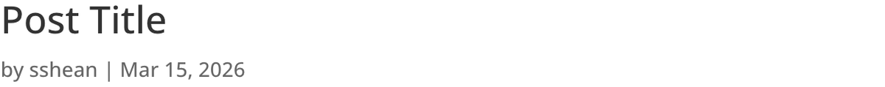

# Post Title Module

The Post Title module displays a post's title, publication metadata, and featured image with full styling control, designed primarily for use in Theme Builder templates.

## Overview

The Post Title module gives you precise control over how the title area of a blog post, page, or custom post type is presented. Instead of relying on your theme's default title output, this module lets you configure exactly which elements appear (title, author, date, comment count, featured image) and how they are styled. Each element can be toggled independently, so you can build anything from a minimal title-only header to a rich post header with full metadata and a prominent featured image.

This module is most commonly used within Divi Theme Builder templates, where it replaces the default post title rendering with a customizable version. When placed in a post body template, it dynamically pulls the title, meta, and featured image from whichever post is being viewed. This makes it essential for building consistent, branded post layouts across your entire site.

Beyond blog posts, the Post Title module works with any post type that has a title and featured image, including pages, projects, products, and custom post types. It integrates with the Divi loop system, allowing it to function within repeating content structures as well. For additional reference, see the [official Elegant Themes documentation](https://help.elegantthemes.com/en/articles/10364058-the-post-title-module-in-divi-5).

[View A Live Demo Of This Module](https://www.16wells.dev/module-demos/post-title/)

{ loading=lazy }
*The Post Title module displaying a post's title, metadata, and featured image in a Theme Builder template.*

## Use Cases

1. **Custom Blog Post Header** — Place the Post Title module at the top of a Theme Builder post body template to create a branded, consistent header for every blog post. Enable the title, author, date, and featured image to give readers full context at a glance.
2. **Minimal Page Title** — Use the module on page templates with only the title enabled and all meta elements disabled. Style the title with a large font size and custom color to create a clean, prominent page heading that matches your design system.
3. **Portfolio Project Header** — Apply the module to a custom project post type template, showing the title and featured image while hiding the date and comment count. This creates a visually focused header appropriate for case studies and portfolio pieces.

## How to Add the Post Title Module

1. Open the Theme Builder or Visual Builder on the template or page where you want the post title to appear.
2. Click the gray **+** icon to add a new module to a row.
3. Search for "Post Title" in the module picker or find it in the Content Elements category, then click to insert it.

## Settings & Options

The Post Title module settings are organized across three tabs: Content, Design, and Advanced.

### Content Tab

The Content tab controls which post elements are visible, how the module links, and whether it participates in loop-based layouts.

| Setting | Type | Description |
|---------|------|-------------|
| Show Title | toggle | Display or hide the post title. When enabled, the title is pulled dynamically from the current post. This is the primary element of the module. |
| Show Meta | toggle | Display or hide the metadata line below the title. This is a master toggle that controls the visibility of the entire meta section. |
| Show Author | toggle | Display or hide the post author's name within the metadata line. Only visible when Show Meta is also enabled. |
| Show Publish Date | toggle | Display or hide the publication date within the metadata line. Only visible when Show Meta is enabled. |
| Show Comments Count | toggle | Display or hide the number of comments associated with the post. Only visible when Show Meta is enabled. |
| Show Featured Image | toggle | Display or hide the post's featured image within the module. The image typically appears above or below the title and meta area depending on the layout. |
| Link | url | Make the entire Post Title module wrapper clickable, directing users to a specified page, section, or external URL. Configure whether the link opens in the same window or a new tab. |
| Background | background controls | Set a background color, gradient, image, or video behind the entire Post Title module container. Supports multi-layered backgrounds with blend modes. |
| Loop | loop toggle | Enable the loop builder to use this module within repeating content structures. When enabled, the module dynamically sources its content from the current item in the loop. |
| Order | order controls | Define the display order of the Post Title module within Flexbox and CSS Grid parent layouts. Useful when the visual order should differ from the DOM order. |
| Meta | admin label | Assign a custom admin label to the module for easier identification in the Visual Builder layer panel. Force visibility in the builder interface. |

### Design Tab

The Design tab provides visual control over the typography, spacing, and standard styling options for the post title and its associated elements.

| Setting | Type | Description |
|---------|------|-------------|
| Text | text styling | Set general text properties that cascade to all text elements within the module, including font family, weight, style, alignment, color, and line height. |
| Title Text | text styling | Override the general text styles specifically for the post title. Includes full typography controls: font family, weight, size, letter spacing, line height, color, and text shadow. Supports separate settings for hover states. |
| Meta Text | text styling | Style the metadata line (author, date, comment count) independently from the title. Typically set to a smaller size and lighter color to establish visual hierarchy. |
| Sizing | dimensions | Set the module's width, max-width, min-height, and height. Control how the module fills its container within the template layout. |
| Spacing | margin/padding | Define margin and padding values for the module and its internal elements. Supports responsive values per breakpoint (desktop, tablet, phone). |
| Border | border controls | Add borders to the module container or individual elements. Configure width, color, style, and border radius for rounded corners. |
| Box Shadow | shadow controls | Apply box shadow effects with customizable horizontal/vertical offset, blur radius, spread, color, and position (outer or inner). |
| Filters | image filters | Apply CSS filter effects such as brightness, contrast, saturation, hue rotation, blur, invert, sepia, and opacity. Particularly useful for styling the featured image. Includes blend mode selection. |
| Transform | transform controls | Apply CSS transforms including scale, translate, rotate, and skew. Set the transform origin point for precise positioning of effects. |
| Animation | animation select | Choose an entrance animation (fade, slide, bounce, zoom, flip, fold, roll) with configurable duration, delay, intensity, and direction. |

### Advanced Tab

The Advanced tab provides developer-oriented controls for custom attributes, conditional display logic, and scroll-driven effects.

| Setting | Type | Description |
|---------|------|-------------|
| Attributes | text fields | Assign a CSS ID and CSS classes to the module for targeting with custom styles or JavaScript. Add custom HTML attributes. |
| CSS | code editor | Write custom CSS that applies directly to specific elements within the module (container, title, meta, featured image, author, date, comments count, etc.). |
| HTML | tag select | Choose a semantic HTML tag for the module's wrapper element, improving accessibility and SEO structure. |
| Conditions | condition builder | Set display conditions so the module only appears based on rules such as user role, page type, date range, or custom logic. |
| Interactions | interaction builder | Define hover, click, or scroll-triggered interactions that affect this module or other elements on the page. |
| Visibility | device toggles | Show or hide the module on desktop, tablet, and/or phone. Hidden modules are not rendered in the page source for that device. |
| Transitions | transition controls | Configure CSS transition properties (duration, easing function, delay) for smooth hover state changes. |
| Position | position controls | Set the CSS position property (relative, absolute, fixed, sticky) and offset values (top, right, bottom, left, z-index). |
| Scroll Effects | scroll controls | Apply scroll-driven effects such as parallax, fade, scale, rotate, blur, or horizontal movement as the user scrolls past the module. |

## Code Examples

### Custom CSS

```css
/* Large, bold post title with underline accent */
.et_pb_post_title .et_pb_title_container h1.entry-title {
    font-size: 2.5rem;
    font-weight: 800;
    line-height: 1.2;
    padding-bottom: 1rem;
    border-bottom: 3px solid var(--et-global-color-primary);
    margin-bottom: 1rem;
}

/* Style the meta line with muted color and spacing */
.et_pb_post_title .et_pb_title_container .et_pb_title_meta_container {
    font-size: 0.85rem;
    color: #888888;
    letter-spacing: 0.02em;
}

/* Add spacing between meta items */
.et_pb_post_title .et_pb_title_meta_container span {
    margin-right: 1rem;
}

/* Style the featured image */
.et_pb_post_title .et_pb_title_featured_container img {
    border-radius: 8px;
    margin-top: 1.5rem;
}

/* Responsive adjustments */
@media (max-width: 980px) {
    .et_pb_post_title .et_pb_title_container h1.entry-title {
        font-size: 1.75rem;
    }
}
```

### PHP Hooks

```php
/**
 * Filter the Post Title module output to wrap the title in a custom element.
 */
add_filter( 'et_module_shortcode_output', function( $output, $render_slug ) {
    if ( 'et_pb_post_title' !== $render_slug ) {
        return $output;
    }
    $output = str_replace(
        'class="et_pb_post_title',
        'class="et_pb_post_title my-custom-post-title',
        $output
    );
    return $output;
}, 10, 2 );

/**
 * Add reading time estimate after post title meta.
 */
function my_add_reading_time_to_post_title() {
    global $post;
    if ( ! $post ) return;

    $content    = get_post_field( 'post_content', $post->ID );
    $word_count = str_word_count( strip_tags( $content ) );
    $minutes    = max( 1, ceil( $word_count / 250 ) );

    echo '<span class="reading-time">' . $minutes . ' min read</span>';
}
add_action( 'et_pb_post_title_after_meta', 'my_add_reading_time_to_post_title' );
```

## Common Patterns

1. **Full-Width Post Header with Featured Image** — Place the Post Title module in a fullwidth section at the top of a Theme Builder post body template. Enable all elements (title, meta, featured image) and use a dark background with light text. Apply the featured image as the module background and add an overlay via the Background settings to create a dramatic hero-style post header.

2. **Minimal Title and Date** — Enable only the title and publish date, hiding the author, comment count, and featured image. Style the date in a small, muted font below the title. This pattern works well for corporate blogs and documentation sites where a clean, understated header is preferred.

3. **Sticky Post Title Bar** — Use the Position settings in the Advanced tab to set the module to "sticky" positioning. Combine this with a solid background color and reduced padding to create a post title that stays visible at the top of the viewport as the reader scrolls through the article. Set a high z-index to ensure it remains above other content.

## Saving Your Work

After configuring the Post Title module:

- **Save changes** — Click the purple **Save** button at the bottom of the Visual Builder, or press `Ctrl+S` (Windows) / `Cmd+S` (Mac).
- **Exit the builder** — Click the **X** button or use `Ctrl+Shift+E` to return to the WordPress dashboard.

## Version Notes

!!! note "Divi 5 Only"
    This page documents Divi 5 behavior exclusively. The Post Title module in Divi 5 includes loop integration and updated markup compared to earlier versions. Class names and DOM structure may differ from Divi 4.

## Troubleshooting

!!! warning "Title Showing Placeholder Text in Builder"
    When editing a Theme Builder template, the Post Title module displays placeholder content because there is no specific post context. This is expected behavior. Save the template and preview an actual post to see the real title, meta, and featured image pulled from that post's data.

!!! warning "Featured Image Not Displaying"
    If the featured image does not appear despite being enabled, verify that: (1) the post being viewed has a featured image assigned in the WordPress editor, (2) the Show Featured Image toggle is enabled in the Content tab, and (3) no CSS or condition is hiding the image element. Also check that image dimensions are not set to zero in the Design tab.

!!! tip "Meta Elements Not Appearing"
    The individual meta toggles (Show Author, Show Publish Date, Show Comments Count) only take effect when the master Show Meta toggle is also enabled. If individual meta items are turned on but nothing appears, check that Show Meta is set to "Yes" in the Content tab.

## Related

- [Post Navigation Module](post-navigation.md) — Add previous/next post links for sequential browsing
- [Post Slider Module](post-slider.md) — Display posts in a sliding carousel format
- [Comments Module](comments.md) — Render the comment form and comment list for posts
