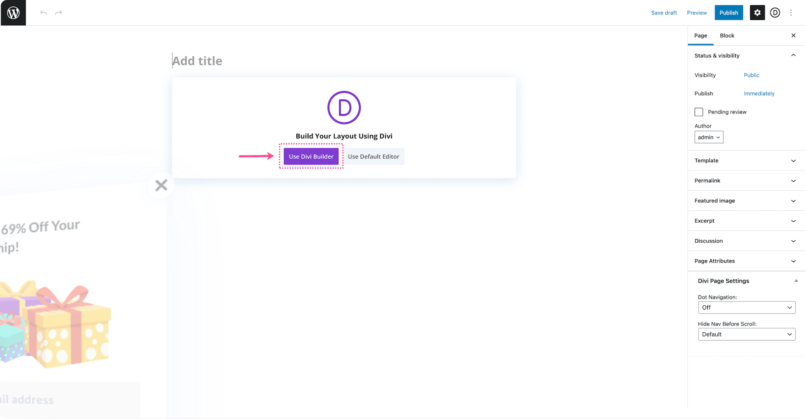
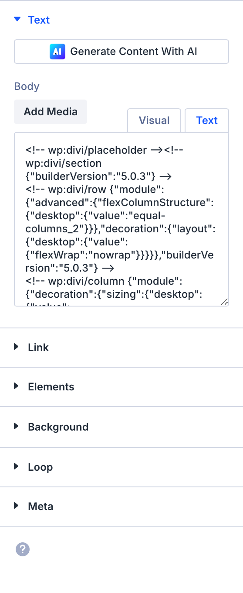

# Pricing Table

The Pricing Table module is a Divi 5 content element used in the Visual Builder.

## Overview

How to add, configure and customize the Divi pricing table module.

The Divi Pricing Tables Module is an eye-catching way to display pricing for services, packages, and subscriptions on your website. You can create as many tables as you want and can style them individually or set module global styles so they all look consistent. Each pricing table has options for a title, subtitle, currency, frequency, price, feature list, and a call to action button. You can even choose a pricing table to be featured in order to help your best offer or most popular service stand out in order to increase conversions.

View A Live Demo Of This Module

<!-- TODO: Replace with proper screenshot -->
<!-- { loading=lazy } -->
<!-- *The Pricing Table module as it appears in the Divi 5 Visual Builder.* -->

## Settings & Options

### Content Tab

<!-- TODO: Verify all Content tab settings for Pricing Table module -->

| Setting | Type | Default | Description |
|---------|------|---------|-------------|
| <!-- TODO: Document Content settings --> | | | |

<!-- { loading=lazy } -->

### Design Tab

<!-- TODO: Verify all Design tab settings for Pricing Table module -->

| Setting | Type | Default | Description |
|---------|------|---------|-------------|
| <!-- TODO: Document Design settings --> | | | |

<!-- { loading=lazy } -->

### Advanced Tab

<!-- TODO: Verify all Advanced tab settings for Pricing Table module -->

| Setting | Type | Default | Description |
|---------|------|---------|-------------|
| CSS ID | text | — | Assign a unique CSS ID to the module |
| CSS Class | text | — | Assign CSS classes to the module |
| Custom CSS | code | — | Add custom CSS directly to the module's elements |
| Visibility | toggle | Show on all devices | Control device visibility (desktop, tablet, phone) |
| Transition | select | Default | Animation transition style for hover effects |

## Code Examples

### Custom CSS

```css
/* Style the Pricing Table module */
.et_pb_pricing_table {
    /* Add your custom styles */
    margin-bottom: 30px;
}

/* Responsive adjustments */
@media (max-width: 980px) {
    .et_pb_pricing_table {
        padding: 20px;
    }
}
```

### PHP Hooks

```php
/* Filter the Pricing Table module output */
add_filter('et_module_shortcode_output', function($output, $render_slug) {
    if ('et_pb_et_pb_pricing_table' !== $render_slug) {
        return $output;
    }
    // Modify $output as needed
    return $output;
}, 10, 2);
```

## Common Patterns

<!-- TODO: Add 2-3 real-world usage patterns with screenshots -->

1. **Basic Usage** — Add the Pricing Table module to any row in the Visual Builder and configure its settings.

2. **Styled Variation** — Use the Design tab to customize fonts, colors, and spacing to match your site's design system.

3. **Dynamic Content** — Use dynamic content fields to pull data from custom fields or post meta.

## Version Notes

!!! note "Divi 5 Only"
    This page documents Divi 5 behavior exclusively.

## Troubleshooting

!!! warning "Module Not Rendering"
    If the Pricing Table module doesn't appear on the front end, verify that:

    - The module is not inside a disabled section or row
    - Visibility settings aren't hiding it on the current device
    - Any required fields (like URLs or content) are filled in

<!-- TODO: Add module-specific troubleshooting items -->

## Related

- [Call To Action](call-to-action.md)
- [Button](button.md)
