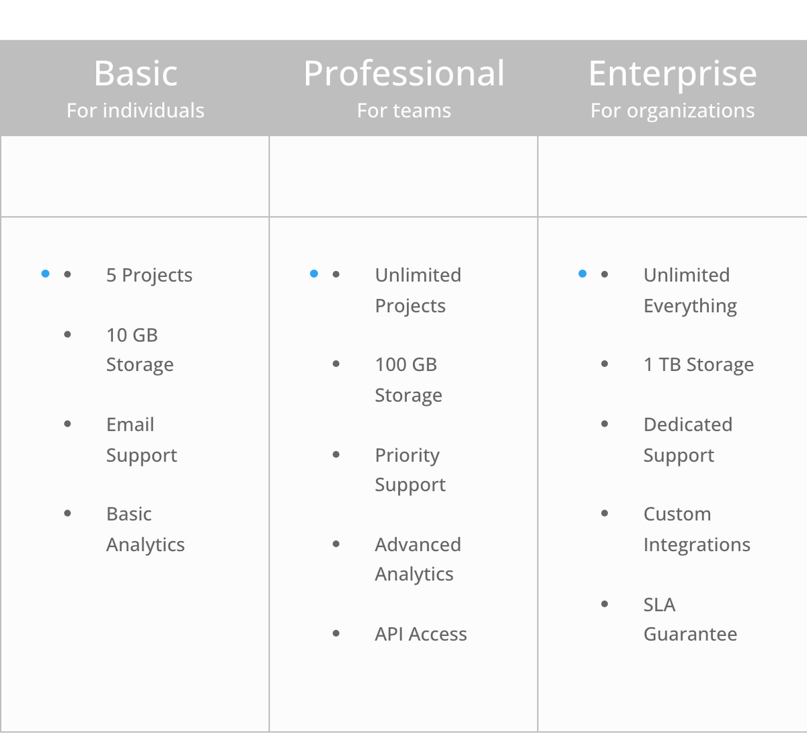

# Pricing Table

The Pricing Table module displays service tiers, subscription plans, or product pricing in a structured, visually appealing column format.

!!! abstract "Quick Reference"
    **What it does:** Presents pricing plans side by side with titles, prices, feature lists, CTA buttons, and a featured table option.
    **When to use it:** SaaS subscription plans, service package pricing, membership level comparisons
    **Key settings:** Pricing Tables (repeater), Featured toggle, Price/Currency/Frequency, Feature list, Button
    **Block identifier:** `divi/pricing-tables`
    **ET Docs:** [Official documentation](https://help.elegantthemes.com/en/articles/10364124-the-pricing-tables-module-in-divi-5)

!!! tip "When to Use This Module"
    - Comparing multiple pricing tiers or service packages side by side
    - Highlighting a recommended plan with the featured table option
    - Displaying feature inclusion/exclusion lists with strikethrough styling

!!! warning "When NOT to Use This Module"
    - Creating a single call-to-action block without plan comparison → use [Call To Action](call-to-action.md)
    - Building a standalone action button → use [Button](button.md)
    - Organizing non-pricing content into switchable panels → use [Tabs](tabs.md)

## Overview

The Pricing Table module provides a purpose-built layout for presenting pricing information on your website. Each table includes dedicated fields for a plan title, subtitle, price with currency symbol, billing frequency, a list of included features, and a call-to-action button. You can place multiple pricing tables side by side within a row to create a comparison layout that helps visitors evaluate their options at a glance.

One of the most useful capabilities of this module is the "featured" table option, which visually highlights a specific plan to draw attention to your most popular or recommended tier. Featured tables can receive distinct styling such as a different background color or drop shadow, making them stand out from the rest. This is a proven conversion technique for guiding visitors toward a preferred purchase decision.

The module supports bullet-point feature lists where individual items can be marked as excluded, rendering them with a strikethrough style to clearly communicate what is and is not included in each tier. Combined with full design customization for typography, colors, spacing, and button styling, the Pricing Table module gives you everything needed to build professional pricing pages without custom code.

For additional reference, see the [official Elegant Themes documentation](https://help.elegantthemes.com/en/articles/10364124-the-pricing-tables-module-in-divi-5).

[View A Live Demo Of This Module](https://www.16wells.dev/module-demos/pricing-table/)

{ loading=lazy }
*The Pricing Table module displaying multiple plan tiers with a featured column highlighted.*

## Use Cases

1. **SaaS Subscription Plans** — Present monthly or annual software plans with feature comparisons, highlighting the most popular tier as featured to maximize sign-ups.

2. **Service Package Pricing** — Display tiered service offerings (e.g., Basic, Professional, Enterprise) for agencies, consultants, or freelancers, with clear feature breakdowns per level.

3. **Membership Levels** — Showcase membership or community access tiers with pricing, included benefits, and excluded features shown via strikethrough styling to encourage upgrades.

## How to Add the Pricing Table Module

1. **Insert the module** — Open the Visual Builder, click the gray plus icon inside any row, and search for "Pricing Tables." Click the module to add it to your layout.

2. **Configure your tables** — In the Content tab, add individual pricing tables. For each table, enter the plan title, subtitle, price, currency, frequency, and feature list. Toggle the "featured" option on the plan you want to emphasize.

3. **Style and publish** — Switch to the Design tab to customize colors, typography, button appearance, and spacing. Preview the layout across device sizes and save your changes when satisfied.

## Settings & Options

### Content Tab

The Content tab is where you define the actual pricing data and manage the individual tables within the module.

| Setting | Type | Description |
|---------|------|-------------|
| **Content** | | |
| Pricing Tables | Repeater | Add, remove, reorder, and configure individual pricing table items. Each table has its own title, subtitle, price, currency, frequency, feature list, button text, button URL, and featured toggle. |
| **Elements** | | |
| Show Bullet | Toggle | Display or hide bullet point icons next to each feature list item. |
| **Link** | | |
| Module Link URL | URL | Make the entire module clickable by assigning a destination URL. |
| Module Link Target | Select | Choose whether the link opens in the same window or a new tab. |
| **Background** | | |
| Background Color | Color | Set a solid background color for the module container. |
| Background Gradient | Gradient | Apply a gradient background to the module. |
| Background Image | Upload | Use an image as the module background. |
| Background Video | URL | Set a video as the module background. |
| Background Pattern | Select | Apply a decorative pattern to the module background. |
| Background Mask | Select | Apply a mask effect to the module background. |
| **Loop** | | |
| Enable Loop | Toggle | Activate the loop builder to dynamically generate pricing tables from a data source. |
| **Order** | | |
| Order | Number | Control the display order of this module within a Flexbox or Grid parent layout. |
| **Meta** | | |
| Admin Label | Text | Assign a custom label that appears in the Visual Builder layers panel for easier identification. |
| Disable | Toggle | Force the module to be hidden or visible within the Visual Builder editing interface. |

### Design Tab

The Design tab controls the visual presentation of the pricing tables, including layout, typography for every text element, button styling, and decorative effects.

**Module-specific settings:**

| Setting | Type | Description |
|---------|------|-------------|
| Background Color | Color | Set the background color for individual pricing table columns. |
| Show Drop Shadow | Toggle | Enable or disable the drop shadow effect on featured pricing tables. |
| Featured Table Bullet Color | Color | Set the color of bullet point icons in the featured pricing table. |
| Table Bullet Color | Color | Set the color of bullet point icons in non-featured pricing tables. |
| Subtitle Text | typography group | Font family, weight, style, alignment, color, size, letter spacing, line height, and text shadow for pricing table subtitles. |
| Price Text | typography group | Font family, weight, style, alignment, color, size, letter spacing, line height, and text shadow for the price value. |
| Currency and Frequency Text | typography group | Font family, weight, style, color, size, letter spacing, line height, and text shadow for the currency symbol and billing frequency label. |
| Excluded Item Text | typography group | Font family, weight, style, color, size, letter spacing, line height, and text shadow for excluded (strikethrough) feature items. |

**Shared design options** — see [Options Groups](../options-groups/index.md) for detailed documentation:

| Options Group | Description |
|--------------|-------------|
| [Text](../options-groups/text.md) | Font, weight, alignment, color, line height, text shadow |
| [Title Text](../options-groups/title-text.md) | Font, weight, size, color, letter spacing, line height, text shadow for table titles |
| [Body Text](../options-groups/body-text.md) | Font, size, color, spacing for feature list and body text |
| [Button](../options-groups/button.md) | Custom styles toggle, text size, colors, border, border radius, font, icon, hover behavior |
| [Sizing](../options-groups/sizing.md) | Width, max-width, min-height, height, alignment |
| [Spacing](../options-groups/spacing.md) | Margin and padding with responsive breakpoint controls |
| [Border](../options-groups/border.md) | Width, color, style, border radius |
| [Box Shadow](../options-groups/box-shadow.md) | Horizontal/vertical offset, blur, spread, color, position |
| [Filters](../options-groups/filters.md) | Brightness, contrast, saturation, hue rotation, blur, invert, sepia, opacity, blend mode |
| [Transform](../options-groups/transform.md) | Scale, translate, rotate, skew, transform origin |
| [Animation](../options-groups/animation.md) | Entrance animation style, direction, duration, delay, intensity |

### Advanced Tab

The Advanced tab provides fine-grained control over HTML attributes, custom CSS, conditional display logic, scroll-based effects, and responsive visibility.

**Shared advanced options** — see [Options Groups](../options-groups/index.md) for detailed documentation:

| Options Group | Description |
|--------------|-------------|
| [Attributes](../options-groups/attributes.md) | CSS ID, classes, custom HTML attributes |
| [CSS](../options-groups/css.md) | Custom CSS per element target (main element, pricing table, title, price, button, before, after) |
| HTML | Custom HTML attributes for module wrapper |
| [Conditions](../options-groups/conditions.md) | Display rules (user role, page type, date, logic) |
| Interactions | Hover, click, or scroll-triggered interactions |
| [Visibility](../options-groups/visibility.md) | Device visibility toggles |
| [Transitions](../options-groups/transitions.md) | Hover transition timing |
| [Position](../options-groups/position.md) | CSS position and offsets |
| [Scroll Effects](../options-groups/scroll-effects.md) | Scroll-driven animation effects |

## Code Examples

### Custom CSS

```css
/* Highlight the featured pricing table with a colored top border */
.et_pb_pricing_table.et_pb_featured_table {
    border-top: 4px solid #2ea3f2;
    transform: scale(1.05);
}

/* Style the pricing table feature list */
.et_pb_pricing_table .et_pb_pricing_content li {
    padding: 8px 0;
    border-bottom: 1px solid #eee;
}

/* Strikethrough styling for excluded features */
.et_pb_pricing_table .et_pb_pricing_content li.et_pb_not_available {
    color: #999;
    text-decoration: line-through;
}

/* Responsive: stack tables vertically on mobile */
@media (max-width: 767px) {
    .et_pb_pricing_table {
        width: 100% !important;
        margin-bottom: 20px;
    }
}
```

### PHP Hooks

```php
/* Filter the Pricing Table module output */
add_filter('et_module_shortcode_output', function($output, $render_slug) {
    if ('et_pb_pricing_table' !== $render_slug) {
        return $output;
    }

    // Add a "Most Popular" badge to featured tables
    $output = str_replace(
        'et_pb_featured_table',
        'et_pb_featured_table has-badge',
        $output
    );

    return $output;
}, 10, 2);
```

## Common Patterns

1. **Three-Tier Comparison Layout** — Place the Pricing Table module in a full-width row and create three tables: a basic plan, a featured mid-tier plan, and a premium plan. Mark the middle table as featured so it scales slightly larger and draws the eye. This classic pattern works well for SaaS products, agency services, and membership sites.

2. **Annual vs. Monthly Toggle** — Combine two Pricing Table modules (one for monthly, one for annual pricing) with a Tabs module or conditional display logic to let visitors switch between billing periods. Use the Conditions setting in the Advanced tab to control which table set is visible based on user interaction.

3. **Feature-Focused Comparison** — Use the pricing table feature list extensively, marking excluded items on lower tiers to create a clear visual comparison. Style excluded items with a lighter color and strikethrough so visitors immediately see the value of upgrading to a higher tier.

## AI Interaction Notes

!!! warning "Create vs. Modify"
    Modifying existing module content via REST API (`wp.apiFetch` PATCH) updates
    title, body text, and settings attributes. **Creating new modules via REST API**
    produces content that renders on the front end but may not appear in the Visual
    Builder layer view. Use browser automation for reliable module creation.
    See [REST API Content Playbook](../playbooks/rest-api-content.md).

**Block identifier:** `divi/pricing-tables` — *Needs verification on current build*

| Operation | Method | Status | Notes |
|-----------|--------|--------|-------|
| Read content | Parse `post_content` block JSON | Observed | Use brace-depth parser — see [Content Encoding](../internals/content-encoding.md) |
| Modify existing | `wp.apiFetch` PATCH on post endpoint | Observed | Update block attributes in `post_content` |
| Create new | Browser automation (Playwright) | Observed | REST creation may break VB visibility |
| Batch modify | Sequential REST requests | Needs Testing | See [REST API Content Playbook](../playbooks/rest-api-content.md) |

**Key content attributes** — *JSON paths need verification*:

| Attribute | JSON Path | Notes |
|-----------|-----------|-------|
| Title | `attrs.title` | Plan name |
| Subtitle | `attrs.subtitle` | Plan description or tagline |
| Currency | `attrs.currency` | Currency symbol |
| Per | `attrs.per` | Billing frequency label |
| Price | `attrs.sum` | Numeric price value |
| Button Text | `attrs.button_text` | CTA button label |
| Button URL | `attrs.button_url` | CTA button destination |
| Features | Child items | Individual feature list entries |

!!! tip "Module Selection Guidance"
    For side-by-side plan comparisons use Pricing Table; for single CTA blocks use Call to Action; for feature lists use Blurb or Toggle.

## Saving Your Work

After configuring your pricing tables, click the green **Save** button in the bottom toolbar of the Visual Builder. For important layout changes, consider saving the section or row as a layout to reuse on other pages. You can also right-click the module in the layers panel and select **Save to Library** to store it as a reusable element.

## Version Notes

!!! note "Divi 5 Only"
    This page documents Divi 5 behavior exclusively. The Pricing Table module in Divi 5 uses the updated options framework with redesigned toggle groupings and expanded design controls compared to earlier versions.

## Troubleshooting

!!! warning "Featured Table Not Standing Out"
    If your featured pricing table looks identical to the others, check the following:

    - Confirm the **Featured** toggle is enabled on the correct table item in the Content tab
    - In the Design tab under Layout, verify that **Show Drop Shadow** is enabled
    - Check that the featured table background color differs from the standard table color
    - Custom CSS may be overriding the default featured styles

!!! warning "Pricing Tables Not Aligning Side by Side"
    If your pricing tables are stacking vertically instead of displaying in columns:

    - Ensure the parent row has enough columns or is set to a Flexbox/Grid layout
    - Check that the module width in the Sizing settings is not set to 100%
    - On tablet and mobile, tables will stack vertically by default for readability

!!! warning "Button Not Appearing"
    If the call-to-action button is missing from a pricing table:

    - Open the individual table item in the Content tab and verify that both **Button Text** and **Button URL** are filled in
    - Check the Design tab Button settings to ensure the button text color is not the same as the button background color
    - Verify the button is not hidden by spacing or overflow settings

## Related

- [Button](button.md) — Standalone button for linking to checkout or signup pages
- [Call To Action](call-to-action.md) — Conversion-focused block with heading, text, and button
- [Tabs](tabs.md) — Organize monthly/annual pricing tiers into tabbed views
- [Toggle](toggle.md) — Collapsible sections for detailed feature comparisons
- [Flexbox Layout](../builder/flexbox.md) — Align multiple pricing tables side by side in responsive rows
