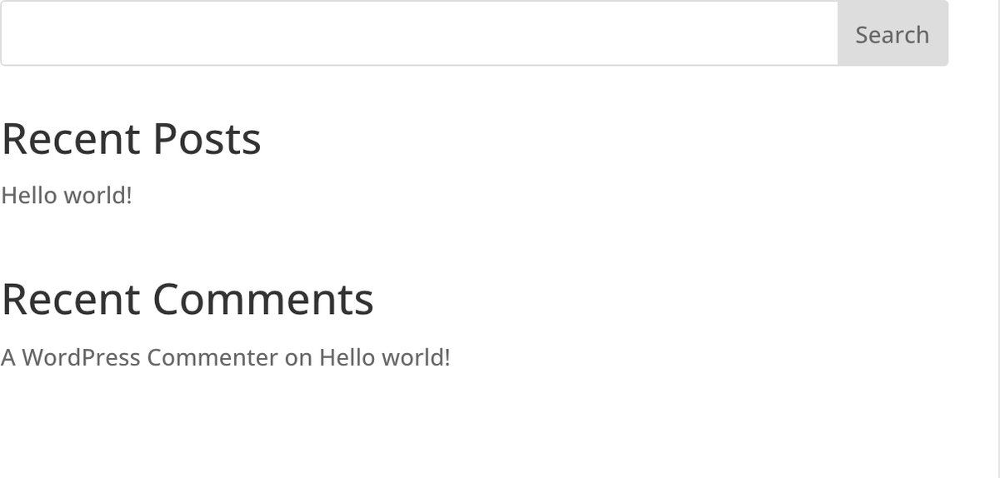

# Sidebar

The Sidebar module displays a registered WordPress widget area within any Divi 5 layout.

## Overview

The Sidebar module bridges the Divi Visual Builder with the traditional WordPress widget system. It allows you to place any registered widget area (sidebar) into your page layouts, giving you access to the full range of WordPress widgets, including categories, recent posts, tag clouds, custom menus, and any third-party widgets installed on your site. This makes it a versatile tool for adding dynamic, widget-driven content to pages that are otherwise built entirely with Divi modules.

Widget areas are managed through the WordPress Appearance menu, where you assign widgets to specific sidebars. The Sidebar module then acts as a viewport that pulls in whichever widget area you select. This means changes to the widget configuration are reflected everywhere that sidebar appears, making it an efficient way to manage globally shared content blocks like newsletter sign-up forms, recent post lists, or custom navigation menus.

The module includes a visual separator between the sidebar title and widget content, with controls for its position. Typography settings give you independent control over the title and body text styling so the sidebar integrates naturally with your overall page design. Whether you are building a traditional blog layout with a content area and sidebar column, or embedding widget content into a custom template, this module provides the connection between Divi and the WordPress widget ecosystem.

For additional reference, see the [official Elegant Themes documentation](https://help.elegantthemes.com/en/articles/10364419-the-sidebar-module-in-divi-5).

[View A Live Demo Of This Module](https://www.16wells.dev/module-demos/sidebar/)

{ loading=lazy }
*The Sidebar module rendering a WordPress widget area within a Divi layout.*

## Use Cases

1. **Blog Post Sidebar** — Add the Sidebar module to a blog post template alongside the Post Content module to create a classic two-column blog layout with widgets for recent posts, categories, tags, and a search bar.

2. **Footer Widget Area** — Place Sidebar modules in footer columns to display widget-based content like contact information, recent articles, or social media links that update globally through the WordPress widget manager.

3. **Custom Template Widget Integration** — Use the Sidebar module in Theme Builder templates to bring WordPress widgets into custom archive, category, or landing page layouts without writing code.

## How to Add the Sidebar Module

1. **Insert the module** — Open the Visual Builder, click the gray plus icon within any row, and search for "Sidebar." Click the module to add it to your layout.

2. **Select a widget area** — In the Content tab, use the Content dropdown to choose which registered WordPress widget area to display. The available options depend on which sidebars are registered by your theme and plugins.

3. **Style and publish** — Use the Design tab to adjust the separator position, customize title and body text typography, and configure spacing. Save your changes when the sidebar integrates well with your layout.

## Settings & Options

### Content Tab

The Content tab lets you select which widget area to display and configure module-level options like linking and background.

| Setting | Type | Description |
|---------|------|-------------|
| **Content** | | |
| Widget Area | Select | Choose which registered WordPress widget area (sidebar) to display in this module. Options are determined by the sidebars registered in your theme and active plugins. |
| **Link** | | |
| Module Link URL | URL | Make the entire module clickable by assigning a destination URL. |
| Module Link Target | Select | Choose whether the link opens in the same window or a new tab. |
| **Background** | | |
| Background Color | Color | Set a solid background color for the module container. |
| Background Gradient | Gradient | Apply a gradient background to the module. |
| Background Image | Upload | Use an image as the module background. |
| Background Video | URL | Set a video as the module background. |
| Background Pattern | Select | Apply a decorative pattern to the module background. |
| Background Mask | Select | Apply a mask effect to the module background. |
| **Loop** | | |
| Enable Loop | Toggle | Activate the loop builder to dynamically generate sidebar content from a data source. |
| **Order** | | |
| Order | Number | Control the display order of this module within a Flexbox or Grid parent layout. |
| **Meta** | | |
| Admin Label | Text | Assign a custom label visible in the Visual Builder layers panel for easier identification. |
| Disable | Toggle | Force the module to be hidden or visible within the Visual Builder editing interface. |

### Design Tab

The Design tab controls the visual layout of the sidebar, including the separator between the title and widget content, all typography settings, and decorative effects.

| Setting | Type | Description |
|---------|------|-------------|
| **Layout** | | |
| Separator Position | Select | Choose the placement of the visual divider line between the sidebar title and widget content (top, bottom, or hidden). |
| **Text** | | |
| Text Orientation | Select | Set the overall text alignment for the module (left, center, right, justified). |
| Text Color | Preset | Choose between light and dark text color presets for the module. |
| **Title Text** | | |
| Title Font | Font Selector | Choose the font family for sidebar widget titles. |
| Title Font Weight | Select | Set the weight (boldness) of the title text. |
| Title Font Style | Toggle | Apply italic, uppercase, underline, or strikethrough to title text. |
| Title Text Alignment | Select | Set the horizontal alignment of widget titles. |
| Title Text Color | Color | Set the color of sidebar widget titles. |
| Title Text Size | Range | Adjust the font size of title text. |
| Title Letter Spacing | Range | Control the spacing between letters in title text. |
| Title Line Height | Range | Set the vertical line height for title text. |
| Title Text Shadow | Select | Apply a shadow effect to title text. |
| **Body Text** | | |
| Body Font | Font Selector | Choose the font family for sidebar widget content and list items. |
| Body Font Weight | Select | Set the weight of body text. |
| Body Font Style | Toggle | Apply italic, uppercase, underline, or strikethrough to body text. |
| Body Text Alignment | Select | Set the horizontal alignment of body text. |
| Body Text Color | Color | Set the color of widget content and list item text. |
| Body Text Size | Range | Adjust the font size of body text. |
| Body Letter Spacing | Range | Control letter spacing in body text. |
| Body Line Height | Range | Set the line height for body text. |
| Body Text Shadow | Select | Apply a shadow effect to body text. |
| **Sizing** | | |
| Width | Range | Set the overall width of the module. |
| Max Width | Range | Define the maximum width the module can expand to. |
| Module Alignment | Select | Align the module within its parent container (left, center, right). |
| Min Height | Range | Set the minimum height for the module. |
| Height | Range | Define a fixed height for the module. |
| Max Height | Range | Set the maximum height the module can reach. |
| **Spacing** | | |
| Margin | Spacing | Set outer spacing around the module on each side. |
| Padding | Spacing | Set inner spacing within the module on each side. |
| **Border** | | |
| Border Width | Range | Set the width of the module border on each side. |
| Border Color | Color | Set the color of the module border. |
| Border Style | Select | Choose the border line style (solid, dashed, dotted, etc.). |
| Border Radius | Range | Control corner rounding for the module container. |
| **Box Shadow** | | |
| Box Shadow | Select | Choose a shadow preset or configure a custom box shadow. |
| Box Shadow Color | Color | Set the color of the box shadow. |
| Box Shadow Position | Select | Place the shadow inside or outside the module. |
| **Filters** | | |
| Hue | Range | Shift the hue of the module and its contents. |
| Saturation | Range | Adjust the saturation level of the module. |
| Brightness | Range | Control the brightness of the module. |
| Contrast | Range | Adjust the contrast of the module. |
| Invert | Range | Invert the colors of the module. |
| Sepia | Range | Apply a sepia tone to the module. |
| Opacity | Range | Set the opacity (transparency) of the module. |
| Blur | Range | Apply a blur effect to the module. |
| Blend Mode | Select | Choose how the module blends with elements beneath it. |
| **Transform** | | |
| Transform Scale | Range | Scale the module up or down from its original size. |
| Transform Translate | Range | Move the module horizontally or vertically from its original position. |
| Transform Rotate | Range | Rotate the module by a specified degree. |
| Transform Skew | Range | Skew the module along the X or Y axis. |
| Transform Origin | Select | Set the origin point for all transform operations. |
| **Animation** | | |
| Animation Style | Select | Choose an entrance animation (fade, slide, bounce, zoom, flip, fold, roll). |
| Animation Direction | Select | Set the direction of the entrance animation. |
| Animation Duration | Range | Control how long the animation takes to complete. |
| Animation Delay | Range | Set a delay before the animation begins. |
| Animation Intensity | Range | Adjust the intensity or distance of the animation effect. |
| Animation Starting Opacity | Range | Set the opacity at the start of the animation. |
| Animation Speed Curve | Select | Choose the easing function for the animation timing. |
| Animation Repeat | Toggle | Set whether the animation repeats or plays only once. |

### Advanced Tab

The Advanced tab provides control over HTML attributes, custom CSS, conditional display rules, scroll-based effects, and responsive visibility.

| Setting | Type | Description |
|---------|------|-------------|
| **Attributes** | | |
| CSS ID | Text | Assign a unique CSS ID to the module for targeting with custom styles or scripts. |
| CSS Class | Text | Add one or more CSS classes to the module for shared styling rules. |
| Custom HTML Attributes | Text | Add custom data attributes or other HTML attributes to the module wrapper element. |
| **CSS** | | |
| Main Element | Code | Write custom CSS that applies to the main module wrapper. |
| Widget Title | Code | Write custom CSS targeting widget title elements within the sidebar. |
| Widget Content | Code | Write custom CSS targeting widget content areas. |
| Before | Code | Write custom CSS for the module's ::before pseudo-element. |
| After | Code | Write custom CSS for the module's ::after pseudo-element. |
| **HTML** | | |
| HTML Tag | Select | Choose the semantic HTML element used for the module wrapper (div, aside, section, etc.). |
| **Conditions** | | |
| Display Conditions | Builder | Create rules to show or hide this module based on dynamic criteria such as user role, date, post type, or custom logic. |
| **Interactions** | | |
| Interactions | Builder | Define custom interactions that trigger actions (show, hide, animate other elements) when users interact with this module. |
| **Visibility** | | |
| Disable On | Checkbox | Selectively hide the module on desktop, tablet, or phone screen sizes. |
| **Transitions** | | |
| Transition Duration | Range | Set the speed of hover state transitions for the module. |
| Transition Delay | Range | Add a delay before hover transitions begin. |
| Transition Speed Curve | Select | Choose the easing function for hover transitions. |
| **Position** | | |
| Position | Select | Set the CSS position value (default/static, relative, absolute, fixed, sticky). |
| Z Index | Number | Control the stacking order of the module relative to other elements. |
| Horizontal Offset | Range | Adjust the left/right position when using absolute or fixed positioning. |
| Vertical Offset | Range | Adjust the top/bottom position when using absolute or fixed positioning. |
| **Scroll Effects** | | |
| Vertical Motion | Toggle/Range | Enable and configure vertical parallax movement as the user scrolls. |
| Horizontal Motion | Toggle/Range | Enable and configure horizontal movement during scroll. |
| Fading In/Out | Toggle/Range | Gradually change the module opacity as it scrolls into or out of the viewport. |
| Scaling Up/Down | Toggle/Range | Scale the module larger or smaller based on scroll position. |
| Rotating | Toggle/Range | Rotate the module as the user scrolls through the page. |
| Blur | Toggle/Range | Apply a progressive blur effect based on scroll position. |

## Code Examples

### Custom CSS

```css
/* Style sidebar widget titles */
.et_pb_sidebar .et_pb_widget_title {
    font-size: 18px;
    font-weight: 700;
    padding-bottom: 10px;
    margin-bottom: 15px;
    border-bottom: 2px solid #2ea3f2;
}

/* Style sidebar widget list items */
.et_pb_sidebar .et_pb_widget li {
    padding: 6px 0;
    border-bottom: 1px solid #eee;
}

/* Style sidebar widget links */
.et_pb_sidebar .et_pb_widget a {
    color: #333;
    text-decoration: none;
    transition: color 0.3s ease;
}

.et_pb_sidebar .et_pb_widget a:hover {
    color: #2ea3f2;
}

/* Responsive: reduce padding on mobile */
@media (max-width: 767px) {
    .et_pb_sidebar {
        padding: 15px;
    }
}
```

### PHP Hooks

```php
/* Filter the Sidebar module output */
add_filter('et_module_shortcode_output', function($output, $render_slug) {
    if ('et_pb_sidebar' !== $render_slug) {
        return $output;
    }

    // Wrap each widget in a custom container for styling
    $output = str_replace(
        'et_pb_widget',
        'et_pb_widget custom-widget-wrapper',
        $output
    );

    return $output;
}, 10, 2);

/* Register a custom sidebar for use with the module */
add_action('widgets_init', function() {
    register_sidebar(array(
        'name'          => 'Custom Divi Sidebar',
        'id'            => 'custom-divi-sidebar',
        'description'   => 'A widget area for the Divi Sidebar module.',
        'before_widget' => '<div class="widget %2$s">',
        'after_widget'  => '</div>',
        'before_title'  => '<h4 class="widget-title">',
        'after_title'   => '</h4>',
    ));
});
```

## Common Patterns

1. **Classic Blog Layout** — Create a two-column row with the Post Content module in the wider column and the Sidebar module in the narrower column. Select a widget area containing Recent Posts, Categories, and a Search widget to replicate the traditional blog reading experience.

2. **Sticky Sidebar Navigation** — Place the Sidebar module in a column and set its Position to "sticky" in the Advanced tab with an appropriate vertical offset. This keeps the sidebar visible as readers scroll through long content, which is especially useful for table-of-contents or navigation widgets.

3. **Widget-Powered Footer Sections** — Add multiple Sidebar modules across a multi-column footer row, each pulling from a different registered widget area. This lets you manage footer content (contact info, recent posts, quick links) entirely through the WordPress widget interface without editing the Divi template each time.

## Saving Your Work

After configuring your sidebar module, click the green **Save** button in the bottom toolbar of the Visual Builder. Remember that the widget content itself is managed separately through Appearance > Widgets in the WordPress admin. Changes to widget assignments will be reflected wherever that widget area is used without needing to re-save the Divi layout.

## Version Notes

!!! note "Divi 5 Only"
    This page documents Divi 5 behavior exclusively. The Sidebar module in Divi 5 includes the updated options framework with improved separator positioning controls and expanded typography settings for title and body text.

## Troubleshooting

!!! warning "Sidebar Showing No Content"
    If the Sidebar module appears empty on the front end:

    - Verify that the selected widget area has widgets assigned to it in Appearance > Widgets
    - Check that the widget area name matches a registered sidebar in your theme
    - Ensure the widgets themselves are configured correctly and not set to display conditionally

!!! warning "Widget Styles Not Matching Site Design"
    If widget content looks out of place within your Divi layout:

    - Use the Title Text and Body Text settings in the Design tab to match fonts, sizes, and colors with your global design
    - Add custom CSS in the Advanced tab to override default widget styles that may be inherited from the theme or plugin
    - Check for conflicting CSS from third-party widget plugins

!!! warning "Sidebar Not Appearing on Mobile"
    If the sidebar module disappears on smaller screens:

    - Check the Visibility settings in the Advanced tab to confirm it is not set to be hidden on tablet or phone
    - If using a column-based layout, verify the parent row column structure does not collapse the sidebar column on mobile
    - Consider the user experience: on mobile, sidebars often work better placed below main content rather than beside it

## Related

- [Menu](menu.md)
- [Search](search.md)
