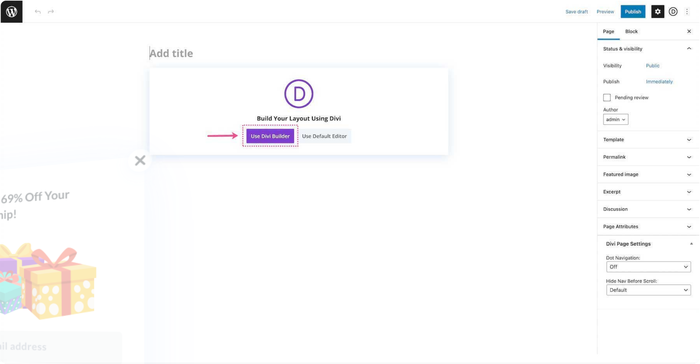

# Slider

The Slider module displays multiple slides with images, text, and buttons in an animated carousel.

## Overview

The Slider module is one of the most versatile content elements in Divi 5. It cycles through a set of slides, each of which can contain a heading, description text, a call-to-action button, and a background image or video. Sliders work well for hero sections, testimonial carousels, product showcases, and any situation where you need to present multiple pieces of content in a compact space.

Each slide functions as an independent content block with its own background, text, and button configuration. The module handles all transition animations automatically and provides navigation arrows and dot controls for manual browsing. Sliders can be placed in any column width and will adapt responsively to the available space.

The module supports both static background images and full-width video backgrounds with parallax effects. Combined with the Design tab's typography and overlay controls, it can produce everything from a simple image carousel to a polished full-screen hero section.

<!-- TODO: Replace with proper screenshot -->
<!-- { loading=lazy } -->
<!-- *The Slider module as it appears in the Divi 5 Visual Builder.* -->

## Settings & Options

### Content Tab

#### Slides (Repeater)

The Content tab contains a repeater field for slides. By default one slide is present. Click the **+** icon to add more slides. Each individual slide has the following settings:

| Setting | Type | Default | Description |
|---------|------|---------|-------------|
| Heading | text | — | The main title displayed on the slide. Supports dynamic content. |
| Button Text | text | — | Label for the slide's call-to-action button. The button is hidden if this field is empty. |
| Button URL | url | — | Destination link for the slide button. The button will not render without both text and a URL. |
| Description | rich-text | — | Body content displayed below the heading. Supports HTML formatting, lists, and inline styles. |
| Background Image | upload | — | Image displayed behind the slide content. Recommended minimum width: 1920px for full-width sliders. |
| Background Color | color | — | Solid background color for the slide. Visible when no background image is set or as a fallback while images load. |
| Use Background Video | toggle | Off | When enabled, replaces the background image with a video background. |
| Background Video MP4 | url | — | URL to an MP4 video file. Displayed when Use Background Video is enabled. |
| Background Video WebM | url | — | URL to a WebM video file. Used as a fallback format for browsers that do not support MP4. |
| Video Pause on Interaction | toggle | Off | Pauses the background video when the user interacts with slide content. |

#### Module-Level Content Settings

| Setting | Type | Default | Description |
|---------|------|---------|-------------|
| Show Arrows | toggle | Yes | Display left/right navigation arrows on the slider. |
| Show Controls | toggle | Yes | Display dot-style pagination controls below the slider. |
| Automatic Animation | toggle | Off | When enabled, slides advance automatically without user interaction. |
| Animation Speed | number | 7000 | Time in milliseconds each slide is displayed before advancing. Only applies when Automatic Animation is enabled. |
| Admin Label | text | — | Internal label visible only in the Visual Builder. Useful for identifying sliders when a page has multiple instances. |
| Background Color | color | — | Module-level background color applied behind all slides. Individual slide backgrounds take precedence. |
| Background Image | upload | — | Module-level background image. Individual slide backgrounds take precedence. |

<!-- TODO: Replace with proper screenshot -->
<!-- { loading=lazy } -->
<!-- *Content tab showing the slide repeater and module-level controls.* -->

### Design Tab

#### Text Settings

| Setting | Type | Default | Description |
|---------|------|---------|-------------|
| Header Font | font | Default | Font family for slide headings. |
| Header Font Weight | select | Bold | Weight of the heading text (Light, Regular, Semi Bold, Bold, Ultra Bold). |
| Header Font Style | toggle | — | Italic, uppercase, underline, strikethrough, or line-through for headings. |
| Header Text Alignment | select | Center | Horizontal alignment of the heading (Left, Center, Right, Justified). |
| Header Text Color | color | #ffffff | Color of the heading text. |
| Header Text Size | range | 46px | Font size of the heading text. Responsive — set independently for desktop, tablet, and phone. |
| Header Letter Spacing | range | 0px | Space between characters in the heading. |
| Header Line Height | range | 1em | Vertical space between lines for multi-line headings. |
| Header Text Shadow | select | None | Shadow effect applied to heading text. |
| Body Font | font | Default | Font family for the slide description text. |
| Body Font Weight | select | Regular | Weight of the body text. |
| Body Font Style | toggle | — | Italic, uppercase, underline, strikethrough, or line-through for body text. |
| Body Text Alignment | select | Center | Horizontal alignment of the description text. |
| Body Text Color | color | #ffffff | Color of the description text. |
| Body Text Size | range | 16px | Font size of the description text. Responsive. |
| Body Letter Spacing | range | 0px | Space between characters in the body text. |
| Body Line Height | range | 1.7em | Vertical space between lines in the description. |
| Body Text Shadow | select | None | Shadow effect applied to body text. |

#### Button Settings

| Setting | Type | Default | Description |
|---------|------|---------|-------------|
| Use Custom Styles for Button | toggle | Off | When enabled, exposes detailed button styling options below. |
| Button Text Size | range | 20px | Font size of the button label. |
| Button Text Color | color | #ffffff | Color of the button text. |
| Button Background Color | color | transparent | Background fill color of the button. |
| Button Border Width | range | 2px | Thickness of the button border. |
| Button Border Color | color | #ffffff | Color of the button border. |
| Button Border Radius | range | 3px | Corner rounding of the button. |
| Button Font | font | Default | Font family for the button text. |
| Button Icon | icon | Arrow | Icon displayed alongside the button text. |
| Button Icon Placement | select | Right | Position of the icon relative to button text (Left or Right). |
| Button On Hover | toggle | Yes | When enabled, the icon slides in on hover. When disabled, the icon is always visible. |

#### Slider and Image Settings

| Setting | Type | Default | Description |
|---------|------|---------|-------------|
| Background Overlay Color | color | rgba(0,0,0,0.3) | Semi-transparent overlay placed on top of slide background images. Improves text readability. |
| Arrow Color | color | #ffffff | Color of the left/right navigation arrows. |
| Dot Nav Color | color | #ffffff | Color of the dot pagination controls. |
| Image Treatment | select | — | Apply effects to slide background images (e.g., grayscale, sepia). |

#### Sizing

| Setting | Type | Default | Description |
|---------|------|---------|-------------|
| Width | range | 100% | Overall width of the slider module. |
| Max Width | range | — | Maximum width constraint. Useful for centering a fixed-width slider within a full-width section. |
| Min Height | range | — | Minimum height of the slider. Prevents the slider from collapsing when content is short. |
| Module Alignment | select | Center | Horizontal alignment of the module when its width is less than the column width. |

#### Spacing

| Setting | Type | Default | Description |
|---------|------|---------|-------------|
| Custom Margin | range | — | Space outside the slider module (top, right, bottom, left). Responsive. |
| Custom Padding | range | 16% 0 | Space inside the slider between its edges and the slide content. Responsive. |

#### Animation

| Setting | Type | Default | Description |
|---------|------|---------|-------------|
| Slide Animation | select | Slide | Transition effect between slides (Slide or Fade). |
| Animation Style | select | None | Entrance animation when the module scrolls into view (Fade, Slide, Bounce, Zoom, Flip, Fold, Roll). |
| Animation Direction | select | Center | Direction of the entrance animation (Center, Left, Right, Top, Bottom). |
| Animation Duration | range | 1000ms | Length of the entrance animation. |
| Animation Delay | range | 0ms | Delay before the entrance animation begins. |
| Animation Intensity | range | 50% | Intensity of the entrance animation effect. |

<!-- TODO: Replace with proper screenshot -->
<!-- { loading=lazy } -->
<!-- *Design tab showing typography, button, and animation settings.* -->

### Advanced Tab

| Setting | Type | Default | Description |
|---------|------|---------|-------------|
| CSS ID | text | — | Assign a unique CSS ID to the module for targeting with custom CSS or JavaScript. |
| CSS Class | text | — | Assign one or more CSS classes to the module, separated by spaces. |
| Custom CSS | code | — | Add custom CSS to specific elements of the slider: Slide, Slide Title, Slide Description, Slide Button, Slide Image, Arrows, Controls. |
| Visibility | toggle | Show on all devices | Control which devices display this module (Desktop, Tablet, Phone). |
| Transition Duration | range | 300ms | Duration of hover transition effects on interactive elements. |
| Horizontal Overflow | select | Default | How content that overflows the module width is handled. |
| Vertical Overflow | select | Default | How content that overflows the module height is handled. |
| Position | select | Default | CSS positioning scheme (Static, Relative, Absolute, Fixed, Sticky). |
| Z Index | number | — | Stacking order of the module relative to other elements. |
| Scroll Effects | toggle | Off | Enable transform effects (rotation, scaling, blur, etc.) triggered by scroll position. |

## Code Examples

### Custom Arrow Styling

```css
/* Replace default arrows with custom styled arrows */
.et_pb_slider .et-pb-arrow-prev,
.et_pb_slider .et-pb-arrow-next {
    font-size: 24px;
    color: #ffffff;
    background: rgba(0, 0, 0, 0.4);
    padding: 12px 16px;
    border-radius: 50%;
    transition: background 0.3s ease;
}

.et_pb_slider .et-pb-arrow-prev:hover,
.et_pb_slider .et-pb-arrow-next:hover {
    background: rgba(0, 0, 0, 0.7);
}

/* Position arrows inside the slider edges */
.et_pb_slider .et-pb-arrow-prev {
    left: 20px;
}

.et_pb_slider .et-pb-arrow-next {
    right: 20px;
}
```

### Full-Width Hero Slider

```css
/* Full-viewport-height hero slider */
.et_pb_slider.hero-slider {
    min-height: 100vh;
}

.et_pb_slider.hero-slider .et_pb_slide {
    min-height: 100vh;
    display: flex;
    align-items: center;
    justify-content: center;
}

/* Darken the background for text readability */
.et_pb_slider.hero-slider .et_pb_slide::before {
    content: '';
    position: absolute;
    top: 0;
    left: 0;
    width: 100%;
    height: 100%;
    background: linear-gradient(
        to bottom,
        rgba(0, 0, 0, 0.3) 0%,
        rgba(0, 0, 0, 0.6) 100%
    );
    z-index: 1;
}

/* Ensure slide content sits above the overlay */
.et_pb_slider.hero-slider .et_pb_slide_description {
    position: relative;
    z-index: 2;
}
```

### Auto-Height Slides Based on Content

```css
/* Let slide height be determined by content instead of padding */
.et_pb_slider.auto-height .et_pb_slide {
    min-height: auto !important;
    padding: 60px 40px;
}

.et_pb_slider.auto-height .et_pb_slide_description {
    padding-bottom: 0;
}

/* Responsive padding for smaller screens */
@media (max-width: 980px) {
    .et_pb_slider.auto-height .et_pb_slide {
        padding: 40px 20px;
    }
}
```

### PHP: Filter Slider Output

```php
/* Add a custom wrapper div around every slider module */
add_filter('et_module_shortcode_output', function($output, $render_slug) {
    if ('et_pb_slider' !== $render_slug) {
        return $output;
    }
    return '<div class="custom-slider-wrapper">' . $output . '</div>';
}, 10, 2);
```

## Common Patterns

### 1. Hero Slider

A full-width slider placed at the top of the page, typically inside a fullwidth section. Each slide features a large background image, a bold heading, a short description, and a CTA button. Set Automatic Animation to **On** with a speed of 5000-7000ms. Use the background overlay color to ensure text remains readable against varied images.

<!-- { loading=lazy }
*A full-width hero slider with gradient overlay and centered content.* -->

### 2. Testimonial Carousel

Use the slider to cycle through customer testimonials. Set each slide's heading to the client name and the description to the quote. Remove the button by leaving Button Text empty. Reduce the padding and use a solid background color instead of images for a clean, minimal look. Add a CSS class to style quotation marks or a star rating above the text.

<!-- { loading=lazy }
*A testimonial slider with minimal styling and customer quotes.* -->

### 3. Product Showcase

Present products or services with a background image of each item, a descriptive heading, key features in the description, and a "Learn More" or "Buy Now" button. Position text to the left using the Text Alignment setting and keep the description concise. Works well at any column width, though a 2/3 or full-width column provides the best visual impact.

<!-- { loading=lazy }
*A product showcase slider with left-aligned text and product imagery.* -->

## Version Notes

!!! note "Divi 5 Only"
    This page documents Divi 5 behavior exclusively.

## Troubleshooting

!!! warning "Slides Not Advancing Automatically"
    If automatic animation is not working:

    - Confirm that **Automatic Animation** is set to **On** in the Content tab.
    - Check the **Animation Speed** value. Very low values (under 500ms) can cause visual glitches; very high values may make it seem like nothing is happening.
    - JavaScript errors from other plugins can break slider animation. Open the browser console (F12) and look for errors. Disable other plugins to test.
    - If the slider has only one slide, automatic animation has no effect.

!!! warning "Background Images Not Displaying"
    If slide background images appear blank:

    - Verify the image URL is correct and the file exists. Open the image URL directly in a browser tab to confirm.
    - Check that the image has not been removed from the WordPress Media Library.
    - If using a CDN or image optimization plugin, ensure it is not blocking or altering the image path.
    - Large images (over 5MB) may fail to load on slow connections. Optimize images to under 500KB.

!!! warning "Slider Height Issues"
    If the slider is too tall, too short, or jumps between heights:

    - The default padding (16% top and bottom) controls height. Adjust **Custom Padding** in the Design tab to control height directly.
    - For fixed-height sliders, set **Min Height** to a specific value (e.g., 500px) and remove vertical padding.
    - Slides with different content lengths will cause height jumping unless you set a fixed Min Height or use the auto-height CSS pattern above.
    - On mobile, reduce padding to prevent excessively tall sliders. Use the responsive toggle on the padding setting.

!!! warning "Slider Content Overlapping on Mobile"
    If text and buttons overlap on smaller screens:

    - Reduce the heading and body text size for tablet and phone breakpoints using the responsive controls.
    - Shorten the description text — what fits on desktop may overflow on mobile.
    - Increase the mobile padding to give content more breathing room.

## Related

- [Post Slider](post-slider.md) — Automatically generates slides from blog posts
- [Video Slider](video-slider.md) — Slider variant with embedded video playback per slide
- [Fullwidth Slider](fullwidth-slider.md) — Full-browser-width slider for use in fullwidth sections
- [Fullwidth Header](fullwidth-header.md) — Alternative hero section with a static layout
