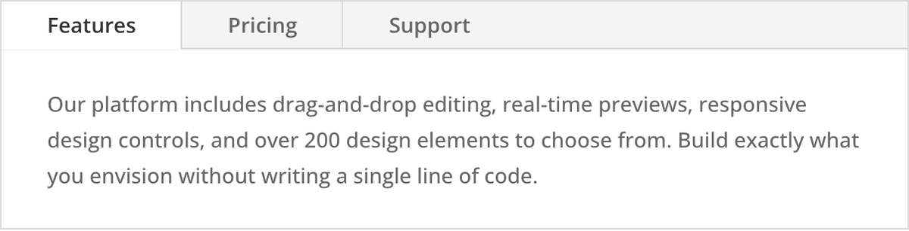

# Tabs

The Tabs module organizes content into switchable panels controlled by clickable tab headers.

## Overview

The Tabs module provides a tabbed interface for grouping related content into distinct panels that visitors switch between by clicking tab headers. Only one panel is visible at a time, which keeps the layout compact and allows you to present a significant amount of information without requiring visitors to scroll through long pages.

Each tab functions as an independent content block with its own title and rich text body. The body supports full HTML formatting, so you can include images, lists, embedded media, and styled text within any tab. At wider column widths, tab headers display in a horizontal row across the top. In narrow columns (quarter-width and below), the headers automatically stack vertically to remain accessible on constrained layouts.

The Tabs module differs from the [Accordion](accordion.md) module in its navigation pattern. While both organize content into collapsible sections, tabs present all headers simultaneously in a row, allowing instant access to any panel. The accordion stacks headers vertically with expand/collapse behavior. Choose tabs when visitors need to compare or switch between sections frequently, and accordions when content is sequential or FAQ-style.

For additional reference, see the [official Elegant Themes documentation](https://help.elegantthemes.com/en/articles/10365057-the-tabs-module-in-divi-5).

[View A Live Demo Of This Module](https://www.16wells.dev/module-demos/tabs/)

{ loading=lazy }
*The Tabs module as it appears on the live demo.*

## Use Cases

1. **Product Specifications** — Present different categories of product information (description, specifications, reviews, shipping) in separate tabs so shoppers can quickly find the details they care about.
2. **Service Tiers or Pricing Plans** — Display different pricing plans or service levels in their own tabs, letting visitors compare options by switching between panels without scrolling.
3. **Categorized Content Blocks** — Organize a resource section where each tab contains a different content category such as tutorials, documentation, and FAQs, keeping everything accessible from a single location on the page.

## How to Add the Tabs Module

1. Open the Visual Builder on the page you want to edit.
2. Click the gray **+** icon to add a new module to a row.
3. Search for "Tabs" in the module picker or find it in the Content Elements category, then click to insert it.

## Settings & Options

The Tabs module settings are organized across three tabs: Content, Design, and Advanced.

### Content Tab

The Content tab manages the individual tab items and module-level configuration for links, backgrounds, and metadata.

| Setting | Type | Description |
|---------|------|-------------|
| Tabs (Repeater) | item list | Manage individual tab items. Click **+** to add a new tab, the pencil icon to edit, the trash icon to delete, and drag to reorder. Each tab item has its own settings detailed below. |
| Link | url | Optionally link the entire tabs module to a specified URL. |
| Background | background controls | Set a background color, gradient, image, or video behind the entire tabs module container. |
| Loop | toggle | Control repeating behavior for the tab items within the module. |
| Order | select | Control the display order of tab items within the module. |
| Meta | admin label | Set an internal label for the module visible only in the Visual Builder's layer panel, helpful for identifying the module when a page contains multiple tab instances. |

#### Individual Tab Item Settings

Each tab within the module has its own configuration panel:

| Setting | Type | Description |
|---------|------|-------------|
| Title | text | The label displayed in the clickable tab header. Keep titles short and descriptive for best usability. |
| Content | rich text editor | The body content displayed in the panel when the tab is active. Supports text formatting, images, lists, embedded media, and HTML. |

### Design Tab

The Design tab controls the visual styling of the tab headers, body content, and overall module layout.

| Setting | Type | Description |
|---------|------|-------------|
| Body Text | text styling | Style the content within tab panels including font family, font size, font weight, font style, text color, text alignment, letter spacing, line height, and text shadow. Responsive controls available per breakpoint. |
| Tab Text | text styling | Style the tab header labels with independent font family, size, weight, style, color, alignment, letter spacing, and line height settings. Separate styling can be configured for active and inactive tab states. |
| Sizing | dimension controls | Set the module width, max width, and horizontal alignment within its column. |
| Spacing | margin/padding | Configure external margin and internal padding for the module. Responsive values can be set independently for each breakpoint. |
| Border | border styling | Add and customize borders around the module and individual tab elements, including width, color, style, and per-corner radius values. |
| Box Shadow | shadow controls | Apply a box shadow effect to the module with configurable horizontal offset, vertical offset, blur, spread, and color. |
| Filters | image filters | Apply CSS filter effects to the module including hue rotation, saturation, brightness, contrast, inversion, sepia, and blur. |
| Transform | transform controls | Apply CSS transforms including scale, translate, rotate, skew, and transform origin adjustments. |
| Animation | animation controls | Configure the module entrance animation triggered when scrolling into view, with style, direction, duration, delay, and intensity options. |

### Advanced Tab

The Advanced tab provides low-level controls for custom attributes, CSS targeting, conditional display logic, and scroll-driven effects.

| Setting | Type | Description |
|---------|------|-------------|
| Attributes | id/class inputs | Assign a unique CSS ID and one or more CSS classes to the module for targeting with custom CSS or JavaScript. |
| CSS | custom CSS editor | Add custom CSS rules targeting specific internal elements of the tabs module such as the tab headers, active tab header, tab content area, and individual tab panels. |
| HTML | html attributes | Configure additional HTML attributes on the module wrapper element. |
| Conditions | display logic | Set conditions that determine when the module is displayed, such as user role, page type, or custom logic rules. |
| Interactions | event handlers | Define interactive behaviors triggered by user actions like click or hover events on the module. |
| Visibility | device toggles | Control which devices display this module by toggling visibility independently for desktop, tablet, and phone. |
| Transitions | transition controls | Set the duration and timing of hover transition effects on interactive elements within the module. |
| Position | positioning controls | Configure the CSS positioning scheme (static, relative, absolute, fixed, or sticky), along with z-index and offset values. |
| Scroll Effects | scroll transforms | Enable transform effects like rotation, scaling, fading, and blur driven by the visitor's scroll position relative to the module. |

## Code Examples

### Custom CSS: Styled Tab Headers

```css
/* Custom tab header styling with bottom border indicator */
.et_pb_tabs .et_pb_tab_common a {
    background: transparent;
    color: #666666;
    font-weight: 600;
    padding: 12px 24px;
    border-bottom: 3px solid transparent;
    transition: all 0.3s ease;
}

.et_pb_tabs .et_pb_tab_common a:hover {
    color: #333333;
    border-bottom-color: #cccccc;
}

.et_pb_tabs .et_pb_tab_active a {
    color: #0073aa;
    border-bottom-color: #0073aa;
    background: transparent;
}
```

### Custom CSS: Full-Width Equal Tab Headers

```css
/* Make tab headers stretch to fill the full module width equally */
.et_pb_tabs .et_pb_tabs_controls {
    display: flex;
}

.et_pb_tabs .et_pb_tabs_controls li {
    flex: 1;
    text-align: center;
}

.et_pb_tabs .et_pb_tabs_controls li a {
    display: block;
    width: 100%;
}
```

### Custom CSS: Stacked Tabs on Mobile

```css
/* Vertical tab layout on smaller screens */
@media (max-width: 767px) {
    .et_pb_tabs .et_pb_tabs_controls {
        flex-direction: column;
    }

    .et_pb_tabs .et_pb_tabs_controls li {
        width: 100%;
        border-bottom: 1px solid #e0e0e0;
    }

    .et_pb_tabs .et_pb_tabs_controls li a {
        padding: 14px 16px;
    }
}
```

### PHP: Filter Tabs Module Output

```php
/* Add ARIA attributes to the tabs module for improved accessibility */
add_filter('et_module_shortcode_output', function($output, $render_slug) {
    if ('et_pb_tabs' !== $render_slug) {
        return $output;
    }
    $output = str_replace(
        'class="et_pb_tabs_controls"',
        'class="et_pb_tabs_controls" role="tablist"',
        $output
    );
    return $output;
}, 10, 2);
```

## Common Patterns

### 1. Product Information Tabs

Create three to four tabs labeled "Overview," "Specifications," "Reviews," and "Shipping." Place detailed content in each panel so visitors can quickly locate the information they need. Style the active tab header with a distinct color that matches your brand, and keep the inactive headers in a neutral tone.

### 2. Location or Branch Selector

Use tabs to display information about different office locations, store branches, or regional services. Each tab header carries the location name, and the panel contains the address, hours, contact details, and an embedded map. This keeps all location data in one compact section.

### 3. Before/After or Comparison View

Create two tabs labeled "Before" and "After" or "Plan A" and "Plan B" to let visitors toggle between two states or options. This works well for case studies, renovation portfolios, or plan comparisons where seeing one view at a time is clearer than a side-by-side layout.

## Saving Your Work

After configuring your tabs, save your changes by clicking the **Save** button (checkmark icon) in the Visual Builder's bottom toolbar. For reusable tab configurations, right-click the module and select **Save to Library** to store it as a preset that can be inserted on other pages.

## Version Notes

!!! note "Divi 5 Only"
    This page documents Divi 5 behavior exclusively. Tabs settings and class names may differ from Divi 4.

## Troubleshooting

!!! warning "Tab Content Not Displaying"
    If clicking a tab header does not reveal the panel content:

    - Ensure the tab item has content entered in its **Content** field. Empty tabs will render a blank panel.
    - JavaScript errors from other plugins or custom scripts can break the tab switching behavior. Open the browser console (F12) and look for errors.
    - If the module was recently duplicated or imported from the library, re-save the page to ensure all tab data is properly stored.

!!! warning "Tab Headers Overlapping or Wrapping Unexpectedly"
    If tab labels are crowding together or breaking to a new line:

    - Shorten the tab titles. Long titles consume more horizontal space and can overflow, especially with many tabs.
    - Reduce the tab header font size in the Design tab's **Tab Text** settings.
    - If you have more than four or five tabs, consider using the Accordion module instead, which handles many items more gracefully in a vertical layout.
    - On smaller screens, the module automatically stacks tab headers. Use the responsive controls to adjust font size and padding for tablet and phone breakpoints.

!!! warning "Styling Not Applying to Active Tab"
    If custom CSS or Design tab styles are not affecting the currently active tab:

    - The active tab uses a distinct CSS class (`.et_pb_tab_active`). Ensure your selectors target this class specifically rather than the general tab class.
    - Inline styles from the Visual Builder may override your custom CSS. Use more specific selectors or add `!important` as a last resort.
    - Clear your browser cache and any site-level caching plugins to ensure you are seeing the latest styles.

## Related

- [Accordion](accordion.md) — Collapsible content panels where one item is open at a time
- [Toggle](toggle.md) — Individual collapsible content blocks that can be open simultaneously
