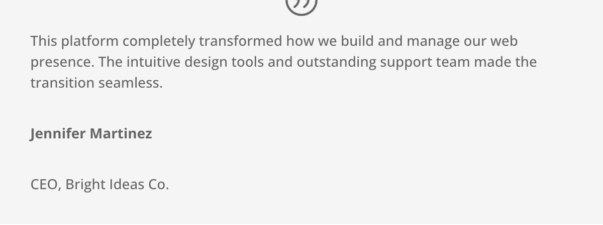

# Testimonial Module

The Testimonial module displays customer quotes, reviews, and endorsements with an author photo, name, job title, and company attribution.

## Overview

The Testimonial module provides a structured way to present social proof on your website. Each testimonial includes a quote body, author image, author name, job position, and company name, all arranged in a clean, professional layout. A decorative quote icon reinforces the visual identity of the module, making it immediately recognizable as a customer endorsement.

Social proof is one of the most effective conversion tools available to website owners. By placing testimonials near calls to action, pricing sections, or service descriptions, you provide visitors with third-party validation that builds trust and reduces hesitation. The Testimonial module makes this easy by combining all the necessary elements into a single, cohesive block.

The module supports both portrait and landscape orientations, allows you to toggle individual elements on or off, and provides granular typography controls for every text element. You can style the quote icon, adjust image dimensions, apply background overlays, and animate the module on scroll. When combined with Divi's row column structures, you can build multi-column testimonial grids, alternating layouts, or single featured endorsements.

For additional reference, see the [official Elegant Themes documentation](https://help.elegantthemes.com/en/articles/10365121-the-testimonial-module-in-divi-5).

[View A Live Demo Of This Module](https://www.16wells.dev/module-demos/testimonial/)

{ loading=lazy }
*The Testimonial module displaying a customer quote with author photo, name, and company.*

## Use Cases

1. **Customer Reviews Section** — Place multiple Testimonial modules in a multi-column row to build a reviews grid on a landing page. Each column can hold a different customer quote, creating a mosaic of social proof that visitors can scan quickly.

2. **Featured Endorsement** — Use a single Testimonial module in a full-width row as a featured quote between content sections. Increase the font size of the body text and apply a background color to the section to make it stand out as a visual break in the page flow.

3. **Case Study Highlights** — Pair the Testimonial module with a Blurb or Text module to attribute a quote to a specific project or result. Position the testimonial alongside metrics or outcomes to reinforce credibility with concrete data.

## How to Add the Testimonial Module

1. **Open the Visual Builder** on the page where you want the testimonial to appear. Click the gray plus icon inside any row to open the module picker.

2. **Search for "Testimonial"** in the module picker search bar, then click the Testimonial module to insert it into the row.

3. **Configure the module** by entering the author name, job title, company name, and testimonial body text in the Content tab. Upload an author portrait image and adjust the design settings to match your site's style.

## Settings & Options

### Content Tab

The Content tab holds all the primary data fields for the testimonial, including the quote text, author details, image, and structural elements.

| Setting | Type | Description |
|---------|------|-------------|
| **Text** | | |
| Author | text | The name of the person giving the testimonial |
| Job Title | text | The author's professional title or role |
| Company | text | The organization the author represents |
| Body | rich text | The testimonial quote content, supports visual editing and HTML |
| URL | url | A link destination applied to the author name or company |
| **Image** | | |
| Image | upload | Portrait or headshot image of the testimonial author |
| Image Alt Text | text | Accessible alt text describing the author image |
| **Elements** | | |
| Quote Icon | toggle | Show or hide the decorative quotation mark icon |
| **Link** | | |
| Module Link URL | url | Makes the entire module a clickable link |
| Module Link Target | select | Opens the link in the same window or a new tab |
| **Background** | | |
| Background Color | color | Solid background color behind the module |
| Background Gradient | gradient | Gradient background with direction and color stop controls |
| Background Image | upload | An image displayed behind the module content |
| Background Video | url | A video URL (MP4 or WebM) used as a motion background |
| Background Pattern | select | A decorative pattern overlay applied to the background |
| Background Mask | select | A shaped mask overlay applied to the background |
| **Loop** | | |
| Dynamic Content | toggle | Enable dynamic content connections for supported fields |
| **Order** | | |
| Module Order | select | Position of this module relative to siblings in the row |
| **Meta** | | |
| Admin Label | text | A custom label shown in the builder layers panel for easy identification |
| Disable On | toggle | Disable the module on specific device sizes (phone, tablet, desktop) |

### Design Tab

The Design tab provides comprehensive visual controls for every element of the testimonial, from the quote icon to the individual text elements.

| Setting | Type | Description |
|---------|------|-------------|
| **Quote Icon** | | |
| Icon Color | color | The color of the decorative quotation mark icon |
| Icon Size | range | The size of the quote icon in pixels |
| **Image** | | |
| Image Width | range | The width of the author portrait image |
| Image Height | range | The height of the author portrait image |
| Image Rounded Corners | range | Border radius applied to the author image |
| Image Border | composite | Border width, style, and color around the author image |
| Image Box Shadow | composite | Shadow effect applied to the author image |
| **Text** | | |
| Text Alignment | select | Horizontal alignment (left, center, right, justified) for all text in the module |
| Text Color Scheme | select | Light or dark text color scheme for the module |
| **Body Text** | | |
| Body Font | typography | Font family, weight, style, and line height for the quote body |
| Body Text Color | color | Font color for the quote body text |
| Body Text Size | range | Font size for the quote body |
| Body Letter Spacing | range | Letter spacing applied to the body text |
| Body Line Height | range | Line height for the body text |
| Body Text Shadow | composite | Shadow effect applied to body text characters |
| **Author Text** | | |
| Author Font | typography | Font family, weight, style, and line height for the author name |
| Author Text Color | color | Font color for the author name |
| Author Text Size | range | Font size for the author name |
| Author Letter Spacing | range | Letter spacing for the author name |
| Author Line Height | range | Line height for the author name |
| Author Text Shadow | composite | Shadow effect on the author name text |
| **Position Text** | | |
| Position Font | typography | Font family, weight, style, and line height for the job title |
| Position Text Color | color | Font color for the job title text |
| Position Text Size | range | Font size for the job title |
| Position Letter Spacing | range | Letter spacing for the job title |
| Position Line Height | range | Line height for the job title |
| Position Text Shadow | composite | Shadow effect on the job title text |
| **Company Text** | | |
| Company Font | typography | Font family, weight, style, and line height for the company name |
| Company Text Color | color | Font color for the company name text |
| Company Text Size | range | Font size for the company name |
| Company Letter Spacing | range | Letter spacing for the company name |
| Company Line Height | range | Line height for the company name |
| Company Text Shadow | composite | Shadow effect on the company name text |
| **Sizing** | | |
| Width | range | The overall width of the module |
| Max Width | range | Maximum width the module can expand to |
| Module Alignment | select | Horizontal alignment of the module within its column |
| Min Height | range | Minimum height of the module container |
| Height | range | Fixed height of the module container |
| Max Height | range | Maximum height the module container can reach |
| **Spacing** | | |
| Margin | composite | External spacing around the module (top, right, bottom, left) |
| Padding | composite | Internal spacing within the module (top, right, bottom, left) |
| **Border** | | |
| Border Width | range | Width of the border around the module |
| Border Color | color | Color of the module border |
| Border Style | select | Style of the border (solid, dashed, dotted, double, groove, ridge) |
| Border Radius | range | Corner rounding applied to the module container |
| **Box Shadow** | | |
| Box Shadow | composite | Shadow effect applied to the module container |
| **Filters** | | |
| Hue Rotate | range | Rotates the hue of all module colors |
| Saturate | range | Adjusts color saturation of the module |
| Brightness | range | Adjusts brightness of the module |
| Contrast | range | Adjusts contrast of the module |
| Invert | range | Inverts the module colors |
| Sepia | range | Applies a sepia tone to the module |
| Opacity | range | Controls the transparency of the module |
| Blur | range | Applies a Gaussian blur to the module |
| Blend Mode | select | CSS mix-blend-mode for how the module blends with its background |
| **Transform** | | |
| Scale | composite | Scale the module horizontally and vertically |
| Translate | composite | Move the module along the X and Y axes |
| Rotate | composite | Rotate the module on the X, Y, and Z axes |
| Skew | composite | Skew the module horizontally and vertically |
| Transform Origin | select | The point around which transformations are applied |
| **Animation** | | |
| Animation Style | select | Entrance animation type (fade, slide, bounce, zoom, flip, fold, roll) |
| Animation Direction | select | Direction from which the animation enters |
| Animation Duration | range | How long the entrance animation takes in milliseconds |
| Animation Delay | range | Delay before the animation starts |
| Animation Intensity | range | The distance or intensity of the animation movement |
| Animation Starting Opacity | range | The opacity value at the start of the animation |
| Animation Speed Curve | select | Easing function for the animation (ease, ease-in, ease-out, linear) |
| Animation Repeat | toggle | Whether the animation replays each time the element enters the viewport |

### Advanced Tab

The Advanced tab provides technical controls for custom attributes, CSS overrides, conditional display logic, and scroll-based effects.

| Setting | Type | Description |
|---------|------|-------------|
| **Attributes** | | |
| CSS ID | text | A unique HTML `id` attribute applied to the module wrapper |
| CSS Class | text | One or more CSS class names added to the module wrapper |
| **CSS** | | |
| Before | code | Custom CSS applied to the module's `::before` pseudo-element |
| Main Element | code | Custom CSS applied to the main module container |
| After | code | Custom CSS applied to the module's `::after` pseudo-element |
| Portrait Image | code | Custom CSS targeting the author portrait image |
| Description | code | Custom CSS targeting the testimonial body text container |
| Author | code | Custom CSS targeting the author name element |
| Position | code | Custom CSS targeting the job title element |
| Company | code | Custom CSS targeting the company name element |
| Quote Icon | code | Custom CSS targeting the decorative quote icon |
| **HTML** | | |
| Custom Attributes | text | Additional HTML attributes added to the module element (e.g., `data-*` attributes) |
| **Conditions** | | |
| Display Conditions | composite | Rules that determine when the module is shown (logged-in status, date range, page type, etc.) |
| **Interactions** | | |
| Cursor Style | select | Custom cursor appearance when hovering over the module |
| **Visibility** | | |
| Disable On | toggle | Hide the module on desktop, tablet, or phone screen sizes |
| Overflow X | select | Horizontal overflow behavior (visible, hidden, scroll, auto) |
| Overflow Y | select | Vertical overflow behavior (visible, hidden, scroll, auto) |
| **Transitions** | | |
| Transition Duration | range | Duration of hover and state change transitions |
| Transition Delay | range | Delay before transition effects begin |
| Transition Speed Curve | select | Easing curve for transition animations |
| **Position** | | |
| Position | select | CSS position type (static, relative, absolute, fixed, sticky) |
| Z Index | number | Stack order of the module relative to other elements |
| Horizontal Offset | range | Left or right offset for positioned elements |
| Vertical Offset | range | Top or bottom offset for positioned elements |
| **Scroll Effects** | | |
| Vertical Motion | composite | Moves the module vertically as the user scrolls |
| Horizontal Motion | composite | Moves the module horizontally as the user scrolls |
| Fade In and Out | composite | Fades the module in or out based on scroll position |
| Scaling Up and Down | composite | Scales the module based on scroll position |
| Rotating | composite | Rotates the module as the user scrolls |
| Blur | composite | Applies a progressive blur based on scroll position |

## Code Examples

### Custom CSS

```css
/* Style the testimonial quote body */
.et_pb_testimonial_description {
    font-style: italic;
    line-height: 1.8;
}

/* Make the author image circular */
.et_pb_testimonial_portrait {
    border-radius: 50%;
    border: 3px solid #2ea3f2;
}

/* Change the quote icon color and size */
.et_pb_testimonial::before {
    color: #2ea3f2;
    font-size: 28px;
}

/* Card-style testimonial with shadow */
.et_pb_testimonial {
    background: #ffffff;
    border-radius: 12px;
    box-shadow: 0 4px 20px rgba(0, 0, 0, 0.08);
    padding: 40px;
    border: none;
}

/* Responsive padding adjustments */
@media (max-width: 980px) {
    .et_pb_testimonial {
        padding: 24px;
    }
}
```

### PHP Hooks

```php
/**
 * Add a star rating above each testimonial body.
 */
function add_testimonial_stars( $output, $render_slug ) {
    if ( 'et_pb_testimonial' !== $render_slug ) {
        return $output;
    }

    $stars = '<div class="testimonial-stars" style="color: #f5a623; margin-bottom: 12px;">';
    $stars .= str_repeat( '&#9733;', 5 );
    $stars .= '</div>';

    // Insert stars before the testimonial description
    $output = str_replace(
        '<div class="et_pb_testimonial_description">',
        '<div class="et_pb_testimonial_description">' . $stars,
        $output
    );

    return $output;
}
add_filter( 'et_module_shortcode_output', 'add_testimonial_stars', 10, 2 );
```

## Common Patterns

1. **Testimonial Grid** — Place three Testimonial modules inside a three-column row. Give each a white background, rounded corners, and a subtle box shadow to create a card-based grid. Set consistent padding across all three and use the same image size for visual uniformity.

2. **Featured Quote with Background** — Use a single Testimonial module in a full-width row. Apply a dark background color or image to the section, switch the text color scheme to light, increase the body font size, and center-align all text. This creates a bold visual break that draws attention to a key endorsement.

3. **Rotating Testimonials** — Combine the Testimonial module with Divi's Slider module by placing individual testimonials on each slide. Alternatively, stack multiple toggles in a single column and use conditional display logic or JavaScript to cycle through them automatically.

## Saving Your Work

After configuring your Testimonial module, click the green checkmark at the bottom of the settings panel to save the module settings. Then save the page using the purple save button in the bottom dock of the Visual Builder. You can also use keyboard shortcut `Ctrl + S` (Windows) or `Cmd + S` (Mac) to save quickly. Consider saving to the Divi Library if you plan to reuse the same testimonial configuration across multiple pages.

## Version Notes

!!! note "Divi 5 Only"
    This page documents Divi 5 behavior exclusively. The Testimonial module in Divi 5 uses updated CSS class structures and the new options framework. Custom CSS selectors from Divi 4 may need adjustment.

## Troubleshooting

!!! warning "Author Image Not Displaying"
    If the author portrait image does not appear on the front end, check the following:

    - Confirm the image has been uploaded and saved in the Image field under the Content tab
    - Verify the image file still exists in the WordPress Media Library
    - Check that image dimensions are reasonable (recommended: 90x90px minimum)
    - Inspect the Image settings in the Design tab to ensure the width and height are not set to zero

!!! warning "Quote Icon Missing or Misaligned"
    If the decorative quote icon disappears or overlaps other content:

    - Verify that the Quote Icon toggle is enabled in the Elements section of the Content tab
    - Check the Icon Size and Icon Color settings in the Design tab to ensure the icon is visible against the background
    - If using custom CSS, inspect for `display: none` or `overflow: hidden` rules that may affect the pseudo-element

!!! warning "Text Styles Not Applying Consistently"
    If typography changes in the Design tab do not reflect on the front end:

    - Each text element (body, author, position, company) has its own typography group; confirm you are editing the correct one
    - Clear any site caching plugins and browser cache after making changes
    - Check for conflicting styles from your child theme or third-party plugins using the browser inspector

## Related

- [Person Module](person.md) — displays a team member profile with photo, name, and bio
- [Slider Module](slider.md) — creates sliding content panels, useful for rotating testimonials
- [Blurb Module](blurb.md) — pairs text content with an icon or image for feature highlights
