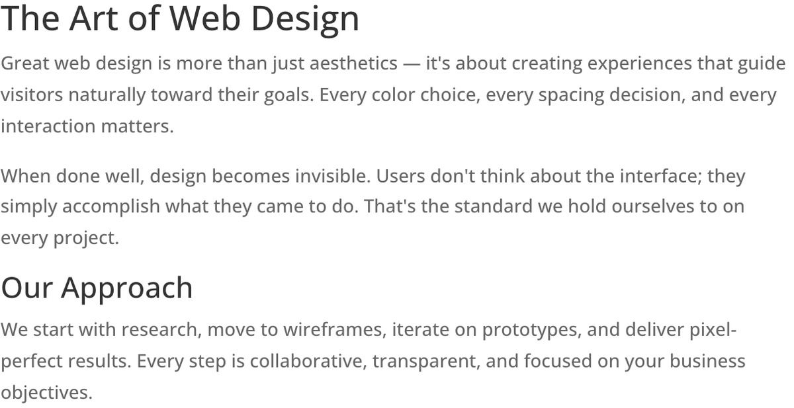

# Text Module

The Text module is Divi's primary content block, providing a rich text editor for adding paragraphs, headings, lists, links, and inline HTML to any page.

!!! abstract "Quick Reference"
    **What it does:** Provides a rich text editor for paragraphs, headings, lists, links, and raw HTML within a Divi module container.
    **When to use it:** Long-form content, HTML embeds, styled typographic elements
    **Key settings:** Body (rich text/HTML), Heading Font/Size/Color, Body Text, Link Color
    **Block identifier:** `divi/text`
    **ET Docs:** [Official documentation](https://help.elegantthemes.com/en/articles/10365197-the-text-module-in-divi-5)

!!! tip "When to Use This Module"
    - Writing article-style content with paragraphs, headings, and lists
    - Embedding custom HTML, iframes, or third-party widget code
    - Combining multiple text elements (headings, body, blockquotes) in a single block

!!! warning "When NOT to Use This Module"
    - Pairing text with an icon or image in a structured card → use [Blurb](blurb.md)
    - Adding a standalone heading without body text → use [Heading](heading.md)
    - Inserting raw code that should not be processed by the visual editor → use [Code](code.md)

## Overview

The Text module is the most fundamental building block in the Divi module library. It wraps a full-featured visual text editor inside a Divi module container, giving you the ability to write and format content using familiar word-processing controls while retaining access to Divi's design system for typography, spacing, and animation.

Unlike more specialized modules such as [Blurb](blurb.md) or [Call to Action](call-to-action.md), the Text module imposes no structural constraints on your content. You can write a single heading, a multi-paragraph article, an HTML embed, or a combination of all three. This flexibility makes it the default choice for any content that does not require the predefined layout of a dedicated module.

The module supports both the visual editor mode and a raw text/HTML mode, allowing advanced users to paste custom markup directly. Typography controls are split between general text settings, heading-specific settings, and body-specific settings, giving you granular control over every typographic element within the module.

For additional reference, see the [official Elegant Themes documentation](https://help.elegantthemes.com/en/articles/10365197-the-text-module-in-divi-5).

[View A Live Demo Of This Module](https://www.16wells.dev/module-demos/text/)

{ loading=lazy }
*The Text module as it appears on the live demo.*

## Use Cases

1. **Long-Form Content Sections** — Use the Text module for article-style content within Divi layouts. Set a max-width of 700-800px and center the module to create an optimal reading experience with comfortable line lengths.

2. **HTML Embeds and Custom Markup** — The Text module accepts raw HTML in its editor, making it useful for embedding third-party widgets, custom forms, iframes, or script-based content that lacks a dedicated Divi module.

3. **Styled Typographic Elements** — Combine headings, body text, and lists within a single module and apply distinct typography settings to each. Use the heading typography controls to create visual hierarchy without needing separate heading and paragraph modules.

## How to Add the Text Module

1. **Open the Visual Builder** on the page where you want to add text content. Click the gray plus icon inside any row to open the module picker.

2. **Search for "Text"** in the module picker search bar, then click the Text module to insert it into the row.

3. **Enter your content** using the visual editor or switch to the text/HTML view for raw markup. Adjust typography, spacing, and design settings through the Design tab.

## Settings & Options

### Content Tab

The Content tab contains the text editor and structural controls for the module.

| Setting | Type | Description |
|---------|------|-------------|
| **Text** | | |
| Body | rich text | The main content area with a visual editor supporting paragraphs, headings, lists, links, images, and raw HTML |
| **Link** | | |
| Module Link URL | url | Makes the entire module a clickable link to the specified destination |
| Module Link Target | select | Opens the link in the same window or a new tab |
| **Background** | | |
| Background Color | color | Solid background color applied behind the module |
| Background Gradient | gradient | Gradient background with direction and color stop controls |
| Background Image | upload | An image displayed behind the module content |
| Background Video | url | A video URL (MP4 or WebM) used as a motion background |
| Background Pattern | select | A decorative pattern overlay applied to the background |
| Background Mask | select | A shaped mask overlay applied to the background |
| **Loop** | | |
| Dynamic Content | toggle | Enable dynamic content connections for supported fields |
| **Order** | | |
| Module Order | select | Position of this module relative to siblings in the row |
| **Meta** | | |
| Admin Label | text | A custom label shown in the builder layers panel for easy identification |
| Disable On | toggle | Disable the module on specific device sizes (phone, tablet, desktop) |

### Design Tab

The Design tab provides typography, sizing, and visual styling controls for all text elements within the module.

**Module-specific settings:**

| Setting | Type | Description |
|---------|------|-------------|
| Heading Font | typography | Font family, weight, style, and line height for heading tags (H1-H6) |
| Heading Text Color | color | Font color for all heading elements |
| Heading Text Size | range | Font size for heading elements |
| Heading Letter Spacing | range | Letter spacing for heading text |
| Heading Line Height | range | Line height for heading elements |
| Heading Text Shadow | composite | Shadow effect applied to heading text |
| Link Color | color | Color applied to hyperlinks within the module |
| Unordered List Font | typography | Font settings for unordered list items |
| Ordered List Font | typography | Font settings for ordered list items |
| Block Quote Font | typography | Font settings for blockquote elements |

**Shared design options** — see [Options Groups](../options-groups/index.md) for detailed documentation:

| Options Group | Description |
|--------------|-------------|
| [Text](../options-groups/text.md) | Font, weight, alignment, color, line height, text shadow |
| [Body Text](../options-groups/body-text.md) | Font, size, color, spacing for paragraph text |
| [Sizing](../options-groups/sizing.md) | Width, max-width, min-height, height, alignment |
| [Spacing](../options-groups/spacing.md) | Margin and padding with responsive breakpoint controls |
| [Border](../options-groups/border.md) | Width, color, style, border radius |
| [Box Shadow](../options-groups/box-shadow.md) | Horizontal/vertical offset, blur, spread, color, position |
| [Filters](../options-groups/filters.md) | Brightness, contrast, saturation, hue rotation, blur, invert, sepia, opacity, blend mode |
| [Transform](../options-groups/transform.md) | Scale, translate, rotate, skew, transform origin |
| [Animation](../options-groups/animation.md) | Entrance animation style, direction, duration, delay, intensity |

### Advanced Tab

The Advanced tab provides technical controls for custom attributes, CSS overrides, conditional display logic, and scroll-based effects.

**Shared advanced options** — see [Options Groups](../options-groups/index.md) for detailed documentation:

| Options Group | Description |
|--------------|-------------|
| [Attributes](../options-groups/attributes.md) | CSS ID, classes, custom HTML attributes |
| [CSS](../options-groups/css.md) | Custom CSS per element target (main element, inner text container, before, after) |
| HTML | Custom HTML attributes for module wrapper |
| [Conditions](../options-groups/conditions.md) | Display rules (user role, page type, date, logic) |
| Interactions | Hover, click, or scroll-triggered interactions |
| [Visibility](../options-groups/visibility.md) | Device visibility toggles |
| [Transitions](../options-groups/transitions.md) | Hover transition timing |
| [Position](../options-groups/position.md) | CSS position and offsets |
| [Scroll Effects](../options-groups/scroll-effects.md) | Scroll-driven animation effects |

## Code Examples

### Custom CSS

```css
/* Constrain line length for readability */
.et_pb_text_inner {
    max-width: 65ch;
}

/* Style the first paragraph as a lead-in */
.et_pb_text_inner p:first-of-type {
    font-size: 1.2em;
    font-weight: 500;
    line-height: 1.6;
}

/* Custom unordered list styling with arrow markers */
.et_pb_text_inner ul li {
    padding-left: 1.5em;
    position: relative;
    list-style: none;
}
.et_pb_text_inner ul li::before {
    content: "\2192";
    position: absolute;
    left: 0;
}

/* Styled blockquote */
.et_pb_text_inner blockquote {
    border-left: 4px solid #2ea3f2;
    padding-left: 20px;
    margin: 24px 0;
    font-style: italic;
    color: #666;
}

/* Responsive font size reduction */
@media (max-width: 767px) {
    .et_pb_text_inner {
        font-size: 15px;
    }
}
```

### PHP Hooks

```php
/**
 * Automatically add target="_blank" and rel="noopener" to external links
 * within Text modules.
 */
function divi_text_external_links( $output, $render_slug ) {
    if ( 'et_pb_text' !== $render_slug ) {
        return $output;
    }

    $site_url = preg_quote( home_url(), '/' );

    $output = preg_replace_callback(
        '/<a\s+([^>]*?)href="(https?:\/\/(?!' . $site_url . ')[^"]*)"([^>]*?)>/i',
        function ( $matches ) {
            $before = $matches[1];
            $href   = $matches[2];
            $after  = $matches[3];

            if ( strpos( $matches[0], 'target=' ) === false ) {
                return '<a ' . $before . 'href="' . $href . '"' . $after . ' target="_blank" rel="noopener">';
            }
            return $matches[0];
        },
        $output
    );

    return $output;
}
add_filter( 'et_module_shortcode_output', 'divi_text_external_links', 10, 2 );
```

## Common Patterns

1. **Readable Article Layout** — Place the Text module in a row with a single column, set the module max-width to 750px, and center-align it. This constrains line length for comfortable reading and mirrors the layout conventions of modern editorial websites.

2. **Two-Column Text Blocks** — Use two Text modules in a two-column row to create side-by-side content areas. This works well for comparing features, presenting before/after scenarios, or splitting an introduction from a detail list.

3. **Inline HTML Embeds** — Switch to the text/HTML editing mode to paste embed codes for third-party services such as forms, maps, or social feeds. The Text module renders arbitrary HTML on the front end, making it a versatile fallback when no dedicated module exists for the content you need.

## AI Interaction Notes

!!! warning "Create vs. Modify"
    Modifying existing module content via REST API (`wp.apiFetch` PATCH) updates
    title, body text, and settings attributes. **Creating new modules via REST API**
    produces content that renders on the front end but may not appear in the Visual
    Builder layer view. Use browser automation for reliable module creation.
    See [REST API Content Playbook](../playbooks/rest-api-content.md).

**Block identifier:** `divi/text` — *Needs verification on current build*

| Operation | Method | Status | Notes |
|-----------|--------|--------|-------|
| Read content | Parse `post_content` block JSON | Observed | Use brace-depth parser — see [Content Encoding](../internals/content-encoding.md) |
| Modify existing | `wp.apiFetch` PATCH on post endpoint | Observed | Update block attributes in `post_content` |
| Create new | Browser automation (Playwright) | Observed | REST creation may break VB visibility |
| Batch modify | Sequential REST requests | Needs Testing | See [REST API Content Playbook](../playbooks/rest-api-content.md) |

**Key content attributes** — *JSON paths need verification*:

| Attribute | JSON Path | Notes |
|-----------|-----------|-------|
| Body | `attrs.content` | Rich text content (HTML supported) |

!!! tip "Module Selection Guidance"
    For rich text content use Text; for heading-only use Heading; for icon+text combos use Blurb; for raw HTML/shortcodes use Code.

## Saving Your Work

After editing your Text module content and design, click the green checkmark at the bottom of the settings panel to apply the changes. Save the page using the purple save button in the bottom dock of the Visual Builder, or use the keyboard shortcut `Ctrl + S` (Windows) or `Cmd + S` (Mac). If you plan to reuse the same text block configuration across multiple pages, save it to the Divi Library for quick access.

## Version Notes

!!! note "Divi 5 Only"
    This page documents Divi 5 behavior exclusively. The inner wrapper class structure and CSS selectors may differ from Divi 4. Verify custom CSS selectors using your browser inspector when migrating styles from earlier versions.

## Troubleshooting

!!! warning "Content Disappearing in the Visual Builder"
    If text content disappears while editing in the Visual Builder, check for unclosed HTML tags in the content body. The Visual Builder's parser is stricter than the front-end renderer and will drop content that follows malformed markup. Switch to the text/HTML view to inspect and fix any unclosed tags.

!!! warning "Typography Settings Not Applying"
    Divi's typography settings rely on CSS specificity to override theme defaults. If your font, size, or color changes are not visible on the front end:

    - Confirm you are editing the correct typography group (Heading Text vs. Body Text)
    - Check for conflicting styles from child themes or third-party plugins with higher specificity
    - Clear all caching layers (plugin cache, server cache, browser cache) and reload

!!! warning "Dynamic Content Not Rendering"
    If dynamic content placeholders show raw tokens instead of resolved values:

    - Verify that the dynamic content source (custom field, post meta, etc.) contains data for the current post
    - Ensure the Loop settings are correctly configured if pulling data from a query
    - Check that the field name matches exactly, including case sensitivity

## Related

- [Blurb Module](blurb.md) — pairs text content with an icon or image for feature blocks
- [Code Module](code.md) — for raw HTML, CSS, and JavaScript that should not be processed by the visual editor
- [Button Module](button.md) — adds a styled call-to-action button linked to any URL
- [Heading Module](heading.md) — standalone heading element for section titles and page headings
- [Text Options](../options-groups/text.md) — Shared typography settings for font, size, color, and alignment
- [Playbook: CSS in Divi](../playbooks/css-in-divi.md) — Best practices for styling text with custom CSS
