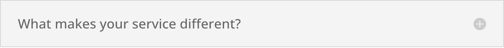

# Toggle Module

The Toggle module creates a collapsible content panel that visitors can expand or collapse by clicking its title bar.

!!! abstract "Quick Reference"
    **What it does:** Creates an independently collapsible content panel with a clickable title bar and expandable body area.
    **When to use it:** FAQ sections, product/service detail breakdowns, step-by-step instructions
    **Key settings:** Title, Body (rich text), Open State (default open/closed), Open/Close Icon, Icon Color
    **Block identifier:** `divi/toggle`
    **ET Docs:** [Official documentation](https://help.elegantthemes.com/en/articles/10368052-the-toggle-module-in-divi-5)

!!! tip "When to Use This Module"
    - Building FAQ sections where visitors scan questions and expand answers
    - Organizing detailed product specifications into collapsible categories
    - Presenting step-by-step instructions with progressive disclosure

!!! warning "When NOT to Use This Module"
    - Grouping collapsible items where only one should be open at a time → use [Accordion](accordion.md)
    - Organizing content into horizontal switchable panels → use [Tabs](tabs.md)

## Overview

The Toggle module provides a simple show/hide interaction for content sections. Each toggle consists of a clickable title bar and a body area that expands or collapses when the title is clicked. This pattern helps you present large amounts of information in a compact format without overwhelming visitors with a wall of text.

Toggles are one of the most effective ways to organize informational content on a page. They work especially well for FAQ sections, product specifications, service descriptions, pricing breakdowns, and any scenario where visitors may only need to read a subset of the available content. By letting users choose what to expand, you reduce cognitive load and improve the overall browsing experience.

Unlike the Accordion module, which groups multiple collapsible items together and ensures only one is open at a time, each Toggle module operates independently. You can place multiple toggles in a row and visitors can open as many as they want simultaneously. You can also set the default state of each toggle to open or closed, giving you control over what content is visible when the page first loads.

For additional reference, see the [official Elegant Themes documentation](https://help.elegantthemes.com/en/articles/10368052-the-toggle-module-in-divi-5).

[View A Live Demo Of This Module](https://www.16wells.dev/module-demos/toggle/)

{ loading=lazy }
*The Toggle module as it appears on the live demo.*

## Use Cases

1. **FAQ Sections** — Stack multiple Toggle modules in a single column to create a frequently asked questions page. Set each toggle title to a question and the body to the answer. Set all toggles to closed by default so visitors can scan the questions and open only the ones relevant to them.

2. **Product or Service Details** — Use toggles to organize detailed specifications, feature lists, or service tiers. Each toggle can represent a category of information (dimensions, materials, warranty, shipping), keeping the page clean while making all details accessible.

3. **Step-by-Step Instructions** — Present multi-step processes where each toggle represents one step. Visitors can work through the steps sequentially, closing completed steps and opening the next. This keeps long instructional content manageable.

## How to Add the Toggle Module

1. **Open the Visual Builder** on the page where you want the collapsible content to appear. Click the gray plus icon inside any row to open the module picker.

2. **Search for "Toggle"** in the module picker search bar, then click the Toggle module to insert it into the row.

3. **Configure the toggle** by entering a title and body content in the Content tab. Set the default state (open or closed) and adjust design settings to match your site's style. Repeat by adding additional Toggle modules in the same column for a multi-item list.

## Settings & Options

### Content Tab

The Content tab holds the toggle's text content, default state, and structural controls.

| Setting | Type | Description |
|---------|------|-------------|
| **Text** | | |
| Title | text | The clickable heading text displayed on the toggle bar |
| Body | rich text | The collapsible content area, supports visual editing and HTML |
| **State** | | |
| Open State | toggle | Whether the toggle is expanded (open) or collapsed (closed) when the page loads |
| **Link** | | |
| Module Link URL | url | Makes the entire module a clickable link to the specified destination |
| Module Link Target | select | Opens the link in the same window or a new tab |
| **Background** | | |
| Background Color | color | Solid background color applied behind the module |
| Background Gradient | gradient | Gradient background with direction and color stop controls |
| Background Image | upload | An image displayed behind the module content |
| Background Video | url | A video URL (MP4 or WebM) used as a motion background |
| Background Pattern | select | A decorative pattern overlay applied to the background |
| Background Mask | select | A shaped mask overlay applied to the background |
| **Loop** | | |
| Dynamic Content | toggle | Enable dynamic content connections for supported fields |
| **Order** | | |
| Module Order | select | Position of this module relative to siblings in the row |
| **Meta** | | |
| Admin Label | text | A custom label shown in the builder layers panel for easy identification |
| Disable On | toggle | Disable the module on specific device sizes (phone, tablet, desktop) |

### Design Tab

The Design tab provides visual controls for the toggle icon, title bar appearance, and all typography elements.

**Module-specific settings:**

| Setting | Type | Description |
|---------|------|-------------|
| Open Icon | icon picker | The icon displayed when the toggle is in the expanded state |
| Close Icon | icon picker | The icon displayed when the toggle is in the collapsed state |
| Icon Color | color | Color of the toggle open/close icon |
| Icon Size | range | Size of the toggle icon in pixels |
| Open Toggle Background Color | color | Background color of the toggle when it is expanded |
| Closed Toggle Background Color | color | Background color of the toggle when it is collapsed |
| Open Toggle Icon Color | color | Icon color when the toggle is in the open state |
| Closed Toggle Icon Color | color | Icon color when the toggle is in the closed state |
| Closed Title Text | typography group | Font family, weight, style, color, size, letter spacing, line height, text shadow for the title when the toggle is closed |

**Shared design options** — see [Options Groups](../options-groups/index.md) for detailed documentation:

| Options Group | Description |
|--------------|-------------|
| [Text](../options-groups/text.md) | Font, weight, alignment, color, line height, text shadow |
| [Title Text](../options-groups/title-text.md) | Font, weight, size, color, letter spacing, line height, text shadow for the toggle title |
| [Body Text](../options-groups/body-text.md) | Font, size, color, spacing for the toggle body content |
| [Sizing](../options-groups/sizing.md) | Width, max-width, min-height, height, alignment |
| [Spacing](../options-groups/spacing.md) | Margin and padding with responsive breakpoint controls |
| [Border](../options-groups/border.md) | Width, color, style, border radius |
| [Box Shadow](../options-groups/box-shadow.md) | Horizontal/vertical offset, blur, spread, color, position |
| [Filters](../options-groups/filters.md) | Brightness, contrast, saturation, hue rotation, blur, invert, sepia, opacity, blend mode |
| [Transform](../options-groups/transform.md) | Scale, translate, rotate, skew, transform origin |
| [Animation](../options-groups/animation.md) | Entrance animation style, direction, duration, delay, intensity |

### Advanced Tab

The Advanced tab provides technical controls for custom attributes, CSS overrides, conditional display logic, and scroll-based effects.

**Shared advanced options** — see [Options Groups](../options-groups/index.md) for detailed documentation:

| Options Group | Description |
|--------------|-------------|
| [Attributes](../options-groups/attributes.md) | CSS ID, classes, custom HTML attributes |
| [CSS](../options-groups/css.md) | Custom CSS per element target (main element, toggle title, toggle icon, toggle content, before, after) |
| HTML | Custom HTML attributes for module wrapper |
| [Conditions](../options-groups/conditions.md) | Display rules (user role, page type, date, logic) |
| Interactions | Hover, click, or scroll-triggered interactions |
| [Visibility](../options-groups/visibility.md) | Device visibility toggles |
| [Transitions](../options-groups/transitions.md) | Hover transition timing |
| [Position](../options-groups/position.md) | CSS position and offsets |
| [Scroll Effects](../options-groups/scroll-effects.md) | Scroll-driven animation effects |

## Code Examples

### Custom CSS

```css
/* Remove default border and add card-style shadow */
.et_pb_toggle {
    border: none;
    border-radius: 8px;
    box-shadow: 0 2px 12px rgba(0, 0, 0, 0.06);
    margin-bottom: 16px;
    overflow: hidden;
}

/* Style the toggle title bar */
.et_pb_toggle_title {
    font-weight: 600;
    padding: 20px 24px;
    position: relative;
}

/* Change the open/close icon to a plus/minus */
.et_pb_toggle_title::after {
    content: "+";
    font-size: 24px;
    font-weight: 300;
    position: absolute;
    right: 24px;
    top: 50%;
    transform: translateY(-50%);
}
.et_pb_toggle_open .et_pb_toggle_title::after {
    content: "\2013";
}

/* Add a left accent border to open toggles */
.et_pb_toggle_open {
    border-left: 4px solid #2ea3f2;
}

/* Responsive adjustments */
@media (max-width: 767px) {
    .et_pb_toggle_title {
        padding: 16px 20px;
        font-size: 16px;
    }
    .et_pb_toggle_content {
        padding: 16px 20px;
    }
}
```

### PHP Hooks

```php
/**
 * Add schema.org FAQ structured data to pages with Toggle modules.
 */
function add_toggle_faq_schema( $output, $render_slug ) {
    if ( 'et_pb_toggle' !== $render_slug ) {
        return $output;
    }

    // Extract title and content from the module output
    preg_match( '/<h[1-6][^>]*class="et_pb_toggle_title"[^>]*>(.*?)<\/h[1-6]>/s', $output, $title_match );
    preg_match( '/<div class="et_pb_toggle_content[^"]*">(.*?)<\/div>/s', $output, $content_match );

    if ( ! empty( $title_match[1] ) && ! empty( $content_match[1] ) ) {
        $question = wp_strip_all_tags( $title_match[1] );
        $answer   = wp_strip_all_tags( $content_match[1] );

        $schema = '<script type="application/ld+json">';
        $schema .= json_encode( array(
            '@context'   => 'https://schema.org',
            '@type'      => 'Question',
            'name'       => $question,
            'acceptedAnswer' => array(
                '@type' => 'Answer',
                'text'  => $answer,
            ),
        ) );
        $schema .= '</script>';

        $output .= $schema;
    }

    return $output;
}
add_filter( 'et_module_shortcode_output', 'add_toggle_faq_schema', 10, 2 );
```

## Common Patterns

1. **FAQ Page** — Stack multiple Toggle modules in a single column, each with a question as the title and the answer as the body content. Set all toggles to the closed state by default. Apply consistent styling across all toggles using a shared CSS class for visual uniformity. Consider adding FAQ schema markup for SEO benefits.

2. **Categorized Information Sections** — Group related toggles under heading modules to create organized information sections. For example, a product page might have a "Specifications" heading followed by toggles for Dimensions, Materials, and Care Instructions, then a "Shipping" heading with toggles for Delivery Times and Return Policy.

3. **Progressive Disclosure for Long Content** — Break lengthy content into logical sections using toggles. This works well for legal pages (terms of service, privacy policies), documentation, or detailed guides where visitors typically need only specific sections rather than reading everything end to end.

## AI Interaction Notes

!!! warning "Create vs. Modify"
    Modifying existing module content via REST API (`wp.apiFetch` PATCH) updates
    title, body text, and settings attributes. **Creating new modules via REST API**
    produces content that renders on the front end but may not appear in the Visual
    Builder layer view. Use browser automation for reliable module creation.
    See [REST API Content Playbook](../playbooks/rest-api-content.md).

**Block identifier:** `divi/toggle` — *Needs verification on current build*

| Operation | Method | Status | Notes |
|-----------|--------|--------|-------|
| Read content | Parse `post_content` block JSON | Observed | Use brace-depth parser — see [Content Encoding](../internals/content-encoding.md) |
| Modify existing | `wp.apiFetch` PATCH on post endpoint | Observed | Update block attributes in `post_content` |
| Create new | Browser automation (Playwright) | Observed | REST creation may break VB visibility |
| Batch modify | Sequential REST requests | Needs Testing | See [REST API Content Playbook](../playbooks/rest-api-content.md) |

**Key content attributes** — *JSON paths need verification*:

| Attribute | JSON Path | Notes |
|-----------|-----------|-------|
| Title | `attrs.title` | Clickable toggle heading text |
| Content | `attrs.content` | Collapsible body content |
| Open | `attrs.open` | Default open/closed state |

!!! tip "Module Selection Guidance"
    For independently collapsible items use Toggle; for one-at-a-time collapsible groups use Accordion; for horizontal tabs use Tabs.

## Saving Your Work

After configuring your Toggle module, click the green checkmark at the bottom of the settings panel to save the module settings. Save the page using the purple save button in the bottom dock of the Visual Builder, or use `Ctrl + S` (Windows) or `Cmd + S` (Mac). If you build a toggle with specific styling that you want to reuse, save it to the Divi Library as a reusable module.

## Version Notes

!!! note "Divi 5 Only"
    This page documents Divi 5 behavior exclusively. The Toggle module in Divi 5 uses the updated options framework and may have different CSS class structures compared to Divi 4. Verify custom CSS selectors when migrating from earlier versions.

## Troubleshooting

!!! warning "Toggle Not Opening or Closing"
    If clicking the toggle title does not expand or collapse the content:

    - Check for JavaScript errors in the browser console that may be blocking the toggle interaction
    - Verify that no other plugins are conflicting with Divi's JavaScript (common with caching plugins that defer or combine scripts)
    - Ensure the toggle module is not wrapped inside a link element, which can intercept click events

!!! warning "Content Overflowing When Toggle Opens"
    If the toggle body content extends beyond its container or overlaps other elements when expanded:

    - Check the Overflow settings in the Advanced tab and set them to `visible`
    - Remove any fixed height values from the Sizing settings in the Design tab
    - If using images or embeds in the toggle body, ensure they have responsive widths (max-width: 100%)

!!! warning "Open State Not Respecting Default Setting"
    If a toggle opens or closes on page load contrary to your State setting:

    - Confirm the Open State toggle in the Content tab is set to your desired default
    - Clear all caching layers (plugin cache, server cache, CDN cache) as cached pages may reflect a previous setting
    - Check for JavaScript that may be programmatically toggling the state on page load

## Related

- [Accordion Module](accordion.md) — groups multiple collapsible items where only one can be open at a time
- [Tabs Module](tabs.md) — organizes content into horizontal or vertical tabbed panels
- [Toggle Icon Options](../options-groups/toggle-icon.md) — Style the expand/collapse indicator icon
- [Toggle Options](../options-groups/toggle.md) — Shared toggle container styling settings
- [Playbook: Build a Page](../playbooks/build-a-page.md) — Step-by-step page building workflow
