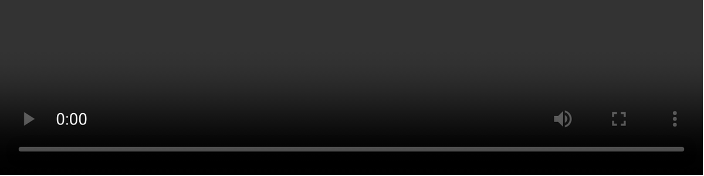

# Video

The Video module embeds a single video player from a self-hosted file, YouTube, or Vimeo into your page layout.

!!! abstract "Quick Reference"
    **What it does:** Embeds a responsive video player from a self-hosted file, YouTube, or Vimeo with an optional overlay thumbnail.
    **When to use it:** Product demos, tutorial embeds, hero section media, testimonial recordings
    **Key settings:** Video (URL/upload), Overlay image, Play Icon styling, Overlay styling
    **Block identifier:** `divi/video`
    **ET Docs:** [Official documentation](https://help.elegantthemes.com/en/articles/10368098-the-video-module-in-divi-5)

!!! tip "When to Use This Module"
    - Embedding a single video from YouTube, Vimeo, or a self-hosted MP4 file
    - Adding a branded overlay thumbnail with a custom play button
    - Placing a featured video in a hero section or product page

!!! warning "When NOT to Use This Module"
    - Displaying multiple videos in a navigable carousel → use [Video Slider](video-slider.md)
    - Embedding audio-only content → use [Audio](audio.md)

## Overview

The Video module lets you place a video anywhere in your Divi 5 layout. It accepts a direct video file upload through the WordPress media library or a URL from a supported third-party host such as YouTube or Vimeo. The module renders a responsive player that adapts to the width of its parent column, so videos look correct on every screen size without additional configuration.

A key feature of the Video module is its overlay image support. Rather than displaying the default player chrome or a black frame before playback begins, you can assign a custom thumbnail image — or generate one directly from the video — to create a polished, branded appearance. The play icon that appears on top of the overlay is fully customizable through the Design tab, giving you control over color and shape.

Because the module handles both self-hosted and externally hosted video, it suits a wide range of situations: hero background alternatives, product demonstrations, tutorial embeds, testimonial recordings, and more. When you need to present multiple videos in a navigable carousel, consider the [Video Slider](video-slider.md) module instead.

For additional reference, see the [official Elegant Themes documentation](https://help.elegantthemes.com/en/articles/10368098-the-video-module-in-divi-5).

[View A Live Demo Of This Module](https://www.16wells.dev/module-demos/video/)

{ loading=lazy }
*The Video module as it appears on the live demo.*

## Use Cases

1. **Product or Service Demonstrations** — Embed a walkthrough video on a landing page to show prospective customers how your product works, replacing lengthy text descriptions with a visual explanation.
2. **Tutorial or Training Content** — Place instructional videos inside course pages, knowledge bases, or onboarding flows so users can follow along at their own pace.
3. **Hero Section Media** — Feature a prominent video at the top of a page with a custom overlay image and branded play button to capture attention immediately upon arrival.

## How to Add the Video Module

1. Open the Visual Builder on the page you want to edit.
2. Click the gray **+** icon to add a new module to a row.
3. Search for "Video" in the module picker or locate it in the Media category, then click to insert it.

For an animated walkthrough of adding and configuring this module, see the
[official Elegant Themes documentation](https://help.elegantthemes.com/en/articles/10368098-the-video-module-in-divi-5).

## Settings & Options

The Video module settings are organized across three tabs: Content, Design, and Advanced.

### Content Tab

The Content tab is where you specify the video source and configure the overlay thumbnail.

| Setting | Type | Description |
|---------|------|-------------|
| Video | url / upload | Provide the video source. Upload an MP4 or other supported file through the media library, or paste a YouTube or Vimeo URL. The module auto-detects the source type and renders the appropriate player. |
| Overlay | image picker | Set a static image that appears over the video before playback starts. You can upload a custom image, choose one from the media library, or click **Generate From Video** to create a thumbnail frame automatically. |
| Order | number / select | Control the module's display order when placed inside a Flexbox or CSS Grid container. Useful for reordering elements without moving them in the layer tree. |
| Meta | admin label / visibility | Assign a custom label to identify this module in the Visual Builder's layer panel and optionally force its visibility during editing. |

<!-- { loading=lazy } -->
<!-- TODO: Capture Content tab screenshot -->

### Design Tab

The Design tab controls the visual presentation of the video player, its overlay, and the play icon.

**Module-specific settings:**

| Setting | Type | Description |
|---------|------|-------------|
| Play Icon | icon styling | Customize the play button that appears on the overlay image. Adjust its color, size, and hover state to match your site branding. |
| Overlay | overlay styling | Style the overlay layer that sits on top of the video before playback. Configure opacity, color tints, or blending effects for a polished pre-play appearance. |

**Shared design options** — see [Options Groups](../options-groups/index.md) for detailed documentation:

| Options Group | Description |
|--------------|-------------|
| [Sizing](../options-groups/sizing.md) | Width, max-width, min-height, height, alignment |
| [Spacing](../options-groups/spacing.md) | Margin and padding with responsive breakpoint controls |
| [Border](../options-groups/border.md) | Width, color, style, border radius |
| [Box Shadow](../options-groups/box-shadow.md) | Horizontal/vertical offset, blur, spread, color, position |
| [Filters](../options-groups/filters.md) | Brightness, contrast, saturation, hue rotation, blur, invert, sepia, opacity, blend mode |
| [Transform](../options-groups/transform.md) | Scale, translate, rotate, skew, transform origin |
| [Animation](../options-groups/animation.md) | Entrance animation style, direction, duration, delay, intensity |

### Advanced Tab

The Advanced tab provides developer-oriented controls for custom attributes, conditional logic, and scroll-driven effects.

**Shared advanced options** — see [Options Groups](../options-groups/index.md) for detailed documentation:

| Options Group | Description |
|--------------|-------------|
| [Attributes](../options-groups/attributes.md) | CSS ID, classes, custom HTML attributes |
| [CSS](../options-groups/css.md) | Custom CSS per element target (video container, overlay, play icon) |
| HTML | Custom HTML attributes for module wrapper |
| [Conditions](../options-groups/conditions.md) | Display rules (user role, page type, date, logic) |
| Interactions | Hover, click, or scroll-triggered interactions |
| [Visibility](../options-groups/visibility.md) | Device visibility toggles |
| [Transitions](../options-groups/transitions.md) | Hover transition timing |
| [Position](../options-groups/position.md) | CSS position and offsets |
| [Scroll Effects](../options-groups/scroll-effects.md) | Scroll-driven animation effects |

## Code Examples

### Custom CSS

```css
/* Add rounded corners and a shadow to the video player */
.et_pb_video {
    border-radius: 12px;
    overflow: hidden;
    box-shadow: 0 4px 20px rgba(0, 0, 0, 0.15);
}

/* Style the overlay play button on hover */
.et_pb_video .et_pb_video_play:hover {
    transform: scale(1.1);
    transition: transform 0.3s ease;
}

/* Constrain video width on large screens */
@media (min-width: 1200px) {
    .et_pb_video {
        max-width: 800px;
        margin-left: auto;
        margin-right: auto;
    }
}

/* Responsive spacing adjustments */
@media (max-width: 980px) {
    .et_pb_video {
        margin-bottom: 20px;
    }
}
```

### PHP Hooks

```php
/* Filter the Video module output */
add_filter('et_module_shortcode_output', function($output, $render_slug) {
    if ('et_pb_video' !== $render_slug) {
        return $output;
    }

    // Wrap the video in a custom container for additional styling
    $output = '<div class="custom-video-wrapper">' . $output . '</div>';

    return $output;
}, 10, 2);
```

## Common Patterns

1. **Overlay Thumbnail with Branded Play Button** — Upload a high-quality custom overlay image that matches your page design, then style the play icon color to align with your brand palette. This creates a consistent, professional look rather than relying on a default video frame.

2. **Centered Hero Video** — Place the Video module in a single-column row at full width, set a max-width in the Sizing settings to prevent it from stretching too wide on large monitors, and add a box shadow for visual depth. Combine with an entrance animation for a polished above-the-fold experience.

3. **Responsive Video Gallery** — Use multiple Video modules inside a multi-column row to create a simple video grid. Apply consistent border radius and spacing across all instances so they read as a cohesive collection. For a more structured multi-video presentation, switch to the [Video Slider](video-slider.md) module.

## AI Interaction Notes

!!! warning "Create vs. Modify"
    Modifying existing module content via REST API (`wp.apiFetch` PATCH) updates
    title, body text, and settings attributes. **Creating new modules via REST API**
    produces content that renders on the front end but may not appear in the Visual
    Builder layer view. Use browser automation for reliable module creation.
    See [REST API Content Playbook](../playbooks/rest-api-content.md).

**Block identifier:** `divi/video` — *Needs verification on current build*

| Operation | Method | Status | Notes |
|-----------|--------|--------|-------|
| Read content | Parse `post_content` block JSON | Observed | Use brace-depth parser — see [Content Encoding](../internals/content-encoding.md) |
| Modify existing | `wp.apiFetch` PATCH on post endpoint | Observed | Update block attributes in `post_content` |
| Create new | Browser automation (Playwright) | Observed | REST creation may break VB visibility |
| Batch modify | Sequential REST requests | Needs Testing | See [REST API Content Playbook](../playbooks/rest-api-content.md) |

**Key content attributes** — *JSON paths need verification*:

| Attribute | JSON Path | Notes |
|-----------|-----------|-------|
| Video URL | `attrs.src` | Primary video source (MP4 or embed URL) |
| Webm URL | `attrs.src_webm` | Alternative WebM video source |
| Image Overlay URL | `attrs.image_src` | Custom thumbnail overlay image |

!!! tip "Module Selection Guidance"
    For single video embeds use Video; for video collections use Video Slider; for audio-only use Audio.

## Saving Your Work

After configuring your Video module, save your changes using one of these methods:

- Click the **green checkmark** at the bottom of the module settings to apply changes.
- Click the **Save** button in the Visual Builder toolbar to persist all page changes.
- Use the keyboard shortcut **Ctrl+S** (Windows) or **Cmd+S** (Mac) to quick-save.

## Version Notes

!!! note "Divi 5 Only"
    This page documents Divi 5 behavior exclusively. The Video module in Divi 5 uses the updated settings panel structure with Content, Design, and Advanced tabs. Some setting names and locations differ from previous versions of Divi.

## Troubleshooting

!!! warning "Video Not Playing"
    If the embedded video does not play when clicked:

    - Verify the URL is correct and publicly accessible (private or unlisted YouTube videos may not embed).
    - For self-hosted files, confirm the video format is supported by browsers (MP4 with H.264 encoding is safest).
    - Check that your hosting provider does not block large media file delivery or throttle bandwidth.

!!! warning "Overlay Image Not Displaying"
    If the custom overlay thumbnail does not appear:

    - Ensure an image is actually assigned in the Overlay setting — an empty field means no overlay.
    - Confirm the image file exists in the media library and has not been deleted.
    - If using **Generate From Video**, note that this feature requires a valid, accessible video source to extract a frame.

!!! tip "Performance Considerations"
    Embedding multiple videos on a single page can affect load times. Consider lazy-loading strategies or placing videos below the fold. For self-hosted video, use compressed MP4 files and consider a CDN to reduce server load.

## Related

- [Video Slider](video-slider.md) — Display multiple videos in a sliding carousel format
- [Audio](audio.md) — Embed audio files with a built-in player
- [Image](image.md) — Display a single image with optional lightbox and link
- [Overlay Options](../options-groups/overlay.md) — Configure play button overlay on video thumbnails
- [Sizing Options](../options-groups/sizing.md) — Control the video container dimensions and aspect ratio
