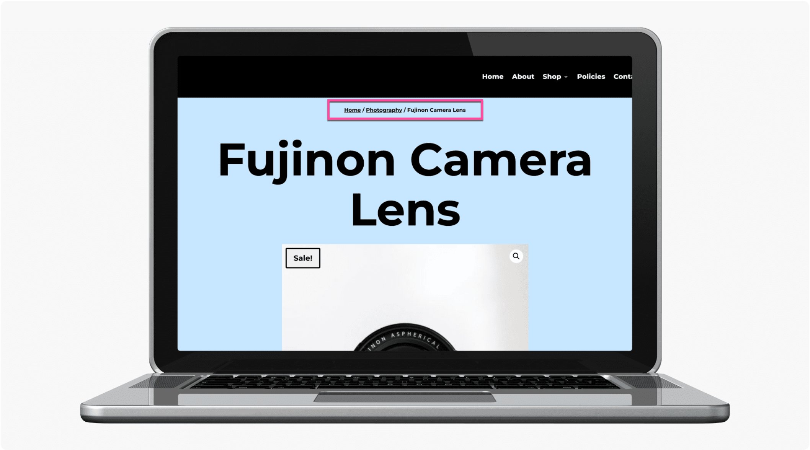

# Woo Breadcrumbs

The Woo Breadcrumbs module displays WooCommerce breadcrumb navigation to help customers orient themselves within your store.

!!! abstract "Quick Reference"
    **What it does:** Displays WooCommerce breadcrumb navigation showing the path from shop to current product or category.
    **When to use it:** Product page templates, category archive templates, custom shop layouts
    **Key settings:** Text styling, CSS customization, Visibility
    **Block identifier:** `divi/woo-breadcrumbs`
    **ET Docs:** [Official documentation](https://www.elegantthemes.com/documentation/divi/the-divi-woo-breadcrumbs-module/)

!!! tip "When to Use This Module"
    - Adding breadcrumb navigation to WooCommerce product page templates in the Theme Builder
    - Helping customers navigate back to parent categories or the shop page
    - Improving SEO with structured breadcrumb markup on product pages

!!! warning "When NOT to Use This Module"
    - On non-WooCommerce pages → breadcrumbs require WooCommerce context
    - For general site breadcrumbs outside of WooCommerce → use a dedicated breadcrumb plugin
    - For page-level navigation → use [Post Navigation](post-navigation.md)

## Overview

How to add, configure and customize the Divi Woo Breadcrumbs module.

The Divi Woo Breadcrumbs Module integrates with WooCommerce and helps customers navigate throughout your store with ease. Using Breadcrumbs in your online store will help customers orient themselves and allow returning to previous pages even easier.

Before you can add the Divi Woo Product Title Module to your website, you’ll need to have the Divi theme and WooCommerce installed on your WordPress website. Learn how to install the Divi theme on your WordPress websitehereand how to install WooCommercehere. For additional information on the Divi Builder itself, its interface, usage philosophy and best practices, please refer to ourGetting Started With The Divi Builderguide.

<!-- TODO: Replace with proper screenshot -->
<!-- { loading=lazy } -->
<!-- *The Woo Breadcrumbs module as it appears in the Divi 5 Visual Builder.* -->

## Settings & Options

### Content Tab

<!-- TODO: Verify all Content tab settings for Woo Breadcrumbs module -->

| Setting | Type | Default | Description |
|---------|------|---------|-------------|
| WooCommerce Performance Optimization | text | — | 14 Tips & Best Practices |
| Updating WooCommerce | text | — | Best Practices to Follow Every Time |

<!-- { loading=lazy } -->

### Design Tab

<!-- TODO: Verify all Design tab settings for Woo Breadcrumbs module -->

| Setting | Type | Default | Description |
|---------|------|---------|-------------|
| <!-- TODO: Document Design settings --> | | | |

<!-- { loading=lazy } -->

### Advanced Tab

<!-- TODO: Verify all Advanced tab settings for Woo Breadcrumbs module -->

| Setting | Type | Default | Description |
|---------|------|---------|-------------|
| CSS ID | text | — | Assign a unique CSS ID to the module |
| CSS Class | text | — | Assign CSS classes to the module |
| Custom CSS | code | — | Add custom CSS directly to the module's elements |
| Visibility | toggle | Show on all devices | Control device visibility (desktop, tablet, phone) |
| Transition | select | Default | Animation transition style for hover effects |

## Code Examples

### Custom CSS

```css
/* Style the Woo Breadcrumbs module */
.et_pb_wc_breadcrumbs {
    /* Add your custom styles */
    margin-bottom: 30px;
}

/* Responsive adjustments */
@media (max-width: 980px) {
    .et_pb_wc_breadcrumbs {
        padding: 20px;
    }
}
```

### PHP Hooks

```php
/* Filter the Woo Breadcrumbs module output */
add_filter('et_module_shortcode_output', function($output, $render_slug) {
    if ('et_pb_et_pb_wc_breadcrumbs' !== $render_slug) {
        return $output;
    }
    // Modify $output as needed
    return $output;
}, 10, 2);
```

## Common Patterns

<!-- TODO: Add 2-3 real-world usage patterns with screenshots -->

1. **Basic Usage** — Add the Woo Breadcrumbs module to any row in the Visual Builder and configure its settings.

2. **Styled Variation** — Use the Design tab to customize fonts, colors, and spacing to match your site's design system.

3. **Dynamic Content** — Use dynamic content fields to pull data from custom fields or post meta.

## Version Notes

!!! note "Divi 5 Only"
    This page documents Divi 5 behavior exclusively.

## Troubleshooting

!!! warning "Module Not Rendering"
    If the Woo Breadcrumbs module doesn't appear on the front end, verify that:

    - The module is not inside a disabled section or row
    - Visibility settings aren't hiding it on the current device
    - Any required fields (like URLs or content) are filled in

<!-- TODO: Add module-specific troubleshooting items -->

## Related

<!-- TODO: Add related module links -->
