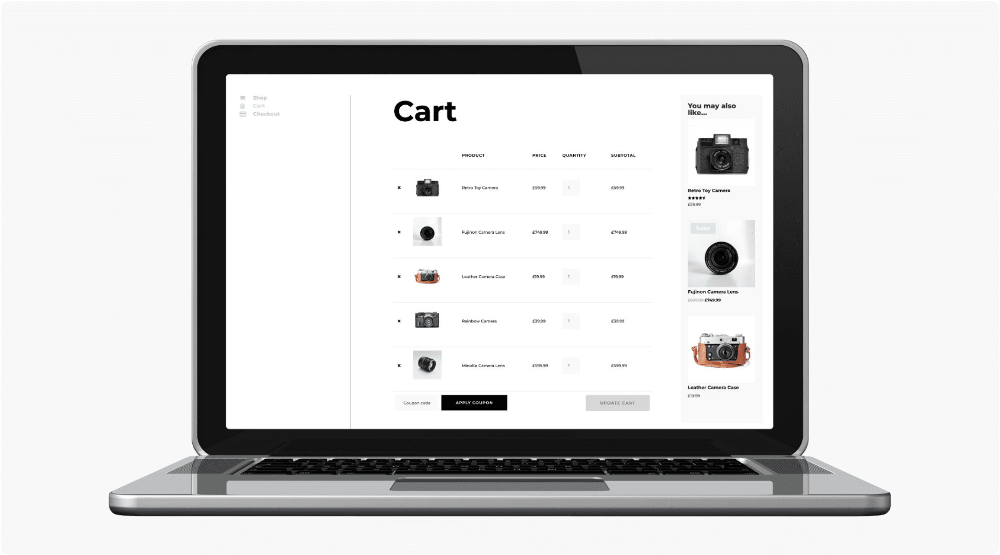
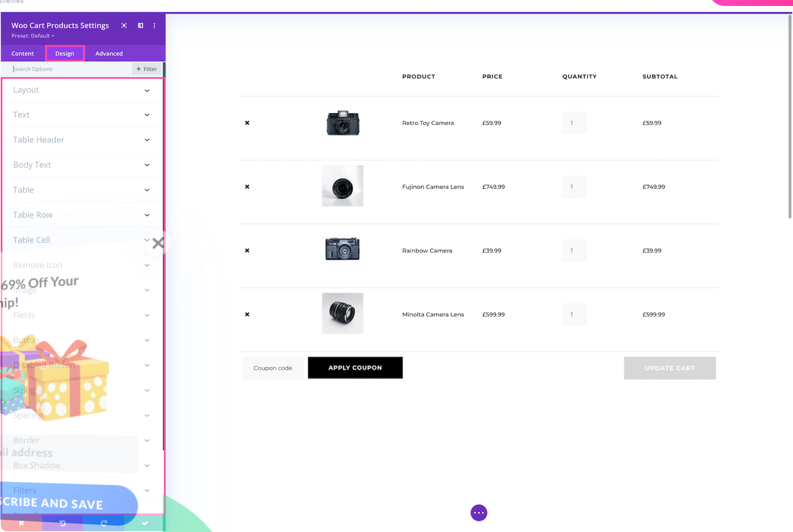

# Woo Cart Products

The Woo Cart Products module is a Divi 5 content element used in the Visual Builder.

## Overview

How to add, configure and customize the Divi Woo cart products module.

The Divi Woo Cart Products module integrates seamlessly with WooCommerce. Add this module to the cart page to display the products that have been added to the cart.

Before we can use the Divi Woo Cart Products module you’ll need to have Divi and WooCommerce installed on your website. Learn how to install the Divi themehereand learn how to install WooCommerce installed on your websitehere. Once you have the Divi theme installed and activated, we can begin using the features and functionalities of Divi. For additional information on the Divi Builder itself, its interface, usage philosophy and best practices, please refer to ourGetting Started With The Divi Builderguide.

<!-- TODO: Replace with proper screenshot -->
<!-- { loading=lazy } -->
<!-- *The Woo Cart Products module as it appears in the Divi 5 Visual Builder.* -->

## Settings & Options

### Content Tab

<!-- TODO: Verify all Content tab settings for Woo Cart Products module -->

| Setting | Type | Default | Description |
|---------|------|---------|-------------|
| WooCommerce Performance Optimization | text | — | 14 Tips & Best Practices |
| Updating WooCommerce | text | — | Best Practices to Follow Every Time |

<!-- TODO: Replace with proper screenshot -->
<!-- { loading=lazy } -->

### Design Tab

<!-- TODO: Verify all Design tab settings for Woo Cart Products module -->

| Setting | Type | Default | Description |
|---------|------|---------|-------------|
| <!-- TODO: Document Design settings --> | | | |

<!-- TODO: Replace with proper screenshot -->
<!-- { loading=lazy } -->

### Advanced Tab

<!-- TODO: Verify all Advanced tab settings for Woo Cart Products module -->

| Setting | Type | Default | Description |
|---------|------|---------|-------------|
| CSS ID | text | — | Assign a unique CSS ID to the module |
| CSS Class | text | — | Assign CSS classes to the module |
| Custom CSS | code | — | Add custom CSS directly to the module's elements |
| Visibility | toggle | Show on all devices | Control device visibility (desktop, tablet, phone) |
| Transition | select | Default | Animation transition style for hover effects |

## Code Examples

### Custom CSS

```css
/* Style the Woo Cart Products module */
.et_pb_wc_cart_products {
    /* Add your custom styles */
    margin-bottom: 30px;
}

/* Responsive adjustments */
@media (max-width: 980px) {
    .et_pb_wc_cart_products {
        padding: 20px;
    }
}
```

### PHP Hooks

```php
/* Filter the Woo Cart Products module output */
add_filter('et_module_shortcode_output', function($output, $render_slug) {
    if ('et_pb_et_pb_wc_cart_products' !== $render_slug) {
        return $output;
    }
    // Modify $output as needed
    return $output;
}, 10, 2);
```

## Common Patterns

<!-- TODO: Add 2-3 real-world usage patterns with screenshots -->

1. **Basic Usage** — Add the Woo Cart Products module to any row in the Visual Builder and configure its settings.

2. **Styled Variation** — Use the Design tab to customize fonts, colors, and spacing to match your site's design system.

3. **Dynamic Content** — Use dynamic content fields to pull data from custom fields or post meta.

## Version Notes

!!! note "Divi 5 Only"
    This page documents Divi 5 behavior exclusively.

## Troubleshooting

!!! warning "Module Not Rendering"
    If the Woo Cart Products module doesn't appear on the front end, verify that:

    - The module is not inside a disabled section or row
    - Visibility settings aren't hiding it on the current device
    - Any required fields (like URLs or content) are filled in

<!-- TODO: Add module-specific troubleshooting items -->

## Related

<!-- TODO: Add related module links -->
