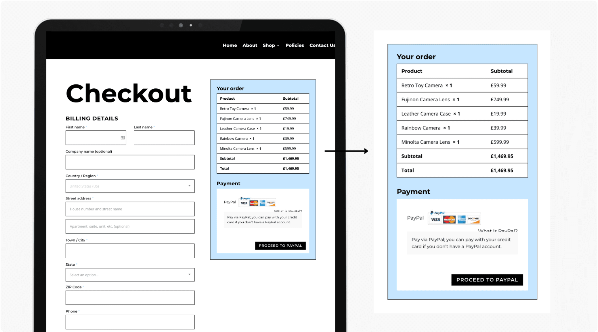

# Woo Checkout Details

The Woo Checkout Details module displays the order summary with cart products, subtotals, and totals on the checkout page.

!!! abstract "Quick Reference"
    **What it does:** Shows the list of products in the cart with subtotal and total prices on the checkout page.
    **When to use it:** Custom checkout page templates in the Theme Builder
    **Key settings:** Text styling, CSS customization, Visibility
    **Block identifier:** `divi/woo-checkout-details`
    **ET Docs:** [Official documentation](https://www.elegantthemes.com/documentation/divi/the-divi-woo-checkout-details-module/)

!!! tip "When to Use This Module"
    - Building a custom WooCommerce checkout page template in the Theme Builder
    - Displaying the order summary so customers can review items before completing purchase
    - Pairing with billing, shipping, and payment modules for a complete checkout flow

!!! warning "When NOT to Use This Module"
    - On non-checkout pages → this module requires the WooCommerce checkout context
    - For cart page product listings → use [Woo Cart Products](woo-cart-products.md)
    - For displaying a product catalog → use [Shop](shop.md)

## Overview

How to add, configure and customize the Divi Woo Checkout Details module.

The Divi Woo Checkout Details Module integrates with WooCommerce functionalities and displays the cart details. This module lists which products have been added to the cart and displays the subtotal and total prices.

Before you can add the Divi Woo Checkout Details Module to your website, you’ll need to have the Divi theme and WooCommerce installed on your WordPress website. Learn how to install the Divi theme on your WordPress websitehereand how to install WooCommercehere. For additional information on the Divi Builder itself, its interface, usage philosophy and best practices, please refer to ourGetting Started With The Divi Builderguide.

<!-- TODO: Replace with proper screenshot -->
<!-- { loading=lazy } -->
<!-- *The Woo Checkout Details module as it appears in the Divi 5 Visual Builder.* -->

## Settings & Options

### Content Tab

<!-- TODO: Verify all Content tab settings for Woo Checkout Details module -->

| Setting | Type | Default | Description |
|---------|------|---------|-------------|
| WooCommerce Performance Optimization | text | — | 14 Tips & Best Practices |
| Updating WooCommerce | text | — | Best Practices to Follow Every Time |

<!-- { loading=lazy } -->

### Design Tab

<!-- TODO: Verify all Design tab settings for Woo Checkout Details module -->

| Setting | Type | Default | Description |
|---------|------|---------|-------------|
| <!-- TODO: Document Design settings --> | | | |

<!-- { loading=lazy } -->

### Advanced Tab

<!-- TODO: Verify all Advanced tab settings for Woo Checkout Details module -->

| Setting | Type | Default | Description |
|---------|------|---------|-------------|
| CSS ID | text | — | Assign a unique CSS ID to the module |
| CSS Class | text | — | Assign CSS classes to the module |
| Custom CSS | code | — | Add custom CSS directly to the module's elements |
| Visibility | toggle | Show on all devices | Control device visibility (desktop, tablet, phone) |
| Transition | select | Default | Animation transition style for hover effects |

## Code Examples

### Custom CSS

```css
/* Style the Woo Checkout Details module */
.et_pb_wc_checkout_details {
    /* Add your custom styles */
    margin-bottom: 30px;
}

/* Responsive adjustments */
@media (max-width: 980px) {
    .et_pb_wc_checkout_details {
        padding: 20px;
    }
}
```

### PHP Hooks

```php
/* Filter the Woo Checkout Details module output */
add_filter('et_module_shortcode_output', function($output, $render_slug) {
    if ('et_pb_et_pb_wc_checkout_details' !== $render_slug) {
        return $output;
    }
    // Modify $output as needed
    return $output;
}, 10, 2);
```

## Common Patterns

<!-- TODO: Add 2-3 real-world usage patterns with screenshots -->

1. **Basic Usage** — Add the Woo Checkout Details module to any row in the Visual Builder and configure its settings.

2. **Styled Variation** — Use the Design tab to customize fonts, colors, and spacing to match your site's design system.

3. **Dynamic Content** — Use dynamic content fields to pull data from custom fields or post meta.

## Version Notes

!!! note "Divi 5 Only"
    This page documents Divi 5 behavior exclusively.

## Troubleshooting

!!! warning "Module Not Rendering"
    If the Woo Checkout Details module doesn't appear on the front end, verify that:

    - The module is not inside a disabled section or row
    - Visibility settings aren't hiding it on the current device
    - Any required fields (like URLs or content) are filled in

<!-- TODO: Add module-specific troubleshooting items -->

## Related

<!-- TODO: Add related module links -->
