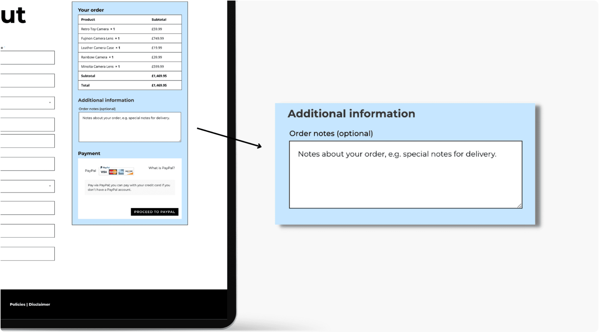

# Woo Checkout Information

The Woo Checkout Information module lets customers add order notes and special instructions during checkout.

!!! abstract "Quick Reference"
    **What it does:** Provides a text field for customers to add notes or special instructions to their order at checkout.
    **When to use it:** Custom checkout page templates in the Theme Builder
    **Key settings:** Field styling, Text styling, CSS customization, Visibility
    **Block identifier:** `divi/woo-checkout-information`
    **ET Docs:** [Official documentation](https://www.elegantthemes.com/documentation/divi/the-divi-woo-checkout-information-module/)

!!! tip "When to Use This Module"
    - Building a custom WooCommerce checkout page that accepts order notes
    - Allowing customers to provide delivery instructions or special requests
    - Completing a checkout layout alongside billing, shipping, and payment modules

!!! warning "When NOT to Use This Module"
    - On non-checkout pages → this module requires the WooCommerce checkout context
    - For general contact or feedback forms → use [Contact Form](contact-form.md)
    - For product-level notes → use WooCommerce product custom fields instead

## Overview

How to add, configure and customize the Divi Woo Checkout Information module.

The Divi Woo Checkout Information Module integrates seamlessly with WooCommerce and can be added to your checkout page template so that customers can add notes to their orders upon checkout.

Before you can add the Divi Woo Checkout Information Module to your website, you’ll need to have the Divi theme and WooCommerce installed on your WordPress website. Learn how to install the Divi theme on your WordPress websitehereand how to install WooCommercehere. For additional information on the Divi Builder itself, its interface, usage philosophy and best practices, please refer to ourGetting Started With The Divi Builderguide.

<!-- TODO: Replace with proper screenshot -->
<!-- { loading=lazy } -->
<!-- *The Woo Checkout Information module as it appears in the Divi 5 Visual Builder.* -->

## Settings & Options

### Content Tab

<!-- TODO: Verify all Content tab settings for Woo Checkout Information module -->

| Setting | Type | Default | Description |
|---------|------|---------|-------------|
| WooCommerce Performance Optimization | text | — | 14 Tips & Best Practices |
| Updating WooCommerce | text | — | Best Practices to Follow Every Time |

<!-- { loading=lazy } -->

### Design Tab

<!-- TODO: Verify all Design tab settings for Woo Checkout Information module -->

| Setting | Type | Default | Description |
|---------|------|---------|-------------|
| <!-- TODO: Document Design settings --> | | | |

<!-- { loading=lazy } -->

### Advanced Tab

<!-- TODO: Verify all Advanced tab settings for Woo Checkout Information module -->

| Setting | Type | Default | Description |
|---------|------|---------|-------------|
| CSS ID | text | — | Assign a unique CSS ID to the module |
| CSS Class | text | — | Assign CSS classes to the module |
| Custom CSS | code | — | Add custom CSS directly to the module's elements |
| Visibility | toggle | Show on all devices | Control device visibility (desktop, tablet, phone) |
| Transition | select | Default | Animation transition style for hover effects |

## Code Examples

### Custom CSS

```css
/* Style the Woo Checkout Information module */
.et_pb_wc_checkout_information {
    /* Add your custom styles */
    margin-bottom: 30px;
}

/* Responsive adjustments */
@media (max-width: 980px) {
    .et_pb_wc_checkout_information {
        padding: 20px;
    }
}
```

### PHP Hooks

```php
/* Filter the Woo Checkout Information module output */
add_filter('et_module_shortcode_output', function($output, $render_slug) {
    if ('et_pb_et_pb_wc_checkout_information' !== $render_slug) {
        return $output;
    }
    // Modify $output as needed
    return $output;
}, 10, 2);
```

## Common Patterns

<!-- TODO: Add 2-3 real-world usage patterns with screenshots -->

1. **Basic Usage** — Add the Woo Checkout Information module to any row in the Visual Builder and configure its settings.

2. **Styled Variation** — Use the Design tab to customize fonts, colors, and spacing to match your site's design system.

3. **Dynamic Content** — Use dynamic content fields to pull data from custom fields or post meta.

## Version Notes

!!! note "Divi 5 Only"
    This page documents Divi 5 behavior exclusively.

## Troubleshooting

!!! warning "Module Not Rendering"
    If the Woo Checkout Information module doesn't appear on the front end, verify that:

    - The module is not inside a disabled section or row
    - Visibility settings aren't hiding it on the current device
    - Any required fields (like URLs or content) are filled in

<!-- TODO: Add module-specific troubleshooting items -->

## Related

<!-- TODO: Add related module links -->
