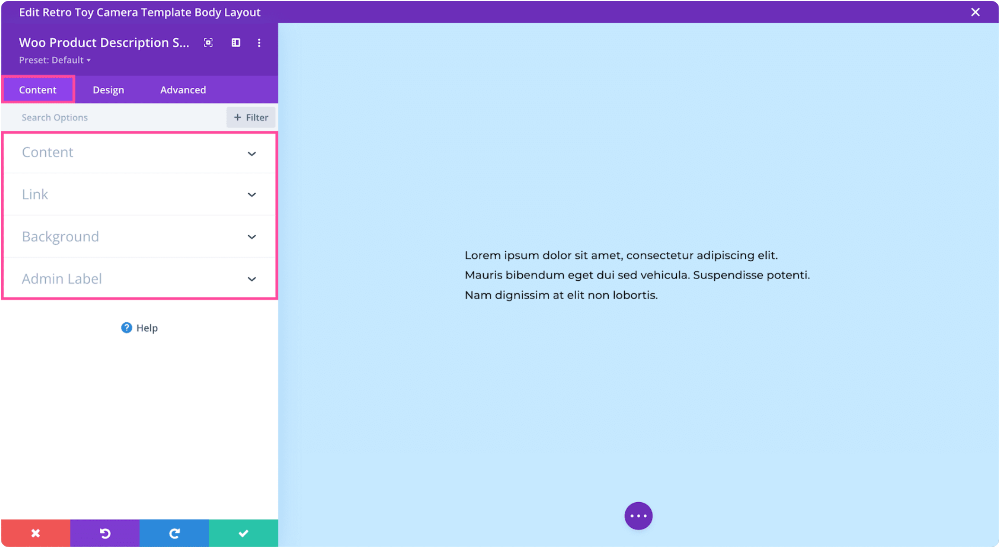

# Woo Product Description

The Woo Product Description module displays the full or short product description from WooCommerce with customizable typography and styling.

!!! abstract "Quick Reference"
    **What it does:** Renders either the long or short WooCommerce product description with full design control over text formatting.
    **When to use it:** Product page templates, custom product layouts in the Theme Builder
    **Key settings:** Product selector, Description Type (short/long), Heading Text, Link
    **Block identifier:** `divi/wc-product-description`
    **ET Docs:** [Official documentation](https://help.elegantthemes.com/en/articles/12033539)

!!! tip "When to Use This Module"
    - Building custom WooCommerce product page templates in the Theme Builder
    - Displaying the full product description in a specific layout position separate from tabs
    - Showing the short product excerpt as a summary near the price and add-to-cart area

!!! warning "When NOT to Use This Module"
    - On non-WooCommerce pages — this module requires a product context
    - For tabbed product info (description + reviews + attributes) — use [Woo Product Tabs](woo-product-tabs.md)
    - For general rich text content — use [Text](text.md)

## Overview

The Woo Product Description module pulls description content directly from the WooCommerce product editor and renders it anywhere in your layout. It supports two description types: the **long description** (the main product content entered in the WordPress editor) and the **short description** (the excerpt field in the product editor).

This module is one of the foundational building blocks for creating dynamic product page templates. By separating the description from the default WooCommerce tabbed layout, you gain full control over where and how product descriptions appear, along with independent typography and styling options.

For additional reference, see the [official Elegant Themes documentation](https://help.elegantthemes.com/en/articles/12033539).

!!! info "WooCommerce Required"
    This module requires WooCommerce to be installed and activated on your WordPress site. It dynamically pulls content from the product being viewed.

<!-- { loading=lazy } -->
<!-- *The Woo Product Description module displaying product content in the Visual Builder.* -->

## Use Cases

1. **Custom Product Layout** — Place the full product description in a dedicated section below the product images and pricing area, styled with custom fonts and spacing that match your brand.
2. **Short Description as Summary** — Use the short description type to show a concise product summary next to the title and price, giving customers a quick overview before they scroll to detailed content.
3. **Split Description Sections** — Use one instance of the module for the short description near the top of the page and another for the long description further down, creating a progressive disclosure pattern.

## How to Add the Woo Product Description Module

1. Navigate to **Divi > Theme Builder** and create or edit a product page template.
2. Open the Visual Builder on the product template.
3. Click the gray **+** icon to add a new module to a row.
4. Search for "Woo Product Description" in the module picker, then click to insert it.

For an animated walkthrough of adding and configuring this module, see the
[official Elegant Themes documentation](https://help.elegantthemes.com/en/articles/12033539).

## Settings & Options

The Woo Product Description module settings are organized across three tabs: Content, Design, and Advanced.

### Content Tab

The Content tab controls which product is referenced, the description type, and module metadata.

| Setting | Type | Description |
|---------|------|-------------|
| Product | select | Choose which product supplies the description content. On a dynamic product template, this defaults to the current product. |
| Description Type | select | Toggle between the **short description** (product excerpt) and the **long description** (full product content). |
| Link | url | Optionally make the entire module clickable, directing users to a specific page, section, or external URL. |
| Background | background controls | Set a background color, gradient, image, or video behind the description module. |
| Loop | toggle | Enable the Loop Builder feature for dynamic template contexts. |
| Order | select | Set the flexbox order of the module relative to sibling elements in the same row. |
| Meta | admin label | Assign an admin label and control module visibility inside the Visual Builder. |

<!-- { loading=lazy } -->

### Design Tab

The Design tab controls the visual styling of the description text.

**Module-specific settings:**

| Setting | Type | Description |
|---------|------|-------------|
| Heading Text | text styling | Customize the font, size, color, weight, and letter spacing of any heading elements within the product description content. |

**Shared design options** — see [Options Groups](../options-groups/index.md) for detailed documentation:

| Options Group | Description |
|--------------|-------------|
| [Text](../options-groups/text.md) | Font, weight, alignment, color, line height, text shadow |
| [Sizing](../options-groups/sizing.md) | Width, max-width, height, min-height |
| [Spacing](../options-groups/spacing.md) | Margin and padding (responsive) |
| [Border](../options-groups/border.md) | Width, color, style, radius |
| [Box Shadow](../options-groups/box-shadow.md) | Shadow effects |
| [Filters](../options-groups/filters.md) | CSS filters (brightness, contrast, hue, saturation, blending) |
| [Transform](../options-groups/transform.md) | Scale, translate, rotate, skew |
| [Animation](../options-groups/animation.md) | Entrance animation styles |

<!-- { loading=lazy } -->

### Advanced Tab

The Advanced tab provides developer-oriented controls for custom attributes, conditional display, and scroll-driven effects.

**Shared advanced options** — see [Options Groups](../options-groups/index.md) for detailed documentation:

| Options Group | Description |
|--------------|-------------|
| [Attributes](../options-groups/attributes.md) | CSS ID, classes, custom HTML attributes |
| [CSS](../options-groups/css.md) | Custom CSS per element target |
| HTML | Choose the semantic HTML tag for the module wrapper |
| [Conditions](../options-groups/conditions.md) | Display rules (user role, page type, date, logic) |
| Interactions | Hover, click, or scroll-triggered interactions |
| [Visibility](../options-groups/visibility.md) | Device visibility toggles |
| [Transitions](../options-groups/transitions.md) | Hover transition timing |
| [Position](../options-groups/position.md) | CSS position and offsets |
| [Scroll Effects](../options-groups/scroll-effects.md) | Scroll-driven animation effects |

<!-- { loading=lazy } -->

## Code Examples

### Custom CSS

```css
/* Style the product description container */
.et_pb_wc_description {
    line-height: 1.8;
    color: #444;
    font-size: 16px;
}

/* Style headings within the description */
.et_pb_wc_description h2,
.et_pb_wc_description h3 {
    font-weight: 600;
    margin-top: 25px;
    margin-bottom: 10px;
    color: #222;
}

/* Style paragraphs within the description */
.et_pb_wc_description p {
    margin-bottom: 15px;
}

/* Style lists within the description */
.et_pb_wc_description ul,
.et_pb_wc_description ol {
    margin-left: 20px;
    margin-bottom: 15px;
}

.et_pb_wc_description li {
    margin-bottom: 5px;
    line-height: 1.6;
}

/* Style the short description variant */
.et_pb_wc_description .woocommerce-product-details__short-description {
    font-size: 15px;
    color: #666;
}

/* Responsive adjustments */
@media (max-width: 980px) {
    .et_pb_wc_description {
        font-size: 15px;
        padding: 0 10px;
    }
}
```

### PHP Hooks

```php
/* Filter the Woo Product Description module output */
add_filter('et_module_shortcode_output', function($output, $render_slug) {
    if ('et_pb_wc_description' !== $render_slug) {
        return $output;
    }
    // Modify $output as needed
    return $output;
}, 10, 2);

/* Modify the product description content before display */
add_filter('the_content', function($content) {
    if (is_product()) {
        // Add custom content before or after the description
        return $content;
    }
    return $content;
});
```

## Common Patterns

1. **Full-Width Description Section** — Place the long description in a full-width row below the product hero area (images, title, price). Style it with ample padding and a clean serif or sans-serif font for readability.

2. **Short Description Near Price** — Position the short description module directly below the product title and above the add-to-cart button. Keep font size slightly smaller than the main body to serve as a supporting summary.

3. **Description with Background** — Apply a light background color or subtle border to the description module to visually separate it from surrounding product elements, making the content area clearly defined.

## AI Interaction Notes

!!! warning "Create vs. Modify"
    Modifying existing module content via REST API (`wp.apiFetch` PATCH) updates
    settings attributes. **Creating new modules via REST API**
    produces content that renders on the front end but may not appear in the Visual
    Builder layer view. Use browser automation for reliable module creation.
    See [REST API Content Playbook](../playbooks/rest-api-content.md).

**Block identifier:** `divi/wc-product-description` — *Needs Testing*

| Operation | Method | Status | Notes |
|-----------|--------|--------|-------|
| Read content | Parse `post_content` block JSON | Needs Testing | Use brace-depth parser — see [Content Encoding](../internals/content-encoding.md) |
| Modify existing | `wp.apiFetch` PATCH on post endpoint | Needs Testing | Update block attributes in `post_content` |
| Create new | Browser automation (Playwright) | Needs Testing | REST creation may break VB visibility |
| Batch modify | Sequential REST requests | Needs Testing | See [REST API Content Playbook](../playbooks/rest-api-content.md) |

**Key content attributes** — *JSON paths need verification*:

| Attribute | JSON Path | Notes |
|-----------|-----------|-------|
| Product | `attrs.product` | Product ID reference |
| Description Type | `attrs.description_type` | Short or long description toggle |

!!! tip "Module Selection Guidance"
    For the full or short product description use Woo Product Description; for tabbed display of description, reviews, and attributes use Woo Product Tabs; for the product title use Woo Product Title.

## Saving Your Work

After configuring the description module:

- **Save changes** — Click the purple **Save** button at the bottom of the Visual Builder, or press `Ctrl+S` (Windows) / `Cmd+S` (Mac).
- **Exit the builder** — Click the **X** button or use `Ctrl+Shift+E` to return to the WordPress dashboard.

## Version Notes

!!! note "Divi 5 Only"
    This page documents Divi 5 behavior exclusively.

!!! info "WooCommerce Required"
    This module requires the WooCommerce plugin to be installed and active. It pulls content from the WooCommerce product description fields.

## Troubleshooting

!!! warning "Module Not Rendering"
    If the Woo Product Description module does not appear on the front end, verify that:

    - WooCommerce is installed and activated
    - The module is placed on a product page template or a page with a valid product context
    - The module is not inside a disabled section or row
    - Visibility settings are not hiding it on the current device

!!! warning "Description Content Is Empty"
    If the module renders but shows no text, check that:

    - The product has description content entered in the WooCommerce product editor
    - You have selected the correct Description Type (short vs. long) — if using short description, verify the product excerpt field is filled in
    - The product is published and not in draft status

!!! tip "Formatting Looks Wrong"
    If headings, lists, or other HTML elements within the description do not display correctly, check for conflicting CSS from your theme or other plugins. The description content renders raw HTML from the WooCommerce editor, so ensure your theme's global styles are not overriding expected formatting.

## Related

- [Woo Product Title](woo-product-title.md) — Displays the product title with customizable typography
- [Woo Product Tabs](woo-product-tabs.md) — Tabbed display of description, additional information, and reviews
- [Text](text.md) — General rich text module for non-WooCommerce content
- [Playbook: Build a Page](../playbooks/build-a-page.md) — Step-by-step page building workflow in the Visual Builder
