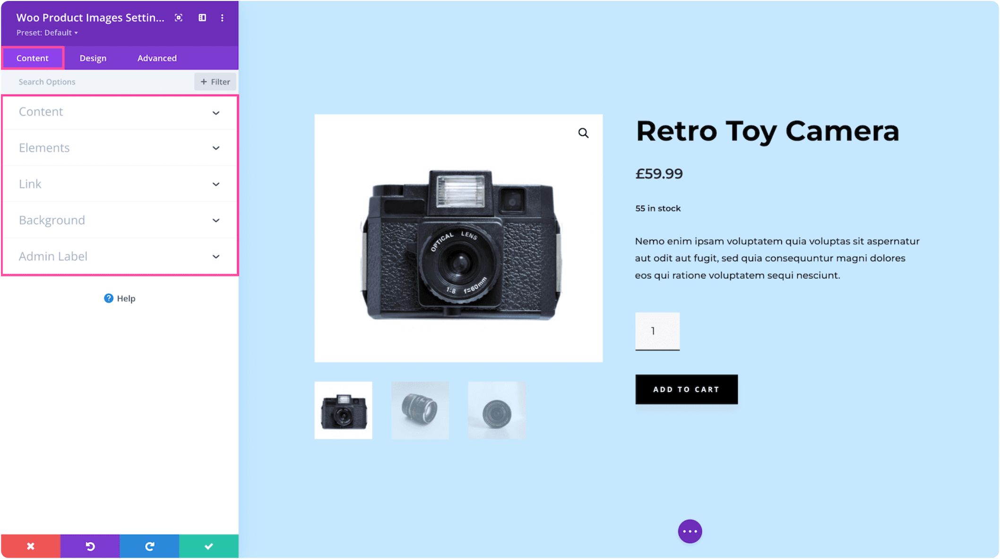

# Woo Product Images

The Woo Product Images module displays the WooCommerce product featured image and gallery thumbnails with zoom and lightbox functionality.

!!! abstract "Quick Reference"
    **What it does:** Renders the product's featured image along with gallery image thumbnails, sale badge, and interactive zoom/lightbox behavior.
    **When to use it:** Product page templates, custom product layouts in the Theme Builder
    **Key settings:** Show Featured Image, Show Gallery Images, Show Sale Badge, Image styling
    **Block identifier:** `divi/wc-product-images`
    **ET Docs:** [Official documentation](https://help.elegantthemes.com/en/articles/12033909)

!!! tip "When to Use This Module"
    - Building custom WooCommerce product page templates with image galleries
    - Displaying product photos with thumbnail navigation and zoom functionality
    - Controlling sale badge visibility and image styling on product pages

!!! warning "When NOT to Use This Module"
    - On non-WooCommerce pages — this module requires a product context
    - For general image galleries — use [Gallery](gallery.md)
    - For a single standalone image — use [Image](image.md)

## Overview

The Woo Product Images module integrates with WooCommerce to display the featured product image alongside gallery thumbnail images. Customers can click thumbnails to switch the main image, use built-in zoom to see product details up close, and open a lightbox for a full-screen view.

The module supports three toggle controls that let you independently show or hide the featured image, gallery thumbnails, and the sale badge. This flexibility allows you to build product layouts ranging from a simple single image to a full interactive gallery experience.

For additional reference, see the [official Elegant Themes documentation](https://help.elegantthemes.com/en/articles/12033909).

!!! info "WooCommerce Required"
    This module requires WooCommerce to be installed and activated on your WordPress site. Product images are pulled from the WooCommerce product editor's image fields.

<!-- { loading=lazy } -->
<!-- *The Woo Product Images module displaying a featured image with gallery thumbnails in the Visual Builder.* -->

## Use Cases

1. **Standard Product Gallery** — Place the module in the left column of a two-column product layout with the title, price, and add-to-cart in the right column, replicating the familiar WooCommerce product page pattern.
2. **Featured Image Only** — Disable gallery thumbnails and show only the featured image for a clean, minimal product presentation suited to single-image products.
3. **Sale Badge Emphasis** — Enable the sale badge and style it with a bold color and large font to draw attention to discounted products in a promotional layout.

## How to Add the Woo Product Images Module

1. Navigate to **Divi > Theme Builder** and create or edit a product page template.
2. Open the Visual Builder on the product template.
3. Click the gray **+** icon to add a new module to a row.
4. Search for "Woo Product Images" in the module picker, then click to insert it.

For an animated walkthrough of adding and configuring this module, see the
[official Elegant Themes documentation](https://help.elegantthemes.com/en/articles/12033909).

## Settings & Options

The Woo Product Images module settings are organized across three tabs: Content, Design, and Advanced.

### Content Tab

The Content tab controls which product images are displayed and their visibility options.

| Setting | Type | Description |
|---------|------|-------------|
| Content (Product) | select | Choose which product supplies the images. On a dynamic product template, this defaults to the current product. |
| Show Featured Image | toggle | Display or hide the main featured product image. Enabled by default. |
| Show Gallery Images | toggle | Display or hide the thumbnail gallery strip beneath the featured image. Enabled by default. |
| Show Sale Badge | toggle | Display or hide the sale badge overlay when the product is on sale. Enabled by default. |
| Link | url | Optionally make the entire module clickable, directing users to a specific page or URL. |
| Background | background controls | Set a background color, gradient, image, or video behind the product images module. |
| Loop | toggle | Enable the Loop Builder feature for dynamic template contexts. |
| Order | select | Set the flexbox order of the module relative to sibling elements in the same row. |
| Meta | admin label | Assign an admin label and control module visibility inside the Visual Builder. |

<!-- { loading=lazy } -->

### Design Tab

The Design tab controls the visual styling of the product images and sale badge.

**Module-specific settings:**

| Setting | Type | Description |
|---------|------|-------------|
| Image | image styling | Customize design options applied to product images, including border-radius, alignment, and hover effects for both the featured image and gallery thumbnails. |
| Sale Badge | badge styling | Style the sale badge appearance, including background color, text color, font size, padding, and positioning on the image. |

**Shared design options** — see [Options Groups](../options-groups/index.md) for detailed documentation:

| Options Group | Description |
|--------------|-------------|
| [Sizing](../options-groups/sizing.md) | Width, max-width, height, min-height |
| [Spacing](../options-groups/spacing.md) | Margin and padding (responsive) |
| [Border](../options-groups/border.md) | Width, color, style, radius |
| [Box Shadow](../options-groups/box-shadow.md) | Shadow effects |
| [Filters](../options-groups/filters.md) | CSS filters (brightness, contrast, hue, saturation, blending) |
| [Transform](../options-groups/transform.md) | Scale, translate, rotate, skew |
| [Animation](../options-groups/animation.md) | Entrance animation styles |

<!-- { loading=lazy } -->

### Advanced Tab

The Advanced tab provides developer-oriented controls for custom attributes, conditional display, and scroll-driven effects.

**Shared advanced options** — see [Options Groups](../options-groups/index.md) for detailed documentation:

| Options Group | Description |
|--------------|-------------|
| [Attributes](../options-groups/attributes.md) | CSS ID, classes, custom HTML attributes |
| [CSS](../options-groups/css.md) | Custom CSS per element target |
| HTML | Choose the semantic HTML tag for the module wrapper |
| [Conditions](../options-groups/conditions.md) | Display rules (user role, page type, date, logic) |
| Interactions | Hover, click, or scroll-triggered interactions |
| [Visibility](../options-groups/visibility.md) | Device visibility toggles |
| [Transitions](../options-groups/transitions.md) | Hover transition timing |
| [Position](../options-groups/position.md) | CSS position and offsets |
| [Scroll Effects](../options-groups/scroll-effects.md) | Scroll-driven animation effects |

<!-- { loading=lazy } -->

## Code Examples

### Custom CSS

```css
/* Style the product images container */
.et_pb_wc_images {
    margin-bottom: 30px;
}

/* Style the featured image */
.et_pb_wc_images .woocommerce-product-gallery__image img {
    border-radius: 8px;
    box-shadow: 0 2px 8px rgba(0, 0, 0, 0.1);
}

/* Style gallery thumbnails */
.et_pb_wc_images .flex-control-thumbs li img {
    border-radius: 4px;
    border: 2px solid transparent;
    transition: border-color 0.3s ease;
}

/* Active thumbnail highlight */
.et_pb_wc_images .flex-control-thumbs li img.flex-active,
.et_pb_wc_images .flex-control-thumbs li img:hover {
    border-color: #2ea3f2;
}

/* Style the sale badge */
.et_pb_wc_images .onsale {
    background: #e74c3c;
    color: #fff;
    font-weight: 700;
    font-size: 14px;
    border-radius: 50%;
    width: 50px;
    height: 50px;
    line-height: 50px;
    text-align: center;
}

/* Responsive adjustments */
@media (max-width: 980px) {
    .et_pb_wc_images {
        margin-bottom: 20px;
    }
    .et_pb_wc_images .flex-control-thumbs li {
        width: 20%;
    }
}
```

### PHP Hooks

```php
/* Filter the Woo Product Images module output */
add_filter('et_module_shortcode_output', function($output, $render_slug) {
    if ('et_pb_wc_images' !== $render_slug) {
        return $output;
    }
    // Modify $output as needed
    return $output;
}, 10, 2);

/* Customize the sale badge text */
add_filter('woocommerce_sale_flash', function($html, $post, $product) {
    $percentage = round((($product->get_regular_price() - $product->get_sale_price()) / $product->get_regular_price()) * 100);
    return '<span class="onsale">-' . $percentage . '%</span>';
}, 10, 3);
```

## Common Patterns

1. **Two-Column Product Hero** — Place the Woo Product Images module in the left column (50-60% width) of a two-column row, with the product title, price, rating, short description, and add-to-cart button stacked in the right column. This mirrors the standard WooCommerce product layout.

2. **Full-Width Gallery** — Use the module in a full-width row for products with many gallery images, giving the thumbnails more horizontal space and allowing for larger image previews.

3. **Minimal Product Card** — Hide the gallery thumbnails and sale badge, showing only the featured image. Style it with rounded corners and a subtle shadow for a clean, card-like product presentation.

## AI Interaction Notes

!!! warning "Create vs. Modify"
    Modifying existing module content via REST API (`wp.apiFetch` PATCH) updates
    settings attributes. **Creating new modules via REST API**
    produces content that renders on the front end but may not appear in the Visual
    Builder layer view. Use browser automation for reliable module creation.
    See [REST API Content Playbook](../playbooks/rest-api-content.md).

**Block identifier:** `divi/wc-product-images` — *Needs Testing*

| Operation | Method | Status | Notes |
|-----------|--------|--------|-------|
| Read content | Parse `post_content` block JSON | Needs Testing | Use brace-depth parser — see [Content Encoding](../internals/content-encoding.md) |
| Modify existing | `wp.apiFetch` PATCH on post endpoint | Needs Testing | Update block attributes in `post_content` |
| Create new | Browser automation (Playwright) | Needs Testing | REST creation may break VB visibility |
| Batch modify | Sequential REST requests | Needs Testing | See [REST API Content Playbook](../playbooks/rest-api-content.md) |

**Key content attributes** — *JSON paths need verification*:

| Attribute | JSON Path | Notes |
|-----------|-----------|-------|
| Show Featured Image | `attrs.show_featured_image` | Toggle for featured image visibility |
| Show Gallery Images | `attrs.show_gallery_images` | Toggle for thumbnail gallery visibility |
| Show Sale Badge | `attrs.show_sale_badge` | Toggle for sale badge visibility |

!!! tip "Module Selection Guidance"
    For WooCommerce product image galleries use Woo Product Images; for general image galleries use Gallery; for single images use Image.

## Saving Your Work

After configuring the product images module:

- **Save changes** — Click the purple **Save** button at the bottom of the Visual Builder, or press `Ctrl+S` (Windows) / `Cmd+S` (Mac).
- **Exit the builder** — Click the **X** button or use `Ctrl+Shift+E` to return to the WordPress dashboard.

## Version Notes

!!! note "Divi 5 Only"
    This page documents Divi 5 behavior exclusively.

!!! info "WooCommerce Required"
    This module requires the WooCommerce plugin to be installed and active. Product images are managed through the WooCommerce product editor's featured image and gallery fields.

## Troubleshooting

!!! warning "Module Not Rendering"
    If the Woo Product Images module does not appear on the front end, verify that:

    - WooCommerce is installed and activated
    - The module is placed on a product page template or a page with a valid product context
    - The module is not inside a disabled section or row
    - Visibility settings are not hiding it on the current device

!!! warning "Gallery Thumbnails Not Showing"
    If the featured image displays but gallery thumbnails are missing, check that:

    - The **Show Gallery Images** toggle is enabled in the Content tab
    - The product has gallery images added in the WooCommerce product editor (not just a featured image)
    - Gallery images are properly attached to the product, not just uploaded to the media library

!!! warning "Sale Badge Not Visible"
    If the sale badge does not appear on products that are on sale, verify that:

    - The **Show Sale Badge** toggle is enabled in the Content tab
    - The product has both a regular price and a sale price set in WooCommerce
    - Custom CSS is not hiding the `.onsale` element

!!! tip "Zoom Not Working"
    If the image zoom feature is not functioning, check that WooCommerce gallery zoom support is enabled in your theme. Also verify that no JavaScript conflicts from other plugins are preventing the zoom library from loading.

## Related

- [Woo Product Title](woo-product-title.md) — Displays the product title with customizable typography
- [Woo Product Price](woo-product-price.md) — Shows the product price with sale price formatting
- [Gallery](gallery.md) — General image gallery module for non-WooCommerce content
- [Image](image.md) — Single image display module
- [Playbook: Build a Page](../playbooks/build-a-page.md) — Step-by-step page building workflow in the Visual Builder
