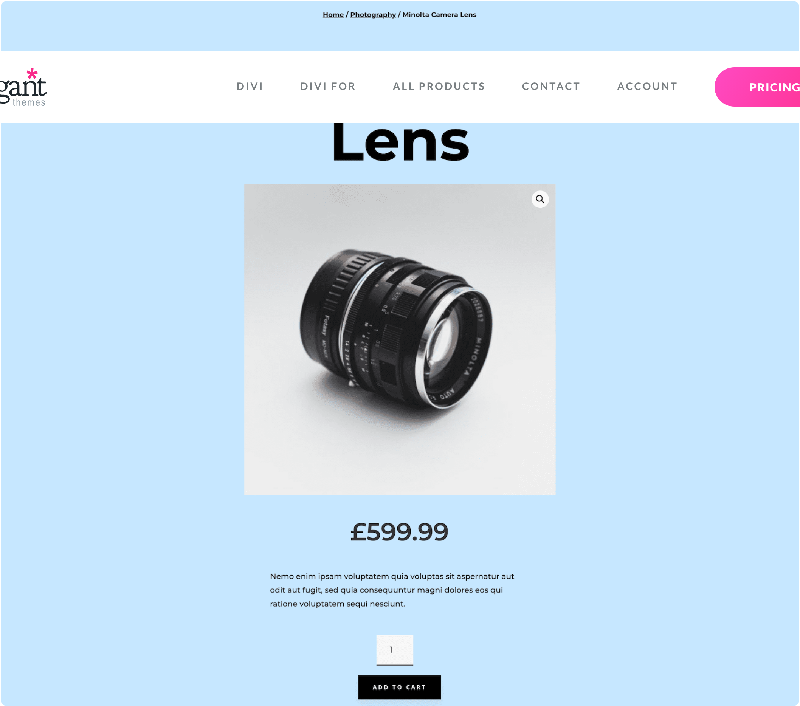
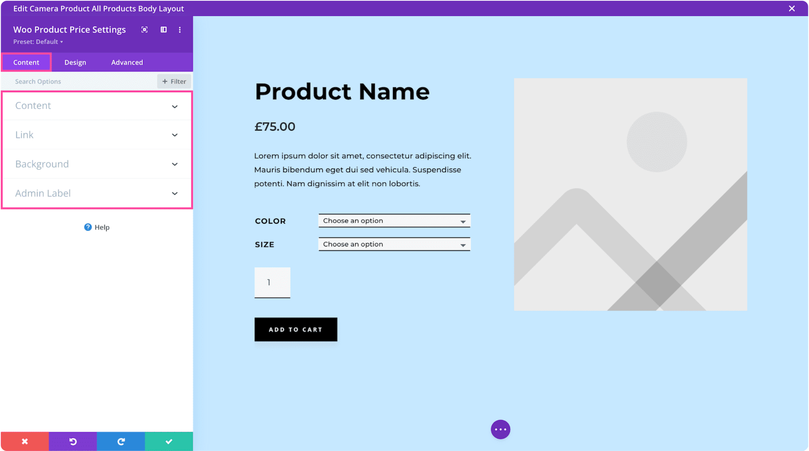

# Woo Product Price

The Woo Product Price module displays the WooCommerce product price with support for sale pricing and custom styling.

!!! abstract "Quick Reference"
    **What it does:** Renders the WooCommerce product price, including regular and sale pricing with strikethrough formatting.
    **When to use it:** Product page templates, custom product layouts in the Theme Builder
    **Key settings:** Price text styling, CSS customization, Visibility
    **Block identifier:** `divi/woo-product-price`
    **ET Docs:** [Official documentation](https://www.elegantthemes.com/documentation/divi/the-divi-woo-product-price-module/)

!!! tip "When to Use This Module"
    - Building custom WooCommerce product page templates with prominent pricing
    - Displaying sale prices with visual emphasis on the discount
    - Positioning the price independently from other product elements

!!! warning "When NOT to Use This Module"
    - On non-WooCommerce pages → this module requires a product context
    - For product grids with prices → use [Shop](shop.md) (prices are built in)
    - For cart or checkout totals → use [Woo Cart Totals](woo-cart-totals.md) or [Woo Checkout Details](woo-checkout-details.md)

## Overview

How to add, configure and customize the Divi Woo related product price.

The Divi Woo Product Price Module works seamlessly with WooCommerce and can display the price of a product anywhere on your website. It’s an easy way to add and style product prices to page templates or regular page designs.

Before you can add the Divi Woo Product Price Module to your website, you’ll need to have the Divi theme and WooCommerce installed on your WordPress website. Learn how to install the Divi theme on your WordPress websitehereand how to install WooCommercehere. For additional information on the Divi Builder itself, its interface, usage philosophy and best practices, please refer to ourGetting Started With The Divi Builderguide.

<!-- TODO: Replace with proper screenshot -->
<!-- { loading=lazy } -->
<!-- *The Woo Product Price module as it appears in the Divi 5 Visual Builder.* -->

## Settings & Options

### Content Tab

<!-- TODO: Verify all Content tab settings for Woo Product Price module -->

| Setting | Type | Default | Description |
|---------|------|---------|-------------|
| WooCommerce Performance Optimization | text | — | 14 Tips & Best Practices |
| Updating WooCommerce | text | — | Best Practices to Follow Every Time |

<!-- TODO: Replace with proper screenshot -->
<!-- { loading=lazy } -->

### Design Tab

<!-- TODO: Verify all Design tab settings for Woo Product Price module -->

| Setting | Type | Default | Description |
|---------|------|---------|-------------|
| <!-- TODO: Document Design settings --> | | | |

<!-- TODO: Replace with proper screenshot -->
<!-- { loading=lazy } -->

### Advanced Tab

<!-- TODO: Verify all Advanced tab settings for Woo Product Price module -->

| Setting | Type | Default | Description |
|---------|------|---------|-------------|
| CSS ID | text | — | Assign a unique CSS ID to the module |
| CSS Class | text | — | Assign CSS classes to the module |
| Custom CSS | code | — | Add custom CSS directly to the module's elements |
| Visibility | toggle | Show on all devices | Control device visibility (desktop, tablet, phone) |
| Transition | select | Default | Animation transition style for hover effects |

## Code Examples

### Custom CSS

```css
/* Style the Woo Product Price module */
.et_pb_wc_product_price {
    /* Add your custom styles */
    margin-bottom: 30px;
}

/* Responsive adjustments */
@media (max-width: 980px) {
    .et_pb_wc_product_price {
        padding: 20px;
    }
}
```

### PHP Hooks

```php
/* Filter the Woo Product Price module output */
add_filter('et_module_shortcode_output', function($output, $render_slug) {
    if ('et_pb_et_pb_wc_product_price' !== $render_slug) {
        return $output;
    }
    // Modify $output as needed
    return $output;
}, 10, 2);
```

## Common Patterns

<!-- TODO: Add 2-3 real-world usage patterns with screenshots -->

1. **Basic Usage** — Add the Woo Product Price module to any row in the Visual Builder and configure its settings.

2. **Styled Variation** — Use the Design tab to customize fonts, colors, and spacing to match your site's design system.

3. **Dynamic Content** — Use dynamic content fields to pull data from custom fields or post meta.

## Version Notes

!!! note "Divi 5 Only"
    This page documents Divi 5 behavior exclusively.

## Troubleshooting

!!! warning "Module Not Rendering"
    If the Woo Product Price module doesn't appear on the front end, verify that:

    - The module is not inside a disabled section or row
    - Visibility settings aren't hiding it on the current device
    - Any required fields (like URLs or content) are filled in

<!-- TODO: Add module-specific troubleshooting items -->

## Related

<!-- TODO: Add related module links -->
