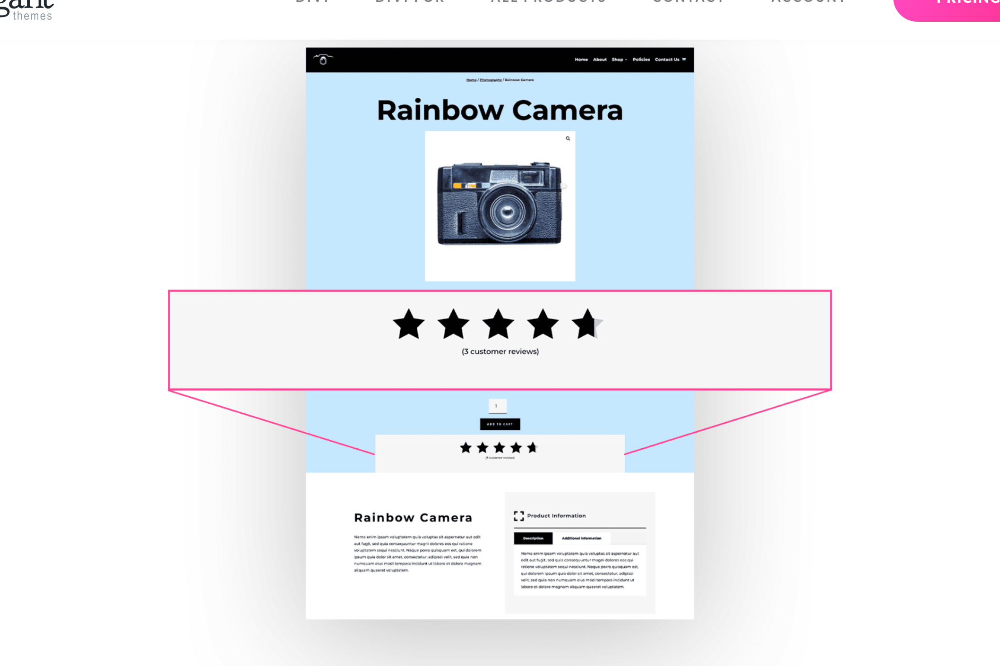

# Woo Product Rating

The Woo Product Rating module displays the average star rating for a WooCommerce product based on customer reviews.

!!! abstract "Quick Reference"
    **What it does:** Shows the average WooCommerce product star rating derived from customer reviews.
    **When to use it:** Product page templates, custom product layouts in the Theme Builder
    **Key settings:** Star color, Star size, CSS customization, Visibility
    **Block identifier:** `divi/woo-product-rating`
    **ET Docs:** [Official documentation](https://www.elegantthemes.com/documentation/divi/the-divi-woo-product-rating-module/)

!!! tip "When to Use This Module"
    - Displaying the average review rating on custom product page templates
    - Positioning the star rating near the product title or price for social proof
    - Styling the rating display to match your store's visual design

!!! warning "When NOT to Use This Module"
    - On non-WooCommerce pages → this module requires a product context
    - For full review listings → use [Woo Product Reviews](woo-product-reviews.md)
    - For product grids with ratings → use [Shop](shop.md) (ratings are built in)

## Overview

How to add, configure and customize the Divi Woo Product Rating module.

The Divi Woo Product Rating module displays the average review for products on your website. This module works integrates with WooCommerce can be used on a product page template or anywhere on your website.

Before we can use the Woo Product Rating module you’ll need to have Divi and WooCommerce installed on your website. Learn how to install the Divi themehereand learn how to install WooCommerce installed on your websitehere. Once you have the Divi theme installed and activated, we can begin using the features and functionalities of Divi.

<!-- TODO: Replace with proper screenshot -->
<!-- { loading=lazy } -->
<!-- *The Woo Product Rating module as it appears in the Divi 5 Visual Builder.* -->

## Settings & Options

### Content Tab

<!-- TODO: Verify all Content tab settings for Woo Product Rating module -->

| Setting | Type | Default | Description |
|---------|------|---------|-------------|
| WooCommerce Performance Optimization | text | — | 14 Tips & Best Practices |
| Updating WooCommerce | text | — | Best Practices to Follow Every Time |

<!-- TODO: Replace with proper screenshot -->
<!-- { loading=lazy } -->

### Design Tab

<!-- TODO: Verify all Design tab settings for Woo Product Rating module -->

| Setting | Type | Default | Description |
|---------|------|---------|-------------|
| <!-- TODO: Document Design settings --> | | | |

<!-- TODO: Replace with proper screenshot -->
<!-- { loading=lazy } -->

### Advanced Tab

<!-- TODO: Verify all Advanced tab settings for Woo Product Rating module -->

| Setting | Type | Default | Description |
|---------|------|---------|-------------|
| CSS ID | text | — | Assign a unique CSS ID to the module |
| CSS Class | text | — | Assign CSS classes to the module |
| Custom CSS | code | — | Add custom CSS directly to the module's elements |
| Visibility | toggle | Show on all devices | Control device visibility (desktop, tablet, phone) |
| Transition | select | Default | Animation transition style for hover effects |

## Code Examples

### Custom CSS

```css
/* Style the Woo Product Rating module */
.et_pb_wc_product_rating {
    /* Add your custom styles */
    margin-bottom: 30px;
}

/* Responsive adjustments */
@media (max-width: 980px) {
    .et_pb_wc_product_rating {
        padding: 20px;
    }
}
```

### PHP Hooks

```php
/* Filter the Woo Product Rating module output */
add_filter('et_module_shortcode_output', function($output, $render_slug) {
    if ('et_pb_et_pb_wc_product_rating' !== $render_slug) {
        return $output;
    }
    // Modify $output as needed
    return $output;
}, 10, 2);
```

## Common Patterns

<!-- TODO: Add 2-3 real-world usage patterns with screenshots -->

1. **Basic Usage** — Add the Woo Product Rating module to any row in the Visual Builder and configure its settings.

2. **Styled Variation** — Use the Design tab to customize fonts, colors, and spacing to match your site's design system.

3. **Dynamic Content** — Use dynamic content fields to pull data from custom fields or post meta.

## Version Notes

!!! note "Divi 5 Only"
    This page documents Divi 5 behavior exclusively.

## Troubleshooting

!!! warning "Module Not Rendering"
    If the Woo Product Rating module doesn't appear on the front end, verify that:

    - The module is not inside a disabled section or row
    - Visibility settings aren't hiding it on the current device
    - Any required fields (like URLs or content) are filled in

<!-- TODO: Add module-specific troubleshooting items -->

## Related

<!-- TODO: Add related module links -->
