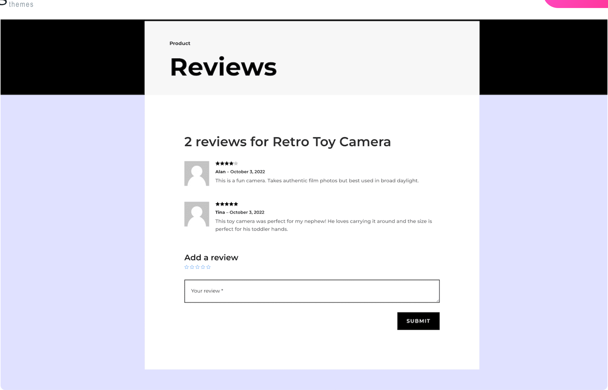

<!-- AUTO-UPDATED: 2026-05-06 — verify changes -->

# Woo Product Reviews

The Woo Product Reviews module displays customer reviews and a review submission form for WooCommerce products.

!!! abstract "Quick Reference"
    **What it does:** Renders the WooCommerce product review list, star ratings, reviewer avatars, and the leave-a-review form.
    **When to use it:** Product page templates, custom product layouts in the Theme Builder
    **Key settings:** Show Author Avatar, Show Comment Count, Show Meta, Show Rating, Star Rating styling, Button styling
    **Block identifier:** `divi/woo-product-reviews`
    **ET Docs:** [Official documentation](https://help.elegantthemes.com/en/articles/12041040)

!!! tip "When to Use This Module"
    - Building custom WooCommerce product pages with a dedicated reviews section
    - Displaying customer reviews and star ratings to build buyer trust and social proof
    - Positioning the reviews section independently in your product template layout

!!! warning "When NOT to Use This Module"
    - On non-WooCommerce pages — this module requires a product context
    - For average star rating display only — use [Woo Product Rating](woo-product-rating.md)
    - For blog post comments — use [Comments](comments.md)

## Overview

The Woo Product Reviews module pulls review data directly from WooCommerce and renders both the existing review list and the review submission form in a single, cohesive block. Each review displays the reviewer's avatar, name, date, star rating, and comment text. The submission form allows logged-in customers to leave their own review with a star rating and written feedback.

This module is one of the key building blocks for custom product page templates in the Theme Builder. While the [Woo Product Tabs](woo-product-tabs.md) module bundles reviews inside a tabbed interface alongside description and attributes, the Woo Product Reviews module gives you the flexibility to place reviews in their own dedicated section — for example, in a full-width row below the main product details.

The review data comes from WooCommerce's built-in review system. To see reviews in this module, WooCommerce must have reviews enabled under WooCommerce > Settings > Products, and at least one product must have received a review. The module respects WooCommerce's review moderation settings, so only approved reviews appear on the front end.

!!! info "WooCommerce Required"
    This module requires WooCommerce to be installed and activated. It will not appear in the module picker if WooCommerce is absent.

[View the official Elegant Themes documentation for this module.](https://help.elegantthemes.com/en/articles/12041040)

<!-- { loading=lazy } -->
<!-- *The Woo Product Reviews module as it appears in the Divi 5 Visual Builder.* -->

## Use Cases

1. **Dedicated Reviews Section** — Place the module in a full-width row below the main product information to give reviews prominent real estate on the page. This works well for products where social proof is a key conversion driver, such as skincare, electronics, or courses.

2. **Side-by-Side Layout** — Position the reviews module alongside the product description in a two-column row. Customers can read the official description on one side and real customer feedback on the other, providing a balanced view.

3. **Review-Focused Landing Page** — Use the module on a custom landing page template that highlights customer satisfaction. Combine it with the [Woo Product Rating](woo-product-rating.md) module as a summary star display at the top and the full reviews list below.

## How to Add the Woo Product Reviews Module

1. Ensure WooCommerce is installed, activated, and that reviews are enabled under WooCommerce > Settings > Products.
2. Open the Visual Builder on a product page template or any page. Click the gray **+** icon to add a new module to a row.
3. Search for "Woo Product Reviews" in the module picker or find it in the WooCommerce category, then click to insert it.

## Settings & Options

The Woo Product Reviews module settings are organized across three tabs: Content, Design, and Advanced.

### Content Tab

The Content tab controls which product's reviews are displayed and which review elements are visible.

| Setting | Type | Description |
|---------|------|-------------|
| Content | select | Choose the product for which you want to display reviews. On Theme Builder templates, this defaults to the current product dynamically. |
| Show Author Avatar | toggle | Display or hide the reviewer's avatar image next to each review. Avatars are pulled from Gravatar based on the reviewer's email. |
| Show Comment Count | toggle | Display or hide the total review count displayed above the reviews list. |
| Show Meta | toggle | Display or hide review metadata such as the reviewer name and review date. |
| Show Rating | toggle | Display or hide the star rating on individual reviews and on the review submission form. |
| Link | url | Optionally make the entire module clickable, directing visitors to a specified URL. |
| Background | background controls | Set a background color, gradient, image, or video behind the module. |
| Order | select | Control the module's placement order within Flexbox and Grid parent layouts. |
| Meta — Admin Label | text | Set a custom label for the module in the Visual Builder's layer panel. |
| Meta — Disable On | device toggles | Control builder-level visibility across devices. |
| Elements |  | Choose to display or hide various elements:Show Author Avatar- Display or hide the reviewer's Avatar image.Show Comment Count- Display or hide the total number of comments (reviews)Show Meta- Display or hide each comment's meta information.Show Rating- Display or hide the Rating system. | <!-- AUTO-ADDED -->
| Order- |  | Choose the Flexbox order of the module. | <!-- AUTO-ADDED -->
| Meta |  | Choose the Woo Product Reviews Module's Label text and force its Visibility inside the Visual Builder. | <!-- AUTO-ADDED -->

### Design Tab

The Design tab provides controls for styling every visual aspect of the reviews section, from text typography to star rating colors and the submit button appearance.

**Module-specific settings:**

| Setting | Type | Description |
|---------|------|-------------|
| Fields | styling controls | Customize the appearance of the review form textarea including background color, border, and focus state styling. |
| Review Count Text | text styling | Control the font, size, color, and weight of the review count heading displayed above the review list. |
| Form Title Text | text styling | Style the "Leave a Review" or equivalent form heading, including font family, size, weight, and color. |
| Meta Text | text styling | Customize the typography for reviewer name, date, and other metadata displayed with each review. |
| Comment Text | text styling | Style the actual review content text including font, size, line height, and color. |
| Star Rating | color/size controls | Adjust the star rating appearance including alignment, filled color, empty color, star size, and spacing between stars. |
| Button | button styling | Customize the review submit button including font, text color, background color, border, border radius, padding, and hover effects. |
| Image |  | Choose the avatar image's design styles, such as border, box shadow, and filter styles. | <!-- AUTO-ADDED -->
| Text |  | Choose the style for the number of reviews text. | <!-- AUTO-ADDED -->
| Sizing |  | Choose the Woo Product Reviews module's sizing. | <!-- AUTO-ADDED -->
| Spacing |  | Choose the Woo Product Reviews module's spacing. | <!-- AUTO-ADDED -->
| Border |  | Choose the Woo Product Reviews module's border styles. | <!-- AUTO-ADDED -->
| Box Shadow |  | Choose the Woo Product Reviews module's Box Shadow styles. | <!-- AUTO-ADDED -->
| Filters |  | Choose the Woo Product Reviews module's filters, including hue shifts, saturation adjustments, and blending modes. | <!-- AUTO-ADDED -->
| Transform |  | Choose the Woo Product Reviews module's advanced design effects, including scaling, rotating, skewing, and translating. | <!-- AUTO-ADDED -->
| Animation |  | Choose the Woo Product Reviews module's animation styles to add personality and interactivity while maintaining a polished, professional feel. | <!-- AUTO-ADDED -->

**Shared design options** — see [Options Groups](../options-groups/index.md) for detailed documentation:

| Options Group | Description |
|--------------|-------------|
| [Text](../options-groups/text.md) | Font, weight, alignment, color, line height, text shadow |
| [Image](../options-groups/image.md) | Border radius, object fit, hover effects for reviewer avatars |
| [Sizing](../options-groups/sizing.md) | Width, max-width, min-height, height, alignment |
| [Spacing](../options-groups/spacing.md) | Margin and padding with responsive breakpoint controls |
| [Border](../options-groups/border.md) | Width, color, style, border radius |
| [Box Shadow](../options-groups/box-shadow.md) | Horizontal/vertical offset, blur, spread, color, position |
| [Filters](../options-groups/filters.md) | Brightness, contrast, saturation, hue rotation, blur, invert, sepia, opacity, blend mode |
| [Transform](../options-groups/transform.md) | Scale, translate, rotate, skew, transform origin |
| [Animation](../options-groups/animation.md) | Entrance animation style, direction, duration, delay, intensity |

### Advanced Tab

The Advanced tab provides low-level control over HTML attributes, custom CSS, conditional display logic, and scroll-based effects.

**Shared advanced options** — see [Options Groups](../options-groups/index.md) for detailed documentation:

| Options Group | Description |
|--------------|-------------|
| [Attributes](../options-groups/attributes.md) | CSS ID, classes, custom HTML attributes |
| [CSS](../options-groups/css.md) | Custom CSS per element target (review container, avatar, star rating, form, button) |
| HTML | Semantic HTML tag selection for the module wrapper |
| [Conditions](../options-groups/conditions.md) | Display rules (user role, page type, date, logic) |
| Interactions | Hover, click, or scroll-triggered interactions |
| [Visibility](../options-groups/visibility.md) | Device visibility toggles |
| [Transitions](../options-groups/transitions.md) | Hover transition timing |
| [Position](../options-groups/position.md) | CSS position and offsets |
| [Scroll Effects](../options-groups/scroll-effects.md) | Scroll-driven animation effects |
| Attributes |  | Assign a CSS ID, reusable CSS classes, or custom HTML attributes to the element. Use these to apply advanced styling via your child theme's stylesheet or Divi's custom CSS settings. | <!-- AUTO-ADDED -->
| CSS |  | Allows you to add custom CSS to the Woo Product Reviews module. | <!-- AUTO-ADDED -->
| Conditions |  | Allows you to create dynamic, personalized content, ensuring the right message reaches the right audience at the right time. | <!-- AUTO-ADDED -->
| Visibility |  | Choose the Woo Product Reviews module's visibility according to different devices. | <!-- AUTO-ADDED -->
| Transitions |  | Choose how long Woo Product Reviews' module animation takes, adding subtle and impactful animations that enhance the user experience and make your modules stand out. | <!-- AUTO-ADDED -->
| Position |  | Choose the Woo Product Reviews module placement and create dynamic, visually engaging designs. | <!-- AUTO-ADDED -->
| Scroll Effects |  | Control how the Woo Product Reviews module behaves and transforms during scrolling. | <!-- AUTO-ADDED -->
| Save |  | k on theSavebutton. | <!-- AUTO-ADDED -->
| Exit |  | k on theExitbutton. | <!-- AUTO-ADDED -->

## Code Examples

### Custom CSS

```css
/* Style the review list container */
.et_pb_wc_reviews .woocommerce-Reviews {
    max-width: 800px;
    margin: 0 auto;
}

/* Style individual review comments */
.et_pb_wc_reviews .comment_container {
    background: #f9f9f9;
    border-radius: 8px;
    padding: 20px;
    margin-bottom: 20px;
    border-left: 4px solid #2ea3f2;
}

/* Style the reviewer avatar */
.et_pb_wc_reviews .comment_container img.avatar {
    border-radius: 50%;
    border: 2px solid #e0e0e0;
}

/* Style star ratings */
.et_pb_wc_reviews .star-rating {
    color: #f5a623;
    font-size: 16px;
}

/* Style the review form submit button */
.et_pb_wc_reviews .form-submit input[type="submit"] {
    background-color: #2ea3f2;
    color: #fff;
    border: none;
    border-radius: 4px;
    padding: 12px 24px;
    font-weight: 600;
    cursor: pointer;
    transition: background-color 0.3s ease;
}

.et_pb_wc_reviews .form-submit input[type="submit"]:hover {
    background-color: #1a8cd8;
}

/* Responsive adjustments */
@media (max-width: 980px) {
    .et_pb_wc_reviews .comment_container {
        padding: 15px;
    }
}
```

### PHP Hooks

```php
/* Filter the Woo Product Reviews module output */
add_filter('et_module_shortcode_output', function($output, $render_slug) {
    if ('et_pb_wc_reviews' !== $render_slug) {
        return $output;
    }
    // Example: Add a heading above the reviews section
    $output = '<h3 class="custom-reviews-heading">What Our Customers Say</h3>' . $output;
    return $output;
}, 10, 2);

/* Customize the number of reviews displayed per page */
add_filter('woocommerce_product_reviews_list_args', function($args) {
    $args['per_page'] = 5;
    return $args;
});
```

## Common Patterns

1. **Full-Width Reviews Below Product** — Place the module in a dedicated full-width row below the product details section. Enable all display options (avatar, meta, rating, comment count) and style the star rating color to match your brand. This gives reviews maximum visibility and encourages customers to scroll down and read feedback.

2. **Minimal Review Display** — Disable the author avatar and meta information to create a clean, quote-style review layout. Style the comment text with a slightly larger font and italic styling. This approach works well for premium or luxury product pages where a refined aesthetic is important.

3. **Reviews with Branded Submit Form** — Use the Button design options to style the review submission button to match your site's call-to-action color. Customize the Fields styling to give the textarea a branded border color on focus. This creates a cohesive experience that encourages customers to leave their own review.

## AI Interaction Notes

!!! warning "Create vs. Modify"
    Modifying existing module content via REST API (`wp.apiFetch` PATCH) updates
    settings attributes. **Creating new modules via REST API** produces content
    that renders on the front end but may not appear in the Visual Builder layer
    view. Use browser automation for reliable module creation.
    See [REST API Content Playbook](../playbooks/rest-api-content.md).

**Block identifier:** `divi/woo-product-reviews` — *Needs Testing*

| Operation | Method | Status | Notes |
|-----------|--------|--------|-------|
| Read content | Parse `post_content` block JSON | Needs Testing | Use brace-depth parser — see [Content Encoding](../internals/content-encoding.md) |
| Modify existing | `wp.apiFetch` PATCH on post endpoint | Needs Testing | Update block attributes in `post_content` |
| Create new | Browser automation (Playwright) | Needs Testing | REST creation may break VB visibility |
| Batch modify | Sequential REST requests | Needs Testing | See [REST API Content Playbook](../playbooks/rest-api-content.md) |

**Key content attributes** — *JSON paths need verification*:

| Attribute | JSON Path | Notes |
|-----------|-----------|-------|
| Show Author Avatar | `attrs.show_author_avatar` | Toggle reviewer avatars |
| Show Comment Count | `attrs.show_comment_count` | Toggle review count display |
| Show Meta | `attrs.show_meta` | Toggle reviewer metadata |
| Show Rating | `attrs.show_rating` | Toggle star ratings |

!!! tip "Module Selection Guidance"
    For the full review list with submission form use Woo Product Reviews; for the average star rating summary use Woo Product Rating; for reviews bundled with description and attributes use Woo Product Tabs.

## Saving Your Work

After configuring the Woo Product Reviews module, click the green **Save** button at the bottom of the Visual Builder interface. The module can be saved as a preset for consistent styling across multiple product templates, or added to your Divi Library for reuse by right-clicking and selecting **Save to Library**.

## Version Notes

!!! note "Divi 5 Only"
    This page documents Divi 5 behavior exclusively. The Woo Product Reviews module in Divi 5 benefits from the updated rendering engine and supports Conditions, Interactions, Scroll Effects, and enhanced styling controls not available in Divi 4.

!!! info "WooCommerce Required"
    This module requires WooCommerce to be installed and activated. Reviews must also be enabled in WooCommerce settings (WooCommerce > Settings > Products > Enable Reviews). WooCommerce 7.0 or later is recommended for full Divi 5 compatibility.

## Troubleshooting

!!! warning "No Reviews Displaying"
    If the module appears but shows no reviews, verify that the product has at least one approved review. Check that reviews are enabled under WooCommerce > Settings > Products. Also confirm that the Content setting is pointed at the correct product (or is set to dynamic on a Theme Builder template).

!!! warning "Review Form Not Showing"
    If the review submission form is missing, verify that WooCommerce review settings allow customer reviews. Check WooCommerce > Settings > Products and ensure "Enable reviews" is checked. Also verify that the user is logged in if WooCommerce requires authenticated users for reviews.

!!! tip "Star Ratings Not Displaying"
    If star ratings are missing from reviews, check that the Show Rating toggle is enabled in the module's Content tab. Also verify that WooCommerce star ratings are enabled under WooCommerce > Settings > Products > Enable star rating on reviews.

## Related

- [Woo Product Rating](woo-product-rating.md)
- [Woo Product Tabs](woo-product-tabs.md)
- [Comments](comments.md)
