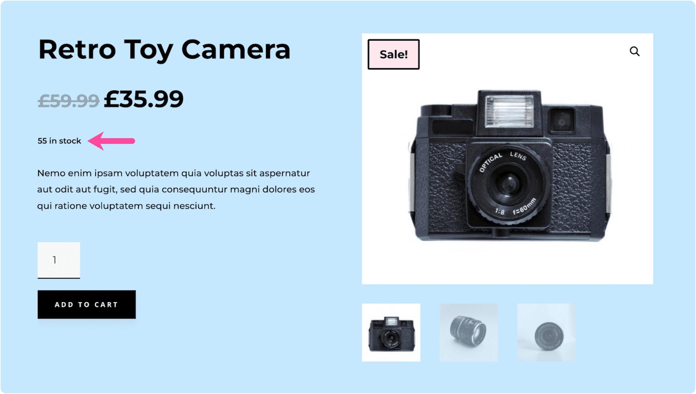
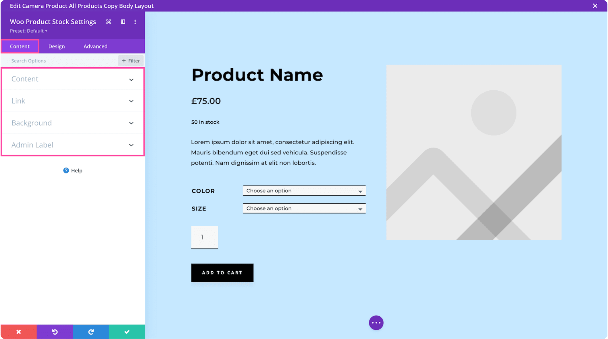

# Woo Product Stock

The Woo Product Stock module displays the stock status and inventory count for a WooCommerce product.

!!! abstract "Quick Reference"
    **What it does:** Shows the product stock number and availability status pulled from WooCommerce inventory settings.
    **When to use it:** Product page templates, custom product layouts in the Theme Builder
    **Key settings:** Text styling, CSS customization, Visibility
    **Block identifier:** `divi/woo-product-stock`
    **ET Docs:** [Official documentation](https://www.elegantthemes.com/documentation/divi/the-divi-woo-product-stock-module/)

!!! tip "When to Use This Module"
    - Displaying stock availability on custom product page templates
    - Creating urgency with low-stock indicators on product pages
    - Positioning stock status information near the add-to-cart area

!!! warning "When NOT to Use This Module"
    - On non-WooCommerce pages → this module requires a product context
    - When stock management is disabled in WooCommerce → the module will show no data
    - For product pricing → use [Woo Product Price](woo-product-price.md)

## Overview

How to add, configure and customize the Divi Woo related product stock.

The Divi Woo Product Stock Module integrates with WooCommerce and can display a product’s stock number anywhere on your website. You can use this module on a product page template or anywhere on your website.

This module pulls the stock number from the Inventory section in a product listing.

<!-- TODO: Replace with proper screenshot -->
<!-- { loading=lazy } -->
<!-- *The Woo Product Stock module as it appears in the Divi 5 Visual Builder.* -->

## Settings & Options

### Content Tab

<!-- TODO: Verify all Content tab settings for Woo Product Stock module -->

| Setting | Type | Default | Description |
|---------|------|---------|-------------|
| WooCommerce Performance Optimization | text | — | 14 Tips & Best Practices |
| Updating WooCommerce | text | — | Best Practices to Follow Every Time |

<!-- TODO: Replace with proper screenshot -->
<!-- { loading=lazy } -->

### Design Tab

<!-- TODO: Verify all Design tab settings for Woo Product Stock module -->

| Setting | Type | Default | Description |
|---------|------|---------|-------------|
| <!-- TODO: Document Design settings --> | | | |

<!-- TODO: Replace with proper screenshot -->
<!-- { loading=lazy } -->

### Advanced Tab

<!-- TODO: Verify all Advanced tab settings for Woo Product Stock module -->

| Setting | Type | Default | Description |
|---------|------|---------|-------------|
| CSS ID | text | — | Assign a unique CSS ID to the module |
| CSS Class | text | — | Assign CSS classes to the module |
| Custom CSS | code | — | Add custom CSS directly to the module's elements |
| Visibility | toggle | Show on all devices | Control device visibility (desktop, tablet, phone) |
| Transition | select | Default | Animation transition style for hover effects |

## Code Examples

### Custom CSS

```css
/* Style the Woo Product Stock module */
.et_pb_wc_product_stock {
    /* Add your custom styles */
    margin-bottom: 30px;
}

/* Responsive adjustments */
@media (max-width: 980px) {
    .et_pb_wc_product_stock {
        padding: 20px;
    }
}
```

### PHP Hooks

```php
/* Filter the Woo Product Stock module output */
add_filter('et_module_shortcode_output', function($output, $render_slug) {
    if ('et_pb_et_pb_wc_product_stock' !== $render_slug) {
        return $output;
    }
    // Modify $output as needed
    return $output;
}, 10, 2);
```

## Common Patterns

<!-- TODO: Add 2-3 real-world usage patterns with screenshots -->

1. **Basic Usage** — Add the Woo Product Stock module to any row in the Visual Builder and configure its settings.

2. **Styled Variation** — Use the Design tab to customize fonts, colors, and spacing to match your site's design system.

3. **Dynamic Content** — Use dynamic content fields to pull data from custom fields or post meta.

## Version Notes

!!! note "Divi 5 Only"
    This page documents Divi 5 behavior exclusively.

## Troubleshooting

!!! warning "Module Not Rendering"
    If the Woo Product Stock module doesn't appear on the front end, verify that:

    - The module is not inside a disabled section or row
    - Visibility settings aren't hiding it on the current device
    - Any required fields (like URLs or content) are filled in

<!-- TODO: Add module-specific troubleshooting items -->

## Related

<!-- TODO: Add related module links -->
