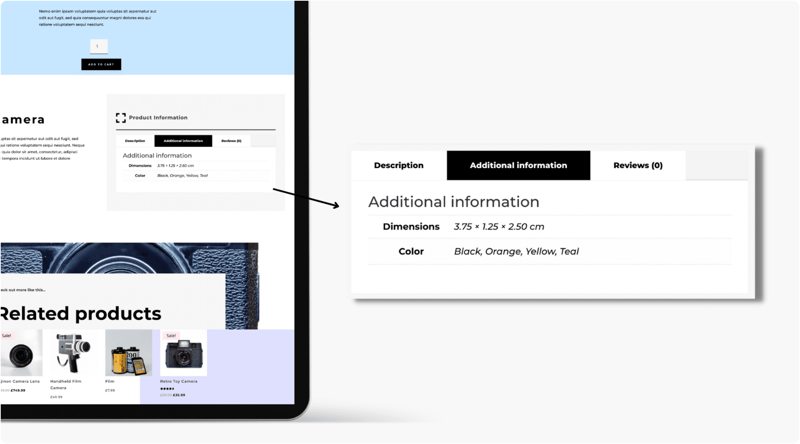

# Woo Product Tabs

The Woo Product Tabs module displays WooCommerce product information in a tabbed layout with description, attributes, shipping, and reviews.

!!! abstract "Quick Reference"
    **What it does:** Renders product description, additional information (attributes), shipping details, and reviews in a compact tabbed interface.
    **When to use it:** Product page templates, custom product layouts in the Theme Builder
    **Key settings:** Included Tabs, Body Text styling, Tab Text styling
    **Block identifier:** `divi/woo-product-tabs`
    **ET Docs:** [Official documentation](https://help.elegantthemes.com/en/articles/12041462)

!!! tip "When to Use This Module"
    - Displaying multiple types of product information in a compact tabbed layout
    - Building product page templates that consolidate description, specs, and reviews
    - Keeping product pages organized without excessive vertical scrolling

!!! warning "When NOT to Use This Module"
    - On non-WooCommerce pages — this module requires a product context
    - For standalone product description display — use [Woo Product Description](woo-product-description.md)
    - For standalone customer reviews — use [Woo Product Reviews](woo-product-reviews.md)

## Overview

The Woo Product Tabs module consolidates multiple types of product information into a single tabbed interface, following the standard WooCommerce product page pattern that customers are familiar with. Each tab corresponds to a different section of product data: the full product description, additional information (attributes like size, color, weight), shipping details, and customer reviews.

The content displayed in each tab is pulled directly from the WooCommerce product listing. The Description tab shows the product's long description field, the Additional Information tab shows product attributes configured under Product Data > Attributes, and the Reviews tab shows customer reviews. You can control which tabs appear using the Included Tabs setting, allowing you to show only the tabs relevant to your products.

This module is a space-efficient alternative to placing the [Woo Product Description](woo-product-description.md), [Woo Product Reviews](woo-product-reviews.md), and attribute information in separate modules throughout the page. It keeps detailed product information accessible without increasing the page length, which is especially useful on mobile devices where vertical scrolling fatigue can reduce engagement.

!!! info "WooCommerce Required"
    This module requires WooCommerce to be installed and activated. It will not appear in the module picker if WooCommerce is absent.

[View the official Elegant Themes documentation for this module.](https://help.elegantthemes.com/en/articles/12041462)

<!-- { loading=lazy } -->
<!-- *The Woo Product Tabs module as it appears in the Divi 5 Visual Builder.* -->

## Use Cases

1. **Standard Product Page Layout** — Place the Woo Product Tabs module below the product image and add-to-cart area in a full-width row. Include all tabs (description, additional information, reviews) to replicate the familiar WooCommerce product page structure that customers expect.

2. **Minimal Product Template** — Use the Included Tabs setting to show only the Description and Reviews tabs. This works well for simple products that do not have configurable attributes, keeping the interface clean and focused on the content that matters most.

3. **Specification-Heavy Products** — For products with many attributes (electronics, clothing with size charts, technical equipment), prioritize the Additional Information tab. Style the tab text to make the attributes tab visually prominent, and consider placing the module higher on the page where customers look for specs before making a purchase decision.

## How to Add the Woo Product Tabs Module

1. Ensure WooCommerce is installed and activated, and that at least one product has a description or attributes configured.
2. Open the Visual Builder on a product page template or any page. Click the gray **+** icon to add a new module to a row.
3. Search for "Woo Product Tabs" in the module picker or find it in the WooCommerce category, then click to insert it.

## Settings & Options

The Woo Product Tabs module settings are organized across three tabs: Content, Design, and Advanced.

### Content Tab

The Content tab controls which product's information is displayed and which WooCommerce tabs are included in the output.

| Setting | Type | Description |
|---------|------|-------------|
| Content | select | Choose the product for which you want to display the tabbed information. On Theme Builder templates, this defaults to the current product dynamically. |
| Included Tabs | multi-select | Choose which WooCommerce default tabs to display. Options typically include Description, Additional Information, Shipping, and Reviews. Deselecting a tab removes it from the tabbed interface entirely. |
| Link | url | Optionally make the entire module clickable, directing visitors to a specified URL. |
| Background | background controls | Set a background color, gradient, image, or video behind the module. |
| Order | select | Control the module's placement order within Flexbox and Grid parent layouts. |
| Meta — Admin Label | text | Set a custom label for the module in the Visual Builder's layer panel. |
| Meta — Disable On | device toggles | Control builder-level visibility across devices. |

### Design Tab

The Design tab provides controls for styling the tab navigation and the body content displayed within each tab panel.

**Module-specific settings:**

| Setting | Type | Description |
|---------|------|-------------|
| Body Text | text styling | Customize the font, size, color, weight, line height, and letter spacing for the content displayed within each tab panel. This affects the description text, attribute table text, and review content. |
| Tab Text | text styling | Style the tab navigation labels including font family, size, weight, color, and active/inactive state styling. Active tab text can be styled differently from inactive tabs to provide clear visual feedback. |

**Shared design options** — see [Options Groups](../options-groups/index.md) for detailed documentation:

| Options Group | Description |
|--------------|-------------|
| [Sizing](../options-groups/sizing.md) | Width, max-width, min-height, height, alignment |
| [Spacing](../options-groups/spacing.md) | Margin and padding with responsive breakpoint controls |
| [Border](../options-groups/border.md) | Width, color, style, border radius |
| [Box Shadow](../options-groups/box-shadow.md) | Horizontal/vertical offset, blur, spread, color, position |
| [Filters](../options-groups/filters.md) | Brightness, contrast, saturation, hue rotation, blur, invert, sepia, opacity, blend mode |
| [Transform](../options-groups/transform.md) | Scale, translate, rotate, skew, transform origin |
| [Animation](../options-groups/animation.md) | Entrance animation style, direction, duration, delay, intensity |

### Advanced Tab

The Advanced tab provides low-level control over HTML attributes, custom CSS, conditional display logic, and scroll-based effects.

**Shared advanced options** — see [Options Groups](../options-groups/index.md) for detailed documentation:

| Options Group | Description |
|--------------|-------------|
| [Attributes](../options-groups/attributes.md) | CSS ID, classes, custom HTML attributes |
| [CSS](../options-groups/css.md) | Custom CSS per element target (tab navigation, tab content panel, active tab) |
| HTML | Semantic HTML tag selection for the module wrapper |
| [Conditions](../options-groups/conditions.md) | Display rules (user role, page type, date, logic) |
| Interactions | Hover, click, or scroll-triggered interactions |
| [Visibility](../options-groups/visibility.md) | Device visibility toggles |
| [Transitions](../options-groups/transitions.md) | Hover transition timing |
| [Position](../options-groups/position.md) | CSS position and offsets |
| [Scroll Effects](../options-groups/scroll-effects.md) | Scroll-driven animation effects |

## Code Examples

### Custom CSS

```css
/* Style the tab navigation bar */
.et_pb_wc_tabs .woocommerce-tabs ul.tabs {
    display: flex;
    gap: 0;
    border-bottom: 2px solid #e0e0e0;
    padding: 0;
    margin: 0 0 20px 0;
    list-style: none;
}

/* Style individual tab labels */
.et_pb_wc_tabs .woocommerce-tabs ul.tabs li a {
    padding: 12px 24px;
    font-weight: 600;
    font-size: 14px;
    color: #666;
    text-decoration: none;
    border-bottom: 2px solid transparent;
    margin-bottom: -2px;
    transition: color 0.3s ease, border-color 0.3s ease;
}

/* Active tab styling */
.et_pb_wc_tabs .woocommerce-tabs ul.tabs li.active a {
    color: #2ea3f2;
    border-bottom-color: #2ea3f2;
}

/* Tab hover state */
.et_pb_wc_tabs .woocommerce-tabs ul.tabs li a:hover {
    color: #2ea3f2;
}

/* Style the tab content panel */
.et_pb_wc_tabs .woocommerce-tabs .panel {
    padding: 20px 0;
    font-size: 15px;
    line-height: 1.8;
}

/* Style the attributes table within tabs */
.et_pb_wc_tabs .woocommerce-tabs table.woocommerce-product-attributes {
    width: 100%;
    border-collapse: collapse;
}

.et_pb_wc_tabs .woocommerce-tabs table.woocommerce-product-attributes td,
.et_pb_wc_tabs .woocommerce-tabs table.woocommerce-product-attributes th {
    padding: 10px 15px;
    border-bottom: 1px solid #eee;
}

/* Responsive: stack tabs vertically on mobile */
@media (max-width: 767px) {
    .et_pb_wc_tabs .woocommerce-tabs ul.tabs {
        flex-direction: column;
    }

    .et_pb_wc_tabs .woocommerce-tabs ul.tabs li a {
        display: block;
        padding: 10px 16px;
        border-bottom: 1px solid #eee;
        border-left: 3px solid transparent;
    }

    .et_pb_wc_tabs .woocommerce-tabs ul.tabs li.active a {
        border-bottom-color: #eee;
        border-left-color: #2ea3f2;
    }
}
```

### PHP Hooks

```php
/* Filter the Woo Product Tabs module output */
add_filter('et_module_shortcode_output', function($output, $render_slug) {
    if ('et_pb_wc_tabs' !== $render_slug) {
        return $output;
    }
    // Modify output as needed
    return $output;
}, 10, 2);

/* Add a custom tab to WooCommerce product tabs */
add_filter('woocommerce_product_tabs', function($tabs) {
    $tabs['shipping_info'] = array(
        'title'    => 'Shipping Info',
        'priority' => 25,
        'callback' => function() {
            echo '<h2>Shipping Information</h2>';
            echo '<p>Free shipping on orders over $50. Standard delivery 3-5 business days.</p>';
        }
    );
    return $tabs;
});

/* Reorder WooCommerce product tabs */
add_filter('woocommerce_product_tabs', function($tabs) {
    if (isset($tabs['reviews'])) {
        $tabs['reviews']['priority'] = 5; // Move reviews to first position
    }
    return $tabs;
});
```

## Common Patterns

1. **Standard Product Page** — Include all available tabs and place the module below the product image and add-to-cart area in a full-width row. Style the active tab with a colored underline that matches your brand's primary color. This is the most common pattern and matches what WooCommerce customers expect to see.

2. **Reviews-First Layout** — Use the PHP `woocommerce_product_tabs` filter to reorder tabs so Reviews appears first. This is effective for products where social proof is the primary conversion driver. Combine with the [Woo Product Rating](woo-product-rating.md) module placed above the tabs to show the average rating summary.

3. **Custom Tab Addition** — Add a Shipping Info or FAQ tab using the `woocommerce_product_tabs` filter. This keeps all product-related information in one organized location rather than creating separate sections on the page. The custom tab content inherits the Body Text styling from the Design tab.

## AI Interaction Notes

!!! warning "Create vs. Modify"
    Modifying existing module content via REST API (`wp.apiFetch` PATCH) updates
    settings attributes. **Creating new modules via REST API** produces content
    that renders on the front end but may not appear in the Visual Builder layer
    view. Use browser automation for reliable module creation.
    See [REST API Content Playbook](../playbooks/rest-api-content.md).

**Block identifier:** `divi/woo-product-tabs` — *Needs Testing*

| Operation | Method | Status | Notes |
|-----------|--------|--------|-------|
| Read content | Parse `post_content` block JSON | Needs Testing | Use brace-depth parser — see [Content Encoding](../internals/content-encoding.md) |
| Modify existing | `wp.apiFetch` PATCH on post endpoint | Needs Testing | Update block attributes in `post_content` |
| Create new | Browser automation (Playwright) | Needs Testing | REST creation may break VB visibility |
| Batch modify | Sequential REST requests | Needs Testing | See [REST API Content Playbook](../playbooks/rest-api-content.md) |

**Key content attributes** — *JSON paths need verification*:

| Attribute | JSON Path | Notes |
|-----------|-----------|-------|
| Included Tabs | `attrs.included_tabs` | Which tabs to display |
| Product | `attrs.product` | Target product for tab content |

!!! tip "Module Selection Guidance"
    For the full tabbed interface use Woo Product Tabs; for standalone description use Woo Product Description; for standalone reviews use Woo Product Reviews.

## Saving Your Work

After configuring the Woo Product Tabs module, click the green **Save** button at the bottom of the Visual Builder interface. The module can be saved as a preset for consistent styling across multiple product templates, or added to your Divi Library for reuse by right-clicking and selecting **Save to Library**.

## Version Notes

!!! note "Divi 5 Only"
    This page documents Divi 5 behavior exclusively. The Woo Product Tabs module in Divi 5 benefits from the updated rendering engine and supports Conditions, Interactions, Scroll Effects, and enhanced styling controls not available in Divi 4.

!!! info "WooCommerce Required"
    This module requires WooCommerce to be installed and activated. Tab content is pulled from WooCommerce product data. WooCommerce 7.0 or later is recommended for full Divi 5 compatibility.

## Troubleshooting

!!! warning "Tabs Show No Content"
    If the module renders tab navigation but tab panels are empty, verify that the product has the corresponding data filled in. The Description tab requires the product's long description field. The Additional Information tab requires at least one product attribute configured under Product Data > Attributes. The Reviews tab requires at least one approved review.

!!! warning "Missing Tabs"
    If certain tabs do not appear in the module output, check the Included Tabs setting in the Content tab. Also verify that WooCommerce has not filtered out tabs due to missing data — WooCommerce automatically hides the Additional Information tab if no attributes are set, and hides the Reviews tab if reviews are disabled.

!!! tip "Custom Tabs Not Appearing"
    If you added custom tabs via the `woocommerce_product_tabs` filter and they do not appear, verify that the filter priority allows your tab to register before the module renders. Also check that the Included Tabs setting in the module is not restricting which tabs display.

## Related

- [Woo Product Description](woo-product-description.md)
- [Woo Product Reviews](woo-product-reviews.md)
- [Tabs](tabs.md)
