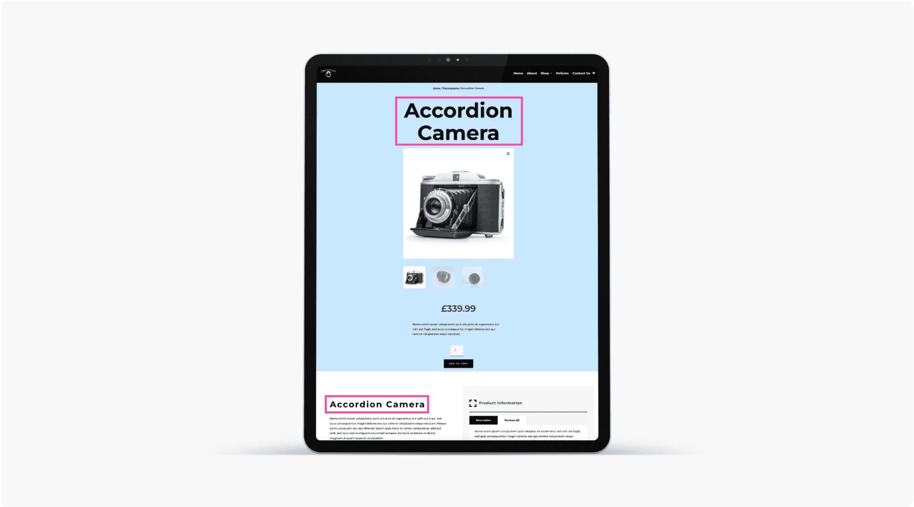

# Woo Product Title

The Woo Product Title module dynamically displays the WooCommerce product title with customizable styling.

!!! abstract "Quick Reference"
    **What it does:** Renders the WooCommerce product name dynamically with full typography and heading level controls.
    **When to use it:** Product page templates, custom product layouts in the Theme Builder
    **Key settings:** Title Text styling, HTML tag selection, Loop Builder
    **Block identifier:** `divi/woo-product-title`
    **ET Docs:** [Official documentation](https://help.elegantthemes.com/en/articles/12041561)

!!! tip "When to Use This Module"
    - Building custom WooCommerce product page templates with a styled product name
    - Positioning the product title independently in a multi-column product layout
    - Styling the product title with custom fonts, sizes, and colors that differ from global heading styles

!!! warning "When NOT to Use This Module"
    - On non-WooCommerce pages — this module requires a product context
    - For post or page titles — use [Post Title](post-title.md)
    - For static headings or manually typed text — use a Text module or Heading module

## Overview

The Woo Product Title module dynamically pulls the product name from WooCommerce and renders it on the page. Unlike a static text or heading module where you type the title manually, this module automatically displays whatever the product's title is in WooCommerce, making it essential for Theme Builder product page templates where the same layout serves hundreds or thousands of different products.

The module provides full control over the title's visual presentation through the Design tab's Title Text settings, including font family, size, weight, color, line height, letter spacing, and text shadow. You can also choose the semantic HTML tag used for the title through the Advanced tab, which is important for SEO and accessibility — using an `<h1>` tag for the main product title signals to search engines that this is the primary heading on the page.

The module also supports the Loop Builder, allowing you to display product titles in a loop context outside of the standard product page template. This is useful for creating custom product listing layouts where you need more control over the title presentation than the [Shop](shop.md) or [Woo Products](woo-products.md) modules provide.

!!! info "WooCommerce Required"
    This module requires WooCommerce to be installed and activated. It will not appear in the module picker if WooCommerce is absent.

[View the official Elegant Themes documentation for this module.](https://help.elegantthemes.com/en/articles/12041561)

<!-- { loading=lazy } -->
<!-- *The Woo Product Title module as it appears in the Divi 5 Visual Builder.* -->

## Use Cases

1. **Hero Product Title** — Place the module at the top of a product page template and style it with a large font size, bold weight, and your brand's primary color. Set the HTML tag to `<h1>` for SEO. This creates a prominent, eye-catching product name that anchors the page.

2. **Compact Product Header** — Position the title module in a multi-column row alongside the [Woo Product Price](woo-product-price.md) and [Woo Product Rating](woo-product-rating.md) modules. Use a moderate font size and keep the styling clean. This creates a compact product header strip that gives customers the key information at a glance.

3. **Loop-Based Product Listing** — Use the Loop Builder to create a custom product listing page where each product title is styled with custom typography. This provides more design control than the built-in title display in the [Shop](shop.md) module, allowing you to create unique product listing layouts.

## How to Add the Woo Product Title Module

1. Ensure WooCommerce is installed and activated, and that at least one product is published.
2. Open the Visual Builder on a product page template or any page. Click the gray **+** icon to add a new module to a row.
3. Search for "Woo Product Title" in the module picker or find it in the WooCommerce category, then click to insert it.

## Settings & Options

The Woo Product Title module settings are organized across three tabs: Content, Design, and Advanced.

### Content Tab

The Content tab controls which product's title is displayed and provides access to the Loop Builder for dynamic contexts.

| Setting | Type | Description |
|---------|------|-------------|
| Content | select | Choose the product for which you want to display the title. On Theme Builder templates, this defaults to the current product dynamically. |
| Link | url | Optionally make the entire module clickable, directing visitors to a specified URL. Useful for linking the title to a custom page or anchor. |
| Background | background controls | Set a background color, gradient, image, or video behind the module. |
| Loop | toggle | Enable the Loop Builder to display product titles in a dynamic loop context for custom product listing layouts. |
| Order | select | Control the module's placement order within Flexbox and Grid parent layouts. |
| Meta — Admin Label | text | Set a custom label for the module in the Visual Builder's layer panel. |
| Meta — Disable On | device toggles | Control builder-level visibility across devices. |

### Design Tab

The Design tab provides typography controls for the product title text.

**Module-specific settings:**

| Setting | Type | Description |
|---------|------|-------------|
| Title Text | text styling | Full typography controls for the product title including font family, font weight, font style, text alignment, text color, font size, letter spacing, line height, and text shadow. Supports responsive settings for different values on desktop, tablet, and phone. |

**Shared design options** — see [Options Groups](../options-groups/index.md) for detailed documentation:

| Options Group | Description |
|--------------|-------------|
| [Sizing](../options-groups/sizing.md) | Width, max-width, min-height, height, alignment |
| [Spacing](../options-groups/spacing.md) | Margin and padding with responsive breakpoint controls |
| [Border](../options-groups/border.md) | Width, color, style, border radius |
| [Box Shadow](../options-groups/box-shadow.md) | Horizontal/vertical offset, blur, spread, color, position |
| [Filters](../options-groups/filters.md) | Brightness, contrast, saturation, hue rotation, blur, invert, sepia, opacity, blend mode |
| [Transform](../options-groups/transform.md) | Scale, translate, rotate, skew, transform origin |
| [Animation](../options-groups/animation.md) | Entrance animation style, direction, duration, delay, intensity |

### Advanced Tab

The Advanced tab provides low-level control over HTML attributes, custom CSS, conditional display logic, and scroll-based effects.

**Shared advanced options** — see [Options Groups](../options-groups/index.md) for detailed documentation:

| Options Group | Description |
|--------------|-------------|
| [Attributes](../options-groups/attributes.md) | CSS ID, classes, custom HTML attributes |
| [CSS](../options-groups/css.md) | Custom CSS per element target (title text, container) |
| HTML | Semantic HTML tag selection (h1, h2, h3, h4, h5, h6, p, span). Choose h1 for the primary product title on product pages for proper SEO hierarchy. |
| [Conditions](../options-groups/conditions.md) | Display rules (user role, page type, date, logic) |
| Interactions | Hover, click, or scroll-triggered interactions |
| [Visibility](../options-groups/visibility.md) | Device visibility toggles |
| [Transitions](../options-groups/transitions.md) | Hover transition timing |
| [Position](../options-groups/position.md) | CSS position and offsets |
| [Scroll Effects](../options-groups/scroll-effects.md) | Scroll-driven animation effects |

## Code Examples

### Custom CSS

```css
/* Style the product title */
.et_pb_wc_title h1,
.et_pb_wc_title h2 {
    font-size: 32px;
    font-weight: 700;
    line-height: 1.3;
    color: #333;
    margin-bottom: 10px;
}

/* Add a decorative underline below the title */
.et_pb_wc_title h1::after {
    content: '';
    display: block;
    width: 60px;
    height: 3px;
    background-color: #2ea3f2;
    margin-top: 12px;
}

/* Hover effect for linked titles */
.et_pb_wc_title a:hover h1,
.et_pb_wc_title a:hover h2 {
    color: #2ea3f2;
    transition: color 0.3s ease;
}

/* Responsive adjustments */
@media (max-width: 980px) {
    .et_pb_wc_title h1,
    .et_pb_wc_title h2 {
        font-size: 26px;
        text-align: center;
    }

    .et_pb_wc_title h1::after {
        margin-left: auto;
        margin-right: auto;
    }
}

@media (max-width: 767px) {
    .et_pb_wc_title h1,
    .et_pb_wc_title h2 {
        font-size: 22px;
    }
}
```

### PHP Hooks

```php
/* Filter the Woo Product Title module output */
add_filter('et_module_shortcode_output', function($output, $render_slug) {
    if ('et_pb_wc_title' !== $render_slug) {
        return $output;
    }
    // Example: Append the product SKU after the title
    global $product;
    if ($product && $product->get_sku()) {
        $sku = esc_html($product->get_sku());
        $output = str_replace('</h1>', ' <span class="product-sku">(SKU: ' . $sku . ')</span></h1>', $output);
    }
    return $output;
}, 10, 2);
```

## Common Patterns

1. **Title + Price + Rating Row** — Place the Woo Product Title, [Woo Product Price](woo-product-price.md), and [Woo Product Rating](woo-product-rating.md) modules in a single row. The title takes the largest visual weight with a bold, large font, the price sits below in a contrasting color, and the rating provides social proof. This creates a complete product header in a compact space.

2. **Overlay Title on Product Image** — Position the title module absolutely over the [Woo Product Images](woo-product-images.md) module using the Position settings in the Advanced tab. Apply a text shadow or semi-transparent background to ensure readability over the image. This creates a dramatic, magazine-style product presentation.

3. **Breadcrumb-Style Title** — Style the title with a moderate font size and lighter weight, then place it above a breadcrumb trail and below the main navigation. This approach works well for stores with deep category hierarchies where the product title serves as a confirmation of where the customer has navigated to.

## AI Interaction Notes

!!! warning "Create vs. Modify"
    Modifying existing module content via REST API (`wp.apiFetch` PATCH) updates
    settings attributes. **Creating new modules via REST API** produces content
    that renders on the front end but may not appear in the Visual Builder layer
    view. Use browser automation for reliable module creation.
    See [REST API Content Playbook](../playbooks/rest-api-content.md).

**Block identifier:** `divi/woo-product-title` — *Needs Testing*

| Operation | Method | Status | Notes |
|-----------|--------|--------|-------|
| Read content | Parse `post_content` block JSON | Needs Testing | Use brace-depth parser — see [Content Encoding](../internals/content-encoding.md) |
| Modify existing | `wp.apiFetch` PATCH on post endpoint | Needs Testing | Update block attributes in `post_content` |
| Create new | Browser automation (Playwright) | Needs Testing | REST creation may break VB visibility |
| Batch modify | Sequential REST requests | Needs Testing | See [REST API Content Playbook](../playbooks/rest-api-content.md) |

**Key content attributes** — *JSON paths need verification*:

| Attribute | JSON Path | Notes |
|-----------|-----------|-------|
| Product | `attrs.product` | Target product for title display |
| Loop | `attrs.loop` | Enable Loop Builder context |

!!! tip "Module Selection Guidance"
    For dynamic WooCommerce product titles use Woo Product Title; for post/page titles use Post Title; for static headings use Text or Heading modules.

## Saving Your Work

After configuring the Woo Product Title module, click the green **Save** button at the bottom of the Visual Builder interface. The module can be saved as a preset for consistent title styling across multiple product templates, or added to your Divi Library for reuse by right-clicking and selecting **Save to Library**.

## Version Notes

!!! note "Divi 5 Only"
    This page documents Divi 5 behavior exclusively. The Woo Product Title module in Divi 5 benefits from the updated rendering engine and supports Conditions, Interactions, Scroll Effects, and the Loop Builder not available in Divi 4.

!!! info "WooCommerce Required"
    This module requires WooCommerce to be installed and activated. WooCommerce 7.0 or later is recommended for full Divi 5 compatibility.

## Troubleshooting

!!! warning "Title Not Displaying"
    If the module appears but shows no title text, verify that the product has a title set in WooCommerce. On Theme Builder templates, ensure the template is assigned to product pages. On regular pages, check that the Content setting is pointed at a valid published product.

!!! warning "Wrong HTML Heading Level"
    If the product title renders as the wrong heading level (e.g., h2 instead of h1), check the HTML setting in the Advanced tab. For the primary product title on a product page, use h1. If you have multiple Woo Product Title modules on a page, only one should be h1 — set others to h2 or lower to maintain proper heading hierarchy.

!!! tip "Title Styling Not Applying"
    If Title Text styling changes in the Design tab do not appear on the front end, check for CSS conflicts from your theme or other plugins. Use the browser developer tools to inspect the title element and verify which CSS rules are being applied. You may need to increase specificity using the Custom CSS field in the Advanced tab.

## Related

- [Woo Product Price](woo-product-price.md)
- [Woo Product Images](woo-product-images.md)
- [Post Title](post-title.md)
