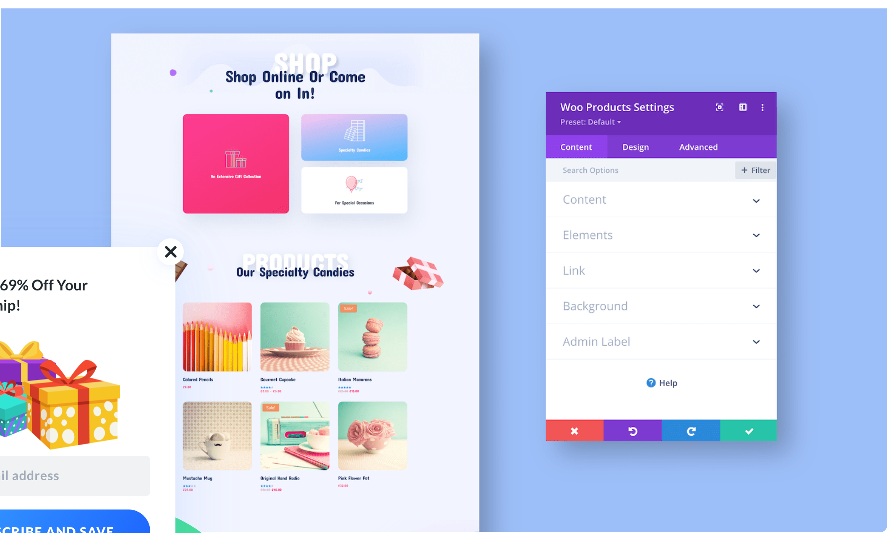

# Woo Products

The Woo Products module displays a gallery of WooCommerce products with options for featured, sale, and custom product collections.

!!! abstract "Quick Reference"
    **What it does:** Shows a configurable grid of WooCommerce products with images, titles, prices, ratings, and sale badges.
    **When to use it:** Homepage product showcases, category landing pages, custom shop layouts, product page upsells
    **Key settings:** Product Type, Product Count, Column Layout, Order, Show elements (Name, Image, Price, Rating, Sale Badge), Pagination
    **Block identifier:** `divi/woo-products`
    **ET Docs:** [Official documentation](https://help.elegantthemes.com/en/articles/12042132)

!!! tip "When to Use This Module"
    - Displaying curated product collections on homepage or landing pages
    - Showing featured, on-sale, best-selling, or top-rated products in a styled grid
    - Building custom shop layouts with product type filtering and pagination

!!! warning "When NOT to Use This Module"
    - On non-WooCommerce sites — this module requires WooCommerce
    - For related products on a product page — use [Woo Related Products](woo-related-products.md)
    - For non-product content grids — use [Blog](blog.md) or [Portfolio](portfolio.md)

## Overview

The Woo Products module displays a gallery of products from your WooCommerce catalog in a grid layout. It provides extensive filtering options to control which products appear, including product type (latest, featured, sale, best selling, top rated, or by category), product count, column layout, sort order, and the ability to offset products for pagination or rotating displays.

Each product card in the grid can display the featured image, product name, price, star rating, and sale badge. All of these elements are individually toggleable through the Content tab, allowing you to create anything from a minimal image-only grid to a full product card with all details visible. The grid responds to screen size automatically, adjusting the column count for tablet and mobile devices.

The module differs from the [Shop](shop.md) module in its filtering approach. While the Shop module focuses on recent, featured, sale, and best-selling product types with category filtering, the Woo Products module adds the ability to filter by specific product type categories and includes a product offset setting for more precise control over which products appear. Both modules render similar product grid layouts, but Woo Products is designed more for curated product showcases than full shop page replacements.

!!! info "WooCommerce Required"
    This module requires WooCommerce to be installed and activated. It will not appear in the module picker if WooCommerce is absent.

[View the official Elegant Themes documentation for this module.](https://help.elegantthemes.com/en/articles/12042132)

<!-- { loading=lazy } -->
<!-- *The Woo Products module as it appears in the Divi 5 Visual Builder.* -->

## Use Cases

1. **Homepage Featured Products** — Set the Product Type to "Featured" and the Product Count to 4 or 6 with a matching column layout. Enable all display elements and style the product cards with box shadows and hover effects. Place this in a dedicated section below the hero to immediately surface your best products.

2. **Sale Products Banner** — Filter by "Sale" product type and place the module inside a section with a bold background color. Add a heading row above with text like "Limited Time Offers." Enable the Sale Badge and style it with the Sale Badge design options for maximum visibility. The grid updates automatically as you mark products on sale in WooCommerce.

3. **Category Product Showcase** — Set the Product Type to "Category" and select specific categories to display. Use a higher product count (8-12) with 3 or 4 columns and enable pagination. This creates a mini shop experience for a specific product category that can be placed on any page.

## How to Add the Woo Products Module

1. Ensure WooCommerce is installed, activated, and that at least one product is published in your WordPress dashboard under Products.
2. Open the Visual Builder on the page you want to edit. Click the gray **+** icon to add a new module to a row.
3. Search for "Woo Products" in the module picker or find it in the WooCommerce category, then click to insert it.

## Settings & Options

The Woo Products module settings are organized across three tabs: Content, Design, and Advanced.

### Content Tab

The Content tab controls which products display, how they are sourced and sorted, and what elements are visible on each product card.

| Setting | Type | Description |
|---------|------|-------------|
| Product Type | select | Choose the product query type: Default, Latest, Featured, Sale, Best Selling, Top Rated, or Category. This determines the base set of products the module pulls from your WooCommerce catalog. |
| Product Count | number input | Set the maximum number of products to display in the grid. Controls how many product cards appear. |
| Column Layout | select | Set the number of columns in the product grid. Affects how many products appear per row on desktop. |
| Order | select | Control the sort order of products. Options include date, title, price, popularity, rating, and other WooCommerce sort fields. |
| Product Offset Number | number input | Skip a specified number of products from the beginning of the query results. Useful for creating paginated layouts or showing different product sets in multiple module instances on the same page. |
| Show Pagination | toggle | Enable or disable pagination controls below the product grid when the total product count exceeds the Product Count setting. |
| Show Name | toggle | Display or hide the product title on each card. |
| Show Image | toggle | Display or hide the product featured image. |
| Show Price | toggle | Display or hide the product price, including sale pricing when applicable. |
| Show Rating | toggle | Display or hide the star rating on each product card. Ratings come from WooCommerce product reviews. |
| Show Sale Badge | toggle | Display or hide the "Sale" badge overlay on products that are currently on sale. |
| Link | url | Optionally make the entire module clickable, directing visitors to a specified URL. |
| Background | background controls | Set a background color, gradient, image, or video behind the module. |
| Order (Flexbox) | select | Control the module's placement order within Flexbox and Grid parent layouts. |
| Meta — Admin Label | text | Set a custom label for the module in the Visual Builder's layer panel. |
| Meta — Disable On | device toggles | Control builder-level visibility across devices. |

### Design Tab

The Design tab provides controls for the visual presentation of the product grid, including image styling, typography, sale badges, and star ratings.

**Module-specific settings:**

| Setting | Type | Description |
|---------|------|-------------|
| Overlay | styling controls | Configure the featured image overlay including overlay color, overlay icon, and hover behavior. Controls the visual effect when hovering over product images. |
| Image | styling controls | Customize the product featured image appearance including border radius, box shadow, spacing, and object fit. |
| Star Rating | color/size controls | Adjust the star rating display including alignment, filled color, empty color, star size, and spacing between stars. |
| Sale Badge | styling controls | Customize the sale badge appearance including background color, text color, font, size, border radius, and positioning on the product card. |
| Title Text | text styling | Control the font, size, color, weight, line height, and letter spacing for the product title displayed on each card. |
| Price Text | text styling | Customize the regular price text including font family, size, weight, and color. |
| Sale Price Text | text styling | Style the sale price independently from the regular price, including font, size, weight, color, and strikethrough styling for the original price. |

**Shared design options** — see [Options Groups](../options-groups/index.md) for detailed documentation:

| Options Group | Description |
|--------------|-------------|
| [Text](../options-groups/text.md) | Font, weight, alignment, color, line height, text shadow |
| [Sizing](../options-groups/sizing.md) | Width, max-width, min-height, height, alignment |
| [Spacing](../options-groups/spacing.md) | Margin and padding with responsive breakpoint controls |
| [Border](../options-groups/border.md) | Width, color, style, border radius |
| [Box Shadow](../options-groups/box-shadow.md) | Horizontal/vertical offset, blur, spread, color, position |
| [Filters](../options-groups/filters.md) | Brightness, contrast, saturation, hue rotation, blur, invert, sepia, opacity, blend mode |
| [Transform](../options-groups/transform.md) | Scale, translate, rotate, skew, transform origin |
| [Animation](../options-groups/animation.md) | Entrance animation style, direction, duration, delay, intensity |

### Advanced Tab

The Advanced tab provides low-level control over HTML attributes, custom CSS, conditional display logic, and scroll-based effects.

**Shared advanced options** — see [Options Groups](../options-groups/index.md) for detailed documentation:

| Options Group | Description |
|--------------|-------------|
| [Attributes](../options-groups/attributes.md) | CSS ID, classes, custom HTML attributes |
| [CSS](../options-groups/css.md) | Custom CSS per element target (product card, image, title, price, sale badge, rating) |
| HTML | Semantic HTML tag selection for the module wrapper |
| [Conditions](../options-groups/conditions.md) | Display rules (user role, page type, date, logic) |
| Interactions | Hover, click, or scroll-triggered interactions |
| [Visibility](../options-groups/visibility.md) | Device visibility toggles |
| [Transitions](../options-groups/transitions.md) | Hover transition timing |
| [Position](../options-groups/position.md) | CSS position and offsets |
| [Scroll Effects](../options-groups/scroll-effects.md) | Scroll-driven animation effects |

## Code Examples

### Custom CSS

```css
/* Style product cards with elevated card design */
.et_pb_wc_products ul.products li.product {
    background: #fff;
    border-radius: 8px;
    box-shadow: 0 2px 8px rgba(0, 0, 0, 0.08);
    padding-bottom: 20px;
    overflow: hidden;
    transition: transform 0.3s ease, box-shadow 0.3s ease;
}

.et_pb_wc_products ul.products li.product:hover {
    transform: translateY(-4px);
    box-shadow: 0 8px 24px rgba(0, 0, 0, 0.12);
}

/* Style the product image container */
.et_pb_wc_products ul.products li.product a img {
    border-radius: 8px 8px 0 0;
    width: 100%;
    transition: transform 0.3s ease;
}

.et_pb_wc_products ul.products li.product:hover a img {
    transform: scale(1.05);
}

/* Style the product title */
.et_pb_wc_products ul.products li.product h3 {
    font-size: 16px;
    font-weight: 600;
    padding: 0 15px;
    margin-top: 15px;
}

/* Style the price display */
.et_pb_wc_products ul.products li.product .price {
    color: #2ea3f2;
    font-weight: 700;
    font-size: 18px;
    padding: 0 15px;
}

/* Sale badge customization */
.et_pb_wc_products span.onsale {
    background-color: #e74c3c;
    color: #fff;
    border-radius: 50%;
    width: 50px;
    height: 50px;
    line-height: 50px;
    text-align: center;
    font-size: 12px;
    font-weight: 700;
}

/* Star rating */
.et_pb_wc_products .star-rating {
    color: #f5a623;
    margin: 8px 15px;
}

/* Responsive: two columns on tablet, one on mobile */
@media (max-width: 980px) {
    .et_pb_wc_products ul.products li.product {
        width: 48% !important;
    }
}

@media (max-width: 767px) {
    .et_pb_wc_products ul.products li.product {
        width: 100% !important;
    }
}
```

### PHP Hooks

```php
/* Filter the Woo Products module output */
add_filter('et_module_shortcode_output', function($output, $render_slug) {
    if ('et_pb_wc_products' !== $render_slug) {
        return $output;
    }
    // Example: Add a "View All" link after the product grid
    $shop_url = get_permalink(wc_get_page_id('shop'));
    $output .= '<div class="woo-products-view-all" style="text-align: center; margin-top: 20px;">';
    $output .= '<a href="' . esc_url($shop_url) . '" class="button">View All Products &rarr;</a>';
    $output .= '</div>';
    return $output;
}, 10, 2);

/* Exclude out-of-stock products from Woo Products module queries */
add_filter('woocommerce_product_query_meta_query', function($meta_query) {
    $meta_query[] = array(
        'key'     => '_stock_status',
        'value'   => 'outofstock',
        'compare' => '!=',
    );
    return $meta_query;
});
```

## Common Patterns

1. **Featured Products Grid** — Set Product Type to "Featured" with a Product Count of 4 and 4-column layout. Enable all display elements and apply card-style box shadows with hover lift effects. Place on the homepage below a hero section to surface your best products with maximum visual impact.

2. **Offset Pagination Grid** — Create multiple Woo Products modules on the same page with different offset values. The first module shows products 1-4 (offset 0), the second shows products 5-8 (offset 4). This creates a segmented product display where different sections can have different styling or headings between them.

3. **Minimal Image Gallery** — Disable Name, Price, Rating, and Sale Badge to create a clean image-only product grid. Style the images with border radius and hover overlay effects. This works well as a visual product showcase where clicking any image navigates to the product page, similar to an Instagram-style gallery.

## AI Interaction Notes

!!! warning "Create vs. Modify"
    Modifying existing module content via REST API (`wp.apiFetch` PATCH) updates
    settings attributes. **Creating new modules via REST API** produces content
    that renders on the front end but may not appear in the Visual Builder layer
    view. Use browser automation for reliable module creation.
    See [REST API Content Playbook](../playbooks/rest-api-content.md).

**Block identifier:** `divi/woo-products` — *Needs Testing*

| Operation | Method | Status | Notes |
|-----------|--------|--------|-------|
| Read content | Parse `post_content` block JSON | Needs Testing | Use brace-depth parser — see [Content Encoding](../internals/content-encoding.md) |
| Modify existing | `wp.apiFetch` PATCH on post endpoint | Needs Testing | Update block attributes in `post_content` |
| Create new | Browser automation (Playwright) | Needs Testing | REST creation may break VB visibility |
| Batch modify | Sequential REST requests | Needs Testing | See [REST API Content Playbook](../playbooks/rest-api-content.md) |

**Key content attributes** — *JSON paths need verification*:

| Attribute | JSON Path | Notes |
|-----------|-----------|-------|
| Product Type | `attrs.type` | Product query type (default, latest, featured, sale, etc.) |
| Product Count | `attrs.posts_number` | Maximum products to display |
| Column Layout | `attrs.columns_number` | Number of grid columns |
| Order | `attrs.orderby` | Sort order field |
| Product Offset | `attrs.offset_number` | Number of products to skip |

!!! tip "Module Selection Guidance"
    For curated product collections use Woo Products; for the main shop page use Shop; for related product suggestions use Woo Related Products; for general post grids use Blog or Portfolio.

## Saving Your Work

After configuring the Woo Products module, click the green **Save** button at the bottom of the Visual Builder interface. The module can be saved as a preset for consistent styling across multiple Woo Products instances, or added to your Divi Library for reuse on other pages by right-clicking and selecting **Save to Library**.

## Version Notes

!!! note "Divi 5 Only"
    This page documents Divi 5 behavior exclusively. The Woo Products module in Divi 5 benefits from the updated rendering engine and supports Conditions, Interactions, Scroll Effects, and enhanced layout controls not available in Divi 4.

!!! info "WooCommerce Required"
    This module requires WooCommerce to be installed and activated. WooCommerce 7.0 or later is recommended for full Divi 5 compatibility.

## Troubleshooting

!!! warning "No Products Displaying"
    If the module appears but shows no products, verify that you have at least one published product in WooCommerce. Check that the Product Type filter matches your product data — "Featured" requires products to be marked as featured, "Sale" requires products with sale prices, and "Category" requires a category selection. Also verify the Product Offset is not set higher than the total number of available products.

!!! warning "Wrong Products Appearing"
    If the module shows unexpected products, check the Product Type and Order settings. Also verify the Product Offset Number is set correctly. If using the "Category" type, confirm the correct categories are selected. WooCommerce caching plugins may also serve stale product data — clear your cache to see updated results.

!!! tip "Pagination Not Working"
    If pagination controls appear but clicking them does not change the displayed products, check for JavaScript conflicts with other plugins. Also verify that the total number of available products exceeds the Product Count setting, as pagination only activates when there are more products than can be shown in a single view.

## Related

- [Shop](shop.md)
- [Woo Related Products](woo-related-products.md)
- [Blog](blog.md)
